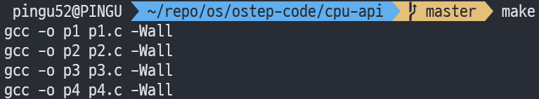
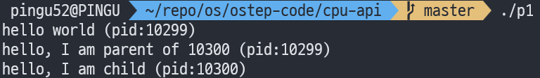
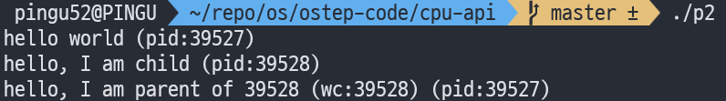
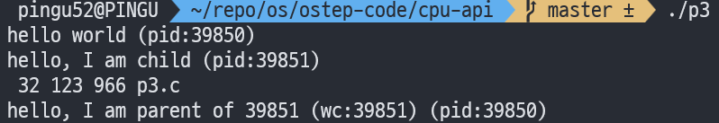
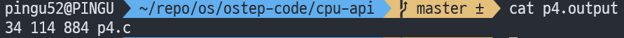
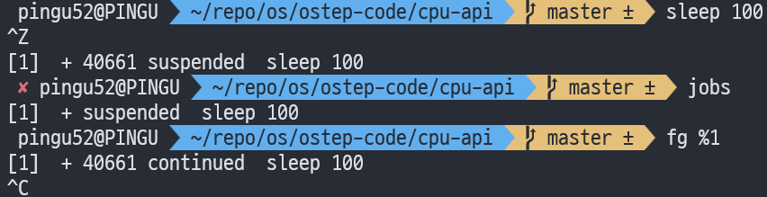

안녕하세요, pingu52입니다.

이번 글은 『Operating Systems: Three Easy Pieces(OSTEP)』의 Interlude: Process API를 읽고 정리한 노트입니다.  
영문 PDF와 한국어 번역 PDF를 함께 보면서, 같은 내용이 어떤 표현과 흐름으로 설명되는지도 같이 체크했습니다.

이 파트의 핵심은 다음으로 정리됩니다.

- UNIX는 프로세스 생성, 실행, 동기화를 `fork()` + `exec()` + `wait()` 같은 작은 조각들의 조합으로 풀었다
- 그 분리 덕분에 셸이 리다이렉션과 파이프 같은 기능을 프로그램 수정 없이 제공할 수 있다

---

### 실습 준비: ostep-code (cpu-api)

이 장의 예제(p1.c~p4.c)는 `ostep-code` 저장소의 `cpu-api/` 디렉터리에 있습니다.

```bash
git clone https://github.com/remzi-arpacidusseau/ostep-code.git
cd ostep-code/cpu-api

# 한 번에 빌드 (p1~p4 생성)
make
```



---

## 1. 이 Interlude가 던지는 질문(CRUX)

OSTEP는 이 막간(interlude)에서 다음 질문을 던집니다.

- 프로세스를 생성하고 제어하려면 OS가 어떤 인터페이스를 제공해야 하는가?
- 유용하면서도 편하게 쓰이려면, 그 인터페이스는 어떻게 설계되어야 하는가?

UNIX는 이 질문에 대해 거대한 단일 API 대신 작은 API들을 조합하는 답을 내놓습니다.

- `fork()` : 새 프로세스를 복제(copy)로 만든다
- `exec()` : 현재 프로세스에 다른 프로그램을 갈아끼운다
- `wait()`/`waitpid()` : 부모가 자식 종료를 기다리고 수거(reap)한다

---

## 2. fork(): 복제로 자식 프로세스를 만든다

`fork()`는 새 프로세스를 하나 생성하지만, 그 방식이 특이합니다.

- 자식 프로세스는 `main()`부터 시작하지 않는다
- 부모와 자식 모두 `fork()` 다음 줄부터 실행을 이어간다
- 거의 동일한 프로세스 복제본이 2개가 된 것처럼 보인다

### 2.1 예제: p1.c (fork 호출)

```c
# /p1.c

#include <stdio.h>
#include <stdlib.h>
#include <unistd.h>

int
main(int argc, char *argv[])
{
    printf("hello world (pid:%d)\n", (int) getpid());
    int rc = fork();
    if (rc < 0) {
        // fork failed; exit
        fprintf(stderr, "fork failed\n");
        exit(1);
    } else if (rc == 0) {
        // child (new process)
	for (int i = 0; i < 1000; i++)
            printf("hello, I am child (pid:%d)\n", (int) getpid());
    } else {
        // parent goes down this path (original process)
	for (int i = 0; i < 1000; i++)
            printf("hello, I am parent of %d (pid:%d)\n",
	       rc, (int) getpid());
    }
    return 0;
}
```

```bash
make p1
./p1
```



#### 관찰 포인트

- `fork()`의 반환값이 부모와 자식에서 다릅니다.
  - 부모: 자식의 PID(양수)
  - 자식: 0
- 출력 순서는 실행마다 달라질 수 있습니다.

:::note
출력 순서가 달라지는 이유는 `fork()` 이후 runnable한 실행 흐름이 2개가 되고,
단일 CPU에서도 스케줄러가 누굴 먼저 돌릴지 보장하지 않기 때문입니다(비결정성).
:::

---

## 3. wait(): 부모가 자식이 끝나길 기다린다

부모가 자식이 끝날 때까지 기다리려면 `wait()` 또는 `waitpid()`를 씁니다.

- 부모는 `wait()`에서 block됨(대기 상태로 진입)
- 자식이 종료하면 부모가 깨어나고 `wait()`가 반환
- `wait()`는 자식의 종료 상태를 회수해 좀비 프로세스가 남지 않도록 정리하는 의미도 있습니다.

### 3.1 예제: p2.c (fork + wait)

```c
#include <stdio.h>
#include <stdlib.h>
#include <unistd.h>
#include <sys/wait.h>

int
main(int argc, char *argv[])
{
    printf("hello world (pid:%d)\n", (int) getpid());
    int rc = fork();
    if (rc < 0) {
        // fork failed; exit
        fprintf(stderr, "fork failed\n");
        exit(1);
    } else if (rc == 0) {
        // child (new process)
        printf("hello, I am child (pid:%d)\n", (int) getpid());
	sleep(1);
    } else {
        // parent goes down this path (original process)
        int wc = wait(NULL);
        printf("hello, I am parent of %d (wc:%d) (pid:%d)\n",
	       rc, wc, (int) getpid());
    }
    return 0;
}
```

```bash
make p2
./p2
```



#### 관찰 포인트

- `wait()`를 추가하면 출력 순서가 안정됩니다.
- 부모가 먼저 스케줄되더라도 곧바로 `wait()`에 들어가므로, 결과적으로 자식이 먼저 출력하게 됩니다.

---

## 4. exec(): 현재 프로세스를 다른 프로그램으로 교체한다

`exec()` 계열은 새 프로세스를 만드는 함수가 아닙니다.  
현재 프로세스의 프로그램 이미지(코드/정적 데이터)를 다른 실행 파일로 교체하고, 그 프로그램을 실행합니다.

실습에서 자주 보는 특징:

- `exec()`가 성공하면, 보통 그 아래 코드는 실행되지 않습니다(되돌아오지 않음).

일반적으로 열린 파일 디스크립터는 `exec()` 이후에도 유지되며,
필요하면 `FD_CLOEXEC`(close-on-exec)로 exec 시점에 닫히도록 설정할 수 있습니다.

### 4.1 예제: p3.c (fork + exec + wait)

`p3.c`는 자식에서 `execvp()`로 `wc`를 실행해, `p3.c` 파일의 line/word/byte를 출력합니다.

```c
#include <stdio.h>
#include <stdlib.h>
#include <unistd.h>
#include <string.h>
#include <sys/wait.h>

int
main(int argc, char *argv[])
{
    printf("hello world (pid:%d)\n", (int) getpid());
    int rc = fork();
    if (rc < 0) {
        // fork failed; exit
        fprintf(stderr, "fork failed\n");
        exit(1);
    } else if (rc == 0) {
        // child (new process)
        printf("hello, I am child (pid:%d)\n", (int) getpid());
        char *myargs[3];
        myargs[0] = strdup("wc");   // program: "wc" (word count)
        myargs[1] = strdup("p3.c"); // argument: file to count
        myargs[2] = NULL;           // marks end of array
        execvp(myargs[0], myargs);  // runs word count
        printf("this shouldn't print out");
    } else {
        // parent goes down this path (original process)
        int wc = wait(NULL);
        printf("hello, I am parent of %d (wc:%d) (pid:%d)\n",
	       rc, wc, (int) getpid());
    }
    return 0;
}
```

```bash
make p3
./p3
```



#### 관찰 포인트

- 자식 프로세스가 `wc`로 변신한 것처럼 보이는 게 핵심입니다.
- 코드에 있는 `printf(...)` 같은 문장은 `exec()`가 성공하면 보이지 않는 게 정상입니다.

### 4.2 exec 변형들(왜 이렇게 많나?)

리눅스에는 `execl()`, `execlp()`, `execle()`, `execv()`, `execvp()`, `execve()` 등 변형이 존재합니다.  
인자 전달 방식, PATH 검색 여부, 환경 변수 전달 같은 차이를 제공합니다. 필요할 때 `man exec`로 확인하는 게 정석입니다.

---

## 5. 왜 fork()와 exec()를 굳이 분리했을까? (셸이 핵심)

셸이 외부 명령을 실행하는 기본 뼈대는 다음을 반복하는 것입니다.

1) `fork()`로 자식 생성  
2) 자식에서 실행 준비(FD 재배선 등)  
3) `exec()`로 명령 실행  
4) 부모는 `wait()`로 종료를 기다리고 프롬프트로 복귀

핵심은 2번이 `fork()`와 `exec()` 사이에 존재한다는 점입니다.  
그 짧은 구간 때문에 셸은 프로그램 수정 없이 실행 환경을 바꿀 수 있습니다.

---

## 6. 리다이렉션(>): 표준출력을 파일로 보내는 원리

예를 들어 아래 명령은 `wc`가 파일 출력을 지원해서 가능한 게 아닙니다.

```bash
wc p3.c > newfile.txt
```

셸이 자식에서 `exec()`를 호출하기 전에 표준출력(stdout)을 파일로 연결하기 때문에 가능한 것입니다.

### 6.1 핵심 아이디어: close(stdout) → open(file)

- 자식에서 `close(STDOUT_FILENO)`로 표준출력을 닫고
- `open("newfile.txt", ...)`로 파일을 엽니다
- 그 다음 `exec()`로 `wc`를 실행합니다

여기서 중요한 OS 가정이 하나 있습니다.

- UNIX는 보통 가장 낮은 번호의 미사용 FD부터 할당합니다.
- stdout(1)을 닫아 비워두면, 다음 `open()`이 그 자리(1)를 재사용할 가능성이 큽니다.
- 결과적으로 `printf()` 같은 출력이 화면 대신 파일로 자연스럽게 흘러갑니다.

또 하나의 포인트:

- 열린 파일 디스크립터는 `exec()`를 건너서 유지됩니다. 그래서 리다이렉션이 먹힙니다.

일반화된 구현은 `dup2(newfd, STDOUT_FILENO)`처럼 원하는 FD로 명시적으로 재배선합니다.
예를 들어 stderr까지 리다이렉션할 때는 `dup2(newfd, STDERR_FILENO)`가 필요합니다.

### 6.2 예제: p4.c (stdout → file)

```c
#include <stdio.h>
#include <stdlib.h>
#include <unistd.h>
#include <string.h>
#include <fcntl.h>
#include <assert.h>
#include <sys/wait.h>

int
main(int argc, char *argv[])
{
    int rc = fork();
    if (rc < 0) {
        // fork failed; exit
        fprintf(stderr, "fork failed\n");
        exit(1);
    } else if (rc == 0) {
	// child: redirect standard output to a file
	close(STDOUT_FILENO); 
	open("./p4.output", O_CREAT|O_WRONLY|O_TRUNC, S_IRWXU);

	// now exec "wc"...
        char *myargs[3];
        myargs[0] = strdup("wc");   // program: "wc" (word count)
        myargs[1] = strdup("p4.c"); // argument: file to count
        myargs[2] = NULL;           // marks end of array
        execvp(myargs[0], myargs);  // runs word count
    } else {
        // parent goes down this path (original process)
        int wc = wait(NULL);
	assert(wc >= 0);
    }
    return 0;
}
```

```bash
make p4
./p4

# 실행 직후에는 아무것도 안 찍힌 것처럼 보일 수 있음(출력이 파일로 갔기 때문)
cat p4.output
```



#### 관찰 포인트

- `./p4` 실행 시 터미널에 출력이 없는 것처럼 보입니다.
- 하지만 `p4.output`을 보면 `wc` 출력이 그대로 들어 있습니다.
- 셸이 하는 리다이렉션을 코드로 그대로 재현한 예제입니다.

---

## 7. 파이프(|): 한 프로세스의 stdout을 다른 프로세스의 stdin으로

파이프도 본질은 같습니다. FD 연결입니다.

- 한쪽 프로세스의 stdout → 파이프 write-end
- 다른쪽 프로세스의 stdin → 파이프 read-end

그래서 다음이 가능해집니다.

```bash
grep -o foo file | wc -l
```

OSTEP는 파이프가 리다이렉션과 유사한 방식으로 구현되지만, `pipe()` 시스템 콜로 두 프로세스를 같은 파이프에 연결한다는 점을 강조합니다.

---

## 8. 프로세스 제어: signals, Ctrl+C / Ctrl+Z, kill()

fork/exec/wait 말고도, UNIX에는 프로세스를 제어하기 위한 인터페이스가 많습니다. 대표가 시그널(signals)입니다.

- `kill()` 시스템 콜: 프로세스에 시그널 전송
- 셸 단축키:
  - `Ctrl+C` → 보통 `SIGINT`(인터럽트, 보통 종료)
  - `Ctrl+Z` → 보통 `SIGTSTP`(stop, 일시정지)
  - 일시정지한 프로세스는 `fg`로 다시 포그라운드 실행 가능

### 8.1 간단 실습: job control 흐름

```bash
sleep 100
# Ctrl+Z
jobs
fg %1
```



---

## 9. man, ps/top, 그리고 Homework

### 9.1 RTFM: man 페이지를 읽는 습관

번역본에는 RTFM에 대한 여담이 실려 있습니다.  
fork/exec/wait 같은 API는 반환값, 에러 조건을 제대로 모르면 사고가 나기 쉬우므로 `man fork`, `man exec`, `man wait`로 확인하는 습관이 중요합니다.

### 9.2 프로세스 관찰 도구

```bash
ps aux | head
top
```

### 9.3 숙제(코드)

이 장은 API를 손에 익히는 성격이 강합니다.

- fork 이후 변수 값을 부모/자식에서 각각 바꿔보고, 서로 영향이 없는지 확인
- `open()` 후 `fork()` 해서 부모/자식이 같은 FD를 공유할 때 동작(오프셋/출력 섞임)을 관찰
- `wait()` 없이 자식이 항상 먼저 출력되게 할 수 있는지 고민해보기(왜 정석은 wait인지)
- `exec*()` 변형들을 하나씩 써보고 차이를 정리하기(PATH 검색 여부 등)
- stdout을 닫고 `printf()` 하면 어떻게 되는지(오류/출력 누락) 확인
- `pipe()`로 두 자식 프로세스를 연결해 `cmd1 | cmd2`를 코드로 재현해보기

영문 PDF에는 `fork.py` 시뮬레이터 기반 숙제(Homework: Simulation)도 별도로 있습니다.  
프로세스 트리(부모/자식 관계)가 어떻게 변하는지 눈으로 보는 데 도움이 됩니다.

---

## 10. 용어정리

- `프로세스(Process)`: 실행 중인 프로그램 인스턴스(주소공간/레지스터/FD 등 상태 포함)
- `PID(Process ID)`: 프로세스 식별자
- `fork()`: 현재 프로세스를 복제해 자식 프로세스를 생성
- `exec()`: 현재 프로세스 이미지를 다른 실행 파일로 교체(성공 시 반환하지 않는 것이 일반적)
- `wait()/waitpid()`: 부모가 자식 종료를 기다리고 상태를 수거(reap)
- `파일 디스크립터(File Descriptor)`: 프로세스가 파일/파이프/소켓 등을 다루는 핸들(0/1/2는 stdin/stdout/stderr)
- `리다이렉션(Redirection)`: FD를 재배선해 표준입출력 흐름을 파일/파이프 등으로 변경
- `파이프(Pipe)`: 한 프로세스의 출력과 다른 프로세스의 입력을 커널 버퍼로 연결
- `시그널(Signal)`: 프로세스에 전달되는 비동기 이벤트/제어 메시지(SIGINT, SIGTSTP 등)
- `job control`: 셸이 포그라운드/백그라운드 작업을 관리하는 기능(`jobs`, `fg`, `bg` 등)
