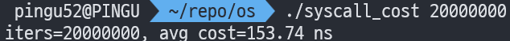
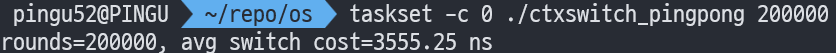

안녕하세요, pingu52입니다.

이번 글은 『Operating Systems: Three Easy Pieces(OSTEP)』의 **Mechanism: Limited Direct Execution(제한적 직접 실행)** 파트를 읽고 정리한 노트입니다.

---

### 실습 준비: 로컬에서 바로 확인할 것들

이 글의 실습은 별도의 커널 소스나 복잡한 설정 없이, 일반적인 리눅스 환경에서 `gcc`만 있으면 바로 테스트해 볼 수 있도록 구성했습니다.

- **컴파일러**: `gcc`
- **시간 측정**: `clock_gettime(CLOCK_MONOTONIC)`
- **(선택) CPU 고정**: `taskset`

---

## 1. 이 장의 핵심 질문: 성능과 제어를 동시에

CPU 가상화의 기본 아이디어는 단순합니다. 하나의 CPU를 여러 프로세스가 번갈아 가며 사용하게 하여(Time Sharing), 마치 동시에 실행되는 것처럼 보이게 하는 것입니다.

하지만 이를 구현하려면 두 가지 상충하는 목표를 해결해야 합니다.

1.  **성능(Performance)**: 가상화로 인해 시스템이 느려지면 안 됩니다.
2.  **제어(Control)**: OS가 CPU에 대한 통제권을 잃어서는 안 됩니다.

프로그램을 CPU에서 바로 실행하는 **직접 실행(Direct Execution)** 방식은 빠르지만, 제한을 두지 않으면 OS가 시스템을 제어할 수 없게 됩니다. 따라서 OSTEP은 다음 두 가지 문제를 제기합니다.

- **(문제 1) 제한된 연산**: 사용자 프로그램이 디스크 I/O 같은 특권 명령을 수행해야 할 때는 어떻게 하는가?
- **(문제 2) 프로세스 전환**: 사용자 프로그램이 실행 중일 때(OS가 멈춰 있을 때) 어떻게 OS가 다시 제어권을 가져와 프로세스를 바꿀 것인가?

이 장에서는 이 두 마리 토끼를 잡기 위한 기법인 **제한적 직접 실행(Limited Direct Execution, LDE)** 을 설명합니다.

---

## 2. 기본 원리: 제한적 직접 실행(Limited Direct Execution)

LDE의 핵심 메시지는 다음과 같습니다.

> **"사용자 코드는 CPU에서 직접 실행하여 성능을 얻되, 위험한 순간에는 하드웨어 메커니즘을 통해 커널이 개입한다."**

"Limited(제한적)"라는 말은 OS가 **커널 진입 지점**과 **복귀 방식**을 엄격하게 통제한다는 뜻입니다.

### 프로그램 시작 프로토콜

OS가 프로그램을 실행하는 과정은 대략 다음과 같습니다.

1. 프로세스 목록에 항목 생성 및 메모리 할당
2. 디스크에서 프로그램 코드/데이터 로드
3. 스택(`argc`, `argv`) 초기화
4. 레지스터 정리 후 `main()`으로 점프 (이후 제어권은 하드웨어/프로세스로 넘어감)

---

## 3. 문제점 1: 제한된 연산(Restricted Operations)

프로그램이 파일을 읽거나, 다른 프로세스를 생성하는 작업은 시스템 전체에 영향을 줍니다. 사용자 프로그램이 이를 마음대로 하게 두면 시스템 보호가 불가능해집니다.

### 3.1 User Mode vs Kernel Mode

이를 해결하기 위해 하드웨어는 실행 모드를 구분합니다.

- **User Mode (사용자 모드)**: 애플리케이션이 동작하는 모드입니다. 하드웨어 리소스에 대한 접근이 제한됩니다.
- **Kernel Mode (커널 모드)**: OS가 동작하는 모드입니다. 모든 특권 명령(Privileged Instruction)을 실행할 수 있습니다.

사용자 모드에서 특권 명령을 시도하면 하드웨어는 **예외(Exception)** 를 발생시키고, OS는 해당 프로세스를 종료시킵니다.

### 3.2 시스템 콜(System Call)과 Trap

사용자 프로그램이 커널의 기능을 사용하고 싶을 때(예: `read()`), **시스템 콜**을 사용합니다. 동작 과정은 다음과 같습니다.

1. 프로그램이 **Trap**이라는 특수 명령어를 실행합니다.
2. **Trap**: 권한이 커널 모드로 격상되고, 미리 정의된 **Trap Handler**로 점프합니다.
3. OS가 커널 모드에서 요청을 처리합니다.
4. 작업 완료 후 **Return-from-trap** 명령어를 실행하여 사용자 모드로 복귀합니다.

:::note
**왜 시스템 콜은 함수 호출처럼 보일까?**
C 코드의 `open()`은 일반 함수처럼 보이지만, 실제로는 C 라이브러리가 그 안에서 어셈블리 명령(`trap` 등)을 실행해 커널 경계를 넘는 작업을 대신 처리해주기 때문입니다.
:::

### 3.3 트랩 테이블(Trap Table)

보안상 가장 중요한 것은 **사용자 코드가 커널 내부의 어디로 점프할지 정할 수 없다**는 점입니다. 만약 임의의 주소로 점프할 수 있다면 악성 코드가 커널을 장악할 수 있습니다.

그래서 OS는 부팅 시점에 **트랩 테이블(Trap Table)**을 초기화하여 하드웨어에게 "시스템 콜이나 예외가 발생하면 실행할 코드의 주소"를 미리 알려줍니다.

---

## 4. 문제점 2: 프로세스 간 전환(Switching Between Processes)

프로세스 A가 실행 중이라면 OS는 실행 중이 아닙니다. OS가 실행되지 않으면 프로세스를 바꿀(스케줄링) 수도 없습니다. OS는 어떻게 다시 CPU 제어권을 가져올까요?

### 4.1 협조적(Cooperative) 방식

과거에는 프로세스가 주기적으로 `yield()` 시스템 콜을 호출하여 제어권을 넘겨줄 것이라 믿었습니다. 하지만 프로세스가 무한 루프에 빠지면 재부팅밖에 답이 없는 치명적 단점이 있습니다.

### 4.2 선점형(Preemptive) 방식: 타이머 인터럽트

OS가 확실하게 주도권을 쥐기 위해 **타이머 인터럽트(Timer Interrupt)** 가 도입되었습니다.

- 부팅 시 OS가 타이머를 설정합니다.
- 수 밀리초마다 하드웨어가 인터럽트를 발생시켜 현재 프로세스를 중단합니다.
- 미리 등록된 OS의 **Interrupt Handler**가 실행됩니다.
- 이로써 OS는 주기적으로 CPU 제어권을 되찾을 수 있습니다.

### 4.3 컨텍스트 스위치(Context Switch)

OS가 제어권을 얻었을 때, 스케줄러가 현재 프로세스(A)에서 다른 프로세스(B)로 전환하기로 결정하면 **컨텍스트 스위치**가 일어납니다.

1. **현재(A) 상태 저장**: A의 범용 레지스터, PC 등을 A의 커널 스택(혹은 구조체)에 저장합니다.
2. **다음(B) 상태 복원**: B의 커널 스택에서 레지스터 값을 복원합니다.
3. **스택 전환(Switch Stack)**: 커널 스택 포인터를 A에서 B로 변경합니다.
4. `return-from-trap`을 실행하면 B의 문맥으로 돌아가 B가 실행됩니다.

---

## 5. 한 장으로 흐름 잡기: LDE 타임라인

전체 흐름을 요약하면 다음과 같습니다.

1. **부팅 (Kernel Mode)**: 트랩 테이블 초기화, 타이머 시작.
2. **프로세스 A 실행 (User Mode)**: `return-from-trap`으로 시작.
3. **이벤트 발생 (Timer Interrupt)**:
    - **하드웨어**: A의 레지스터를 A의 커널 스택에 저장 → 커널 모드 진입 → Trap Handler로 점프.
    - **OS (Trap Handler)**: 스케줄러가 B로 전환 결정.
    - **OS (Switch)**: `switch()` 루틴이 A의 상태를 PCB에 저장하고, B의 상태를 복원.
4. **프로세스 B 실행 (User Mode)**: `return-from-trap`으로 B 실행 재개.

---

## 6. 실습: 비용 측정하기 (C Code)

이론적인 "비용(Cost)"을 실제 코드로 체감해 봅시다.

### 6.1 시스템 콜 비용 측정 (`getpid`)

`getpid()`는 `trap` → `kernel` → `return-from-trap`을 거치는 가장 가벼운 시스템 콜 중 하나입니다.

```c
# syscall_cost.c

#define _GNU_SOURCE
#include <stdio.h>
#include <stdint.h>
#include <stdlib.h>
#include <time.h>
#include <unistd.h>

static inline uint64_t nsec_now(void) {
    struct timespec ts;
    clock_gettime(CLOCK_MONOTONIC, &ts);
    // 초와 나노초를 합쳐서 반환
    return (uint64_t)ts.tv_sec * 1000000000ull + 
           (uint64_t)ts.tv_nsec;
}

int main(int argc, char **argv) {
    // 인자로 반복 횟수를 받음 (기본값: 10,000,000)
    const long iters = (argc > 1) ? atol(argv[1]) : 10000000L;
    volatile pid_t sink = 0; // 컴파일러 최적화 방지

    uint64_t t0 = nsec_now();
    for (long i = 0; i < iters; i++) {
        sink ^= getpid(); // 시스템 콜 반복 호출
    }
    uint64_t t1 = nsec_now();

    double avg = (double)(t1 - t0) / (double)iters;
    printf("iters=%ld, avg cost=%.2f ns\n", iters, avg);
    return 0;
}
```



### 6.2 컨텍스트 스위치 비용 측정 (Pipe Ping-Pong)

두 프로세스가 파이프를 통해 데이터를 주고받으며 강제로 `block`과 `unblock`을 반복하게 하여 전환 비용을 측정합니다.

```c
# ctxswitch_pingpong.c

#define _GNU_SOURCE
#include <stdio.h>
#include <stdint.h>
#include <stdlib.h>
#include <time.h>
#include <unistd.h>
#include <sys/wait.h>

// 시간 측정 함수 (syscall_cost.c와 동일)
static inline uint64_t nsec_now(void) {
    struct timespec ts;
    clock_gettime(CLOCK_MONOTONIC, &ts);
    return (uint64_t)ts.tv_sec * 1000000000ull + 
           (uint64_t)ts.tv_nsec;
}

int main(int argc, char **argv) {
    const long rounds = (argc > 1) ? atol(argv[1]) : 100000L;

    int p2c[2], c2p[2]; // 부모->자식, 자식->부모 파이프
    if (pipe(p2c) != 0 || pipe(c2p) != 0) {
        perror("pipe");
        return 1;
    }

    pid_t pid = fork();
    if (pid < 0) {
        perror("fork");
        return 1;
    }

    if (pid == 0) {
        // Child Process
        close(p2c[1]); close(c2p[0]);
        char b;
        for (long i = 0; i < rounds; i++) {
            // 부모가 쓸 때까지 대기 (Context Switch 발생 지점)
            if (read(p2c[0], &b, 1) != 1) _exit(2);
            if (write(c2p[1], &b, 1) != 1) _exit(3);
        }
        _exit(0);
    }

    // Parent Process
    close(p2c[0]); close(c2p[1]);

    char b = 'x';
    uint64_t t0 = nsec_now();
    for (long i = 0; i < rounds; i++) {
        if (write(p2c[1], &b, 1) != 1) return 4;
        // 자식이 쓸 때까지 대기 (Context Switch 발생 지점)
        if (read(c2p[0], &b, 1) != 1) return 5;
    }
    uint64_t t1 = nsec_now();

    int st;
    waitpid(pid, &st, 0);

    // 한 라운드에 (A->B, B->A) 두 번의 전환이 발생함에 유의
    double avg = (double)(t1 - t0) / (double)(rounds * 2);
    printf("rounds=%ld, avg switch cost=%.2f ns\n", rounds, avg);
    return 0;
}
```



:::tip
정확한 측정을 위해 `taskset -c 0 ./ctxswitch_pingpong` 처럼 특정 코어에 바인딩하여 실행하는 것이 좋습니다.
:::

---

## 7. 마무리

이 장은 철저히 **메커니즘(Mechanism)** 을 다뤘습니다. 어떻게 CPU를 뺏고, 어떻게 돌려줄 것인가? 에 대한 답은 **Trap, Timer Interrupt, Context Switch**였습니다.

이제 그렇다면 누구를 실행할 것인가? 라는 **정책(Policy)** 의 영역이 남았습니다. 다음 글부터는 스케줄링 알고리즘에 대해 다룹니다.

## 용어 정리

- `Limited Direct Execution (LDE)`: 직접 실행으로 성능을 얻고, OS 개입으로 제어를 얻는 가상화 기법.
- `Trap` / `Return-from-trap`: 유저 모드와 커널 모드를 오가는 핵심 명령어.
- `Trap Table`: 부팅 시 OS가 설정하는 핸들러 주소 목록 (보안의 핵심).
- `Context Switch`: 레지스터와 스택을 교체하여 실행 중인 프로세스를 변경하는 작업.
