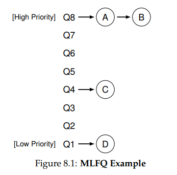
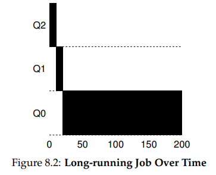
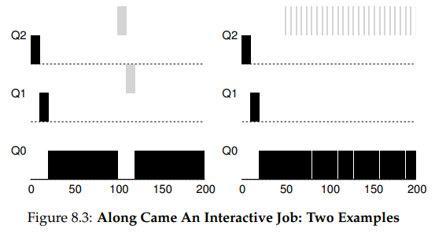
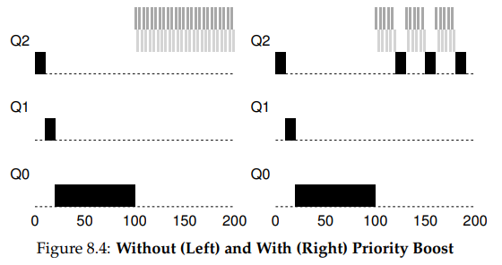
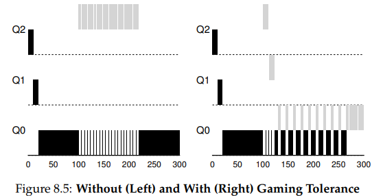
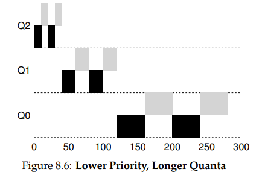

안녕하세요, pingu52입니다.

이번 글은 『Operating Systems: Three Easy Pieces(OSTEP)』의 **Scheduling: The Multi-Level Feedback Queue(MLFQ)** 파트를 읽고 정리한 노트입니다.

지난 7장에서 우리는 SJF/STCF(반환 시간 최적)와 RR(응답 시간 최적)이라는 두 가지 갈래를 봤습니다. 하지만 이들은 치명적인 전제가 필요했습니다. 바로 **작업의 실행 시간을 미리 알고 있다** 는 것이죠.

현실의 OS는 미래를 볼 수 없습니다. 이번 장에서는 **정보가 없는 상태(without perfect knowledge)** 에서, 어떻게 **반환 시간과 응답 시간**을 모두 잡을 수 있는지 알아봅니다.

---

## 1. 핵심 질문: 정보 없이 스케줄링하기

우리가 원하는 이상적인 스케줄러의 조건은 다음과 같습니다.

1. **짧은 작업(Interactive Job)** 은 빨리 실행시켜 **응답 시간(Response Time)** 을 줄이고 싶다. (RR처럼)
2. **긴 작업(CPU-bound Job)** 은 완료 시간을 줄여 **반환 시간(Turnaround Time)** 을 최적화하고 싶다. (SJF처럼)
3. 단, **OS는 작업이 짧은지 긴지 미리 알 수 없다.**

이 문제를 해결하기 위해 **MLFQ(Multi-Level Feedback Queue)** 는 **과거의 행동(History)** 을 보고 미래를 예측하는 전략을 사용합니다.

---

## 2. MLFQ의 기본 구조와 규칙

MLFQ는 이름 그대로 **여러 개의 큐(Multi-Level Queue)** 를 사용합니다. 각 큐는 **우선순위(Priority)** 가 다릅니다.

*Figure 8.1: MLFQ의 기본 구조*

### 기본 규칙 (Basic Rules)

- **Rule 1**: 우선순위가 높은(A) 작업이 낮은(B) 작업보다 먼저 실행된다. (`Pri(A) > Pri(B)`)
- **Rule 2**: 우선순위가 같으면, **RR(Round Robin)** 방식으로 돌아가며 실행된다.

즉, 높은 우선순위 큐에 있는 작업들이 다 끝나야 낮은 큐의 작업이 실행됩니다. 그렇다면 우선순위는 어떻게 정할까요?

### 우선순위 조정 (Priority Adjustment)

MLFQ는 작업이 처음 들어오면 일단 **"짧은 작업일 것이다"** 라고 가정하고 최고 우선순위를 부여합니다. 그리고 실행하면서 **CPU를 많이 쓰면 우선순위를 깎습니다.**

*Figure 8.2: 긴 작업은 시간이 지남에 따라 아래 큐로 떨어진다*

- **Rule 3**: 작업이 시스템에 진입하면, **가장 높은 우선순위(Top Queue)** 에 둔다.
- **Rule 4 (초기 버전)**:
  - 작업이 할당된 타임 슬라이스(Time Slice)를 다 쓰면, 우선순위를 낮춘다(강등).
  - 작업이 타임 슬라이스를 다 쓰기 전에 CPU를 양보(I/O 등)하면, 우선순위를 **유지**한다.

*Figure 8.3: 긴 작업(검은색) 실행 중 짧은 작업(회색)이 들어오면 높은 우선순위에서 빨리 처리된다 (SJF 근사)*

이 방식대로면 짧은 작업은 빨리 끝나서 나가고, 긴 작업은 천천히 아래 큐로 내려가게 됩니다. **SJF를 흉내** 내는 것이죠.

---

## 3. 문제점과 해결책

하지만 위의 기본 규칙만으로는 심각한 문제들이 발생합니다.

### 3.1 문제 1: 기아 상태 (Starvation)

시스템에 짧은 대화형 작업(Interactive Job)이 끊임없이 들어오면 어떻게 될까요?
Rule 1에 의해 높은 우선순위 큐만 계속 실행되므로, 낮은 우선순위에 있는 긴 작업들은 CPU를 전혀 받지 못하는 **기아(Starvation)** 상태에 빠집니다.

#### 해결책: 주기적인 우선순위 상향 (Priority Boost)

주기적으로 모든 작업을 최상위 큐로 올려버리면 해결됩니다.

*Figure 8.4: (좌) 부스트 없음 - 긴 작업(검은색) 기아 발생 / (우) 부스트 있음 - 주기적으로 실행됨*

- **Rule 5 (Priority Boost)**: 일정 시간 **S**가 지나면, 시스템의 **모든 작업을 최상위 큐로 이동**시킨다.

이렇게 하면 두 가지가 해결됩니다.

1. 긴 작업도 주기적으로 실행 기회를 보장받습니다 (기아 해결).
2. CPU 위주 작업이었다가 대화형으로 바뀐 작업도 다시 높은 우선순위를 얻을 수 있습니다.

### 3.2 문제 2: 스케줄러 속이기 (Gaming the Scheduler)

초기 Rule 4에는 허점이 있습니다.
*"타임 슬라이스를 다 쓰기 전에 양보하면 우선순위 유지"*

만약 어떤 악의적인 프로그램이 타임 슬라이스가 10ms일 때, **9.9ms만 쓰고 0.1ms 동안 I/O를 하는 행위를 반복**한다면?
이 작업은 CPU를 거의 독점하면서도 계속 최상위 큐에 머물게 됩니다. 이를 **게이밍(Gaming)** 이라고 합니다.

#### 해결책: 더 나은 측정 (Better Accounting)

각 단계에서 **총 사용 시간**을 누적해서 기록해야 합니다.

*Figure 8.5: (좌) 게이밍 허용 - 꼼수 쓰는 작업(회색)이 CPU 독점 / (우) 게이밍 방지 - 총 사용량을 채우면 강등됨*

- **Rule 4 (개정판)**: 해당 단계에서 사용한 **CPU 시간의 총합(Allotment)** 을 다 쓰면, I/O를 했든 안 했든 우선순위를 낮춘다.

이제 꼼수를 부려도 결국 할당량을 채우면 가차 없이 강등됩니다.

---

## 4. 튜닝과 파라미터 (Tuning and Parameters)

MLFQ를 실제로 구현하려면 수많은 상수(Parameter)를 정해야 합니다.

- **큐의 개수**: 몇 단계로 나눌 것인가?
- **타임 슬라이스 크기**: 상위 큐는 응답성이 중요하니 짧게(10ms), 하위 큐는 처리량이 중요하니 길게(100ms) 주는 것이 일반적입니다.
- **부스트 주기 (S)**: 너무 길면 기아 상태가 생기고, 너무 짧으면 대화형 작업의 응답성이 떨어집니다. 이를 "Voo-doo Constants(주술적 상수)"라고 부르기도 합니다. (정답이 없고 튜닝이 필요함)

*Figure 8.6: 하위 큐로 갈수록 타임 슬라이스를 길게 설정한 예*

Solaris 같은 실제 OS는 테이블 형태로 이 값들을 관리하여 관리자가 튜닝할 수 있게 합니다.

---

## 5. 요약 (Summary)

우리는 작업의 정보를 모르는 상태에서 스케줄링을 해야 했습니다. **MLFQ**는 **"과거는 미래를 보여준다(Learn from History)"** 는 철학으로 이 문제를 해결했습니다.

**최종 MLFQ 규칙:**

1. **Rule 1**: `Priority(A) > Priority(B)`이면 A 실행.
2. **Rule 2**: `Priority(A) == Priority(B)`이면 RR로 실행.
3. **Rule 3**: 새 작업은 최상위 큐에 배치.
4. **Rule 4**: 한 단계에서 할당 시간(Allotment)을 다 쓰면 강등 (게이밍 방지).
5. **Rule 5**: 주기(S)마다 모든 작업을 최상위로 리셋 (부스트).

이로써 MLFQ는 짧은 작업에는 **빠른 응답성**을, 긴 작업에는 **공정한 진행**을 보장하며 현대 OS 스케줄러의 근간이 되었습니다.

---

## 6. 용어 정리

- `MLFQ (Multi-Level Feedback Queue)`: 여러 개의 우선순위 큐를 두고, 작업의 실행 패턴(CPU 사용량)에 따라 큐를 이동시키며 스케줄링하는 기법.
- `피드백 (Feedback)`: 작업의 과거 실행 이력(짧게 쓰고 반환했는지, 오래 썼는지)을 바탕으로 우선순위를 조정하는 메커니즘.
- `기아 상태 (Starvation)`: 우선순위가 낮은 작업이 높은 우선순위 작업들에 밀려 오랫동안 CPU를 할당받지 못하는 현상.
- `우선순위 상향 (Priority Boost)`: 기아 상태를 방지하기 위해 주기적으로 모든 작업의 우선순위를 최상위로 올리는 기법.
- `게이밍 (Gaming)`: 스케줄러의 허점(예: 타임 슬라이스 직전에 CPU 반환)을 악용하여 부당하게 많은 CPU 시간을 차지하려는 행위.
- `할당량 (Allotment)`: 해당 우선순위 단계에서 머무를 수 있는 CPU 사용 시간의 총량. 이를 소진하면 아래 단계로 강등됨.
- `Voo-doo Constants`: 최적의 값을 찾기 어렵고 상황에 따라 달라지는 튜닝 파라미터들(부스트 주기, 타임 슬라이스 길이 등)을 일컫는 말.

---

## Reference

- [Operating Systems: Three Easy Pieces - Chapter 8: Scheduling: The Multi-Level Feedback Queue](https://pages.cs.wisc.edu/~remzi/OSTEP/cpu-sched-mlfq.pdf)
