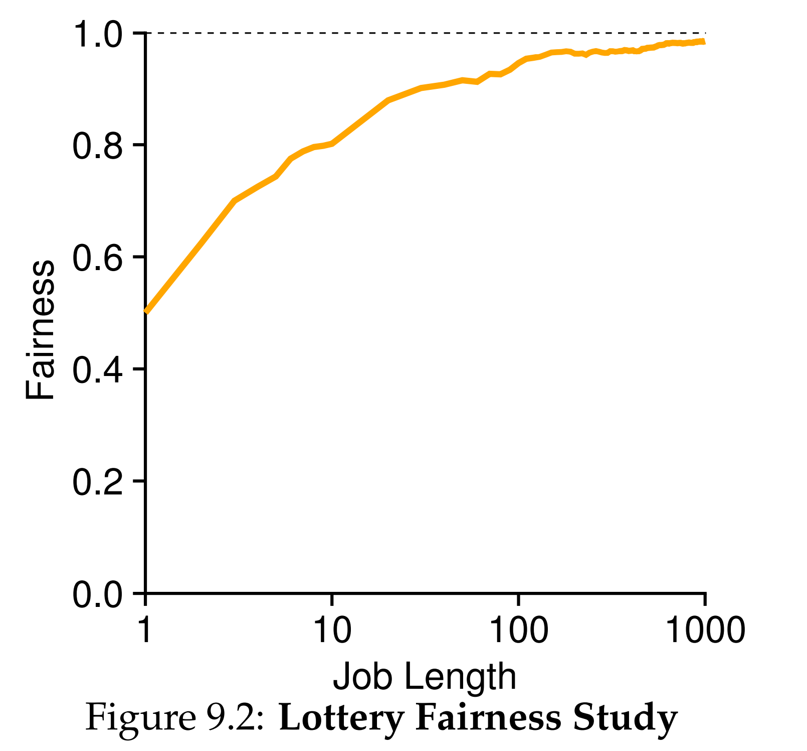
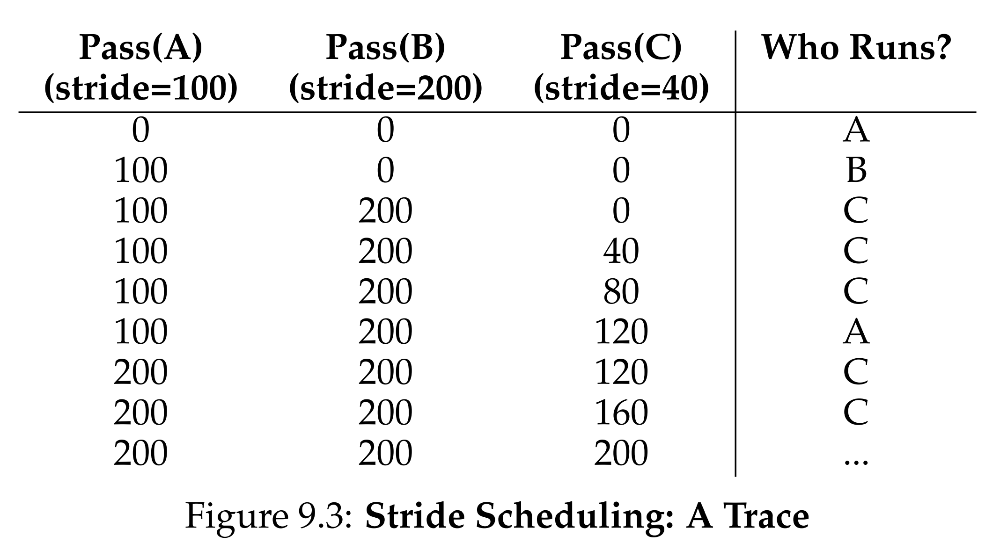
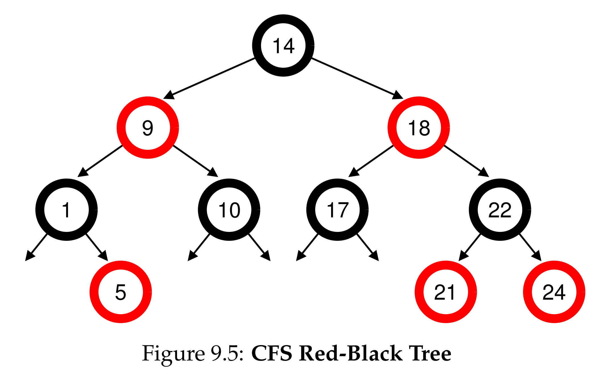

안녕하세요, pingu52입니다.

이번 글은 『Operating Systems: Three Easy Pieces(OSTEP)』의 **Scheduling: Proportional Share** 파트를 읽고 정리한 노트입니다.

지난 장(MLFQ)까지는 반환 시간(Turnaround Time)이나 응답 시간(Response Time) 같은 **성능 지표를 최적화**하는 데 집중했습니다. 이번 장에서는 관점을 조금 바꿔, **각 작업에게 CPU를 얼마나 공정하게(Fair) 나누어 줄 것인가?** 를 고민하는 **비례 배분(Proportional Share)** 스케줄러에 대해 알아봅니다.

---

## 1. 추첨 스케줄링 (Lottery Scheduling)

비례 배분을 구현하는 가장 직관적이고 오래된 아이디어 중 하나는 **추첨(Lottery)** 입니다. (Waldspurger & Weihl, 1994)

### 1.1 기본 개념: 티켓(Tickets)

핵심은 **티켓(Ticket)** 입니다. 티켓은 해당 작업이 받아야 할 **자원의 몫(Share)** 을 나타냅니다.

- 전체 티켓이 100장일 때, 프로세스 A가 75장, B가 25장을 가지고 있다면?
- A는 75%의 확률로, B는 25%의 확률로 CPU를 얻게 됩니다.

스케줄러는 매 타임 슬라이스마다 복권 추첨을 하듯 무작위로 숫자를 뽑고, 당첨된 티켓을 가진 프로세스를 실행합니다.

### 1.2 한계: 짧은 기간의 불공정성

추첨의 가장 큰 문제는 **확률**에 의존한다는 점입니다.
작업이 길다면 대수의 법칙에 의해 결국 목표 비율(75:25)에 수렴하겠지만, **실행 시간이 짧다면** 운에 따라 심각한 불균형(Unfairness)이 발생할 수 있습니다.

*Figure 9.2: 작업 길이가 짧을수록(좌측) 공정성이 낮고, 길수록(우측) 1에 수렴한다.*

---

## 2. 보폭 스케줄링 (Stride Scheduling)

"왜 굳이 랜덤을 써서 불확실성을 안고 가야 해?"라는 의문에서 나온 결정론적(Deterministic) 방식입니다.

### 2.1 보폭(Stride)과 패스(Pass)

각 프로세스는 티켓 수에 반비례하는 **보폭(Stride)** 값을 가집니다. 티켓이 많을수록 보폭은 작아집니다.

$$Stride = \frac{\text{Large Constant}}{\text{Tickets}}$$

- **Pass**: 현재까지 프로세스가 이동한 거리 (CPU 사용량)
- **알고리즘**: 현재 **Pass 값이 가장 작은 프로세스**를 선택해 실행하고, 실행 후에는 그 프로세스의 Pass에 Stride를 더합니다.

*Figure 9.3: 보폭 스케줄링의 정확한 실행 순서*

### 2.2 장단점

- **장점**: 언제나 정확한 비율로 CPU를 배분합니다. 짧은 기간에도 공정성이 보장됩니다.
- **단점**: **상태 관리(Global State)** 가 필요합니다. 새로운 프로세스가 중간에 들어오면 Pass 값을 얼마로 설정해야 할지(0으로 하면 독점하게 됨) 등 복잡한 문제가 생깁니다.

---

## 3. 리눅스 CFS (Completely Fair Scheduler)

현대 리눅스의 기본 스케줄러인 **CFS**는 비례 배분 방식을 매우 효율적으로 구현한 사례입니다. 티켓 대신 **vruntime(가상 실행 시간)** 이라는 개념을 사용합니다.

### 3.1 기본 동작: vruntime

- 모든 프로세스는 `vruntime`을 가집니다.
- 프로세스가 실행되는 동안 `vruntime`은 실제 실행 시간만큼 증가합니다.
- CFS는 **가장 작은 `vruntime`을 가진 프로세스**를 다음에 실행합니다.

즉, "가장 덜 실행된 녀석"을 골라 실행시켜 균형(Fairness)을 맞추는 것입니다.

### 3.2 가중치와 타임 슬라이스 (Weight & Time Slice)

CFS는 우선순위(Unix `nice` 값)를 **가중치(Weight)** 로 변환하여 처리합니다.
우선순위가 높은 프로세스는 더 많은 타임 슬라이스를 받아야 합니다. CFS는 **목표 응답 주기(`sched_latency`)** 를 각 프로세스의 가중치 비율에 따라 나눕니다.

$$time\_slice_k = \frac{weight_k}{\sum_{i=0}^{n-1} weight_i} \cdot sched\_latency$$

예를 들어 A의 가중치가 3, B의 가중치가 1이고 `sched_latency`가 48ms라면:

- A는 $$\frac{3}{4} \times 48 = 36ms$$
- B는 $$\frac{1}{4} \times 48 = 12ms$$
를 할당받습니다.

### 3.3 vruntime의 증가 속도

또한 CFS는 가중치가 높은 프로세스의 `vruntime`이 **천천히 증가**하게 만듭니다. 그래야 스케줄러가 "아직 덜 실행됐네?"라고 판단하고 더 자주 뽑아주기 때문입니다.

$$vruntime_i = vruntime_i + \frac{weight_0}{weight_i} \cdot runtime_i$$

- `weight_0`: 기본 가중치 (nice 0일 때의 값, 보통 1024)
- `runtime_i`: 실제 CPU를 사용한 시간

가중치(`weight_i`)가 클수록 더해지는 값이 작아지므로, `vruntime`이 느리게 자랍니다.

### 3.4 효율적인 자료구조: Red-Black Tree

수많은 프로세스 중에서 `vruntime`이 가장 작은 녀석을 빠르게 찾기 위해, CFS는 리스트 대신 **레드-블랙 트리(Red-Black Tree)** 를 사용합니다.

*Figure 9.5: vruntime을 키(Key)로 정렬된 레드-블랙 트리 구조*

가장 왼쪽 노드(Min vruntime)를 선택하는 비용이 $$O(1)$$, 다시 삽입하는 비용이 $$O(\log N)$$으로 매우 효율적입니다.

---

## 4. 요약 (Summary)

이번 장에서는 성능 최적화가 아닌 **비례 배분(Fair Share)** 을 위한 스케줄러들을 살펴봤습니다.

1. **Lottery Scheduling**: **무작위성(Randomness)** 과 **티켓**을 이용해 단순하고 유연하게 몫을 배분하지만, 단기적으로는 불공정할 수 있습니다.
2. **Stride Scheduling**: 결정론적 알고리즘으로 정확한 배분을 보장하지만, 신규 작업 처리가 까다롭습니다.
3. **Linux CFS**: **vruntime**과 **RB-Tree**를 이용해 공정성과 효율성, 확장성을 모두 잡은 현대적인 스케줄러입니다. 특히 **가중치 공식**을 통해 정교한 타임 슬라이스 분배를 구현했습니다.

---

## 5. 용어 정리

- `비례 배분(Proportional Share)`: 반환/응답 시간 최적화보다 각 작업에 일정 비율의 CPU를 보장하는 것을 목표로 하는 스케줄링.
- `티켓(Ticket)`: 해당 프로세스가 받아야 할 자원의 몫을 나타내는 추상적인 단위.
- `보폭(Stride)`: 티켓 수의 역수. 보폭 스케줄링에서 프로세스가 한 번 실행될 때마다 증가하는 Pass 값의 크기.
- `vruntime(Virtual Runtime)`: CFS에서 사용하는 가상 실행 시간. 우선순위(Weight)가 높을수록 실제 시간보다 느리게 증가함.
- `sched_latency`: CFS가 모든 프로세스를 한 번씩 실행시키는 데 걸리는 목표 주기.
- `Red-Black Tree`: CFS가 실행 대기 중인 프로세스들을 vruntime 순으로 정렬하여 관리하는 균형 이진 탐색 트리 자료구조.

---

## Reference

- [Operating Systems: Three Easy Pieces - Chapter 9: Scheduling: Proportional Share](https://pages.cs.wisc.edu/~remzi/OSTEP/cpu-sched-lottery.pdf)
