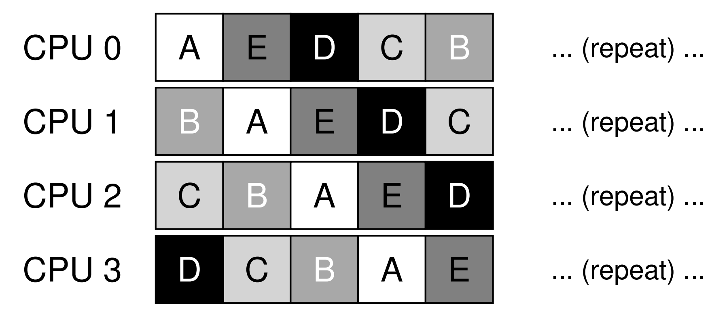
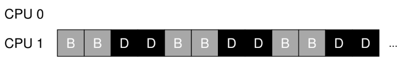

안녕하세요, pingu52입니다.

이번 글은 『Operating Systems: Three Easy Pieces(OSTEP)』의 **Multiprocessor Scheduling (Advanced)** 파트를 읽고 정리한 노트입니다.

지난 시간까지 우리는 CPU가 하나만 있는 상황을 가정하고 스케줄링(SJF, RR, MLFQ, Lottery 등)을 고민했습니다. 하지만 요즘 세상에 싱글 코어 CPU를 쓰는 사람은 거의 없죠.

CPU가 여러 개(Multicore)가 되면 기존의 스케줄링 이론들은 어떤 도전에 직면할까요? 단순히 "CPU가 많으니까 일을 나눠서 하면 된다"라고 하기엔, 하드웨어적인 제약과 성능 문제가 꽤 복잡합니다.

---

## 1. 배경: 멀티프로세서 환경의 하드웨어 이슈

멀티프로세서 스케줄링을 이해하려면, 먼저 하드웨어 아키텍처가 어떻게 변했는지 이해해야 합니다. 핵심은 **캐시(Cache)** 입니다.

### 1.1 캐시 일관성 (Cache Coherence)

*Figure 10.2: 두 개의 CPU가 메모리를 공유하지만 캐시는 따로 가진 구조*

각 CPU는 자신만의 L1, L2 캐시를 가지고 있습니다.
만약 CPU 1이 메모리 주소 A의 데이터를 읽어와서 수정했다면, CPU 1의 캐시에는 최신 데이터가 있지만 메인 메모리와 CPU 2의 캐시에는 **구버전 데이터(Stale Data)** 가 남아있게 됩니다.

이 상태에서 CPU 2가 A를 읽으려고 하면 문제가 생기겠죠? 이를 해결하기 위해 하드웨어는 **버스 스누핑(Bus Snooping)** 등의 기술로 모든 캐시의 데이터를 일치시키는 **캐시 일관성**을 보장합니다.

### 1.2 동기화 (Synchronization)

OS 커널이나 애플리케이션이 공유 데이터(예: 작업 큐)에 접근할 때, 여러 CPU가 동시에 접근하면 데이터가 깨질 수 있습니다.
이를 막기 위해 **락(Lock)** 을 사용해야 하는데, CPU가 많아질수록 락을 얻기 위한 경쟁(Contention)이 심해져 성능 저하가 발생합니다.

### 1.3 캐시 친화성 (Cache Affinity)

프로세스 A가 CPU 1에서 실행되었다면, CPU 1의 캐시에는 A가 쓰던 데이터가 잔뜩 남아있을 겁니다(Warm Cache).
다음에 A를 실행할 때 CPU 2로 옮겨버리면, CPU 2는 맨땅에서 데이터를 다시 로드해야 하므로 느려집니다. 따라서 스케줄러는 **가능하면 같은 프로세스를 같은 CPU에서 실행**하려고 노력해야 하는데, 이를 **캐시 친화성**이라고 합니다.

---

## 2. 정책 1: SQMS (Single Queue Multiprocessor Scheduling)

가장 단순한 접근법은 **"기존 스케줄러를 재활용하자"** 입니다.
모든 작업을 **하나의 글로벌 큐(Single Queue)** 에 넣고, 여러 CPU가 이 큐에서 작업을 꺼내가는 방식입니다.

### 장점

- **단순함**: 기존 싱글 프로세서용 스케줄러(예: MLFQ)를 거의 그대로 쓸 수 있습니다.
- **로드 밸런싱(Load Balancing)**: 모든 CPU가 하나의 큐를 공유하므로, 특정 CPU가 놀고 있는 일이 없습니다.

### 단점

1. **확장성(Scalability) 부족**: 모든 CPU가 큐 하나에 접근하려다 보니 **락 경쟁(Lock Contention)** 이 심각해집니다. CPU를 늘려도 성능이 그만큼 오르지 않습니다.
2. **캐시 친화성(Affinity) 나쁨**: 작업이 이 CPU 저 CPU를 왔다 갔다 하게 됩니다(Ping-pong Effect). 캐시 효과를 전혀 못 봅니다.

*SQMS의 문제점: 작업(A~E)들이 CPU를 고정하지 못하고 계속 옮겨 다닌다.*

*물론 Affinity Mask 같은 기법으로 일부 해결할 수는 있지만, 근본적인 락 경쟁 문제는 남습니다.*

---

## 3. 정책 2: MQMS (Multi-Queue Multiprocessor Scheduling)

확장성 문제를 해결하기 위해 등장한 것이 **MQMS**입니다.
**CPU마다 각자의 큐(Queue)를 갖는 방식**입니다. 작업이 시스템에 들어오면 특정 CPU의 큐에 배치됩니다.

### 장점

- **확장성(Scalability) 좋음**: 각 CPU는 자기 큐만 봅니다. 글로벌 락 경쟁이 사라집니다.
- **캐시 친화성(Affinity) 좋음**: 작업이 한 번 큐에 들어가면 계속 같은 CPU에서 실행되므로 캐시 효율이 극대화됩니다.

### 단점: 로드 불균형 (Load Imbalance)

치명적인 단점이 있습니다. 운 나쁘게 어떤 CPU의 큐는 텅 비고, 어떤 CPU의 큐는 작업이 쌓일 수 있습니다.

*MQMS의 문제점: CPU 1은 바쁜데(B, D), CPU 0은 할 일이 없어 놀고 있다.*

이런 상황을 해결하기 위해 **워크 스틸링(Work Stealing)** 기술이 필요합니다.

#### 해결책: 워크 스틸링 (Work Stealing)

놀고 있는 CPU가 바쁜 CPU의 큐를 훔쳐(peek) 보고, 작업이 많으면 일부를 가져오는 기법입니다.

- 너무 자주 훔쳐보면? -> 오버헤드 증가
- 너무 안 훔쳐보면? -> 로드 불균형 지속

결국 "얼마나 자주 훔쳐볼 것인가"가 튜닝의 핵심이 됩니다.

---

## 4. 리눅스의 접근 (Linux Schedulers)

현대 리눅스 스케줄러들은 대부분 **MQMS** 방식을 기반으로 발전했습니다.

- **O(1) Scheduler**: 우선순위 배열을 CPU마다 두어 확장성을 잡았고, 인터랙티브 성능에 집중했습니다.
- **CFS (Completely Fair Scheduler)**: 현재 리눅스의 기본 스케줄러로, 역시 멀티 큐 구조를 사용하며 결정론적인 공정성(vruntime)을 보장합니다.
- **BFS**: 특이하게 다시 단일 큐(SQMS) 구조를 채택하여, 데스크탑 환경에서의 복잡성을 줄이려 시도하기도 했습니다.

---

## 5. 요약 (Summary)

멀티프로세서 스케줄링은 **확장성**과 **캐시 효율** 사이의 줄타기입니다.

| 정책 | 구조 | 장점 | 단점 |
| :--- | :--- | :--- | :--- |
| **SQMS** | 단일 큐 공유 | 구현 단순, 자동 로드 밸런싱 | **락 경쟁(확장성 X)**, 캐시 친화성 낮음 |
| **MQMS** | CPU별 개별 큐 | **확장성 우수**, 캐시 친화성 높음 | **로드 불균형**, 워크 스틸링 구현 복잡 |

결국 "완벽한 스케줄러는 없다"는 명제는 여기서도 유효합니다. 시스템의 목적(서버용 vs 데스크탑용)에 따라 적절한 트레이드오프를 선택해야 합니다.

---

## 6. 용어 정리

- `캐시 일관성(Cache Coherence)`: 여러 CPU 캐시에 저장된 동일한 데이터가 항상 같은 값을 유지하도록 보장하는 하드웨어 메커니즘.
- `버스 스누핑(Bus Snooping)`: 캐시들이 버스를 감시하며 메모리 변경 사항을 감지하는 기술.
- `캐시 친화성(Cache Affinity)`: 프로세스를 이전에 실행했던 CPU에서 계속 실행하여 캐시 적중률(Hit Rate)을 높이려는 성질.
- `SQMS (Single Queue Multiprocessor Scheduling)`: 모든 작업을 하나의 글로벌 큐에서 관리하는 방식.
- `MQMS (Multi-Queue Multiprocessor Scheduling)`: CPU마다 별도의 큐를 두어 관리하는 방식.
- `워크 스틸링(Work Stealing)`: MQMS에서 로드 불균형을 해소하기 위해, 한가한 CPU가 바쁜 CPU의 작업을 가져오는 기법.

---

## Reference

- [Operating Systems: Three Easy Pieces - Chapter 10: Multiprocessor Scheduling (Advanced)](https://pages.cs.wisc.edu/~remzi/OSTEP/cpu-sched-multi.pdf)
