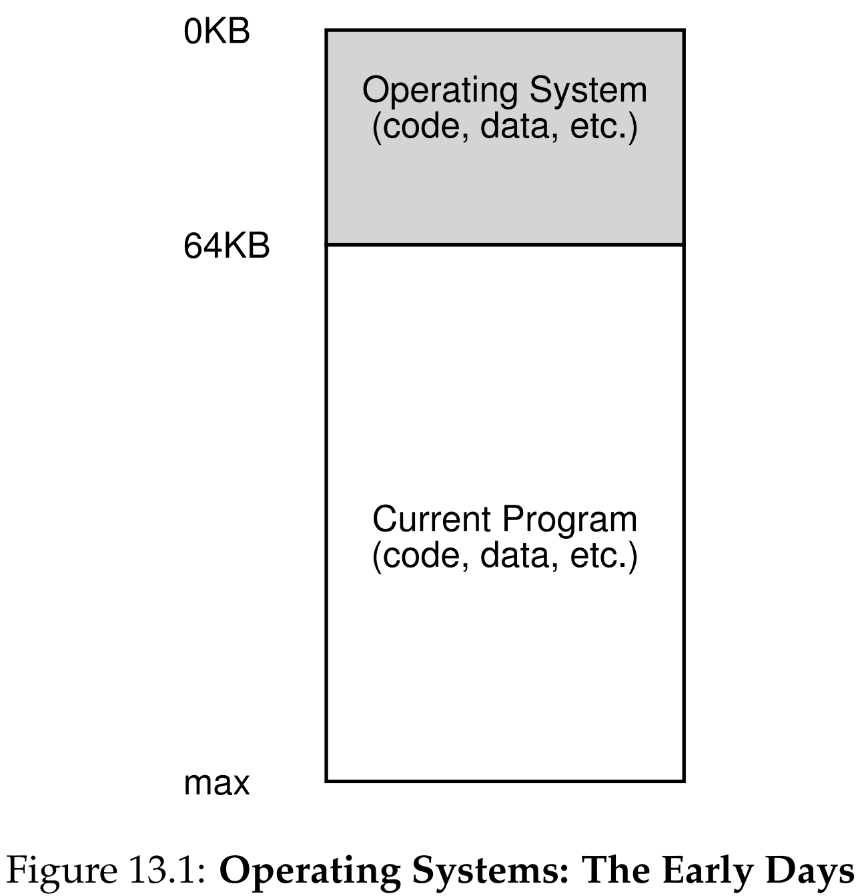
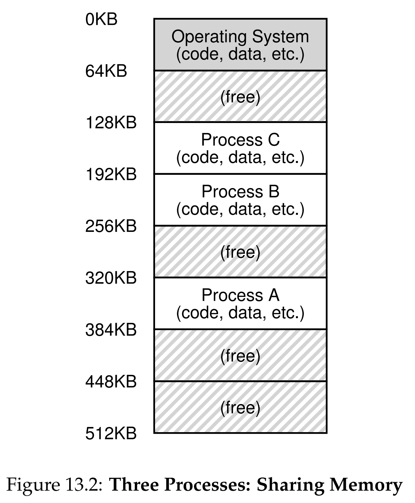
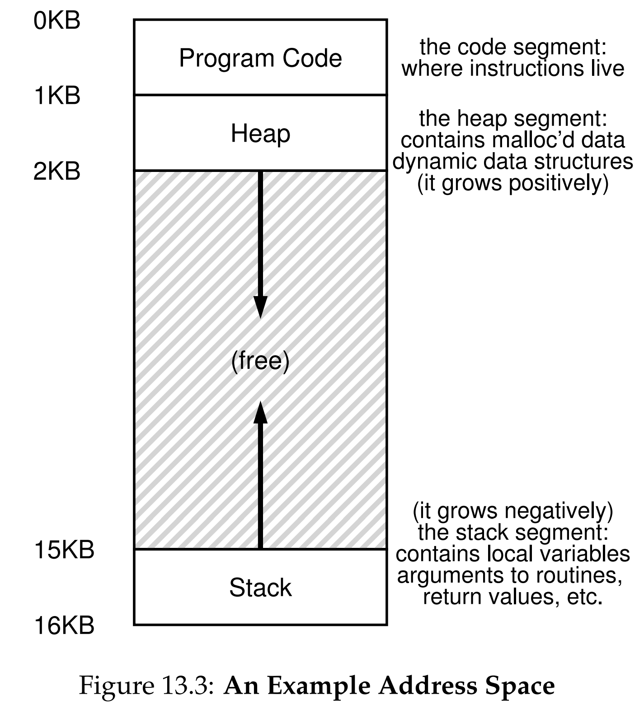

안녕하세요, pingu52입니다.

지난 포스팅까지 CPU 가상화(스케줄링)를 다루었고, 이번 글부터는 OS의 또 다른 핵심 기능인 **메모리 가상화(Memory Virtualization)** 를 정리합니다.

『Operating Systems: Three Easy Pieces(OSTEP)』 13장은 메모리 가상화의 가장 기초가 되는 개념인 **주소 공간(Address Space)** 의 정의와 필요성, 그리고 이를 구현하기 위한 목표를 설명합니다.

---

## 1. 초기 시스템과 멀티프로그래밍

### 1.1 초기 시스템 (Early Systems)

초기의 컴퓨터 시스템은 메모리 관리가 단순했습니다.
물리 메모리의 앞부분(예: 0~64KB)에는 운영체제(라이브러리 세트)가 상주하고, 나머지 공간에는 **단 하나의 실행 중인 프로그램**이 로드되어 물리 메모리를 직접 사용했습니다.

*Figure 13.1: 초기 시스템의 메모리 구조. OS와 하나의 프로그램만 존재한다.*

- 물리 메모리를 그대로 사용했습니다.
- 가상화? 추상화? 그런 건 없었습니다.

### 1.2 멀티프로그래밍과 시분할 (Multiprogramming & Time Sharing)

이후 컴퓨터 자원의 효율성을 높이기 위해 여러 프로세스를 동시에 메모리에 올리는 **멀티프로그래밍(Multiprogramming)** 이 도입되었습니다. 이어 사용자와의 상호작용이 중요한 **시분할 시스템(Time Sharing)** 시대로 넘어오면서, 여러 프로세스가 빠른 응답 속도로 전환되며 실행되어야 했습니다.

*Figure 13.2: 시분할 시스템. 물리 메모리에 여러 프로세스가 나누어 적재되어 있다.*

여기서 문제가 생깁니다.
여러 프로세스가 메모리에 동시에 올라와 있어야 하는데, **서로의 영역을 침범하지 않게 어떻게 보호할 것인가?**

이 과정에서 **보호(Protection)** 문제가 대두되었습니다.
하나의 메모리 공간에 여러 프로세스가 공존하게 되면서, 어떤 프로세스가 다른 프로세스의 메모리나 OS 영역을 침범(읽기/쓰기)하지 못하도록 막아야 할 필요성이 생긴 것입니다.

---

## 2. 핵심 추상화: 주소 공간 (Address Space)

이 문제를 해결하기 위해 OS는 **주소 공간(Address Space)** 이라는 개념을 도입합니다.

:::note
**주소 공간**: 실행 중인 프로그램이 보기에 자신이 독점하고 있는 메모리의 모습
:::

실제 물리 메모리는 수많은 프로세스가 공유하고 있지만, OS는 각 프로세스에게 **"네가 이 메모리를 다 쓰고 있어"** 라는 환상을 심어줍니다.

*Figure 13.3: 일반적인 주소 공간의 구조 (Code, Heap, Stack)*

일반적인 주소 공간은 다음 세 가지 요소로 구성됩니다.

1. **코드(Code)**: 명령어(Instruction)가 저장되는 영역입니다. 크기가 고정(Static)되어 있으므로 주소 공간의 상단에 위치합니다.
2. **힙(Heap)**: `malloc()` (C) 또는 `new` (Java/C++) 등을 통해 동적으로 할당되는 메모리입니다. 상단(코드 직후)에서 시작하여 아래로 확장됩니다.
3. **스택(Stack)**: 함수 호출 체인, 지역 변수, 리턴 주소 등이 저장되는 영역입니다. 주소 공간의 하단에서 시작하여 위로 확장됩니다.

---

## 3. 메모리 가상화 (Virtualizing Memory)

메모리 가상화의 핵심 원리는 다음과 같습니다.

:::note
**사용자 프로그램이 보는 모든 주소는 가상 주소(Virtual Address)이다.**
:::

C 프로그램에서 포인터 주소를 출력했을 때 나오는 값은 실제 물리 메모리의 주소(Physical Address)가 아닙니다.

1. 프로세스가 가상 주소(예: 0번지)에 접근을 시도합니다.
2. **OS**와 **하드웨어**가 개입하여 이 가상 주소를 실제 데이터가 위치한 **물리 주소**로 변환합니다.
3. 이를 통해 프로세스는 자신이 메모리를 독점하는 것처럼 느끼지만, 실제로는 OS가 물리 메모리를 여러 프로세스에 나누어 관리합니다.

---

## 4. 메모리 가상화의 목표 (Goals)

OS가 메모리를 가상화할 때 달성해야 하는 세 가지 주요 목표는 다음과 같습니다.

### 4.1 투명성 (Transparency)

가상화는 실행 중인 프로그램이 인지할 수 없어야 합니다.
프로그램은 자신이 가상 메모리를 사용한다는 사실을 모른 채, 전용 물리 메모리를 가진 것처럼 동작해야 합니다.

### 4.2 효율성 (Efficiency)

가상화로 인한 오버헤드를 최소화해야 합니다.

- **시간(Time)**: 주소 변환 과정이 프로그램 실행 속도를 크게 저하시키지 않아야 합니다. (하드웨어 TLB 등의 지원 필요)
- **공간(Space)**: 가상화를 지원하기 위한 데이터 구조(페이지 테이블 등)가 메모리를 너무 많이 차지하지 않아야 합니다.

### 4.3 보호 (Protection)

프로세스 간의 **격리(Isolation)** 를 보장해야 합니다.
한 프로세스가 다른 프로세스의 메모리나 OS 자체의 메모리에 접근하거나 영향을 주어서는 안 됩니다. 이를 통해 프로그램이 오류를 일으켜도 다른 프로세스나 시스템 전체는 안전하게 보호됩니다.

---

## 5. 요약 (Summary)

13장에서는 메모리 가상화의 기본 개념을 다루었습니다.
OS는 **주소 공간**이라는 추상화를 통해 프로그램에게 사용하기 쉬운 메모리 뷰를 제공하고, 내부적으로는 **주소 변환(Address Translation)** 메커니즘을 통해 물리 메모리를 효율적이고 안전하게 관리합니다.

다음 장부터는 이 가상화를 실제로 구현하기 위한 기법들(베이스/바운드 레지스터, 세그멘테이션, 페이징 등)을 순차적으로 살펴볼 예정입니다.

---

## 6. 용어 정리

- `주소 공간(Address Space)`: 실행 중인 프로그램이 인식하는 메모리의 추상화된 범위.
- `가상 주소(Virtual Address)`: 프로그램이 참조하는 논리적인 주소. OS에 의해 물리 주소로 변환됨.
- `물리 주소(Physical Address)`: 실제 하드웨어 메모리 상의 주소.
- `투명성(Transparency)`: 가상화 시스템이 사용자에게 드러나지 않고 투명하게 동작하는 성질.
- `격리(Isolation)`: 프로세스가 서로의 메모리에 간섭하지 못하도록 분리하여 시스템 신뢰성을 높이는 원칙.

---

## Reference

- [Operating Systems: Three Easy Pieces - Chapter 13: The Abstraction: Address Spaces](https://pages.cs.wisc.edu/~remzi/OSTEP/vm-intro.pdf)
- [Operating Systems: Three Easy Pieces - Dialogue on Memory Virtualization](https://pages.cs.wisc.edu/~remzi/OSTEP/dialogue-vm.pdf)
