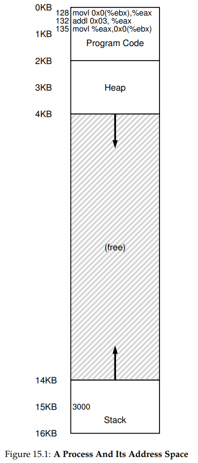
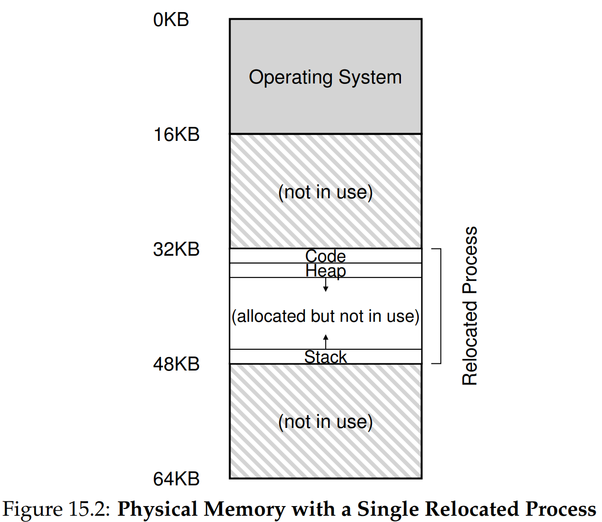

안녕하세요, pingu52입니다.

이번 장에서는 메모리 가상화를 실제로 구현하는 **메커니즘(Mechanism)** 을 다룹니다.

CPU 가상화에서 **LDE(Limited Direct Execution, 제한적 직접 실행)** 기법을 사용했던 것 기억하시나요? 메모리 가상화에서도 비슷한 전략을 사용합니다. 프로그램이 메모리에 직접 접근하게 두되, **중요한 순간에 OS와 하드웨어가 개입**하여 효율성과 제어를 동시에 잡는 것이 목표입니다.

그 첫 번째 단계로, 가장 단순하지만 강력한 기법인 **하드웨어 기반 주소 변환(Hardware-based Address Translation)**, 일명 **동적 재배치(Dynamic Relocation)** 를 알아봅니다.

---

## 1. 주소 변환 (Address Translation)

주소 변환의 핵심 아이디어는 간단합니다.

:::note
하드웨어가 모든 메모리 참조를 가로채서(Interpose), 가상 주소를 실제 물리 주소로 바꾼다.
:::

프로그램은 자신이 `0`번지부터 시작하는 완벽한 전용 메모리를 가진다고 생각하지만, 실제로는 물리 메모리의 어딘가(예: `32KB`)에 배치되어 있습니다. CPU는 명령어를 실행하거나 데이터를 읽고 쓸 때마다 이 변환을 수행합니다.

---

## 2. 동적 재배치: 베이스와 바운드 (Base and Bounds)

이 변환을 이해하기 위해, 먼저 프로세스가 바라보는 메모리(환상)와 실제 메모리(현실)를 비교해 봅시다.

*Figure 15.1: 프로세스의 관점. 코드는 0부터, 스택은 16KB에서 시작한다고 믿습니다.*

하지만 실제 물리 메모리 상에서의 모습은 다릅니다.

*Figure 15.2: 실제 물리 메모리. OS는 이 프로세스를 32KB 지점에 재배치했습니다.*

이러한 **재배치(Relocation)** 를 효율적으로 수행하기 위해 CPU에는 두 개의 특수 레지스터가 필요합니다.

### 2.1 베이스 레지스터 (Base Register)

프로그램이 물리 메모리의 **어디에 로드되었는지(시작 위치)** 를 저장합니다.
주소 변환 공식은 다음과 같습니다.

$\text{Physical Address} = \text{Virtual Address} + \text{Base}$

예를 들어, 베이스가 `32KB`이고 프로그램이 가상 주소 `128`을 요청하면:
`32768 + 128 = 32896` (물리 주소)

### 2.2 바운드 레지스터 (Bounds Register)

**보호(Protection)** 를 위한 레지스터입니다. 주소 공간의 **크기(Limit)** 를 저장합니다.
프로그램이 자신의 크기를 벗어난 가상 주소(예: 범위를 넘거나 음수)를 요청하면, 하드웨어는 변환을 중단하고 **예외(Exception)** 를 발생시킵니다.

### 2.3 동작 예시

- 가상 주소 공간 크기: 4KB
- 물리 메모리 로드 위치: 16KB (Base)
- 가상 주소 `0` 접근 -> `16KB` (유효)
- 가상 주소 `3000` 접근 -> `19384` (16KB + 3000, 유효)
- 가상 주소 `4400` 접근 -> **Fault (Out of Bounds)**

이 기법을 **동적 재배치(Dynamic Relocation)** 라고 부르는 이유는, 프로그램 실행 중에도 베이스 레지스터만 바꾸면 주소 공간을 쉽게 다른 곳으로 옮길(Move) 수 있기 때문입니다.

---

## 3. 하드웨어의 지원 (Hardware Support)

이 메커니즘이 동작하려면 하드웨어(CPU/MMU)가 다음 기능들을 지원해야 합니다.

1. **특권 모드(Privileged Mode)**: 베이스/바운드 레지스터는 오직 커널 모드에서만 수정 가능해야 합니다. 일반 프로그램이 이를 수정하면 메모리 보호가 무너집니다.
2. **예외 발생(Exception Raising)**: 범위 밖 메모리 접근 시 CPU는 실행을 멈추고 OS의 예외 핸들러를 호출해야 합니다.
3. **주소 변환 회로**: 매 명령어 인출, 로드, 스토어마다 덧셈과 비교 연산을 매우 빠르게 수행해야 합니다.

---

## 4. 운영체제의 역할 (OS Issues)

하드웨어가 변환을 담당하더라도, OS가 처리해야 할 중요한 이슈들이 있습니다.

### 4.1 프로세스 생성 시 (Creation)

새 프로세스를 위한 메모리 공간을 찾아야 합니다. 이를 위해 **프리 리스트(Free List)** 같은 자료구조로 비어 있는 물리 메모리 슬롯을 관리합니다.

### 4.2 프로세스 종료 시 (Termination)

프로세스가 끝나면 사용하던 메모리를 회수하여 다시 프리 리스트에 반환해야 합니다.

### 4.3 문맥 교환 시 (Context Switch)

베이스와 바운드 레지스터는 CPU에 하나뿐입니다.

- A 프로세스 실행 중단 -> A의 베이스/바운드 값을 **PCB(Process Control Block)** 에 저장.
- B 프로세스 실행 재개 -> PCB에 있던 B의 베이스/바운드 값을 CPU 레지스터에 복원.

### 4.4 예외 처리 (Exception Handling)

바운드 범위를 벗어난 접근이 발생했을 때 실행할 **핸들러(Handler)**를 부팅 시에 등록해야 합니다. 보통 이런 경우 해당 프로세스를 강제 종료(Kill)시킵니다.

### 4.5 실행 흐름 상세 분석 (Timeline)

프로그램이 실행될 때(런타임), OS와 하드웨어 그리고 프로그램이 어떻게 상호작용하는지 표로 정리해 봅시다.

| OS (커널 모드) | 하드웨어 | 프로그램 (유저 모드) |
| :--- | :--- | :--- |
| **프로세스 A 시작** 1. 프로세스 테이블 항목 할당 2. 메모리 할당 3. 베이스/바운드 레지스터 설정 4. 트랩 리턴 (return-from-trap) | | |
| | 1. A의 레지스터 복원 2. 유저 모드로 전환 3. A의 시작(PC)으로 점프 | |
| | **주소 변환 & 실행** 1. 가상 주소 변환 2. 명령어 인출(Fetch) | **프로세스 A 실행** 명령어 실행... (A 실행 중) |
| | **타이머 인터럽트 발생** 1. 커널 모드로 전환 2. 인터럽트 핸들러로 점프 | |
| **컨텍스트 스위치 (A → B)** 1. A 중단, B 실행 결정 2. `switch()` 루틴 호출 3. A의 레지스터(베이스/바운드 포함) 저장 4. B의 레지스터(베이스/바운드 포함) 복원 5. 트랩 리턴 | | |
| | 1. B의 레지스터 복원 2. 유저 모드로 전환 3. B의 PC로 점프 | |
| | **명령어 인출 및 실행** 1. 가상 주소 변환 2. 주소 범위 체크 (유효) 3. 로드/스토어 수행 | **프로세스 B 실행** 잘못된 로드(Bad Load) 시도 |
| | **예외 발생 (Out-of-Bounds)** 1. 범위 초과 감지 2. 커널 모드로 전환 3. 트랩 핸들러로 점프 | |
| **예외 처리** 1. 프로세스 B 강제 종료 (Kill) 2. B의 메모리 반환 3. 프로세스 테이블에서 제거 | | |

---

## 5. 요약 (Summary)

이번 장에서는 메모리 가상화의 기본 메커니즘인 **동적 재배치**를 살펴봤습니다.
베이스와 바운드 레지스터라는 간단한 하드웨어 추가만으로 우리는 **효율성(빠른 변환)** 과 **보호(범위 체크)** 를 달성할 수 있습니다.

하지만 이 방식에는 치명적인 단점이 하나 있습니다. 바로 **내부 단편화(Internal Fragmentation)** 입니다. 스택과 힙 사이의 사용하지 않는 공간(Free Space)도 물리 메모리를 차지해야 하기 때문에 메모리 낭비가 심합니다. 이를 해결하기 위해 다음 장에서는 **세그멘테이션(Segmentation)** 을 배울 것입니다.

---

## 6. 용어 정리

- `주소 변환(Address Translation)`: 가상 주소를 물리 주소로 변환하는 하드웨어 메커니즘.
- `동적 재배치(Dynamic Relocation)`: 프로그램 실행 중에 베이스 레지스터를 이용해 주소 공간의 물리적 위치를 지정하는 기법.
- `베이스 레지스터(Base Register)`: 주소 변환을 위해 가상 주소에 더해지는 시작 물리 주소 값.
- `바운드 레지스터(Bounds Register)`: 메모리 보호를 위해 주소 공간의 크기(상한선)를 저장하는 레지스터.
- `MMU(Memory Management Unit)`: 주소 변환과 접근 제어를 담당하는 CPU 내부의 하드웨어 장치.
- `프리 리스트(Free List)`: 사용 가능한 물리 메모리 영역들을 관리하는 OS의 자료구조.
- `내부 단편화(Internal Fragmentation)`: 할당된 메모리 영역 내부에서 사용되지 않고 낭비되는 공간.

---

## Reference

- [Operating Systems: Three Easy Pieces - Chapter 15: Mechanism: Address Translation](https://pages.cs.wisc.edu/~remzi/OSTEP/vm-mechanism.pdf)
