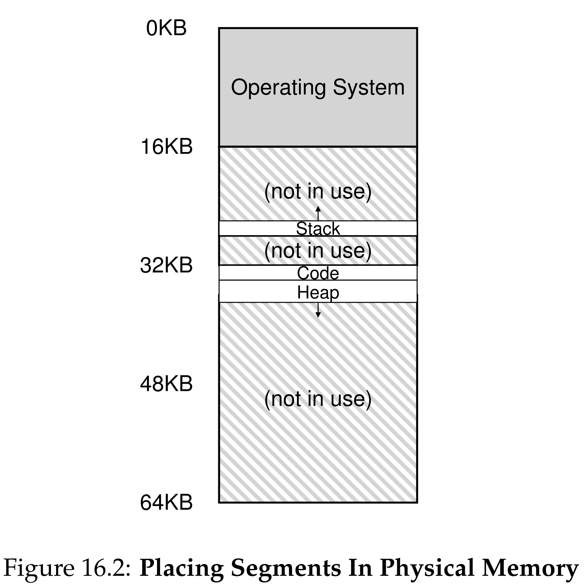
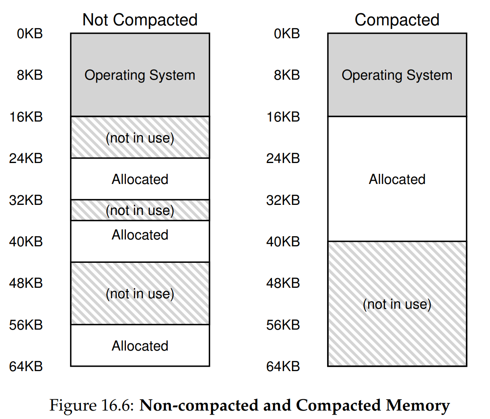

안녕하세요, pingu52입니다.

지난 장에서 다룬 **베이스와 바운드(Base and Bounds)** 방식은 물리 메모리의 연속된 공간에 프로세스의 전체 주소 공간을 배치하는 방식이었습니다. 하지만 이 방식은 치명적인 비효율성을 가지고 있습니다.

일반적인 프로세스 주소 공간을 보면, **스택(Stack)** 과 **힙(Heap)** 사이에는 사용되지 않는 빈 공간(Free Space)이 존재합니다. 베이스/바운드 방식은 이 빈 공간까지 포함하여 물리 메모리를 할당해야 하므로, 메모리 낭비가 심각합니다. 이를 **내부 단편화(Internal Fragmentation)** 라고 합니다.

이번 장에서는 이 문제를 해결하기 위해 주소 공간을 논리적인 단위로 쪼개서 관리하는 **세그멘테이션(Segmentation)** 기법을 알아봅니다.

---

## 1. 세그멘테이션: 베이스/바운드의 일반화

세그멘테이션의 핵심 아이디어는 **베이스/바운드 쌍을 논리적 세그먼트(Segment)마다 따로 두는 것**입니다. 이를 통해 주소 공간 전체가 아닌, 실제로 사용 중인 부분만 물리 메모리에 매핑할 수 있습니다.

일반적인 주소 공간은 다음 3개의 논리적 세그먼트로 나뉩니다.

1. **코드(Code)**: 명령어 집합 (읽기 전용)
2. **힙(Heap)**: 동적 데이터 (아래로 성장)
3. **스택(Stack)**: 지역 변수 및 함수 컨텍스트 (위로 성장)

운영체제는 이 세그먼트들을 물리 메모리의 각기 다른 위치에 독립적으로 배치합니다. 결과적으로 스택과 힙 사이의 빈 공간은 물리 메모리를 차지하지 않게 되어 메모리 효율이 획기적으로 개선됩니다.

*Figure 16.2: 물리 메모리에 배치된 세그먼트들. 논리적으로 연속된 주소 공간이 물리 메모리에서는 불연속적으로, 필요한 크기만큼만 할당되어 있다.*

---

## 2. 주소 변환 메커니즘 (Address Translation)

세그멘테이션 환경에서 하드웨어는 가상 주소를 어떻게 물리 주소로 변환할까요? 이제 가상 주소는 **세그먼트 식별자**와 **오프셋**으로 해석됩니다.

### 2.1 세그먼트 식별 (Explicit Approach)

가장 일반적인 방법은 가상 주소의 **최상위 비트(Top bits)** 를 세그먼트 번호로 사용하는 것입니다.
예를 들어 14비트 가상 주소 공간에서 상위 2비트를 식별자로 사용한다면:

- `00`: 코드 세그먼트
- `01`: 힙 세그먼트
- `10`: (미사용)
- `11`: 스택 세그먼트

나머지 하위 12비트는 해당 세그먼트 내부에서의 **오프셋(Offset)** 이 됩니다.

### 2.2 주소 변환 과정

하드웨어는 다음과 같은 로직으로 물리 주소를 계산합니다.

1. **세그먼트 추출**: 가상 주소의 상위 비트를 읽어 세그먼트 번호를 얻습니다.
2. **오프셋 추출**: 나머지 하위 비트를 오프셋으로 사용합니다.
3. **범위 검사 (Protection)**: 오프셋이 해당 세그먼트의 `Bounds`보다 작은지 확인합니다. 범위를 벗어나면 `Segmentation Fault`를 발생시킵니다.
4. **물리 주소 계산**: `Base[Segment] + Offset`을 통해 최종 물리 주소를 얻습니다.

---

## 3. 스택(Stack)의 처리: 음수 방향 성장

스택은 다른 세그먼트와 달리 **높은 주소에서 낮은 주소로(Backwards)** 자라납니다. 이를 지원하기 위해 하드웨어는 추가적인 정보가 필요합니다.

- **성장 방향 비트 (Grows Positive?)**: 1이면 양의 방향(힙, 코드), 0이면 음의 방향(스택)으로 성장함을 의미합니다.

스택의 경우 물리 주소 변환 방식이 조금 다릅니다. 스택은 세그먼트의 끝에서부터 거꾸로 자라기 때문에, 오프셋을 **음수(Negative Offset)** 로 계산해야 합니다. 이때 스택의 **베이스 레지스터**는 세그먼트의 시작이 아닌 **물리적 끝(높은 주소)** 을 가리키게 됩니다.

$$\text{Offset} = \text{VirtualAddress\ Offset} - \text{Max\ Segment\ Size}$$
$$\text{PhysicalAddress} = \text{Base} + \text{Offset}$$

예를 들어 4KB 크기의 스택 세그먼트에서 3KB 지점에 접근한다면, 오프셋은 $3KB - 4KB = -1KB$가 되며, 이를 베이스 주소(높은 주소)에서 뺍니다.

---

## 4. 공유와 보호 (Sharing & Protection)

세그멘테이션은 메모리 효율성뿐만 아니라 **공유(Sharing)** 의 이점도 제공합니다.
특히 **코드 세그먼트**는 읽기 전용(Read-Only)이므로, 여러 프로세스가 동일한 물리 메모리상의 코드를 공유하여 메모리를 절약할 수 있습니다.

이를 위해 하드웨어는 세그먼트 레지스터에 **보호 비트(Protection Bits)** 를 추가합니다.

- **Read-Execute**: 코드 세그먼트 (공유 가능)
- **Read-Write**: 힙, 스택 세그먼트 (프로세스별 전용)

만약 **읽기 전용**인 코드 세그먼트에 쓰기(Store)를 시도하면, 하드웨어는 보호 오류를 발생시켜 OS에게 알립니다.

---

## 5. 세분화(Fine-grained) vs 광역(Coarse-grained)

- **광역 세그멘테이션 (Coarse-grained)**: 우리가 지금까지 살펴본 것처럼 주소 공간을 코드, 힙, 스택 등 큼직한 몇 개의 단위로 나누는 방식입니다.
- **세분화 세그멘테이션 (Fine-grained)**: 초기 시스템(예: Burroughs B5000)처럼 주소 공간을 매우 잘게 쪼개어 수많은 세그먼트로 관리하는 방식입니다. 이 경우 세그먼트 정보를 레지스터가 아닌 메모리상의 **세그먼트 테이블**에 저장해야 합니다.

---

## 6. 운영체제의 역할과 새로운 문제

세그멘테이션은 내부 단편화 문제를 해결했지만, **외부 단편화(External Fragmentation)** 라는 새로운 난제를 가져왔습니다.

### 6.1 외부 단편화 (External Fragmentation)

세그먼트들의 크기는 고정되어 있지 않고 가변적(Variable-sized)입니다. 프로세스가 생성되고 종료됨에 따라 물리 메모리에는 서로 다른 크기의 세그먼트들이 할당되고 해제됩니다. 이 과정에서 **작은 빈 공간(Hole)** 들이 메모리 곳곳에 흩어지게 됩니다.

*Figure 16.6: (좌) 외부 단편화 발생. 총 빈 공간은 24KB지만 연속되지 않아 20KB를 할당할 수 없음. (우) 압축(Compaction) 후 할당 가능한 상태.*

전체 빈 메모리의 합은 충분하더라도, 연속된 공간이 부족하여 배치를 못 하는 현상이 발생합니다.

### 6.2 해결책

1. **압축 (Compaction)**: 흩어진 세그먼트들을 한쪽으로 몰아 큰 빈 공간을 확보합니다. 하지만 메모리 복사 비용이 매우 비싸 시스템 성능에 부담을 줍니다.
2. **빈 공간 관리 알고리즘**: `Best-fit`, `First-fit`, `Buddy Algorithm` 등의 기법을 사용하여 리스트를 효율적으로 관리해 단편화를 최소화합니다.

---

## 7. 요약 (Summary)

세그멘테이션은 **드문드문한(Sparse) 주소 공간**을 효율적으로 지원하기 위해 도입되었습니다.

- **장점**: 내부 단편화 해결, 코드 공유 용이, 동적 스택/힙 성장 지원.
- **단점**: 가변 크기 할당으로 인한 **외부 단편화** 발생.

결국 가변 크기의 세그먼트를 관리하는 것은 근본적으로 복잡합니다. 그래서 현대 OS는 메모리를 고정 크기 단위로 관리하는 **페이징(Paging)** 기법을 사용하게 됩니다. 다음 장에서 그 내용을 다룹니다.

---

## 8. 용어 정리

- `세그멘테이션(Segmentation)`: 주소 공간을 논리적 단위(코드, 힙, 스택)로 나누어 물리 메모리에 비연속적으로 할당하는 기법.
- `내부 단편화(Internal Fragmentation)`: 할당된 공간 내부에서 사용되지 않고 낭비되는 메모리.
- `외부 단편화(External Fragmentation)`: 전체 빈 공간은 충분하지만, 연속되지 않아서 할당할 수 없는 상태.
- `보호 비트(Protection Bits)`: 세그먼트별로 읽기/쓰기/실행 권한을 설정하여 불법적인 접근을 막는 비트.
- `압축(Compaction)`: 메모리 단편화를 해결하기 위해 사용 중인 메모리 블록들을 이동시켜 빈 공간을 합치는 작업.

---

## Reference

- [Operating Systems: Three Easy Pieces - Chapter 16: Segmentation](https://pages.cs.wisc.edu/~remzi/OSTEP/vm-segmentation.pdf)
