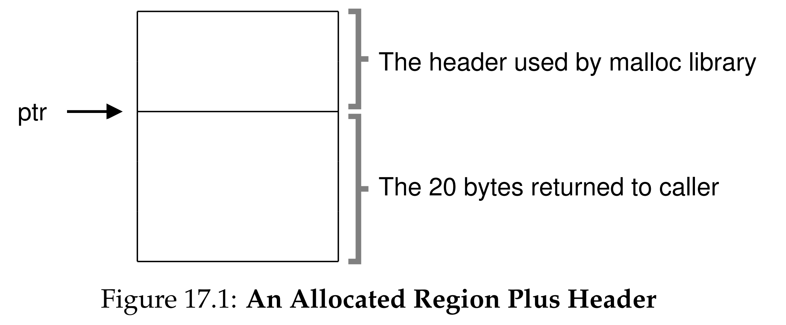
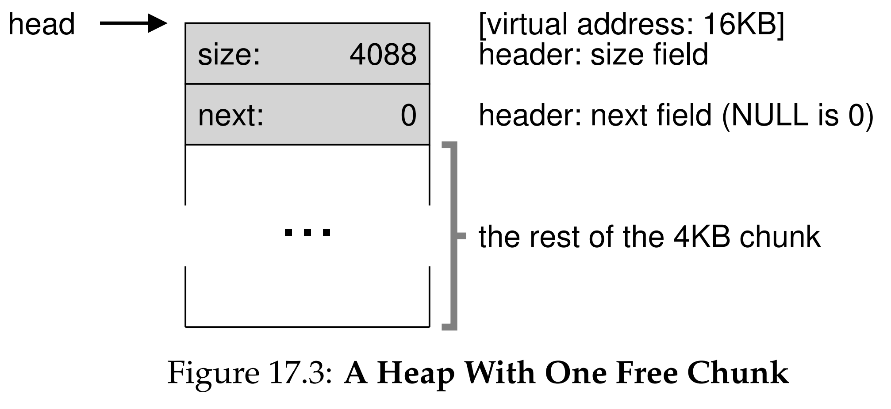
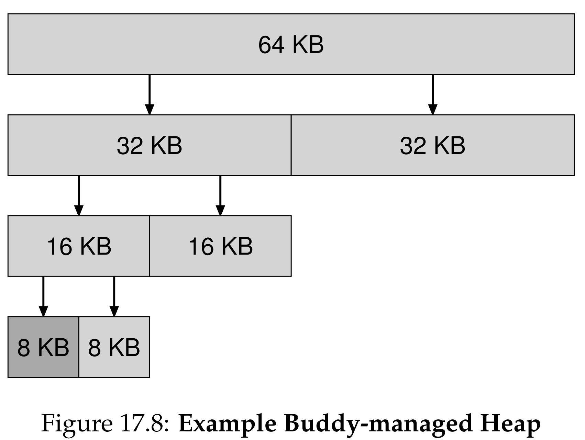

안녕하세요, pingu52입니다.

이전 16장에서 세그멘테이션이 가변 크기의 메모리를 할당하면서 **외부 단편화(External Fragmentation)** 문제를 일으킨다는 점을 확인했습니다. 전체 빈 공간은 충분하지만 연속된 공간이 없어 할당에 실패하는 이 문제는 메모리 관리 시스템의 핵심 과제입니다.

이번 장에서는 `malloc` 라이브러리나 운영체제 커널이 **빈 공간(Free Space)**을 효율적으로 관리하기 위해 사용하는 구체적인 기법과 정책들을 다룹니다.

---

## 1. 가정 및 문제 정의

우리가 관리해야 할 힙(Heap) 메모리 환경은 다음과 같습니다.

- **인터페이스**: `malloc(size_t size)`로 할당하고 `free(void *ptr)`로 해제합니다.
- **가변 크기**: 1바이트부터 수 킬로바이트까지 다양한 크기의 요청이 들어옵니다.
- **목표**: 외부 단편화를 최소화하고, 할당/해제 속도를 최적화해야 합니다.

---

## 2. 저수준 메커니즘 (Low-level Mechanisms)

대부분의 할당자(Allocator)는 빈 공간 관리를 위해 **분할(Splitting)** 과 **병합(Coalescing)** 이라는 기본 메커니즘을 사용합니다.

### 2.1 분할 (Splitting)

사용자가 요청한 크기보다 더 큰 빈 덩어리(Chunk)만 존재할 때 사용합니다.
예를 들어 10바이트 빈 공간이 있는데 1바이트 요청이 들어온 경우:

1. 10바이트 덩어리를 찾습니다.
2. 이를 1바이트(할당)와 9바이트(빈 공간)로 **나눕니다(Split)**.
3. 1바이트는 사용자에게 반환하고, 나머지 9바이트는 빈 공간 리스트(Free List)에 유지합니다.

### 2.2 병합 (Coalescing)

메모리가 해제되었을 때, 단순히 리스트에 추가하기만 하면 작은 조각들이 흩어지게 됩니다. 이를 방지하기 위해 병합을 수행합니다.

1. 메모리가 해제될 때(`free`), 해제되는 영역 바로 옆에 빈 공간이 있는지 확인합니다.
2. 인접한 빈 공간이 있다면 하나의 큰 덩어리로 **합칩니다(Coalesce)**.

이 과정이 없다면 힙은 시간이 지날수록 작은 조각들로 파편화되어 큰 요청을 처리할 수 없게 됩니다.

---

## 3. 할당된 크기 추적 (Tracking The Size)

`free(void *ptr)` 인터페이스는 포인터만 받을 뿐, **해제할 크기**를 인자로 받지 않습니다. 메모리 할당 라이브러리는 어떻게 해제해야 할 크기를 알 수 있을까요?

대부분의 할당자는 **헤더(Header)** 라는 메타데이터를 할당된 메모리 바로 앞부분에 저장합니다.


*Figure 17.1: 할당된 영역의 구조. ptr은 사용자가 사용하는 공간을 가리키며, 그 바로 앞(hptr)에 크기 정보를 담은 헤더가 위치합니다.*

헤더 구조체의 예시는 다음과 같습니다.

```c
typedef struct {
 int size;
 int magic;
} header_t;
```

사용자가 `malloc(N)`을 호출하면, 라이브러리는 `N + sizeof(header_t)` 크기의 공간을 찾습니다. 사용자는 `ptr`을 받지만, 라이브러리는 `free(ptr)` 호출 시 포인터 연산을 통해 헤더의 위치를 찾아내고 크기(`size`)를 확인하여 안전하게 해제합니다.

---

## 4. 프리 리스트 임베딩 (Embedding A Free List)

빈 공간을 관리하기 위한 리스트(Linked List) 노드는 어디에 저장할까요? 메모리 관리를 위한 추가 메모리를 또 `malloc`으로 할당할 수는 없습니다.

따라서 할당자는 **빈 공간 그 자체**에 리스트 노드를 저장합니다. 이를 **임베딩(Embedding)** 이라고 합니다.


*Figure 17.3: 빈 공간 내부에 프리 리스트가 임베딩된 모습. 4KB 힙 안에 하나의 거대한 빈 덩어리가 있고, 그 안에 size와 next 포인터가 저장되어 있습니다.*

빈 공간의 시작 부분에 `next` 포인터와 `size` 정보를 기록하여, 빈 덩어리들을 연결 리스트로 관리합니다. 메모리가 할당되면 이 공간은 사용자 데이터로 덮어쓰여지고, 해제되면 다시 리스트 노드로 활용됩니다.

---

## 5. 기본 할당 전략 (Basic Strategies)

빈 공간 리스트에서 적절한 덩어리를 찾는 정책(Policy)은 다양합니다.

### 5.1 Best Fit

- 리스트 전체를 검색하여 요청 크기보다 크거나 같은 것 중 **가장 작은** 덩어리를 선택합니다.
- **장점**: 공간 낭비를 최소화합니다.
- **단점**: 전체를 탐색해야 하므로 성능 오버헤드가 큽니다.

### 5.2 Worst Fit

- 리스트 전체를 검색하여 **가장 큰** 덩어리를 선택하고 분할합니다.
- **의도**: 남은 조각도 충분히 크도록 하여 활용도를 높이려는 의도입니다.
- **현실**: 전체 탐색 비용이 들고, 실험적으로 단편화를 오히려 심화시키는 경향이 있어 잘 사용되지 않습니다.

### 5.3 First Fit

- 리스트를 처음부터 검색하여 **가장 먼저 발견된** 충분한 크기의 덩어리를 선택합니다.
- **장점**: 탐색 속도가 빠릅니다.
- **단점**: 리스트의 앞부분에 작은 조각(Splinters)들이 몰리는 현상이 발생합니다.

### 5.4 Next Fit

- First Fit과 유사하지만, **마지막으로 할당한 위치**에서부터 검색을 시작합니다.
- **장점**: 리스트 전체에 빈 공간 분산을 유도하여 First Fit의 앞부분 쏠림 현상을 완화합니다.

---

## 6. 고급 접근법 (Other Approaches)

### 6.1 분리 가용 리스트 (Segregated Lists)

자주 할당되는 특정 크기(예: 32바이트, 64바이트)의 객체들을 위한 전용 리스트를 별도로 유지합니다.

- **장점**: 크기가 고정되어 있어 단편화가 발생하지 않으며 할당 속도가 매우 빠릅니다.
- **예시**: 솔라리스의 **Slab Allocator**가 대표적입니다.

### 6.2 버디 할당 (Buddy Allocation)

메모리를 $2^N$ 크기로 관리하며, 할당 시 큰 덩어리를 절반씩($2^N \rightarrow 2^{N-1}$) 계속 **이분(Binary Splitting)**하여 할당합니다.


*Figure 17.8: 64KB 공간에서 7KB 요청을 처리하기 위해 8KB 블록까지 분할하는 과정. 해제 시에는 인접한 '버디'가 비어있다면 즉시 상위 블록으로 병합됩니다.*

- **장점**: 해제 시 주소 연산만으로 인접한 **버디(Buddy)** 블록을 찾아 쉽게 **병합**할 수 있습니다. 속도가 빠릅니다.
- **단점**: $2^N$ 단위로만 할당하므로 내부 단편화가 발생할 수 있습니다.

---

## 7. 요약 (Summary)

17장에서는 메모리 할당자가 빈 공간을 관리하는 구체적인 기법을 다루었습니다.

- **핵심 기술**: 분할과 병합, 헤더를 이용한 정보 추적, 프리 리스트 임베딩.
- **할당 정책**: Best Fit, First Fit 등 상황에 맞는 전략 선택이 중요합니다.
- **고급 기법**: 성능과 효율성을 위해 Slab Allocator나 Buddy System 같은 고도화된 알고리즘이 실제 OS와 라이브러리에서 사용됩니다.

다음 장에서는 가상 메모리 시스템의 완성형이라 할 수 있는 **페이징(Paging)** 기법에 대해 본격적으로 알아봅니다.

---

## 8. 용어 정리

- `외부 단편화(External Fragmentation)`: 빈 공간의 총합은 충분하나 연속되지 않아 할당할 수 없는 상태.
- `분할(Splitting)`: 큰 빈 공간을 요청된 크기만큼 자르고 나머지를 빈 공간으로 유지하는 기법.
- `병합(Coalescing)`: 인접한 빈 공간들을 합쳐 더 큰 빈 공간을 만드는 기법.
- `헤더(Header)`: 할당된 메모리 블록 앞에 메타데이터(크기 등)를 저장하는 영역.
- `임베딩(Embedding)`: 메모리 관리를 위한 자료구조(리스트)를 빈 공간 내부에 저장하는 방식.
- `버디 할당(Buddy Allocation)`: 메모리를 2의 거듭제곱 단위로 분할 및 병합하여 관리하는 기법.

---

## Reference

- [Operating Systems: Three Easy Pieces - Chapter 17: Free-Space Management](https://pages.cs.wisc.edu/~remzi/OSTEP/vm-freespace.pdf)
