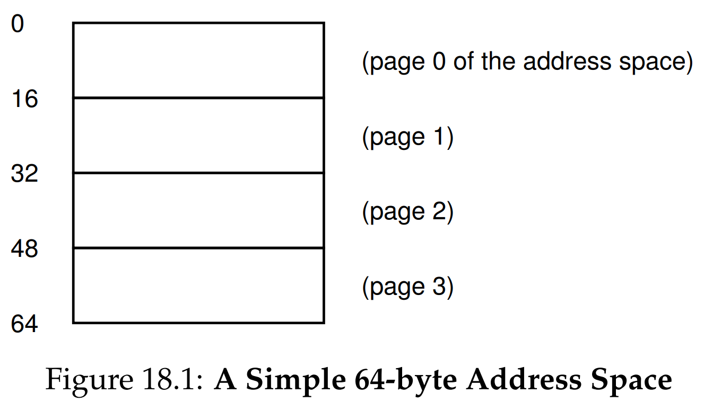
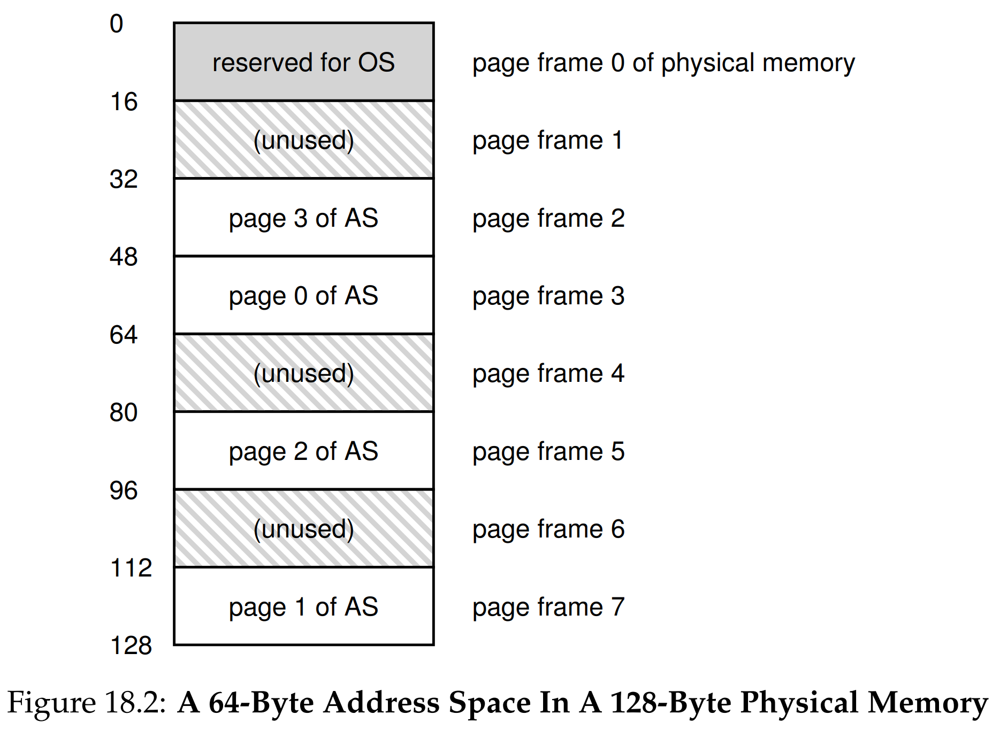
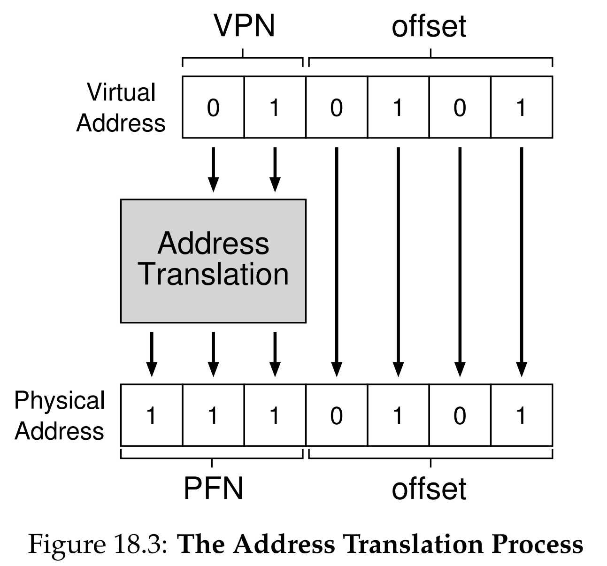

안녕하세요, pingu52입니다.

이전 장들에서 우리는 메모리 가상화를 위해 두 가지 접근법을 배웠습니다.

1. **베이스/바운드**: 주소 공간 전체를 연속적으로 배치 (내부 단편화 발생)
2. **세그멘테이션(Segmentation)**: 논리적 단위로 쪼개서 배치 (외부 단편화 발생)

세그멘테이션(Segmentation)의 가변 크기 할당은 필연적으로 메모리를 조각내어 **외부 단편화**를 유발합니다. 이를 해결하기 위해 운영체제는 가변 크기 대신 **고정 크기(Fixed-size)** 단위로 메모리를 관리하는 **페이징(Paging)** 기법을 도입했습니다.

이번 장에서는 페이징의 기본 개념과 주소 변환 메커니즘, 그리고 이에 따른 비용을 분석합니다.

---

## 1. 개념: 페이지와 페이지 프레임

페이징의 핵심 아이디어는 메모리 공간을 일정하고 고정된 크기로 나누는 것입니다.

- **페이지(Page)**: 가상 메모리(주소 공간)를 고정 크기로 나눈 조각.
- **페이지 프레임(Page Frame)**: 물리 메모리를 동일한 고정 크기로 나눈 조각(슬롯).

*Figure 18.1: 64바이트 가상 주소 공간이 4개의 16바이트 페이지(Page 0~3)로 나뉜 모습.*

*Figure 18.2: 128바이트 물리 메모리. 가상 페이지들이 순서 없이 물리 프레임(Frame)에 흩어져 배치된 것을 볼 수 있습니다.*

운영체제는 가상 주소 공간의 각 **페이지**를 물리 메모리의 빈 **페이지 프레임** 중 아무 곳에나 배치할 수 있습니다. 순서대로 배치할 필요가 없으며, 물리 메모리가 흩어져 있어도 상관없습니다. 모든 프레임의 크기가 같으므로 **외부 단편화가 완벽하게 해결**됩니다.

---

## 2. 주소 변환 (Address Translation)

페이징 시스템에서 가상 주소는 두 부분으로 나뉩니다.

1. **가상 페이지 번호 (VPN: Virtual Page Number)**: 해당 주소가 몇 번째 페이지에 있는지 나타냅니다.
2. **오프셋 (Offset)**: 페이지 내부에서 데이터가 어디에 위치하는지 나타냅니다.

### 2.1 예시: 64바이트 주소 공간, 16바이트 페이지

주소 공간이 64바이트($2^6$)이므로 가상 주소는 6비트입니다.
페이지 크기가 16바이트($2^4$)이므로 하위 4비트는 **오프셋**이고, 나머지 상위 2비트는 **VPN**이 됩니다.

예를 들어 가상 주소 `21` (이진수 `010101`)을 변환해 봅시다.

- **VPN**: 상위 2비트 `01` -> **1번 페이지**
- **Offset**: 하위 4비트 `0101` -> **5번째 바이트**

즉, 가상 페이지 1번의 5번째 바이트를 의미합니다.

### 2.2 물리 주소 계산

이제 하드웨어는 VPN(1)을 물리 프레임 번호(**PFN**: Physical Frame Number)로 바꿔야 합니다. 만약 가상 페이지 1번이 물리 프레임 7번에 있다고 가정하면:

- **PFN**: `111` (7번 프레임)
- **Offset**: `0101` (그대로 유지)
- **물리 주소**: `1110101` (117번지)

이 변환 정보를 저장하는 곳이 바로 **페이지 테이블(Page Table)** 입니다.

*Figure 18.3: 주소 변환 로직. 가상 주소의 VPN(01)을 이용해 PFN(111)을 찾고, 오프셋(0101)과 합쳐 물리 주소를 만드는 과정을 보여줍니다.*

---

## 3. 페이지 테이블 (Page Table)

페이지 테이블은 **가상 페이지(VPN)를 물리 프레임(PFN)으로 매핑**하는 자료구조입니다.

### 3.1 어디에 저장되는가?

이전의 베이스/바운드 레지스터나 세그먼트 레지스터는 개수가 적어 CPU 내부의 레지스터(MMU)에 저장할 수 있었습니다.
하지만 페이징에서는 페이지 개수가 매우 많기 때문에 레지스터에 담을 수 없습니다. 따라서 페이지 테이블은 **물리 메모리(RAM)** 에 저장됩니다.

### 3.2 페이지 테이블 항목 (PTE: Page Table Entry)

페이지 테이블의 각 항목(PTE)은 PFN뿐만 아니라 시스템 관리를 위한 중요한 비트들을 포함합니다.

- **Valid Bit**: 해당 변환이 유효한지(사용 중인 주소 공간인지) 표시. (세그먼트의 바운드 체크와 유사)
- **Protection Bits**: 읽기/쓰기/실행 권한 표시.
- **Present Bit**: 해당 페이지가 물리 메모리에 있는지, 디스크(스왑)에 있는지 표시.
- **Dirty Bit**: 페이지가 메모리에 올라온 후 수정되었는지 표시.
- **Reference Bit (Accessed Bit)**: 최근에 접근되었는지 표시 (페이지 교체 알고리즘에서 사용).

---

## 4. 페이징의 문제점: 속도와 공간

페이징은 외부 단편화를 해결했지만, 두 가지 심각한 새로운 문제를 야기합니다.

### 4.1 속도 문제 (Too Slow)

가상 주소를 물리 주소로 바꾸려면 페이지 테이블을 읽어야 합니다. 그런데 페이지 테이블은 **메모리**에 있습니다.
즉, 명령어 하나를 실행(`Fetch`)하거나 데이터를 로드(`Load`)할 때마다, **페이지 테이블을 읽기 위해 추가적인 메모리 접근**이 필요합니다.

- **명령어 인출**: 메모리 접근 1회 (페이지 테이블) + 메모리 접근 1회 (실제 명령어) = 2회 접근
- **데이터 로드**: 메모리 접근 1회 (페이지 테이블) + 메모리 접근 1회 (실제 데이터) = 2회 접근

메모리 접근은 CPU 연산보다 훨씬 느리므로, 시스템 성능이 절반 이하로 떨어질 수 있습니다.

### 4.2 공간 문제 (Too Big)

페이지 테이블의 크기가 너무 큽니다.
예를 들어 32비트 주소 공간에서 4KB 페이지를 사용한다고 가정해 봅시다.

- VPN 크기: 20비트 (약 100만 개 페이지)
- PTE 크기: 4바이트
- 프로세스당 페이지 테이블 크기: 100만 x 4바이트 = **4MB**

프로세스가 100개 실행 중이라면 페이지 테이블만으로 **400MB**의 메모리가 낭비됩니다.

---

## 5. 요약 (Summary)

18장에서는 고정 크기 할당 방식인 **페이징(Paging)** 의 기초를 다루었습니다.

- **장점**: **외부 단편화가 없음**. 물리 메모리 관리의 유연성 확보.
- **메커니즘**: 가상 주소를 **VPN**과 **Offset**으로 나누고, **페이지 테이블**을 통해 VPN을 PFN으로 변환.
- **단점**:
  1. **속도 저하**: 매 메모리 접근마다 페이지 테이블 조회를 위한 추가 메모리 접근 발생.
  2. **메모리 낭비**: 프로세스마다 거대한 페이지 테이블을 유지해야 함.

다음 장부터는 이 두 가지 문제(속도와 공간)를 해결하기 위한 기법인 **TLB(Translation Lookaside Buffer)** 와 **멀티 레벨 페이지 테이블**을 차례로 알아볼 것입니다.

---

## 6. 용어 정리

- `페이지(Page)`: 가상 주소 공간을 고정 크기로 나눈 블록.
- `페이지 프레임(Page Frame)`: 물리 메모리를 페이지와 동일한 크기로 나눈 블록.
- `VPN(Virtual Page Number)`: 가상 주소의 상위 비트로, 페이지 테이블의 인덱스로 사용됨.
- `PFN(Physical Frame Number)`: 물리 메모리 상의 프레임 번호.
- `PTE(Page Table Entry)`: 페이지 테이블의 각 항목으로, PFN과 상태 비트(Valid, Dirty 등)를 포함함.
- `페이지 테이블(Page Table)`: VPN을 PFN으로 매핑 정보를 저장하는 자료구조.

---

## Reference

- [Operating Systems: Three Easy Pieces - Chapter 18: Paging: Introduction](https://pages.cs.wisc.edu/~remzi/OSTEP/vm-paging.pdf)
