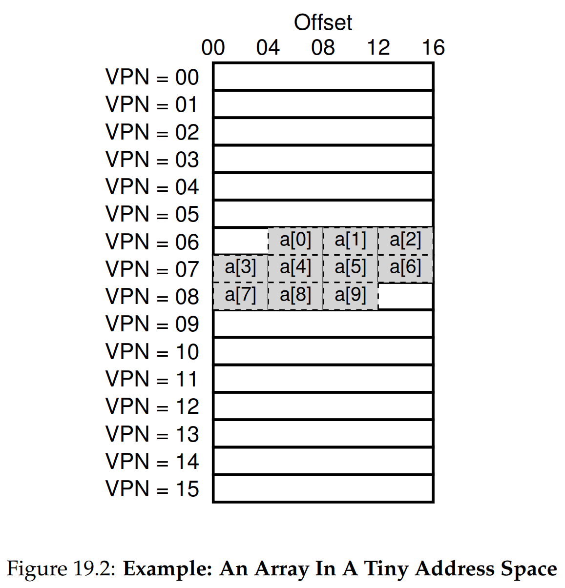
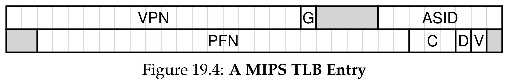

안녕하세요, pingu52입니다.

지난 18장에서 우리는 페이징(Paging)이 외부 단편화 문제를 해결하고 유연한 메모리 관리를 가능하게 한다는 것을 배웠습니다. 하지만 페이징에는 치명적인 비용이 따릅니다.

:::note
**주소 변환을 위해 메모리에 있는 페이지 테이블을 매번 읽어야 한다.**
:::

즉, 명령어 인출(Fetch)이나 데이터 로드(Load)를 할 때마다 메모리 접근이 최소 2배로 늘어나게 되어 시스템 성능이 심각하게 저하됩니다.

이번 장에서는 이 문제를 해결하기 위해 도입된 하드웨어 **변환 색인 버퍼(TLB: Translation Lookaside Buffer)** 에 대해 알아봅니다.

---

## 1. TLB의 기본 개념 (Basic Algorithm)

TLB는 MMU(Memory Management Unit)의 일부로서, **가상 주소에서 물리 주소로의 변환 정보를 저장하는 하드웨어 캐시(Cache)** 입니다.

주소 변환이 필요할 때 하드웨어는 페이지 테이블(메모리)을 보기 전에 먼저 TLB(캐시)를 확인합니다. 하드웨어의 동작 로직을 의사 코드(Pseudo-code)로 표현하면 다음과 같습니다.

### 하드웨어 제어 흐름 (TLB Control Flow)

```c
// 0. 가상 주소에서 VPN 추출
VPN = (VirtualAddress & VPN_MASK) >> SHIFT

// 1. TLB 검색
(Success, TlbEntry) = TLB_Lookup(VPN)

if (Success == True) { // TLB Hit (빠름)
    if (CanAccess(TlbEntry.ProtectBits) == True) {
        Offset = VirtualAddress & OFFSET_MASK
        PhysAddr = (TlbEntry.PFN << SHIFT) | Offset
        AccessMemory(PhysAddr)
    } else {
        RaiseException(PROTECTION_FAULT)
    }
}
else { // TLB Miss (느림)
    // 2. 페이지 테이블 조회 (메모리 접근 발생)
    PTEAddr = PTBR + (VPN * sizeof(PTE))
    PTE = AccessMemory(PTEAddr)

    if (PTE.Valid == False) {
        RaiseException(SEGMENTATION_FAULT)
    } else if (CanAccess(PTE.ProtectBits) == False) {
        RaiseException(PROTECTION_FAULT)
    } else {
        // 3. TLB 업데이트 및 명령어 재실행
        TLB_Insert(VPN, PTE.PFN, PTE.ProtectBits)
        RetryInstruction()
    }
}
```

**핵심 과정**:

1. **TLB 히트 (Hit)**: 변환 정보가 TLB에 있다면, 즉시 물리 주소를 계산하여 메모리에 접근합니다. (페이지 테이블 접근 없음)
2. **TLB 미스 (Miss)**: 없다면, 하드웨어가 페이지 테이블(메모리)에 접근하여 정보를 가져옵니다. 그 후 TLB를 업데이트하고 명령어를 **재실행(Retry)** 합니다. 재실행 시에는 히트가 발생합니다.

---

## 2. 지역성 (Locality): TLB가 작동하는 이유

TLB는 크기가 매우 작습니다(보통 32~128 항목). 이렇게 작은 캐시가 어떻게 시스템 전체의 성능을 획기적으로 높일 수 있을까요? 그 비밀은 **지역성(Locality)** 에 있습니다.

다음은 16바이트 페이지 크기를 가진 시스템에서 정수 배열 `a[0]`부터 `a[9]`까지 순차적으로 접근하는 상황입니다.


*Figure 19.2: 배열이 메모리에 배치된 모습. a[0]~a[2]는 같은 페이지(06)에, a[3]~a[6]은 다음 페이지(07)에 위치합니다.*

### 공간 지역성 (Spatial Locality)

위 그림을 보면 `a[0]`, `a[1]`, `a[2]`는 모두 **VPN 06** 페이지에 있습니다.

1. `a[0]` 접근: **TLB Miss**. (VPN 06 정보를 TLB에 로드)
2. `a[1]` 접근: **TLB Hit**. (이미 06번 정보가 있음)
3. `a[2]` 접근: **TLB Hit**.

이처럼 한 번 미스가 발생하면, 같은 페이지 내의 인접한 데이터들은 모두 히트가 발생합니다.

### 시간 지역성 (Temporal Locality)

프로그램이 루프(Loop)를 돌며 이 배열에 반복해서 접근한다고 가정해 봅시다. 두 번째 반복부터는 필요한 모든 페이지 정보가 이미 TLB에 들어있으므로 **100% 히트**가 발생합니다.

---

## 3. TLB 미스 처리: 누가 담당하는가?

TLB 미스가 발생했을 때 페이지 테이블을 뒤져서 새로운 정보를 가져오는 작업은 누가 할까요? 이는 아키텍처(CISC vs RISC)마다 다릅니다.

### 3.1 하드웨어 관리 (CISC, 예: x86)

하드웨어가 페이지 테이블의 위치(CR3 레지스터 등)와 구조를 정확히 알고 있습니다. 1번 섹션의 코드처럼, 미스가 발생하면 하드웨어가 직접 페이지 테이블을 탐색(Walk)하고 TLB를 업데이트합니다.

### 3.2 소프트웨어 관리 (RISC, 예: MIPS)

현대의 많은 RISC 아키텍처는 하드웨어를 단순하게 유지하기 위해 **소프트웨어 관리 방식**을 사용합니다. 하드웨어의 동작 로직이 훨씬 간단해집니다.

### 하드웨어 제어 흐름 (Software-Managed TLB)

```c
VPN = (VirtualAddress & VPN_MASK) >> SHIFT
(Success, TlbEntry) = TLB_Lookup(VPN)

if (Success == True) { // TLB Hit
    if (CanAccess(TlbEntry.ProtectBits) == True) {
        Offset = VirtualAddress & OFFSET_MASK
        PhysAddr = (TlbEntry.PFN << SHIFT) | Offset
        AccessMemory(PhysAddr)
    } else {
        RaiseException(PROTECTION_FAULT)
    }
}
else { // TLB Miss
    RaiseException(TLB_MISS) // 하드웨어는 예외만 발생시키고 끝!
}
```

**동작 과정**:

1. **미스 발생 시**: 하드웨어는 단순히 `TLB_MISS` **예외(Exception)** 를 발생시킵니다.
2. **트랩 핸들러 실행**: CPU는 커널 모드로 전환되고, OS의 트랩 핸들러 코드가 실행됩니다.
3. **소프트웨어 처리**: OS가 페이지 테이블을 조회하고, 특권 명령어를 사용해 TLB를 업데이트합니다.
4. **재실행**: 트랩에서 리턴(Return-from-trap)하여 명령어를 재실행합니다.

이 방식은 하드웨어 설계를 단순화하고, OS가 페이지 테이블 구조(역방향 페이지 테이블, 해시 테이블 등)를 자유롭게 선택할 수 있는 유연성을 제공합니다.

---

## 4. TLB 항목의 구성 (TLB Contents)

TLB는 단순한 VPN-PFN 매핑 외에도 몇 가지 중요한 비트들을 포함합니다.

| VPN | PFN | Valid | Prot | Dirty | ASID |
| :--- | :--- | :--- | :--- | :--- | :--- |

- **Valid Bit**: 이 항목이 유효한 변환 정보를 담고 있는지 표시합니다. (페이지 테이블의 Valid 비트와는 다릅니다. 부팅 직후에는 모두 0입니다.)
- **Protection Bits**: 읽기/쓰기/실행 권한을 표시합니다.
- **Dirty Bit**: 해당 페이지가 수정되었는지 여부를 나타냅니다.
- **ASID (Address Space ID)**: 문맥 교환 문제를 해결하기 위한 프로세스 식별자입니다.

---

## 5. 문맥 교환 문제 (Context Switch Issues)

TLB는 프로세스별 가상 주소를 물리 주소로 변환합니다. 만약 프로세스 A에서 프로세스 B로 **문맥 교환(Context Switch)** 이 일어나면 어떻게 될까요?

프로세스 A의 VPN 10번과 프로세스 B의 VPN 10번은 서로 다른 물리 주소를 가리켜야 합니다. 하지만 TLB에 VPN 10번 정보가 남아있다면 하드웨어는 이를 구분할 수 없습니다.

### 해결책 1: 플러시 (Flush)

문맥 교환이 일어날 때마다 TLB의 모든 내용을 비웁니다(Valid 비트를 0으로 설정).

- **단점**: 프로세스가 실행될 때마다 초기 미스(Cold-start miss)가 대량으로 발생하여 성능 비용이 큽니다.

### 해결책 2: ASID (Address Space ID) 활용


*Figure 19.4: ASID 필드를 추가하여 두 프로세스(ASID 1, 2)가 동일한 VPN(10)을 가지고 있어도 구분할 수 있게 한 모습.*

TLB 항목에 **ASID** 필드를 추가하여, 어떤 프로세스의 매핑 정보인지 구분합니다. 이렇게 하면 문맥 교환 시에도 TLB를 비울 필요가 없어 성능 저하를 막을 수 있습니다. (PID와 유사하지만 비트 수가 더 적습니다.)

---

## 6. 교체 정책 (Replacement Policy)

TLB가 가득 찼을 때 새로운 항목을 넣으려면 기존 항목 중 하나를 버려야 합니다. 어떤 것을 버리는 게 좋을까요?

- **LRU (Least Recently Used)**: 가장 오랫동안 사용하지 않은 항목을 교체합니다. 지역성의 원리에 따라 일반적으로 효율적입니다.
- **Random**: 무작위로 교체합니다. 구현이 매우 간단하고, LRU가 취약한 특정 패턴(TLB 크기보다 약간 큰 데이터를 반복 순회하는 경우)에서 오히려 더 좋은 성능을 보이기도 합니다.

---

## 7. 요약 (Summary)

이번 장에서는 페이징의 성능 문제를 해결하는 핵심 장치인 **TLB**를 다뤘습니다.

- **TLB는 하드웨어 캐시**로서 주소 변환 속도를 획기적으로 높여줍니다.
- **공간/시간 지역성** 덕분에 작은 크기로도 높은 히트율을 보장합니다.
- **TLB 미스**는 하드웨어 또는 OS(소프트웨어)가 처리합니다.
- **문맥 교환 시** 발생하는 문제는 **ASID**를 통해 효율적으로 해결합니다.

다음 장에서는 페이지 테이블 자체가 너무 커지는 **공간 문제**를 해결하기 위한 **멀티 레벨 페이지 테이블**에 대해 알아보겠습니다.

---

## 8. 용어 정리

- `TLB(Translation Lookaside Buffer)`: 가상-물리 주소 변환 정보를 저장하는 하드웨어 캐시.
- `TLB 히트(Hit)`: 원하는 변환 정보가 TLB에 있는 경우.
- `TLB 미스(Miss)`: 변환 정보가 TLB에 없어 페이지 테이블을 조회해야 하는 경우.
- `공간 지역성(Spatial Locality)`: 참조된 주소와 인접한 주소가 곧 참조될 가능성이 높은 특성.
- `시간 지역성(Temporal Locality)`: 최근에 참조된 주소가 다시 참조될 가능성이 높은 특성.
- `ASID(Address Space ID)`: TLB 내에서 프로세스를 구별하기 위해 사용하는 식별자.
- `플러시(Flush)`: TLB의 모든 항목을 무효화(비움)하는 작업.

---

## Reference

- [Operating Systems: Three Easy Pieces - Chapter 19: Translation Lookaside Buffers](https://pages.cs.wisc.edu/~remzi/OSTEP/vm-tlbs.pdf)
