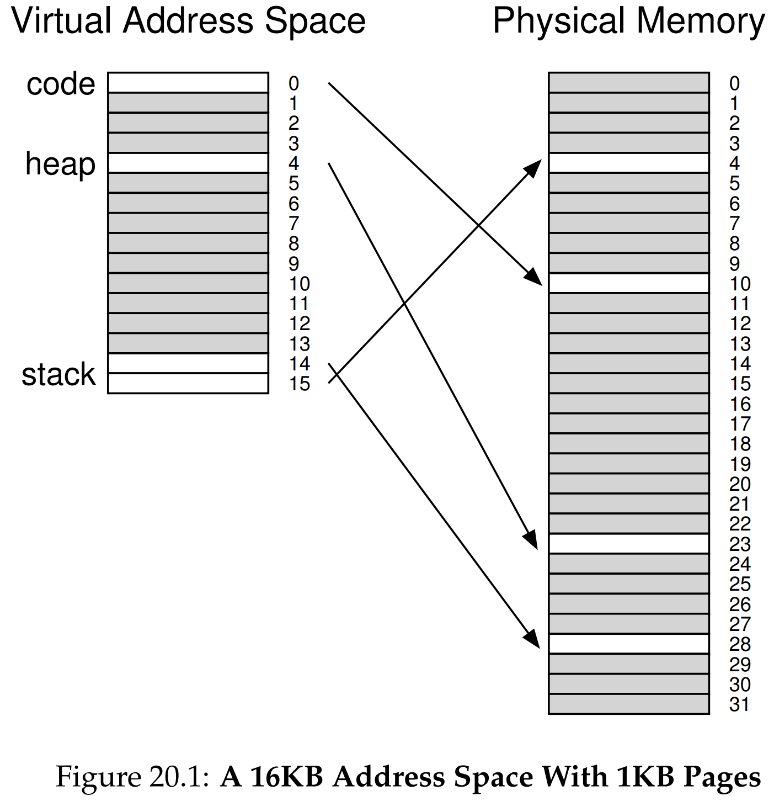
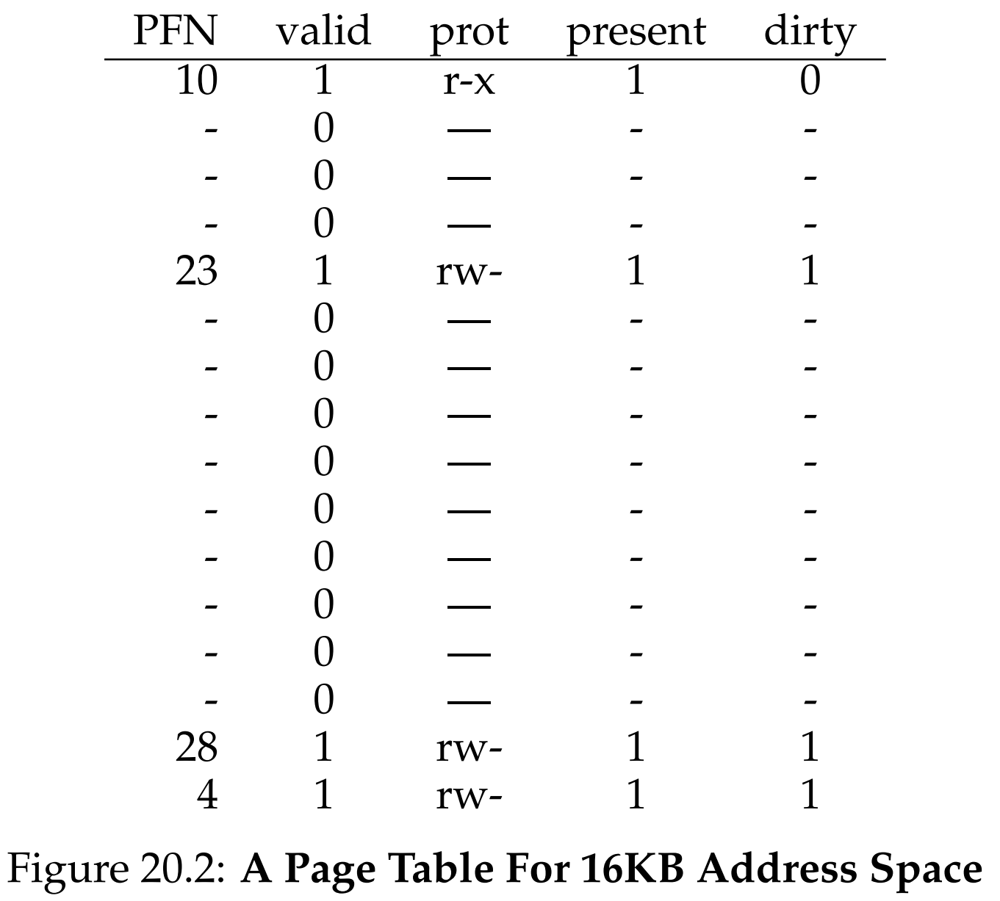
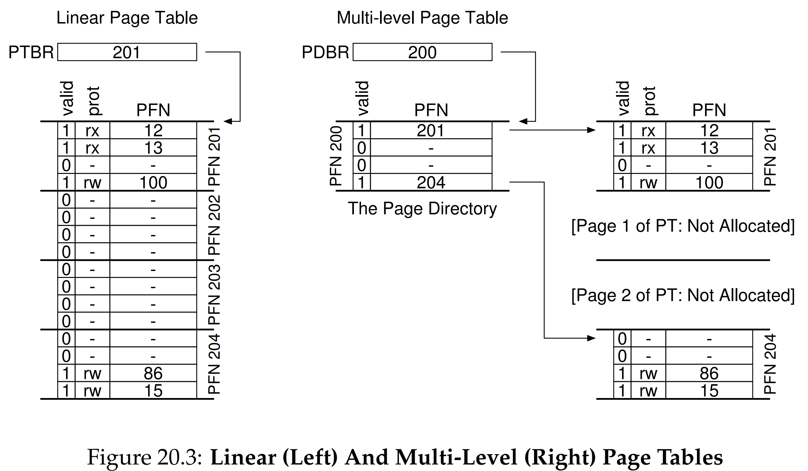
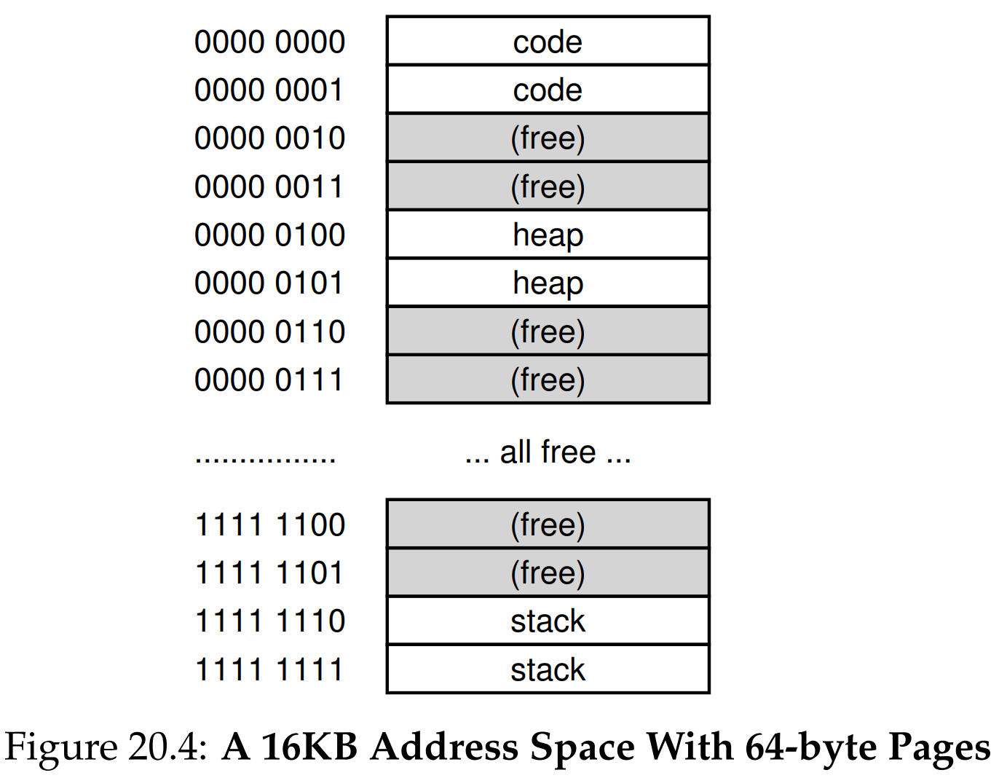
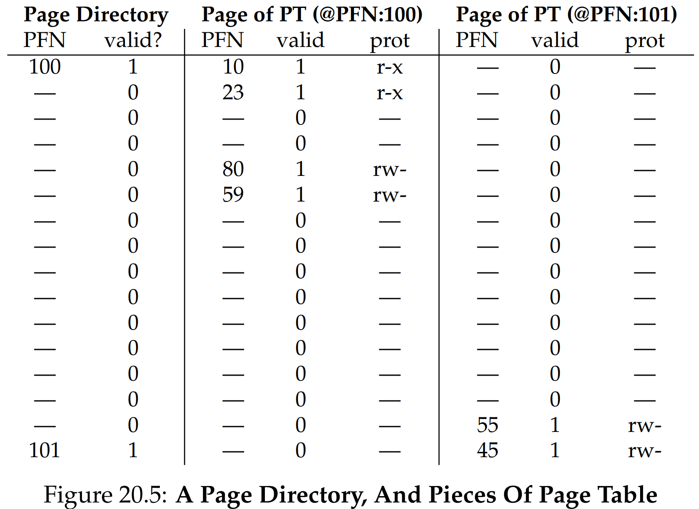

안녕하세요, pingu52입니다.

이전 장에서 Paging의 동작과 TLB 기반 가속을 봤다면, 이번 장의 핵심은 **Page Table의 공간(Space) 비용**입니다.
TLB로 시간(Time)은 어느 정도 잡았는데, Page Table은 프로세스 수만큼 존재하니 메모리 소모가 무시하기 어렵습니다.

**32-bit 주소 공간**, **4KB Page**, **4-byte PTE**를 가정하면 다음과 같습니다.

- 가상 페이지 수: $2^{32} / 2^{12} = 2^{20}$ (약 100만 개)
- Page Table 크기: $2^{20} \times 4\text{B} = 4\text{MB}$
- 프로세스 100개면: **$400\text{MB}$** 가 Page Table로만 빠질 수 있습니다.

---

## 1. 간단한 해결책: Bigger Pages

가장 직관적인 방법은 **Page Size를 키워서** 페이지 수(=PTE 수)를 줄이는 것입니다.

예를 들어 32-bit 주소 공간에서 Page Size를 $4\text{KB} \rightarrow 16\text{KB}$로 올리면 다음과 같이 변화합니다.

- Offset: $12\text{bit} \rightarrow 14\text{bit}$
- VPN: $20\text{bit} \rightarrow 18\text{bit}$
- PTE 개수: $2^{20} \rightarrow 2^{18}$
- Page Table: $4\text{MB} \rightarrow 1\text{MB}$

즉, **Page Size를 4배 키우면 Page Table도 정확히 4배 줄어듭니다.**

### 단점: Internal Fragmentation

하지만 페이지가 커질수록 프로세스가 실제로 쓰지 않는 공간이 페이지 내부에 남아 **내부 단편화(Internal Fragmentation)** 가 커집니다.
그래서 대부분의 시스템은 기본 페이지를 작게 유지하고(예: $4\text{KB}$, $8\text{KB}$), 필요할 때만 큰 페이지를 쓰는 식의 타협을 합니다.

---

## 2. Hybrid 접근법: Paging + Segmentation

Linear Page Table이 큰 이유는 **사용하지 않는 가상 주소 영역까지 PTE를 전부 만들어** 들고 있기 때문입니다.
일반적인 프로세스 주소 공간은 Code, Heap, Stack만 듬성듬성 쓰고, 중간에 큰 Hole(빈 공간)이 남는 경우가 많습니다.


*Figure 20.1: 대부분이 비어있는(Sparse) 주소 공간의 예시. 이 빈 공간을 위해 Page Table을 유지하는 것은 낭비입니다.*

그래서 나온 아이디어가 **“세그먼트별로 Page Table을 따로 두자”** 입니다.

- Code segment용 Page Table
- Heap segment용 Page Table
- Stack segment용 Page Table

이때 Segmentation의 Base/Bounds 개념을 재활용합니다.

- **Base**: “세그먼트 자체의 시작”이 아니라 **해당 세그먼트 Page Table의 물리 주소**
- **Bounds**: 해당 Page Table의 끝(=유효한 페이지 개수)

### 장점

- Hole 구간을 위한 PTE를 만들지 않으므로, **희소(Sparse) 주소 공간에서 낭비를 크게 줄일 수 있음**

### 단점: External Fragmentation(다시 등장)

이 방식은 Page Table이 “페이지 단위”가 아니라 **PTE 개수 단위로(가변 크기)** 메모리를 차지하게 됩니다.
즉, 물리 메모리에서 **딱 맞는 빈 공간을 찾아 넣는 문제**가 생기며, 결과적으로 **External Fragmentation 성격의 복잡성**을 다시 불러옵니다.

또한 문맥 교환 시 세그먼트별 Base/Bounds도 함께 교체되어야 하므로 구현/관리 부담이 늘어납니다.

---

## 3. Multi-level Page Tables

Hybrid가 Segmentation을 끌어온 타협이라면, Multi-level은 **Page Table 자체를 Paging하자** 라는 접근입니다.


*Figure 20.2: (문제점) 대부분이 Invalid인 Linear Page Table. 낭비되는 공간이 많습니다.*

핵심 아이디어는 간단합니다.

1. Linear Page Table을 **페이지 크기 단위로 조각**냅니다.
2. 어떤 조각(Page Table Page) 안에 **유효한 PTE가 하나도 없으면**, 그 조각은 **아예 할당하지 않습니다.**
3. 대신, 어떤 조각이 존재하는지 추적하는 상위 구조가 필요합니다. → **Page Directory**

### 3.1 시각화: Linear vs Multi-level

Multi-level이 하는 일을 가장 직관적으로 보여주는 그림이 **Figure 20.3** 입니다.

- **Linear**: 주소 공간 중간이 비어 있어도, 중간에 해당하는 Page Table Page까지 전부 메모리에 존재해야 합니다.
- **Multi-level**: Page Directory가 필요한 조각만 Valid로 표시하고, 나머지 조각은 **Not Allocated** 상태로 둡니다.


*Figure 20.3: Linear(좌) vs Multi-level(우). 중간 Page Table Page를 사라지게 만들고, Page Directory로 추적합니다.*

### 3.2 Page Directory / PDE의 의미

- Page Directory는 “Page Table의 각 조각(Page Table Page)”마다 엔트리를 하나씩 가집니다.
- 엔트리 = **PDE(Page Directory Entry)**

PDE는 최소한 다음을 포함합니다.

- **Valid Bit**
- **PFN** (해당 Page Table Page가 올라간 물리 프레임 번호)

중요한 포인트 하나: **PDE의 Valid 의미는 PTE의 Valid와 조금 다릅니다.**

- **PDE Valid**: 이 PDE가 가리키는 Page Table Page 안에 **Valid PTE가 최소 1개라도 존재**한다
- **PDE Invalid**: 그 조각은 아예 존재하지 않으며, PFN 등 나머지 필드는 정의되지 않습니다.

### 3.3 장단점 (Time–Space Trade-off)

#### 장점(Space)

- 사용한 주소 공간의 양에 비례해서만 Page Table 공간을 할당 → **Sparse Address Space에 강함**
- 조각이 “페이지 단위”로 관리되므로, OS가 Page Table을 늘릴 때도 **그냥 빈 페이지 하나 잡아 붙이면 됨**
- (그 결과) **연속된 큰 물리 메모리 덩어리**가 꼭 필요하지 않음

#### 단점(Time)

- (2-level 기준) TLB Miss가 나면 Page Walk 과정에서 **추가 메모리 접근 2회**가 필요합니다.
    1. Page Directory 접근
    2. Page Table 접근

---

## 4. Multi-level을 손으로 따라가기: Detailed Example

OSTEP는 Multi-level이 어떻게 인덱싱되는지를 작은 예제로 풀어줍니다.

**가정:**

- 주소 공간: $16\text{KB}$
- 페이지 크기: $64\text{B}$
- 가상 주소: $14\text{bit}$ (VPN $8\text{bit}$ + Offset $6\text{bit}$)
- PTE 크기: $4\text{B}$

Linear Page Table은 $2^8 = 256$ 엔트리 → $256 \times 4\text{B} = 1\text{KB}$가 됩니다.
그런데 페이지가 $64\text{B}$이므로, $1\text{KB}$ Page Table은 $1024 / 64 = 16$개의 Page Table Page로 나눌 수 있고, 각 Page Table Page는 $64 / 4 = 16$개의 PTE를 담습니다.

### 4.1 주소공간 예시 (Figure 20.4)


*Figure 20.4: 16KB 주소공간 + 64B 페이지 예시.*

### 4.2 Page Directory와 조각난 Page Table (Figure 20.5)

Figure 20.5는 Page Directory가 **어떤 Page Table Page(PFN 100, 101 등)를 가리키는지**, 그리고 그 조각 안에 어떤 PTE가 들어있는지를 “3단(Directory / PT page / PT page)” 형태로 보여줍니다.


*Figure 20.5: Page Directory(좌)와 Page Table 조각(중/우). Linear의 16페이지 대신 3페이지만 할당하는 예시를 보여줍니다.*

**핵심 결론:**

- Linear였다면 Page Table Page를 16개 다 잡아야 하지만,
- Multi-level에서는:
  - Page Directory 1페이지
  - 실제로 쓰는 PT 조각 2페이지
  - 총 **3페이지만** 쓰는 식으로 절약이 가능합니다.

### 4.3 주소 변환 예시 (계산)

OSTEP는 예시 주소 `0x3F80`(VPN 254의 0th byte)을 변환합니다.

이 예제에서는 VPN $8\text{bit}$를 상위 $4\text{bit}$/하위 $4\text{bit}$로 나눠서 사용합니다.

- 상위 $4\text{bit}$: **Page Directory Index**
- 하위 $4\text{bit}$: **Page Table Index**

변환 과정은 다음과 같습니다.

1. **PD Index 추출**: `1111` ($15$) → Directory의 마지막 엔트리 확인
2. **PT Index 추출**: `1110` ($14$) → 해당 PT Page의 14번째 엔트리 확인
3. **물리 주소 계산**: 결과 PTE가 $\text{PFN} = 55$라면:
    - $\text{PhysAddr} = (55 \ll 6) + \text{Offset}$
    - Offset이 0이면 최종 주소는 `0x0DC0`

#### 제어 흐름 (Control Flow)

주소 변환 과정을 코드로 표현하면 다음과 같습니다. Linear 방식보다 메모리 접근이 한 번 더 발생(Directory → Table)하는 것을 볼 수 있습니다.

```c
// 1. 가상 주소 분해
VPN = (VirtualAddress & VPN_MASK) >> SHIFT
(PDIndex, PTIndex) = Split(VPN)

// 2. Page Directory 접근 (첫 번째 메모리 접근)
PDEAddr = PageDirBase + (PDIndex * sizeof(PDE))
PDE = AccessMemory(PDEAddr)

if (PDE.Valid == False) {
    RaiseException(SEGMENTATION_FAULT) // 존재하지 않는 조각
} else {
    // 3. Page Table 접근 (두 번째 메모리 접근)
    // PDE.PFN은 해당 Page Table Page의 물리 주소를 가리킴
    PTEAddr = (PDE.PFN << SHIFT) + (PTIndex * sizeof(PTE))
    PTE = AccessMemory(PTEAddr)

    if (PTE.Valid == False) {
        RaiseException(SEGMENTATION_FAULT) // 유효하지 않은 페이지
    } else if (CanAccess(PTE.ProtectBits) == False) {
        RaiseException(PROTECTION_FAULT)
    } else {
        // 4. TLB 업데이트 및 재실행
        TLB_Insert(VPN, PTE.PFN, PTE.ProtectBits)
        RetryInstruction()
    }
}
```

---

## 5. 더 깊은 계층: More Than Two Levels

2-level로 끝나지 않는 이유는 간단합니다.
**"각 레벨의 조각이 한 페이지에 딱 들어가게 만들자"** 가 목표인데, **Page Directory 자체가 너무 커질 수 있기 때문**입니다.

**OSTEP 예제:**

- VA = $30\text{bit}$
- Page = $512\text{B}$ → Offset $9\text{bit}$
- VPN = $21\text{bit}$
- PTE $4\text{B}$ → 한 페이지($512\text{B}$)에 PTE 128개 → 인덱스에 $7\text{bit}$ 필요

즉, $21\text{bit}$ VPN 중 하위 $7\text{bit}$는 PT Index로 쓰고 나면, 상위에 $14\text{bit}$가 남습니다.
그런데 Directory가 $2^{14}$ 엔트리이고 PDE가 $4\text{B}$라면, Directory 크기는 $2^{14} \times 4\text{B} = 64\text{KB}$로 **128페이지**가 됩니다.
이러면 Directory도 한 페이지에 들어가게 하자는 목표가 깨지므로, Directory를 다시 Paging하고 상위 Directory를 추가해서 트리를 더 깊게 만듭니다.

---

## 6. Inverted Page Tables

Multi-level과는 다른 방향으로, 공간을 더 줄이는 접근이 **Inverted Page Table**입니다.

- “프로세스마다 Page Table”을 두는 대신,
- 시스템에 **단 하나의 Page Table**만 두고,
- 엔트리는 “가상 페이지”가 아니라 **물리 페이지(Physical Page)마다 하나씩** 둡니다.

즉, 각 엔트리는 대략 다음 정보를 담습니다.

- 이 물리 페이지를 누가(어떤 Process) 쓰는지
- 그 프로세스의 어떤 VPN이 매핑되는지

문제는 **Lookup**입니다.
가상주소(VPN) → PFN을 찾으려면 테이블을 검색해야 하므로, 선형 탐색은 비싸고 보통 **해시(Hash)** 를 사용하여 속도를 높입니다 (예: PowerPC).

---

## 7. Swapping the Page Tables to Disk

지금까지는 Page Table이 **항상 물리 메모리(커널 소유)** 에 있다고 가정했습니다.
하지만 트릭을 다 써도 Page Table이 너무 커질 수 있고, 이때 일부 시스템은 다음과 같이 동작합니다.

- Page Table을 **Kernel Virtual Memory**에 두고,
- 메모리 압박이 크면 Page Table의 일부를 **디스크로 Swap Out** 하기도 합니다.

---

## 8. 요약 (Summary)

- **Bigger Pages**: Page Table은 줄지만 Internal Fragmentation이 커짐.
- **Hybrid (Paging + Segmentation)**: Hole을 피할 수 있으나, Page Table이 가변 크기로 흩어지며 외부 단편화 성격의 문제와 복잡성이 다시 등장.
- **Multi-level Page Table**: Page Table을 Page-sized 조각으로 나누고, 필요한 조각만 할당.
  - Sparse Address Space에 강함.
  - TLB Miss 시 Page Walk 비용(추가 접근)이 증가.
- **More Than Two Levels**: Directory도 Page-sized Unit으로 유지하려면 트리를 더 깊게 해야 함.
- **Inverted Page Table**: “물리 페이지당 1엔트리”로 공간을 줄이는 대신 Lookup을 해시 등으로 해결.
- **Swapping PT to Disk**: Page Table조차 메모리에 다 못 두면 일부를 디스크로 내릴 수 있음.

---

## 9. 용어 정리

- `Linear Page Table`: VPN을 인덱스로 바로 접근하는 배열형 페이지 테이블
- `Internal Fragmentation`: 할당 단위(페이지) 내부에서 남는 낭비
- `Hybrid (Paging + Segmentation)`: 세그먼트별로 별도 Page Table을 두는 접근
- `Page Directory`: Page Table 조각들의 존재/위치를 추적하는 상위 테이블
- `PDE (Page Directory Entry)`: Page Directory의 엔트리 (조각 존재 여부 + PFN 등)
- `Multi-level Page Table`: Page Directory를 루트로 하는 트리형 페이지 테이블
- `Page Walk`: TLB Miss 시 Page Table을 따라가며 변환을 찾는 과정
- `Inverted Page Table`: 물리 페이지당 하나의 엔트리를 갖는 단일 페이지 테이블 구조

---

## Reference

- [Operating Systems: Three Easy Pieces - Chapter 20: Paging: Smaller Tables](https://pages.cs.wisc.edu/~remzi/OSTEP/vm-smalltables.pdf)
