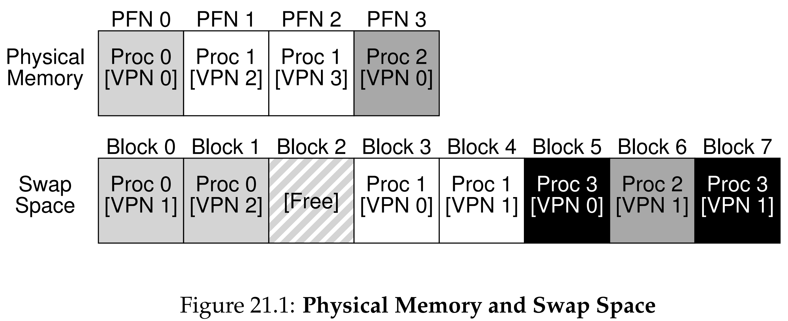

안녕하세요, pingu52입니다.

지금까지는 활성 페이지가 모두 물리 메모리에 있다고 가정했습니다. 하지만 현대 시스템은 물리 메모리보다 훨씬 큰 프로그램을 실행하거나, 여러 프로그램을 동시에 실행해야 합니다.

이를 위해 OS는 메모리 계층 구조에서 한 단계 아래에 있는 저장장치(HDD 또는 SSD)를 활용합니다. 당장 필요하지 않은 페이지는 디스크로 내리고, 다시 필요해지면 메모리로 올리는 방식으로 큰 가상 주소 공간을 제공합니다.

---

## 1. 스왑 공간 (Swap Space)

OS는 페이지를 임시로 보관하기 위해 디스크에 **스왑 공간(Swap Space)** 이라는 영역을 예약합니다.

- **역할**: 메모리에서 쫓겨난 페이지를 보관합니다.
- **단위**: OS는 스왑 공간을 페이지 크기 단위로 읽고 씁니다.
- **요구사항**: 스왑 공간에서 각 페이지가 저장된 위치(Disk Address)를 OS가 추적해야 합니다.

이 구조 덕분에 프로세스는 물리 메모리 크기에 제한받지 않고 더 큰 주소 공간을 가진 것처럼 실행될 수 있습니다.

---

## 2. 핵심 메커니즘: Valid Bit와 Present Bit

하드웨어는 주소 변환 시 해당 페이지가 접근 가능한 매핑인지, 그리고 실제로 메모리에 올라와 있는지 확인해야 합니다. 이를 위해 PTE에는 보통 두 종류의 상태 비트가 필요합니다.

- **Valid Bit**:
  - 1: 해당 가상 페이지는 프로세스 주소 공간에 속함 (접근 가능).
  - 0: 주소 공간에 속하지 않음, 접근하면 즉시 예외 처리.
- **Present Bit**:
  - 1: 페이지가 물리 메모리에 존재함.
  - 0: 주소 공간에는 속하지만 현재 메모리에 없고 스왑(디스크)에 있음.

중요한 구분은 다음과 같습니다.

- **Valid 0**: 잘못된 접근(Invalid Access), 스왑 인 대상이 아님.
- **Valid 1 & Present 0**: 정상 주소이지만 메모리에 없어 OS가 디스크에서 가져와야 함.

이번 장에서 집중하는 **페이지 폴트(Page Fault)** 는 두 번째 경우입니다.

---

## 3. 페이지 폴트 (Page Fault) 처리 과정

프로그램이 Valid 1인 페이지에 접근했지만 Present 0이면, 하드웨어는 주소 변환을 완료할 수 없어 예외를 발생시킵니다. 이 예외가 바로 **Page Fault**입니다.

Page Fault는 디스크 I/O가 필요하므로 처리는 반드시 OS의 **Page Fault Handler**가 맡습니다.

### 처리 순서 (Control Flow)

1. **예외 발생**: 하드웨어가 PTE를 확인하다 Present 0을 발견하고 Page Fault Exception을 발생시킵니다.
2. **OS 개입 및 위치 확인**: OS는 해당 페이지가 스왑 공간의 어디에 저장되어 있는지 확인합니다. 일반적으로 Present 0인 동안 PTE의 PFN 필드는 실제 PFN이 아니라 **디스크 주소(Disk Address)** 정보를 담도록 재해석해 사용합니다.
3. **빈 프레임 확보**:
   - Free Frame이 있으면 바로 사용합니다.
   - 없으면 **Victim Page**를 골라 내보내기(Eviction)를 수행합니다.
4. **디스크 I/O 요청**: OS가 디스크에 페이지 읽기 요청을 보내고, 지정한 물리 프레임에 적재하도록 합니다.
5. **프로세스 차단 (Block)**: 디스크 I/O는 매우 느리므로, OS는 Fault를 낸 프로세스를 **Blocked** 상태로 전환하고 그동안 다른 Ready 프로세스를 실행합니다.
6. **I/O 완료 처리**: 디스크 작업이 끝나면 인터럽트가 발생하고, OS가 완료 처리를 수행합니다. PTE를 갱신합니다.
    - Present Bit를 1로 변경.
    - PFN 필드에 실제 물리 프레임 번호 기록.
7. **재실행 (Retry)**: OS는 Fault를 일으켰던 명령어를 재시도(Retry)합니다.
    - 재실행 시 **TLB Miss**가 다시 발생할 수 있으며, 이때는 페이지가 메모리에 존재하므로(Present 1) 정상적으로 TLB가 업데이트되고 실행됩니다.

---

## 4. 메모리가 가득 찼다면 (Replacement)

Free Frame이 없으면 OS는 어떤 페이지를 내보낼지 결정해야 합니다. 이를 **페이지 교체(Page Replacement)** 라고 합니다.

잘못된 페이지를 반복적으로 내보내면 성능이 급격히 떨어질 수 있습니다. 어떤 페이지를 내보낼지는 **정책(Policy)** 의 영역이며, 다음 장에서 다룹니다.

---

## 5. 스왑 데몬 (The Swap Daemon)

OS는 메모리가 완전히 바닥난 다음에야 대응하는 방식보다, 일정량의 여유 프레임을 유지하는 쪽이 안정적입니다. 이를 위해 **High Watermark (HW)** 와 **Low Watermark (LW)** 를 사용합니다.

- 여유 메모리가 **LW** 아래로 떨어지면 백그라운드 스레드가 동작합니다.
- 여유 메모리를 **HW** 수준까지 회복시키면 다시 대기(Sleep)합니다.

이 백그라운드 스레드는 **Swap Daemon** 또는 **Page Daemon**으로 불리며, 핵심 역할은 다음과 같습니다.

- 미리 페이지를 비워(Free) 여유 공간을 확보합니다.
- Page Fault Handler가 매번 교체 작업을 길게 수행하지 않도록 부담을 줄입니다.
- 여러 페이지를 묶어 한 번에 쓰는 **Clustering** 같은 방식으로 디스크 효율을 높일 수 있습니다.

---

## 6. 요약 (Summary)

이번 장에서는 물리 메모리의 한계를 넘어서는 메커니즘을 살펴보았습니다.

- **Swap Space**: 디스크를 메모리의 확장 공간으로 사용합니다.
- **Present Bit**: 페이지가 메모리에 있는지 디스크에 있는지 구분합니다.
- **Page Fault**: Present 0인 페이지 접근 시 발생하며, OS가 디스크 I/O로 해결합니다.
- **Swap Daemon**: 백그라운드에서 여유 메모리를 유지해 시스템 효율을 높입니다.

이제 스왑을 수행하는 방법을 봤고, 다음 장에서는 어떤 페이지를 내보낼지 결정하는 교체 정책을 다룹니다.

---

## 7. 용어 정리

- `Swap Space`: 메모리에서 쫓겨난 페이지들을 보관하기 위해 디스크에 미리 예약된 공간.
- `Present Bit`: 해당 페이지가 물리 메모리에 존재하는지(1), 아니면 스왑 공간에 있는지(0)를 나타내는 PTE의 비트.
- `Page Fault`: 프로그램이 접근하려는 유효한 페이지가 현재 물리 메모리에 없을 때 하드웨어가 발생시키는 예외(Exception).
- `Page Fault Handler`: 페이지 폴트 발생 시 실행되는 OS 코드로, 디스크에서 페이지를 읽어와 메모리에 적재하는 역할을 수행함.
- `Swap Daemon (Page Daemon)`: 여유 공간이 부족할 때(Low Watermark 도달) 백그라운드에서 실행되어 페이지를 스왑 아웃시키는 커널 스레드.
- `High/Low Watermark`: 스왑 데몬이 동작을 시작(Low)하고 멈추는(High) 기준이 되는 여유 메모리 임계값.

---

## Reference

- [Operating Systems: Three Easy Pieces - Chapter 21: Beyond Physical Memory: Mechanisms](https://pages.cs.wisc.edu/~remzi/OSTEP/vm-beyondphys.pdf)
