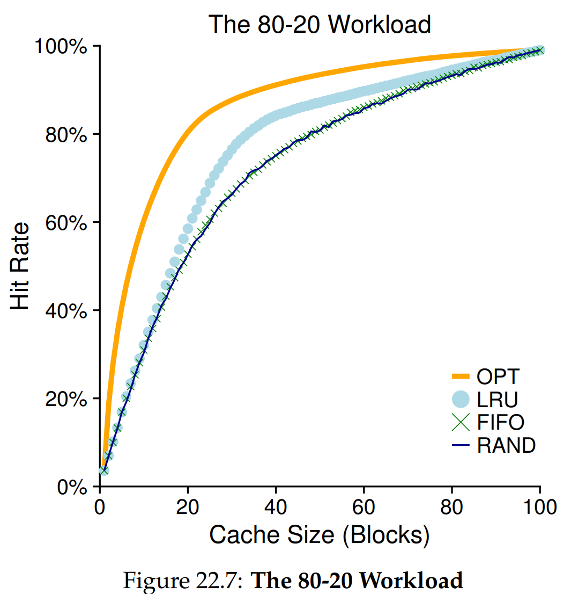
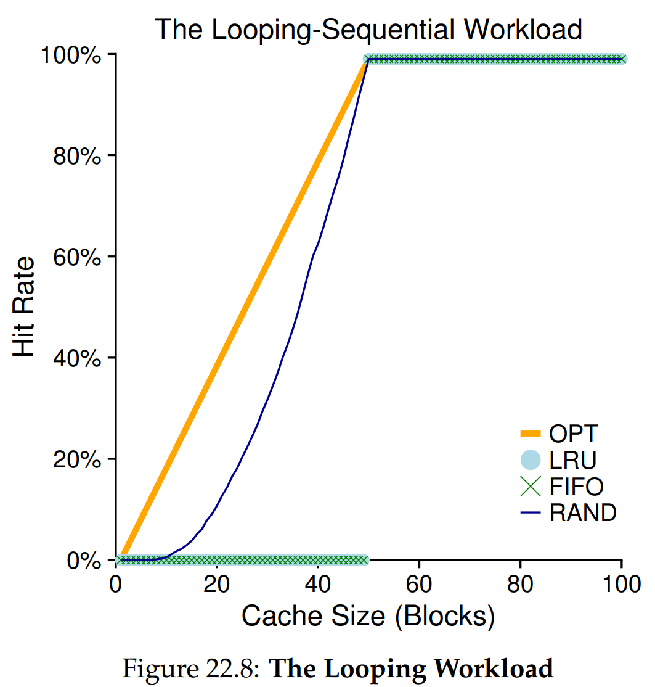

안녕하세요, pingu52입니다.

지난 21장에서는 스왑 공간과 페이지 폴트를 통해 물리 메모리의 한계를 넘는 **메커니즘**을 살펴보았습니다. 이제 남는 질문은 **정책(Policy)** 입니다.

메모리가 부족해져 교체(Eviction)가 필요할 때, 과연 **어떤 페이지를 내보낼지**가 시스템 성능의 핵심입니다.

---

## 1. 캐시 관리의 목표: AMAT 최소화

메인 메모리는 시스템의 모든 페이지 중 일부를 담는 **캐시(Cache)** 로 볼 수 있습니다. 우리의 목표는 캐시 미스를 최소화하여 **평균 메모리 접근 시간(AMAT)** 을 낮추는 것입니다.

$$AMAT = T_M + (P_{miss} \times T_D)$$

- $T_M$: 메모리 접근 비용 (약 100ns)
- $T_D$: 디스크 접근 비용 (약 10ms)
- $P_{miss}$: 캐시 미스 확률

$T_D$가 매우 크기 때문에 아주 작은 미스율의 증가도 전체 성능에 치명적입니다. 예를 들어 $T_M$이 100ns이고 $T_D$가 10ms라면, 미스율($P_{miss}$)이 0.1%만 되어도 AMAT는 약 10µs 수준으로 치솟습니다. 이는 메모리만 쓸 때보다 약 100배 느려지는 결과입니다.

---

## 2. 기준점: OPT 또는 MIN

Belady가 제시한 최적 정책(MIN 또는 OPT)은 **"가장 먼 미래에 다시 접근될 페이지를 교체하는 것"** 입니다 .

- **장점**: 미스 횟수를 최소화하는 이상적인 기준입니다.
- **한계**: OS는 미래를 알 수 없으므로 실제 구현은 불가능합니다.
- **용도**: 다른 현실적인 정책들이 얼마나 좋은지 평가하는 **비교 기준(Baseline)** 으로 사용됩니다 .

---

## 3. 단순한 정책: FIFO와 Random

### 3.1 FIFO (First-In, First-Out)

시스템에 가장 먼저 들어온 페이지를 먼저 내보냅니다 .

- **장점**: 구현이 매우 단순합니다.
- **단점**: 페이지의 중요도를 전혀 고려하지 않습니다. 자주 쓰이는 페이지라도 먼저 들어왔다는 이유로 쫓겨날 수 있습니다.
- **특징**: **벨라디의 역설(Belady's Anomaly)** 이 발생할 수 있습니다. 즉, 캐시 크기를 늘렸음에도 불구하고 오히려 히트율이 떨어지는 기이한 현상이 나타날 수 있습니다 .

*Figure 22.2: FIFO 정책의 동작 예시. 자주 참조되는 페이지(0번)도 먼저 들어왔다는 이유로 교체될 수 있습니다.*

### 3.2 Random

메모리 압박 시 무작위로 페이지를 선택해 교체합니다.

- **장점**: 구현이 쉽고, 특정 "꼬인 케이스(Corner-case)"를 피하는 성질이 있습니다.
- **단점**: 성능이 운에 좌우되며, 지능적인 선택을 하지는 않습니다.

Random은 일부 패턴(Looping)에서 의외로 잘 버티기도 하고, 어떤 경우에는 최적에 크게 못 미치기도 합니다.

---

## 4. 과거를 이용하기: LRU와 지역성

미래를 알 수 없다면 **과거(History)** 를 이용합니다. 대부분의 프로그램은 **지역성(Locality)** 을 보입니다.

- **시간 지역성 (Temporal Locality)**: 최근에 접근한 데이터는 곧 다시 접근될 가능성이 큽니다.
- **공간 지역성 (Spatial Locality)**: 어떤 데이터 주소 근처의 데이터도 함께 접근될 가능성이 큽니다.

**LRU (Least Recently Used)** 는 가장 오랫동안 참조되지 않은 페이지를 내보내는 정책으로, 시간 지역성을 잘 활용하여 일반적으로 우수한 성능을 냅니다.

---

## 5. Workload로 보는 정책의 성격

작은 트레이스만으로는 정책의 특성이 잘 드러나지 않으므로, 대표적인 워크로드(Workload)를 통해 정책들을 비교해 봅시다.

### 5.1 80-20 Workload

전체 참조의 80%가 특정 20%의 **Hot Page**에 집중되는 형태입니다. LRU는 자주 쓰이는 Hot Page를 메모리에 오래 유지하는 경향이 있어, FIFO나 Random보다 훨씬 유리합니다.

### 5.2 Looping Sequential Workload

0부터 49까지의 페이지를 순차적으로 반복 접근하는 형태입니다.

이 경우 LRU와 FIFO는 최악의 성능을 보입니다. 캐시 크기가 49라도(페이지가 50개인데), 가장 오래된 페이지(방금 접근했던 페이지)를 내보내게 되어 **히트율이 0%** 가 될 수 있습니다. 반면 Random은 특정 패턴에 갇히지 않으므로 0보다는 나은 성능을 보여줍니다.

---

## 6. 완전한 LRU는 비싸다

LRU가 좋긴 하지만, 이를 완벽하게 구현하려면 **모든 메모리 참조마다** 해당 페이지를 리스트의 가장 앞으로 옮기는 등의 작업이 필요합니다. 이는 하드웨어적으로나 성능적으로 오버헤드가 너무 큽니다.

그래서 현대 시스템은 LRU를 완벽하게 구현하는 대신 **근사(Approximation)** 하는 방법을 사용합니다.

---

## 7. 시계 알고리즘 (Clock Algorithm): LRU 근사

근사의 핵심 도구는 **Use Bit (Reference Bit)** 입니다.

1. 페이지가 참조될 때 하드웨어가 **Use Bit를 1로 설정**합니다.
2. OS는 페이지들을 원형 리스트(시계)로 관리하며 **시계 바늘**을 돌립니다 .
3. 교체가 필요하면 바늘이 가리키는 페이지의 Use Bit를 확인합니다.

- **1이면**: 최근에 사용되었으므로 기회를 줍니다. **0으로 클리어**하고 다음 페이지로 이동합니다 .
- **0이면**: 최근에 사용되지 않았으므로 **교체 대상(Victim)** 으로 선택합니다.

이 방식은 주기적으로 Use Bit를 청소하며 오래된 페이지를 찾아내므로, LRU와 유사하게 동작하면서도 오버헤드가 적습니다.

---

## 8. Dirty Page와 Thrashing

### 8.1 Dirty Page 고려

내용이 수정된 **Dirty Page**를 내보내려면 디스크에 다시 써야(Write-back) 하므로 비용이 비쌉니다. 반면 수정되지 않은 **Clean Page**는 그냥 버리면 됩니다.

따라서 OS는 **Modified Bit (Dirty Bit)** 를 함께 확인하여, 기왕이면 **Unused & Clean** 페이지를 우선적으로 교체하려 합니다.

### 8.2 Thrashing (스레싱)

실행 중인 프로세스들의 메모리 요구량(Working Set의 합)이 물리 메모리를 초과하면, 시스템은 끊임없이 페이지 교체만 하느라 실제 작업은 거의 못 하게 됩니다. 이를 **스레싱**이라 합니다.

대응 방법은 크게 두 가지입니다.

- **입장 제어 (Admission Control)**: 일부 프로세스를 잠시 재우거나 실행을 늦춰서, 나머지 프로세스들이 충분한 메모리를 확보하게 합니다.
- **OOM Killer**: 최악의 경우, 메모리를 많이 쓰는 프로세스를 강제로 종료하여 시스템을 살려냅니다 .

---

## 9. 교체 외 정책도 있다

페이지 교체 외에도 VM 시스템은 다양한 정책을 가집니다.

- **Page Selection Policy**
- **Demand Paging**: 페이지가 실제로 접근될 때 가져옵니다.
- **Prefetching**: 곧 사용될 페이지를 예측해 미리 가져옵니다.
- **Write Policy**
- **Clustering**: 여러 번의 쓰기 작업을 모아서 한 번에 디스크에 씁니다.

---

## 10. 요약: 효율적인 페이지 교체를 위한 설계 원칙

이번 장을 통해 우리는 단순히 누구를 내보낼까를 넘어, 시스템 전체 성능을 결정짓는 핵심 설계 원칙들을 배웠습니다.

1. **성능의 척도는 AMAT이다**: 디스크 I/O는 메모리보다 압도적으로 느리기 때문에, 아주 미세한 미스율($P_{miss}$)의 차이가 시스템 전체 속도를 결정짓습니다.
2. **미래는 알 수 없으므로 과거를 빌려온다**: 이상적인 OPT(미래 기준)는 구현이 불가능하므로, 우리는 '지역성(Locality)'의 원리를 믿고 '최근 기록(History)'인 LRU를 대안으로 삼습니다.
3. **완벽함보다 효율성이 우선이다**: 완벽한 LRU는 관리가 너무 비싸기 때문에, 현대 OS는 하드웨어의 Use Bit를 활용한 'Clock 알고리즘'으로 성능과 오버헤드 사이에서 현실적인 타협점을 찾습니다.
4. **I/O 비용의 비대칭성을 활용한다**: 수정된 페이지(Dirty)를 내보내는 것은 추가적인 쓰기 작업을 유발하므로, Clean 페이지를 우선적으로 교체해 디스크 부담을 줄이는 것이 영리한 설계입니다.
5. **시스템의 한계를 인정해야 한다**: 아무리 좋은 알고리즘도 물리 메모리 부족(Thrashing) 앞에서는 무력합니다. 이때는 프로세스 수를 줄이는 '입장 제어(Admission Control)'나 'OOM Killer' 같은 시스템 차원의 결단이 필요합니다.

---

## 11. 용어 정리

- `AMAT`: 평균 메모리 접근 시간 (Average Memory Access Time).
- `OPT / MIN`: 미래를 보고 가장 늦게 다시 쓰일 페이지를 교체하는 이상적 정책.
- `FIFO`: 먼저 들어온 페이지를 먼저 교체하는 정책.
- `Random`: 무작위로 교체 대상을 선택하는 정책.
- `LRU`: 가장 오랫동안 사용되지 않은(Least Recently Used) 페이지를 교체하는 정책.
- `시간/공간 지역성`: 최근 접근한 데이터나 그 주변 데이터가 다시 접근될 가능성이 높다는 성질.
- `Use Bit (Reference Bit)`: 페이지가 참조되었는지를 나타내는 비트.
- `Clock Algorithm`: Use Bit를 활용해 LRU를 근사하는 알고리즘.
- `Dirty Bit (Modified Bit)`: 페이지 내용이 수정되었는지를 나타내는 비트.
- `Thrashing`: 메모리 부족으로 인해 페이지 교체만 반복되며 성능이 급격히 저하되는 현상.
- `Working Set`: 프로세스가 원활히 실행되기 위해 필요한 활성 페이지들의 집합.
- `Admission Control`: 시스템 부하 조절을 위해 작업의 진입을 제한하는 기법.
- `OOM Killer`: 메모리 부족 시 프로세스를 강제 종료하여 시스템을 복구하는 리눅스 커널 기능.

---

## Reference

- [Operating Systems: Three Easy Pieces - Chapter 22: Beyond Physical Memory: Policies](https://pages.cs.wisc.edu/~remzi/OSTEP/vm-beyondphys-policy.pdf)
