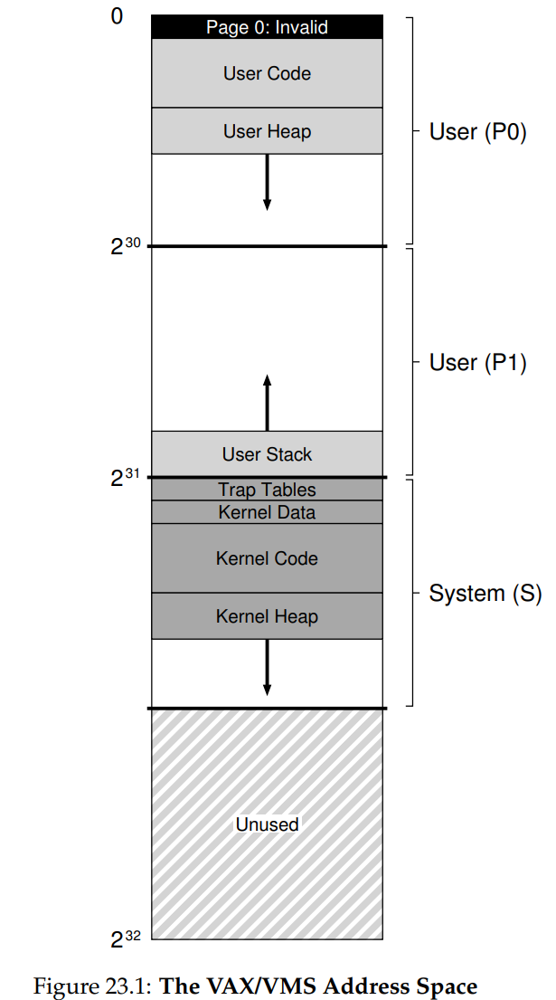
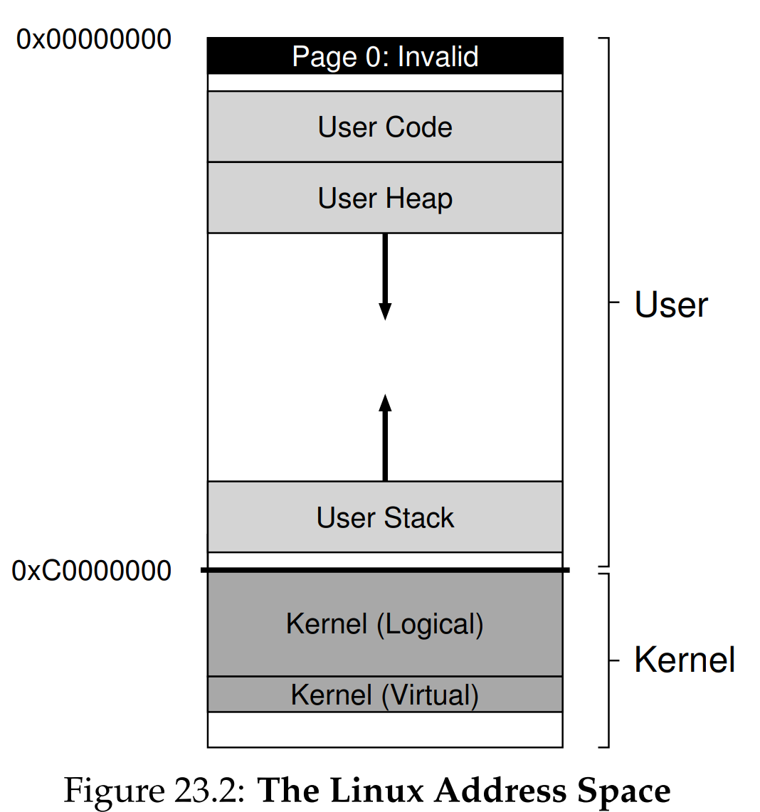

안녕하세요, pingu52입니다.

지금까지 가상 메모리의 메커니즘과 정책을 배웠습니다. 이번 장에서는 이 조각들이 실제 운영체제에서 어떻게 결합되는지 확인합니다.

- **VAX/VMS**: 하드웨어 제약을 소프트웨어로 흡수하며 표준 기법을 정립한 시스템
- **Linux**: 대용량 메모리와 현대 보안 요구에 맞춰 진화한 시스템

---

## 1. VAX/VMS 가상 메모리 시스템

VAX는 32비트 주소 공간을 사용하지만 페이지 크기가 **512바이트**로 매우 작습니다. 페이지가 작으면 단편화는 줄지만 페이지 테이블이 커지고 디스크 I/O 효율도 나빠지기 쉽습니다. VMS는 이런 제약을 시스템 설계로 흡수했습니다.

### 1.1 하드웨어 관점에서의 Hybrid 구조

VAX는 페이징과 세그멘테이션을 결합한 하이브리드 형태입니다.

- 가상 주소는 VPN과 Offset으로 나뉘고, VPN의 상위 비트가 어떤 세그먼트에 속하는지 구분합니다.
- 프로세스 공간은 **P0, P1**로 나뉘며 각 세그먼트는 별도 페이지 테이블을 가집니다.
- 세그먼트별 페이지 테이블은 Base/Bounds 레지스터로 관리합니다.

### 1.2 주소 공간 구조와 Figure 23.1

VMS는 주소 공간을 크게 세 영역으로 나눕니다.

- **P0 (User Code/Heap)**: 사용자 코드와 힙이 위치하며, 힙은 아래 방향으로 성장합니다.
- **P1 (User Stack)**: 사용자 스택이 위치하며, 스택은 위 방향으로 성장합니다.
- **S (System)**: 커널 코드와 데이터가 위치하며, 모든 프로세스에서 공유됩니다.

VMS는 **0번 페이지를 접근 불가(Invalid)** 로 두어 Null 포인터 역참조를 빠르게 드러나게 합니다. 또한 실제 주소 공간에는 사용자 영역 외에도 Trap Tables, Kernel Heap 같은 요소가 포함됩니다.

*Figure 23.1: VAX/VMS 주소 공간 예시. 0번 페이지 Invalid, User 영역, Trap Tables, Kernel 영역이 함께 구성된다.*

### 1.3 페이지 테이블 자체의 가상화

VMS의 중요한 설계는 **사용자 페이지 테이블 자체를 커널 가상 메모리(S 영역)** 에 둔다는 점입니다 .

- 프로세스별로 P0, P1 페이지 테이블이 존재합니다.
- 페이지 테이블은 커널 가상 메모리에서 할당되므로, 심한 메모리 압박에서는 **페이지 테이블 페이지도 스왑 아웃** 대상이 됩니다.
- 결과적으로 페이지 테이블이 물리 메모리를 잠식하는 문제를 VM 시스템 안으로 끌고 들어와 완화합니다.

이 선택은 주소 변환 자체를 더 복잡하게 만들지만, 하드웨어 관리 TLB가 대부분의 비용을 숨겨줍니다.

### 1.4 교체 정책과 I/O 최적화

VAX PTE에는 Valid, Protection, Dirty, OS Reserved, PFN 등이 들어갑니다. 중요한 제약은 **Reference Bit이 없다**는 점입니다. VMS는 이를 소프트웨어로 보완합니다.

- **Reference Bit 에뮬레이션**: 페이지를 접근 불가(Invalid)로 설정해 접근 시 트랩을 유발하고, OS가 OS Reserved 필드에 참조 여부를 기록한 뒤 원래 보호 비트를 복구합니다.
- **프로세스별 Resident Set 관리**: 메모리 독점을 막기 위해 프로세스별로 상주 페이지 수를 제한합니다.
- **Segmented FIFO 계열**: Evict된 페이지를 곧바로 재사용하지 않고 Global List(Clean/Dirty)에 두어 재참조되면 회수할 기회를 주고, 처리 비용을 줄입니다.
- **Clustering**: 작은 페이지 단위의 I/O 비효율을 줄이기 위해 여러 페이지를 묶어 디스크에 기록합니다.

### 1.5 지연 최적화 (Lazy Optimization)

VMS는 현대 OS에서 표준이 된 지연 최적화를 적극 사용합니다.

- **Demand Zeroing**: 힙 확장 시 즉시 프레임을 할당해 0으로 채우지 않고, 실제 접근 시점에 페이지 폴트로 할당과 초기화를 수행합니다.
- **Copy-On-Write (COW)**: `fork` 시 페이지를 복사하지 않고 읽기 전용으로 공유하다가, 쓰기 시점에 폴트로 새 페이지를 할당해 복사합니다.

---

## 2. Linux 가상 메모리 시스템

Linux는 VMS에서 발전한 아이디어를 계승하면서도 대용량 메모리와 현대 워크로드에 맞춘 기능을 확장했습니다.

### 2.1 주소 공간 분할과 Figure 23.2

32비트 Linux는 사용자 영역과 커널 영역을 분할합니다. 전형적인 Split은 `0xC0000000` 기준입니다.

- `0x00000000` ~ `0xBFFFFFFF`: 사용자 가상 주소
- `0xC0000000` ~ `0xFFFFFFFF`: 커널 가상 주소

커널 가상 주소는 두 종류로 구분됩니다.

- **Kernel Logical Address**: `kmalloc`으로 확보하며 물리 메모리 일부와 **Direct Mapping** 관계를 가집니다. 스왑이 불가능하며 DMA에 필수적입니다.
- **Kernel Virtual Address**: `vmalloc`으로 확보하며 가상으로 연속이지만 물리적으로는 불연속일 수 있습니다.

*Figure 23.2: Linux 주소 공간 예시. User 영역과 Kernel 영역이 분할되고, Kernel 내부에 Logical과 Virtual이 공존한다.*

### 2.2 Page Cache와 Active/Inactive 리스트

Linux는 파일 I/O 성능을 위해 **Page Cache**를 적극 활용하고, 교체 정책은 LRU를 근사하는 방향으로 설계됩니다.

- **Inactive List**: 재참조가 확인되지 않은 페이지가 머무는 리스트로, 교체 후보가 되기 쉽습니다.
- **Active List**: 재참조가 확인된 페이지가 승격되어 머무는 리스트입니다.

이 구조는 큰 파일을 한 번만 읽는 작업(Sequential Scan)이 메모리를 오염시키는 문제를 완화하는 데 도움이 됩니다.

### 2.3 Huge Pages

메모리가 커질수록 TLB 엔트리 수는 상대적으로 부족해집니다. Linux는 **Huge Page (2MB, 1GB)** 를 지원해 TLB 미스를 줄입니다.

- 큰 페이지는 TLB 커버리지를 키워 성능을 높일 수 있습니다.
- 대신 내부 단편화와 관리 비용이 커질 수 있습니다.

### 2.4 메모리 매핑과 Demand Paging

Linux는 실행 파일과 공유 라이브러리를 포함해 많은 데이터를 **Memory Mapped File** 형태로 주소 공간에 배치합니다.

- 매핑된 구간은 실제 접근 시점에 페이지 폴트로 필요한 부분만 메모리에 올립니다.
- 결과적으로 주소 공간 구성과 지연 적재가 자연스럽게 결합됩니다.

### 2.5 보안 기능: NX, ASLR, KPTI

현대 VM 시스템에서 보안은 핵심 요구사항입니다.

- **NX Bit**: 스택/힙 영역에서 코드 실행을 막아 버퍼 오버플로우 공격을 완화합니다.
- **ASLR**: 코드, 힙, 스택 배치를 무작위화해 공격자가 주소를 예측하기 어렵게 만듭니다.
- **KPTI**: 멜트다운(Meltdown) 같은 CPU 취약점에 대응해 커널 페이지 테이블을 사용자 공간과 격리시킵니다.

---

## 3. 요약

- **VAX/VMS**: 작은 페이지 크기와 Reference Bit 부재 같은 하드웨어 제약을 설계와 소프트웨어 기법으로 흡수했습니다. 0번 페이지 Invalid, 커널 매핑, 페이지 테이블 가상화, 지연 최적화, Clustering 같은 기법이 핵심입니다.
- **Linux**: 주소 공간 분할과 커널 매핑 위에서 Page Cache와 LRU 근사 교체 정책을 운용하고, Huge Pages로 대용량 메모리에 대응합니다. 또한 NX, ASLR, KPTI 같은 보안 기법이 VM과 강하게 결합되어 있습니다.

---

## 4. 용어 정리

- `Demand Zeroing`: 요청 시 즉시 초기화하지 않고, 접근 시점에 폴트로 할당과 초기화를 수행하는 기법.
- `Copy-On-Write (COW)`: 공유 후 쓰기 시점에 복사하는 기법.
- `Resident Set`: 프로세스가 물리 메모리에 상주시키는 페이지 집합.
- `Clustering`: 디스크 I/O 효율을 위해 여러 페이지를 묶어 처리하는 기법.
- `Page Cache`: 파일 데이터를 메모리에 캐시해 재사용하는 컴포넌트.
- `Kernel Logical Address`: Direct Mapping 기반의 연속적인 커널 주소 영역.
- `Kernel Virtual Address`: `vmalloc` 기반의 가상 연속 커널 주소 영역.
- `NX Bit`: 실행 금지 비트.
- `ASLR`: 주소 공간 배치 무작위화.
- `KPTI`: 커널 페이지 테이블 격리.

---

## Reference

- [Operating Systems: Three Easy Pieces - Chapter 23: Complete Virtual Memory Systems](https://pages.cs.wisc.edu/~remzi/OSTEP/vm-complete.pdf)
