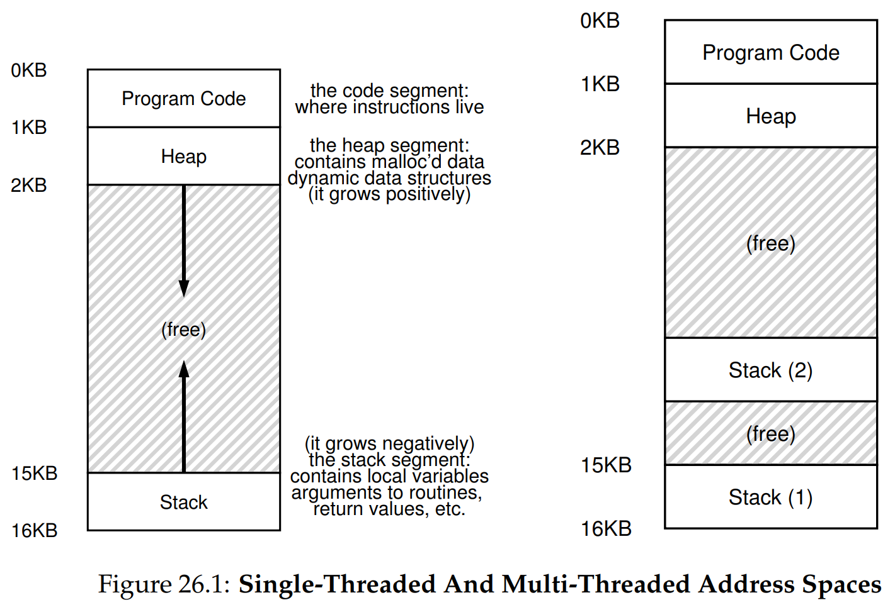
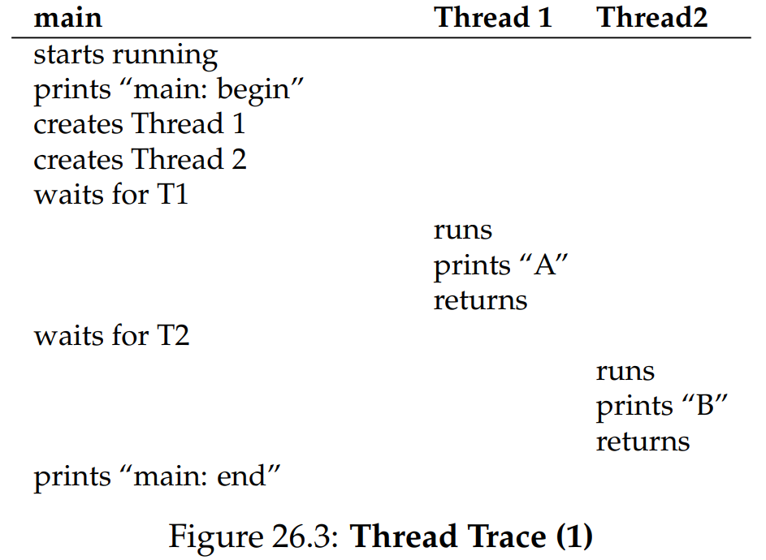
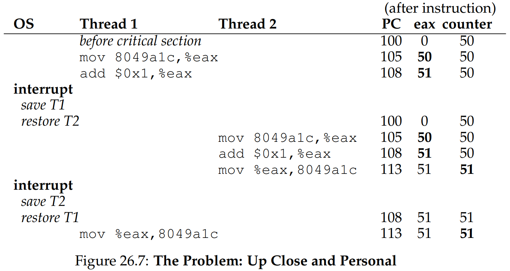

안녕하세요, pingu52입니다.

이전까지 다뤘던 프로세스는 보통 하나의 실행 흐름만 가진다고 가정했습니다.이번 장에서는 하나의 주소 공간 안에 여러 실행 흐름이 공존하는 **멀티 스레드 프로그램**을 다룹니다.

---

## 1. 스레드란 무엇인가

스레드는 **하나의 프로세스 안에서 실행되는 또 하나의 실행 흐름**입니다.

각 스레드는 서로 독립적인 실행 상태를 가집니다.

- `Program Counter (PC)`: 다음에 가져올 명령어 위치를 추적합니다.
- `레지스터 상태`: 연산을 위한 개인 상태(컨텍스트)입니다.
- `스레드별 스택`: 함수 호출과 로컬 변수를 저장하기 위한 공간입니다.

반면, 스레드들은 **주소 공간을 공유**합니다.

- 코드(Code) 영역
- 전역 변수 등 데이터 영역
- 힙(Heap)



:::note
**스택의 변화 (Figure 26.1)**
단일 스레드 프로세스는 스택이 하나만 존재하지만, 멀티 스레드 프로세스는 **스레드마다 별도의 스택**이 주소 공간 내 여러 위치에 배치됩니다.이를 통해 각 스레드는 독립적으로 함수를 호출할 수 있습니다.
:::

---

## 2. 왜 스레드를 사용하는가

스레드를 사용하는 대표적인 이유는 두 가지입니다.

- **병렬성 (Parallelism)**: 멀티코어 환경에서 작업을 쪼개 동시에 실행하여 속도를 높입니다.(예: 큰 배열 연산 분산 처리)
- **I/O 대기 시간 활용**: 한 스레드가 I/O 작업으로 막혀도(Block), 다른 스레드가 CPU를 사용해 유용한 작업을 계속할 수 있습니다.

---

## 3. 스레드 생성과 스케줄링의 비결정성

스레드는 `pthread_create()`로 생성하고 `pthread_join()`으로 종료를 기다립니다.

다음 코드는 메인 스레드가 A와 B를 출력하는 두 스레드를 만듭니다.

```c
#include <stdio.h>
#include <pthread.h>

void *mythread(void *arg) {
printf("%s\n", (char *)arg);
return NULL;
}

int main(int argc, char *argv[]) {
pthread_t p1, p2;
// 스레드 생성: mythread("A"), mythread("B") 실행
pthread_create(&p1, NULL, mythread, "A");
pthread_create(&p2, NULL, mythread, "B");

// 대기
pthread_join(p1, NULL);
pthread_join(p2, NULL);
return 0;
}
```

**핵심은 실행 순서를 알 수 없다는 점입니다.**
OS 스케줄러의 선택에 따라 A가 먼저 나올 수도, B가 먼저 나올 수도 있습니다.이처럼 같은 입력에도 실행 순서와 결과가 달라질 수 있는 성질을 `Indeterminate`(비결정적)이라고 합니다.



---

## 4. 공유 데이터가 들어오면 문제가 시작된다

단순 출력만으로는 큰 문제가 드러나지 않지만, **공유 데이터**를 건드리기 시작하면 심각한 문제가 발생합니다.
다음은 두 스레드가 하나의 `counter` 변수를 공유하며 각각 10,000,000번씩 1을 더하는 예제입니다.

```c
static volatile int counter = 0;

// 각 스레드가 이 루프를 10,000,000번 반복합니다.
for (i = 0; i < 1e7; i++) {
counter = counter + 1;
}
```

기대하는 결과는 `20,000,000`이지만, 실제 실행해보면 `19,345,221` 같은 예상과 다른 값이 나옵니다.심지어 실행할 때마다 값이 바뀌기도 합니다.

---

## 5. 왜 이런 일이 생기는가: 경쟁 상태 (Race Condition)

문제의 원인은 `counter = counter + 1` 코드가 **원자적(Atomic)이지 않기 때문**입니다.
이 C언어 코드는 어셈블리어(x86) 관점에서 보면 3단계로 쪼개집니다.

1. `mov 0x8049a1c, %eax`: 메모리에서 값을 레지스터로 가져옵니다 (**Load**).
2. `add $0x1, %eax`: 레지스터 값을 1 증가시킵니다 (**Add**).
3. `mov %eax, 0x8049a1c`: 레지스터 값을 다시 메모리에 저장합니다 (**Store**).

만약 타이머 인터럽트로 컨텍스트 스위치가 이 명령어들 사이에 끼어들면 어떻게 될까요?



1. **Thread 1**이 `counter`(50)를 로드하고 1을 더해 `51`을 만듭니다 (아직 저장하지 않음).
2. *(인터럽트 발생)* **Thread 2**로 전환됩니다.
3. **Thread 2**도 `counter`를 로드합니다.메모리에는 아직 `50`이 있습니다.
4. **Thread 2**가 1을 더해 `51`을 만들고 메모리에 저장합니다.(`counter = 51`)
5. *(다시 Thread 1 복귀)*
6. **Thread 1**은 아까 들고 있던 `51`을 메모리에 저장합니다.(`counter = 51`)

결국 두 번 더했는데 결과는 1만 증가했습니다.이처럼 실행 타이밍에 따라 결과가 달라지는 상황을 `Race Condition`(경쟁 상태)이라고 합니다.

---

## 6. 원자성(Atomicity)의 필요

우리가 원하는 것은 임계 영역의 명령어들이 마치 **하나의 슈퍼 명령어**처럼 실행되는 것입니다.

:::note
**All or Nothing**
:::

중간에 끊기지 않고 모두 실행되거나, 아예 실행되지 않아야 합니다.이를 `Atomicity`(원자성)이라고 합니다. 하드웨어는 몇 가지 기본적인 동기화 명령어(Synchronization Primitives)를 제공하고, 운영체제는 이를 이용해 **락(Lock)** 같은 도구를 만들어 제공합니다.

---

## 7. 또 다른 문제: 순서 대기 (Waiting)

공유 변수 문제 외에도, 한 스레드가 다른 스레드의 작업이 끝날 때까지 기다려야 하는 상황(예: I/O 완료 대기)이 있습니다. 이를 위해 `Condition Variable`(조건 변수) 같은 메커니즘이 필요하며, 이후 챕터에서 다룰 예정입니다.

---

## 8. 요약 (Summary)

이번 장에서는 병행성(Concurrency)의 기초를 다뤘습니다.

- **스레드**: 주소 공간을 공유하지만 실행 흐름(PC, 레지스터, 스택)은 분리된 실행 단위입니다.
- **비결정성**: 스케줄링에 따라 실행 순서가 달라질 수 있어 결과 예측이 어렵습니다.
- **경쟁 상태**: 공유 데이터 접근 시 원자성이 보장되지 않으면 데이터가 손상될 수 있습니다.
- **해결 방향**: 하드웨어와 OS의 지원을 받아 상호 배제(Lock)와 순서 제어(Condition Variable)를 구현해야 합니다.

---

## 9. 용어 정리

- `Thread`: 프로세스 내에서 실행되는 독립적인 실행 흐름.PC, 레지스터, 스택을 독립적으로 가짐.
- `Critical Section`: 공유 자원에 접근하는 코드의 일부분으로, 동시에 실행되면 안 되는 구역.
- `Race Condition`: 여러 스레드가 동시에 임계 영역에 진입하여 실행 타이밍에 따라 결과가 달라지는 상황.
- `Indeterminate`: 프로그램의 실행 결과가 실행할 때마다 달라지는 성질.
- `Mutual Exclusion`: 하나의 스레드만 임계 영역에 진입하도록 보장하는 것.
- `Atomicity`: 작업이 중단되지 않고 한 번에 실행되는 성질. All or Nothing.
- `Context Switch`: CPU 제어권을 한 스레드(또는 프로세스)에서 다른 스레드로 넘기는 작업.
- `Program Counter`: 현재 실행 중인 명령어의 주소를 저장하는 레지스터.

---

## Reference

- [Operating Systems: Three Easy Pieces - Chapter 26: Concurrency: An Introduction](https://pages.cs.wisc.edu/~remzi/OSTEP/threads-intro.pdf)
