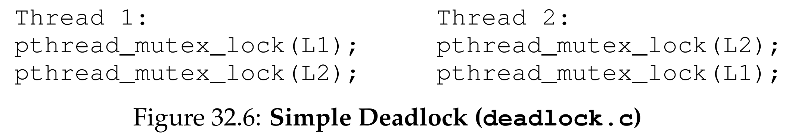
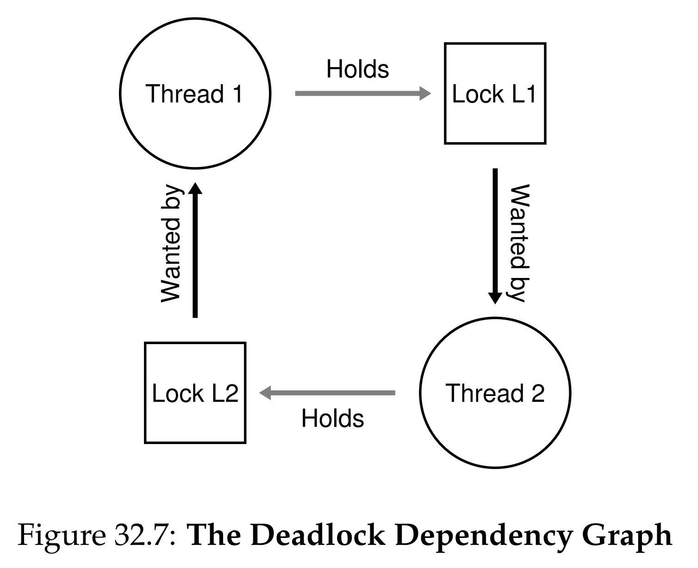

안녕하세요, pingu52입니다.

병행 프로그래밍이 어렵다는 것은 모두가 아는 사실입니다. 하지만 실제 현장에서 어떤 형태의 버그가 자주 터지는지에 대한 체계적인 분석은 생각보다 많지 않습니다.

이번 장에서는 Lu 등이 수행한 오픈소스 애플리케이션(MySQL, Apache, Mozilla, OpenOffice) 버그 분석 연구를 바탕으로, 병행성 버그를 크게 두 부류로 정리합니다.

- **비교착(Non-deadlock) 버그**: 교착 상태가 아닌 대부분의 병행성 버그
- **교착(Deadlock) 버그**: 락/자원 대기 사이클로 인해 영원히 진행이 멈추는 버그

흥미로운 결론은, 전체 병행성 버그 중 **비교착 버그가 더 큰 비중**을 차지했다는 점입니다.

---

## 1. 비교착 버그 (Non-deadlock Bugs)

Lu의 연구에서 비교착 버그는 대표적으로 **원자성 위반(Atomicity Violation)**, **순서 위반(Order Violation)** 두 패턴으로 많이 나타났습니다.

### 1.1 원자성 위반 (Atomicity Violation)

원자성 위반은 **원자적으로 실행되어야 할 코드 구간이 중간 끼어들기(interleaving)로 깨지는 현상**입니다. 전형적인 형태는 체크 후 사용(check-then-use) 패턴입니다.

문제 코드(MySQL 예시):

```c
// Thread 1
if (thd->proc_info) {
    // 이 사이에 다른 스레드가 끼어들 수 있음
    fputs(thd->proc_info, ...);
}

// Thread 2
thd->proc_info = NULL;
```

Thread 1이 `proc_info != NULL`을 확인한 직후 Thread 2가 `proc_info = NULL`로 바꾸면, Thread 1은 `fputs()`에서 NULL 포인터 역참조로 크래시가 날 수 있습니다.

해결책은 간단한 편입니다. **검사와 사용을 하나의 임계 영역으로 묶어** 직렬화(serialize)하면 됩니다.

```c
pthread_mutex_t proc_info_lock = PTHREAD_MUTEX_INITIALIZER;

// Thread 1
pthread_mutex_lock(&proc_info_lock);
if (thd->proc_info) {
    fputs(thd->proc_info, ...);
}
pthread_mutex_unlock(&proc_info_lock);

// Thread 2
pthread_mutex_lock(&proc_info_lock);
thd->proc_info = NULL;
pthread_mutex_unlock(&proc_info_lock);
```

원자성 위반을 보는 실전 관점은 이렇습니다.

- 단일 변수라도 **검사 → 사용**이 분리되어 있으면, 그 사이가 취약 지점이 됩니다.
- 해결은 보통 **락 추가**이지만, 해당 변수를 접근하는 모든 경로가 같은 락 규약을 따라야 합니다.

### 1.2 순서 위반 (Order Violation)

순서 위반은 **두 스레드 사이에 기대한 실행 순서가 강제되지 않아** 발생합니다. 예를 들어 Thread 2가 Thread 1의 초기화를 전제하는데, 스케줄링에 따라 그 전제가 깨질 수 있습니다.

문제 코드:

```c
// Thread 1
void init() {
    mThread = PR_CreateThread(mMain, ...);
}

// Thread 2
void mMain(...) {
    mState = mThread->State; // mThread가 아직 NULL이면 크래시
}
```

해결책은 **순서(초기화 완료)를 동기화로 강제**하는 것입니다. 조건 변수(또는 세마포어)가 정석입니다.

```c
pthread_mutex_t mtLock = PTHREAD_MUTEX_INITIALIZER;
pthread_cond_t  mtCond = PTHREAD_COND_INITIALIZER;
int mtInit = 0;

// Thread 1
void init() {
    mThread = PR_CreateThread(mMain, ...);

    pthread_mutex_lock(&mtLock);
    mtInit = 1;
    pthread_cond_signal(&mtCond);
    pthread_mutex_unlock(&mtLock);
}

// Thread 2
void mMain(...) {
    pthread_mutex_lock(&mtLock);
    while (mtInit == 0)
        pthread_cond_wait(&mtCond, &mtLock);
    pthread_mutex_unlock(&mtLock);

    mState = mThread->State;
}
```

여기서도 핵심은 패턴입니다.

- 순서 위반은 결국 **상태 변수(state) + wait/signal**로 해결합니다.
- `while`로 조건을 재확인해야 합니다(Mesa semantics + spurious wakeup).

---

## 2. 교착 상태 (Deadlock)

교착 상태는 스레드들이 서로가 가진 자원을 기다리며 **영원히 진행하지 못하는 상태**입니다. 가장 단순한 형태는 두 락을 서로 반대 순서로 잡는 패턴입니다.



*Figure 32.6: 두 스레드가 `L1`, `L2`를 교차 순서로 획득하면 교착 상태가 발생할 수 있습니다.*

Figure 32.6의 내용을 코드로 적으면 다음과 같습니다.

```c
// Thread 1
pthread_mutex_lock(L1);
pthread_mutex_lock(L2);

// Thread 2
pthread_mutex_lock(L2);
pthread_mutex_lock(L1);
```

어떤 실행에서는 우연히 지나가기도 하지만, 특정 인터리빙에서는 둘 다 두 번째 락에서 멈추며 교착이 됩니다. 이 현상은 의존성 그래프로 보면 더 명확합니다.



*Figure 32.7: 의존성 그래프에서 락/자원 대기 관계가 사이클을 만들면 교착 상태가 발생합니다.*

의존성 그래프를 $G=(V,E)$ 로 두고, 간선 $a \rightarrow b$ 를 a가 b가 가진 락이나 자원을 기다리는 관계로 정의하면, 교착 상태는 $G$ 에 **사이클(cycle)** 이 존재할 때 발생한다고 볼 수 있습니다.

### 2.1 교착 상태의 필요조건 (Coffman Conditions)

교착 상태는 아래 네 조건이 동시에 만족될 때 발생합니다.

1. **상호 배제(Mutual Exclusion)**: 자원을 배타적으로 점유합니다.
2. **점유 및 대기(Hold-and-Wait)**: 자원을 가진 채로 다른 자원을 기다립니다.
3. **비선점(No Preemption)**: 자원을 강제로 빼앗을 수 없습니다.
4. **순환 대기(Circular Wait)**: 대기 관계가 사이클을 이룹니다.

이를 논리식으로 쓰면 다음처럼 요약할 수 있습니다.

$$
Deadlock \iff ME \land HW \land NP \land CW
$$

즉, 네 조건 중 **하나라도 깨면** 교착 상태를 예방할 수 있습니다.

---

## 3. 교착 상태 예방 (Deadlock Prevention)

예방 전략은 결국 Coffman 조건 중 하나를 의도적으로 깨는 방식입니다.

### 3.1 순환 대기 예방: 락 순서 정하기 (Lock Ordering)

가장 실용적이면서 자주 쓰는 방법이 **락 획득 순서를 강제**하는 것입니다.

- 항상 `L1 → L2` 순서로만 잡게 만들면, 사이클이 생길 수 없습니다.
- 복잡한 시스템에서는 전체 순서(total ordering) 대신 부분 순서(partial ordering)를 설계하기도 합니다.

다중 락을 인자로 받는 함수가 문제를 만들 수 있는데, 이때는 **락 주소값으로 순서를 강제**하는 테크닉이 실용적입니다.

```c
void do_something(pthread_mutex_t *m1, pthread_mutex_t *m2) {
    if (m1 == m2) return; // 동일 락이면 특별 처리

    if (m1 > m2) { // 주소 큰 것부터(또는 반대로) 일관되게
        pthread_mutex_lock(m1);
        pthread_mutex_lock(m2);
    } else {
        pthread_mutex_lock(m2);
        pthread_mutex_lock(m1);
    }

    // ... critical section ...

    pthread_mutex_unlock(m1);
    pthread_mutex_unlock(m2);
}
```

락 순서는 결국 규약입니다. 규약이 깨지는 순간 교착은 다시 가능해지므로, 코드베이스 규모가 커질수록 문서화와 리뷰 규율이 중요해집니다.

### 3.2 점유 및 대기 예방: 한 번에 모두 획득하기

점유 및 대기 조건을 깨려면 **필요한 락을 한 번에 원자적으로 획득**하면 됩니다. 전역 prevention 락으로 락 획득 구간을 감싸는 방식이 대표적입니다.

```c
pthread_mutex_lock(&prevention);
pthread_mutex_lock(L1);
pthread_mutex_lock(L2);
// ...
pthread_mutex_unlock(&prevention);
```

단점이 명확합니다.

- 병행성이 크게 줄어듭니다.
- 필요한 락을 미리 알아야 하므로 캡슐화/모듈성이 발목을 잡습니다.

### 3.3 비선점 예방: trylock으로 후퇴(back off)하기

`pthread_mutex_trylock()`을 이용하면, 두 번째 락 획득 실패 시 **이미 잡은 락을 풀고 재시도**할 수 있습니다.

```c
top:
pthread_mutex_lock(L1);
if (pthread_mutex_trylock(L2) != 0) {
    pthread_mutex_unlock(L1);
    // livelock 완화를 위해 랜덤/지수 backoff를 두는 것이 일반적
    goto top;
}
```

이 방식은 교착은 피하지만, 서로가 계속 양보만 하는 **라이브락(livelock)** 이 발생할 수 있습니다. 실무에서는 랜덤 딜레이, exponential backoff 같은 완화책을 함께 둡니다.

### 3.4 상호 배제 예방: 락 없는(lock-free) 접근

가장 강한 형태는 락 자체를 없애 **상호 배제 조건을 성립하지 않게** 만드는 것입니다. 대표가 CAS 기반의 lock-free 설계입니다.

CAS 정의:

```c
int CompareAndSwap(int *addr, int expected, int newv) {
    if (*addr == expected) {
        *addr = newv;
        return 1; // success
    }
    return 0; // failure
}
```

CAS로 구현한 원자적 증가:

```c
void AtomicIncrement(int *value, int amount) {
    int old, newv;
    do {
        old  = *value;
        newv = old + amount;
    } while (CompareAndSwap(value, old, newv) == 0);
}
```

락이 없으니 교착은 원천적으로 사라지지만, 구현이 어렵고, 다른 형태의 진행 실패(예: livelock/기아) 가능성도 남습니다. 또한 유용한 자료구조를 lock-free로 완성하려면 훨씬 더 많은 고려가 필요합니다.

---

## 4. 회피와 탐지 (Avoidance and Detection)

### 4.1 회피 (Avoidance)

스레드가 어떤 락을 필요로 하는지 **사전에 알고** 있다면, 스케줄러가 교착이 나지 않도록 실행을 배치할 수 있습니다. 은행원 알고리즘류가 여기에 속합니다.

하지만 범용 OS/일반 애플리케이션에서는 전역적인 요구(lock demand)를 정확히 아는 것이 어려워 실용성이 제한됩니다. 회피는 종종 병행성을 희생하며, 결과적으로 성능 손해로 이어지기도 합니다.

### 4.2 탐지와 복구 (Detect and Recover)

교착을 완전히 막지 않고, **발생을 허용한 뒤 주기적으로 탐지**하는 전략도 있습니다.

- 자원(락) 대기 그래프를 만들고 사이클을 검사합니다.
- 사이클 발견 시 스레드/트랜잭션을 중단하거나, 재시작으로 복구합니다.

데이터베이스 시스템이 대표적이며, 교착이 드물고 복구 비용이 감당 가능할 때 현실적인 접근이 됩니다.

---

## 5. 요약 (Summary)

- 비교착 버그는 실무에서 흔하며, 특히 **원자성 위반**과 **순서 위반** 패턴이 큰 비중을 차지합니다.
  - 원자성 위반: check-then-use 같은 구간을 락으로 묶어 직렬화
  - 순서 위반: 상태 변수 + 조건 변수/세마포어로 순서를 강제
- 교착은 네 조건이 동시에 만족될 때 발생하며,
  $$
  Deadlock \iff ME \land HW \land NP \land CW
  $$
  네 조건 중 하나를 깨는 방식으로 예방할 수 있습니다.
- 현실에서 가장 실용적인 방어는 보통 **락 순서 규약(lock ordering)** 을 세우고 지키는 것입니다.
- lock-free/새 병행 모델은 가능성이 크지만, 일반적으로는 복잡도가 높아 널리 적용되기 어렵습니다.

병행 프로그램을 완벽하게 만드는 것은 어렵습니다. 따라서 처음에는 단순한 동기화로 정확성을 확보하고, 패턴 기반으로 위험 구간(원자성/순서)을 점검하며, 락 순서 같은 규약을 통해 교착 가능성을 줄이는 접근이 가장 현실적입니다.

---

## 6. 용어 정리

- `Non-deadlock bug (비교착 버그)`: 교착 상태가 아닌 병행성 버그. 원자성 위반, 순서 위반 등이 대표적.
- `Atomicity Violation (원자성 위반)`: 원자적으로 실행되어야 할 코드 구간이 인터리빙으로 깨지는 버그.
- `Order Violation (순서 위반)`: 스레드 간 필요한 실행 순서가 강제되지 않아 발생하는 버그.
- `Deadlock (교착 상태)`: 둘 이상의 스레드가 서로 상대의 자원을 기다리며 무한 대기하는 상태.
- `Coffman Conditions`: 교착이 발생하기 위한 네 가지 필요조건(상호 배제, 점유 및 대기, 비선점, 순환 대기).
- `Livelock (라이브락)`: 스레드들이 실행은 계속하지만 충돌 회피만 반복하여 실제 진전이 없는 상태.
- `Lock-free / Wait-free`: 락 없이(또는 모든 연산이 유한 단계 내 종료하도록) 동기화를 달성하는 설계 철학.

---

## Reference

- [Operating Systems: Three Easy Pieces - Chapter 32: Common Concurrency Problems](https://pages.cs.wisc.edu/~remzi/OSTEP/threads-bugs.pdf)
- Lu et al., Learning from Mistakes: A Comprehensive Study on Real World Concurrency Bug Characteristics, ASPLOS 2008
- Coffman et al., System Deadlocks, ACM Computing Surveys, 1971
