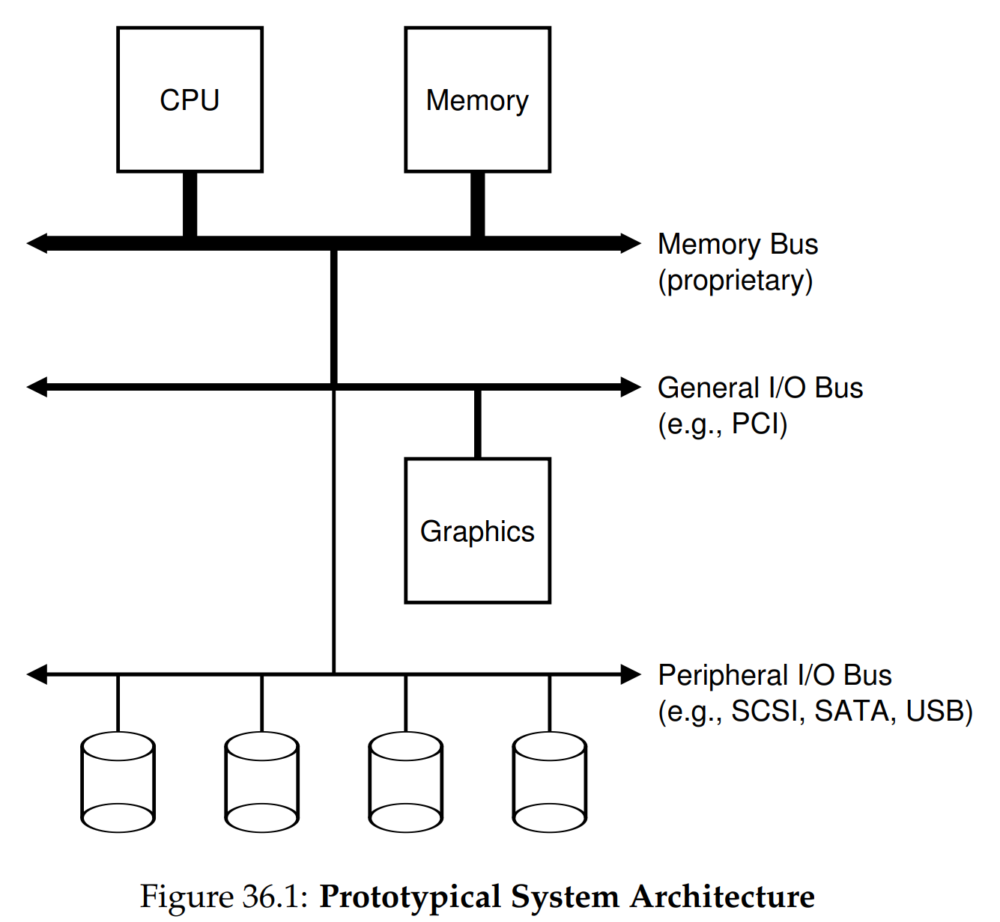
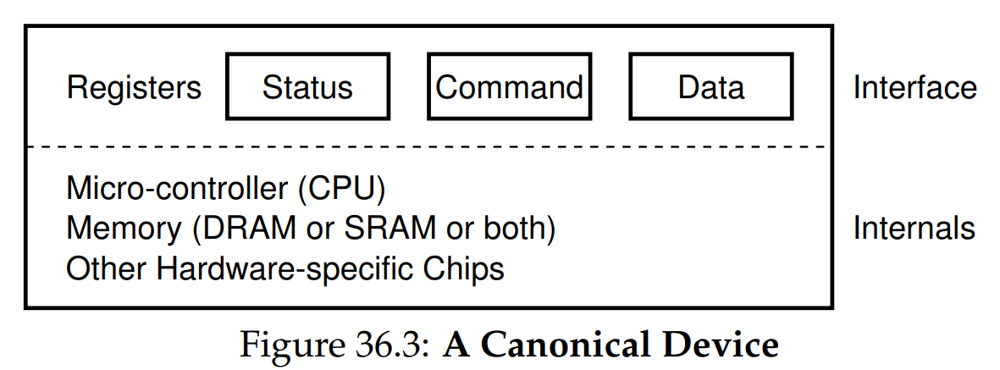
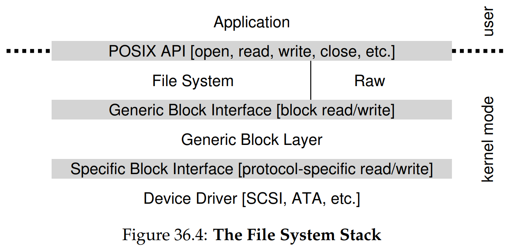

안녕하세요, pingu52입니다.

병행성(Concurrency) 파트를 마치고, 이제 운영체제의 세 번째 큰 주제인 **영속성(Persistence)** 으로 넘어갑니다. 영속성을 이해하려면 먼저 시스템이 데이터를 입력받고 출력하는 **I/O 장치**와 OS가 어떻게 소통하는지부터 정리해야 합니다.

이번 글에서는 OSTEP 36장 내용을 따라, OS가 I/O 장치를 시스템에 통합하고 효율적으로 제어하는 핵심 메커니즘들인 **Polling**, **Interrupt**, **DMA**, 그리고 이를 묶어주는 **디바이스 드라이버**까지 정리합니다.

---

## 1. 시스템 아키텍처 (System Architecture)

CPU와 메인 메모리는 보통 매우 빠른 **메모리 버스(memory bus)** 로 직접 연결됩니다. 그 아래에는 여러 장치를 연결하기 위한 버스가 계층적으로 붙습니다.

- **Memory bus**: CPU와 DRAM 사이의 가장 빠른 경로
- **General I/O bus**: PCIe 같은 고성능 I/O 버스(그래픽, 고속 네트워크 등)
- **Peripheral bus**: SATA, SCSI, USB 같은 상대적으로 느린 주변장치 버스(디스크, 키보드 등)

### 1.1 왜 계층 구조인가

핵심 이유는 **물리적 제약과 비용**입니다.

- 빠른 버스일수록 신호 무결성을 위해 길이가 짧아야 하고, 많은 장치를 멀리까지 달기 어렵습니다.
- 빠르고 복잡한 버스는 구현 비용이 큽니다.

그래서 고성능 장치는 CPU 가까운 고속 버스에, 나머지 장치는 한 단계 아래의 버스에 연결하는 계층 구조가 일반적입니다.



---

## 2. 표준 장치와 인터페이스 (Canonical Device)

장치는 크게 두 부분으로 나눌 수 있습니다.

- **Interface**: OS가 장치를 제어하기 위해 접근하는 레지스터 집합
- **Internals**: 장치 내부의 실제 동작(컨트롤러, 마이크로컨트롤러, 펌웨어, 장치 내부 메모리 등)

### 2.1 장치 인터페이스의 전형

대부분의 장치는 다음과 같은 레지스터를 제공합니다.

- **Status register**: 장치 상태(준비됨, 바쁨, 오류 등)
- **Command register**: 수행할 동작 지정(읽기, 쓰기, 리셋 등)
- **Data register**: 데이터 송수신 통로

OS는 이 레지스터를 읽고 쓰는 것만으로 장치를 제어할 수 있고, 장치 내부의 복잡함은 장치가 알아서 처리합니다.


---

## 3. 표준 프로토콜과 Polling (Canonical Protocol)

가장 단순한 제어 방식은 **폴링(polling)** 입니다. OS가 상태 레지스터를 반복해서 확인하면서 장치가 준비될 때까지 기다립니다.

### 3.1 폴링 기반 프로토콜 흐름

아래는 전형적인 흐름입니다.

```c
// 1) 장치가 준비될 때까지 대기
while (STATUS == BUSY) { /* spin */ }

// 2) 데이터 레지스터에 필요한 데이터 채우기
write_data_to_DATA_register();

// 3) 커맨드 레지스터에 명령 기록
write_command_to_COMMAND_register();

// 4) 완료될 때까지 다시 대기
while (STATUS == BUSY) { /* spin */ }
```

### 3.2 폴링의 장단점

- 장점: 구현이 단순하고 예측 가능함
- 단점: 장치가 느릴수록 CPU가 바쁜 루프만 돌며 낭비됨

폴링의 CPU 낭비를 아주 단순화해 보면, 장치 작업 시간이 $T_{dev}$ 일 때 CPU가 아무 일도 못 하는 시간이 거의 $T_{dev}$에 가깝습니다. 즉 CPU 유휴 시간을 활용할 수 없습니다. 정확히는 CPU가 idle이 아니라 busy-wait로 시간을 소비합니다.

---

## 4. 인터럽트로 CPU 오버헤드 줄이기 (Interrupts)

폴링의 핵심 문제는 CPU가 기다림을 직접 수행한다는 점입니다. 이를 해결하기 위해 등장한 것이 **인터럽트(interrupt)** 입니다.

### 4.1 인터럽트 기반 흐름

1. OS가 장치에 요청을 보냅니다.
2. OS는 해당 프로세스를 **block** 시키고 다른 일을 수행합니다.
3. 장치가 작업을 끝내면 **인터럽트**를 발생시킵니다.
4. CPU는 커널의 **인터럽트 핸들러**로 들어가 마무리 작업을 합니다.
5. 대기하던 프로세스를 **wakeup** 합니다.

이 방식의 핵심 가치는 **연산과 I/O의 중첩(overlap)** 입니다. 폴링은 기다림 동안 CPU가 놀지만, 인터럽트는 그 시간을 다른 프로세스 실행에 사용합니다.

### 4.2 인터럽트가 항상 이득은 아니다

인터럽트도 비용이 있습니다. 인터럽트 처리 과정은 보통 다음 오버헤드를 동반합니다.

- 트랩 및 컨텍스트 전환 비용
- 핸들러 실행 비용
- 캐시/파이프라인 교란 비용

따라서 장치가 매우 빠른 경우에는

$$
T_{dev} \ll T_{int}
$$

일 때, 인터럽트 처리 비용 $T_{int}$ 가 지배적이 되어 오히려 폴링이 더 나을 수 있습니다. 그래서 현실의 시스템은 보통 **짧게 폴링하다가, 오래 걸리면 인터럽트로 전환하는 하이브리드**를 사용합니다.

### 4.3 인터럽트 폭주와 coalescing

네트워크 패킷 폭주처럼 인터럽트가 너무 자주 발생하면, OS가 인터럽트 처리만 하느라 정상 작업을 거의 못 하는 **livelock**에 빠질 수 있습니다.

이를 완화하기 위한 대표 기법이 **interrupt coalescing**입니다.

- 일정 시간 또는 일정 개수의 이벤트를 모아
- 인터럽트를 한 번만 발생시켜
- 인터럽트 빈도를 낮춥니다

장점은 CPU 오버헤드 감소, 단점은 이벤트 처리 지연(latency) 증가입니다. 결국 이 역시 **오버헤드 vs 지연**의 트레이드오프입니다. 네트워크 스택에서는 인터럽트 완화와 함께 일정 구간 폴링으로 전환하는 방식도 흔히 결합됩니다.

---

## 5. 데이터 이동을 더 효율적으로 (DMA)

장치와 메모리 사이 데이터 이동을 CPU가 직접 수행하면, CPU가 단순 복사 작업에 묶입니다. 이를 **PIO(programmed I/O)** 라고 부르기도 합니다.

### 5.1 DMA의 핵심 아이디어

**DMA(Direct Memory Access)** 는 데이터 복사를 전담하는 하드웨어 엔진입니다.

1. OS가 DMA 엔진에 다음을 설정합니다.
   - 소스/목적지 주소
   - 전송 크기
2. DMA 엔진이 메모리와 장치 사이 데이터를 복사합니다.
3. 완료되면 DMA가 인터럽트로 OS에 알립니다.

이렇게 하면 CPU는 전송 동안 다른 일을 할 수 있어, 대용량 I/O에서 특히 큰 이득이 있습니다.

---

## 6. 장치 레지스터에 접근하는 방법 (Device Interaction)

OS가 장치 인터페이스 레지스터에 접근하는 방식은 크게 두 가지입니다.

### 6.1 Explicit I/O instructions

일부 아키텍처는 장치 접근을 위한 별도의 명령어를 제공합니다. 예를 들어 x86의 `in`, `out` 같은 방식입니다.

### 6.2 Memory-mapped I/O

장치 레지스터를 물리 주소 공간의 일부로 매핑해, 일반 메모리 접근처럼 `load/store` 로 접근하는 방식입니다. 현대 시스템에서 매우 흔합니다. 다만 MMIO는 일반 메모리와 달리 재주문이나 캐싱의 영향을 받을 수 있어, 드라이버에서는 `volatile` 접근이나 메모리 배리어 같은 제어가 함께 쓰이기도 합니다.

---

## 7. 디바이스 드라이버와 추상화 (Device Driver)

OS는 장치 종류가 달라도 공통 인터페이스로 다루고 싶어 합니다. 이 역할을 하는 것이 **디바이스 드라이버**입니다.

### 7.1 스택으로 보는 위치

예를 들어 파일 시스템은 아래와 같은 계층을 통해 디스크에 접근합니다.

- 파일 시스템: 읽기/쓰기 같은 논리 요청 생성
- 범용 블록 계층: 요청을 일반화하고 스케줄링
- 장치 드라이버: 실제 장치 프로토콜(레지스터 조작) 수행
- 하드웨어 장치



### 7.2 드라이버의 현실적인 어려움

- 장치별로 드라이버가 다르고, 하드웨어 조합이 방대합니다.
- OS 커널 코드 중 상당 부분이 드라이버일 정도로 규모가 큽니다.
- 하드웨어 세부에 강하게 결합된 코드가 많아 버그가 생기기 쉽습니다.

즉 추상화는 필수지만, 유지보수 비용도 함께 커집니다.

---

## 8. 사례 연구: IDE 디스크 드라이버 (xv6)

이 절은 디바이스 드라이버가 실제로 어떤 흐름을 갖는지 보여주는 예시입니다. xv6의 IDE 드라이버는 다음의 구성 요소로 동작합니다.

- 요청 큐(queue)
- 요청 시작 루틴
- 인터럽트 핸들러
- sleep/wakeup 동기화

### 8.1 IDE 인터페이스 개요

IDE는 비교적 단순한 레지스터 기반 인터페이스를 갖습니다.



### 8.2 요청 처리 흐름

전체 흐름은 아래처럼 이해하면 됩니다.

1. 요청이 들어오면 큐에 넣습니다.
2. 디스크가 idle이면 즉시 요청을 시작합니다.
3. 요청을 시작할 때 레지스터를 채우고 read 또는 write 명령을 내립니다.
4. 프로세스는 I/O 완료까지 sleep 합니다.
5. 디스크가 완료하면 인터럽트를 발생시키고, 핸들러가 필요한 데이터를 복사하거나 상태를 갱신한 뒤 잠든 프로세스를 깨웁니다.

여기서 중요한 포인트는 두 가지입니다.

- 요청 시작은 보통 **인터럽트가 아닌 정상 실행 흐름**에서 수행됩니다.
- 완료 처리는 **인터럽트 핸들러**에서 수행되고, 그 결과로 다음 요청을 이어서 시작합니다.

```c
// 개념 코드: xv6 IDE 드라이버의 핵심 흐름을 단순화한 형태
// buf: 블록 I/O 요청 구조체(READ/WRITE 플래그, 섹터 번호, 데이터 버퍼 등)

static struct spinlock ide_lock;
static struct buf *idequeue;

static void ide_start(struct buf *b) {
    // 1) 장치 ready까지 짧게 폴링(status 확인)
    // 2) 섹터 번호/개수 및 데이터 레지스터 설정
    // 3) READ/WRITE 커맨드를 기록해 요청 시작
}

void ide_rw(struct buf *b) {
    acquire(&ide_lock);

    // 요청을 큐에 연결
    b->qnext = NULL;
    if (idequeue == NULL) idequeue = b;
    else tail(idequeue)->qnext = b;

    // 디스크가 idle이면 즉시 시작
    if (idequeue == b)
        ide_start(b);

    // 완료까지 sleep: 인터럽트 핸들러가 flags 갱신 후 wakeup
    while ((b->flags & (B_VALID | B_DIRTY)) != B_VALID)
        sleep(b, &ide_lock);

    release(&ide_lock);
}

void ide_intr(void) {
    acquire(&ide_lock);

    struct buf *b = idequeue;
    if (b == NULL) {
        release(&ide_lock);
        return;
    }
    idequeue = b->qnext;

    if ((b->flags & B_DIRTY) == 0) {
        // READ 완료: 장치 -> 메모리 전송(예: insl(DATA, b->data, BSIZE/4))
    } else {
        // WRITE 완료: 이미 메모리 -> 장치 전송(outsl)을 끝낸 상태
        b->flags &= ~B_DIRTY;
    }

    b->flags |= B_VALID;
    wakeup(b);

    // 다음 요청이 있으면 이어서 시작
    if (idequeue != NULL)
        ide_start(idequeue);

    release(&ide_lock);
}
```

완료 조건은 다음 불변식으로 요약할 수 있습니다.

$$
(b \texttt{->} \mathit{flags} \mathbin{\&} (\texttt{B\_VALID} \mid \texttt{B\_DIRTY})) = \texttt{B\_VALID}
$$

즉 I/O가 끝나면 버퍼는 유효하고(`B_VALID`), 더 이상 dirty가 아니어야 합니다.

---

## 9. 요약

- 시스템은 계층적 버스 구조로 다양한 I/O 장치를 연결합니다.
- 장치는 status, command, data 레지스터 같은 인터페이스를 제공하고, OS는 이를 통해 제어합니다.
- 폴링은 단순하지만 CPU를 낭비할 수 있습니다.
- 인터럽트는 연산과 I/O를 중첩해 효율을 높이지만, 빠른 장치나 인터럽트 폭주 상황에서는 오버헤드 문제가 생길 수 있습니다.
- DMA는 대용량 데이터 이동에서 CPU 부담을 크게 줄입니다.
- 디바이스 드라이버는 하드웨어의 구체성을 캡슐화해 OS 전체에 표준 인터페이스를 제공합니다.

다음 장부터는 디스크 같은 저장장치의 물리적 특성과 스케줄링으로 넘어갑니다.

---

## 10. 용어 정리

- `Polling`: 상태 레지스터를 반복적으로 읽어 완료 여부를 확인하는 방식
- `Interrupt`: 장치가 작업 완료 시 CPU에 신호를 보내 커널 핸들러를 실행시키는 메커니즘
- `PIO`: CPU가 직접 데이터 이동을 수행하는 방식
- `DMA`: CPU 개입 없이 메모리와 장치 사이 데이터를 전송하는 하드웨어 엔진
- `Memory-mapped I/O`: 장치 레지스터를 메모리 주소에 매핑해 `load/store` 로 접근하는 방식
- `Device Driver`: 장치별 제어 방식(프로토콜)을 OS가 쓰기 쉬운 형태로 캡슐화한 커널 코드
- `Interrupt Coalescing`: 여러 이벤트를 모아 인터럽트를 덜 자주 발생시키는 기법

---

## Reference

- [Operating Systems: Three Easy Pieces - Chapter 36: I/O Devices](https://pages.cs.wisc.edu/~remzi/OSTEP/file-devices.pdf)
