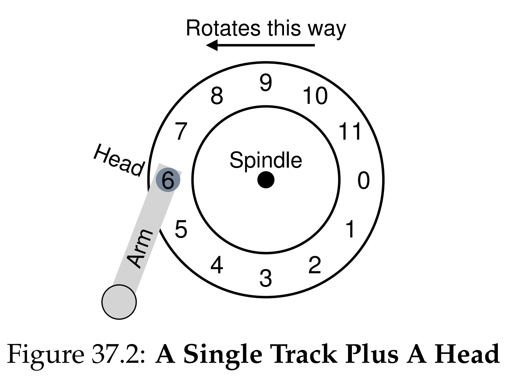
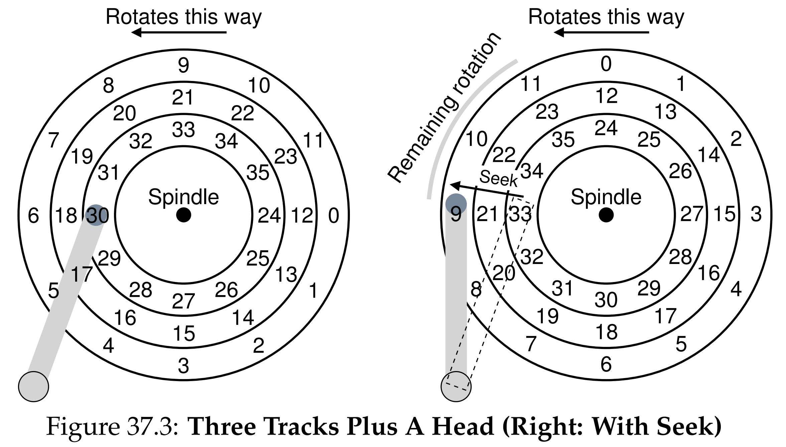
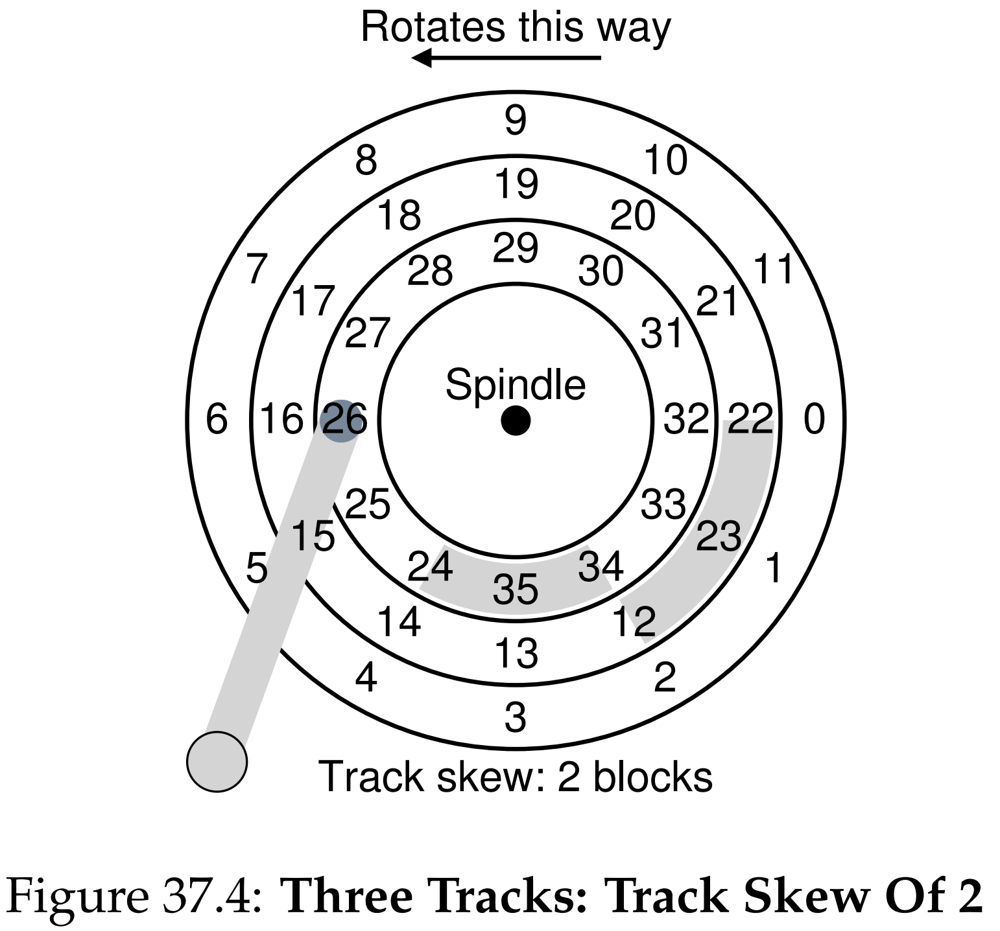
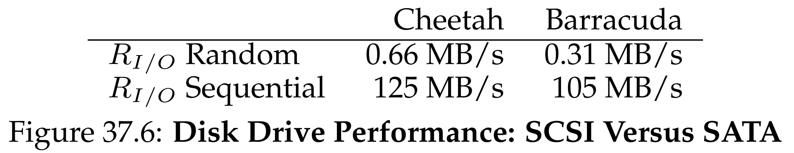
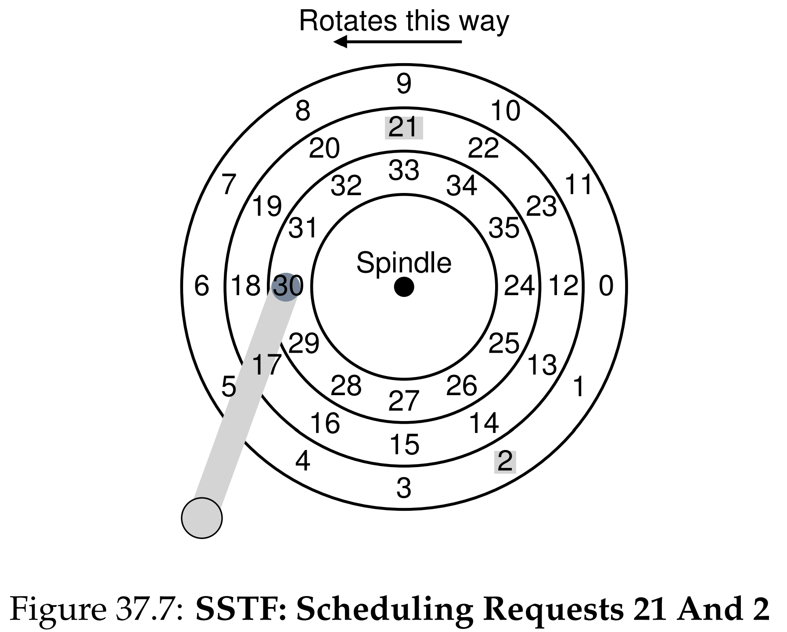
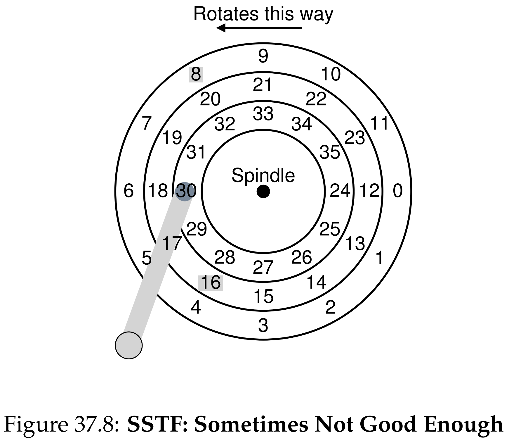

안녕하세요, pingu52입니다.

지난 장에서 운영체제가 I/O 장치와 상호작용하는 일반적인 방식(폴링, 인터럽트, DMA)을 봤습니다. 이번 장에서는 오랫동안 영속성의 핵심 저장장치였던 **하드 디스크 드라이브(HDD)** 를 더 깊게 들여다봅니다.

HDD는 **기계적 장치**입니다. 즉, 탐색과 회전 같은 물리적 동작이 성능을 지배합니다. 이 특성을 이해해야 이후 파일 시스템이 왜 연속 배치, 근접 배치, 순차 I/O를 중요하게 다루는지 자연스럽게 연결됩니다.

---

## 1. 디스크가 제공하는 인터페이스

현대 HDD의 외부 인터페이스는 단순하게 보입니다.

- 디스크는 $0$부터 $n-1$까지 번호가 붙은 **섹터(sector)** 의 배열로 표현됩니다.
- OS는 섹터 번호(논리 블록 주소, LBA)를 지정해 읽기/쓰기를 요청합니다.
- 파일 시스템은 보통 더 큰 블록(예: $4\,\mathrm{KiB}$) 단위로 I/O를 수행하지만, 디스크가 제공하는 최소 단위는 섹터입니다.

여기서 한 가지를 보수적으로 기억해 두는 편이 안전합니다.

- 쓰기 원자성은 보통 **하나의 섹터 단위**만 보장된다고 가정합니다.
- 섹터보다 큰 단위의 쓰기 도중 전원이 나가면 일부만 기록되는 **torn write**가 생길 수 있습니다.

또 하나의 중요한 사실은 명시적 인터페이스에 적히지 않습니다.

- 디스크 주소 공간에서 **가까운 블록** 접근이 **먼 블록** 접근보다 보통 빠릅니다.
- 큰 덩어리의 **연속 접근(sequential)** 이 **임의 접근(random)** 보다 압도적으로 빠릅니다.

이것이 파일 시스템이 배치를 고민하는 근본 이유입니다.

추가로, OS가 보는 LBA는 디스크 내부에서 물리 위치로 매핑됩니다. 따라서 물리적 결함 섹터 재매핑 같은 이유로, LBA가 단순히 기하학적 위치와 1:1로 대응하지 않을 수 있습니다.

---

## 2. 물리적 구조

디스크 성능을 이해하려면 기본 기하(geometry)를 알아야 합니다.

- **Platter**: 데이터를 저장하는 원판(자성 코팅)
- **Spindle**: 플래터를 일정 속도로 회전시키는 축과 모터(RPM)
- **Track**: 표면의 동심원 기록 단위
- **Cylinder**: 여러 플래터에서 같은 반지름의 트랙 집합
- **Head / Arm**: 트랙 위로 이동하며 읽고 쓰는 헤드와 이를 움직이는 암

여기서 track, cylinder 같은 용어는 설명에 매우 유용하지만, 현대 디스크는 존(zones), 재매핑, 내부 최적화로 인해 이 기하학을 OS에 그대로 노출하지 않는 경우가 많습니다. 그럼에도 기계적 이동과 회전이 비용을 만든다는 본질은 같습니다.

### 2.1 탐색과 트랙 이동

헤드는 트랙 사이를 이동합니다. 이 이동이 **탐색(seek)** 이고, 디스크가 느린 가장 큰 이유 중 하나입니다.

### 2.2 트랙 스큐와 멀티존

연속 읽기가 트랙 경계를 넘을 때도 빠르게 이어지려면, 트랙 이동 시간 동안 회전해버린 각도를 보정해야 합니다.

- **Track skew**: 다음 트랙의 시작 섹터 위치를 의도적으로 밀어, 트랙 변경 직후에도 연속 섹터를 곧바로 읽게 만드는 기법

또한 바깥쪽 트랙은 둘레가 더 길어 더 많은 섹터를 담을 수 있습니다.

- **Multi-zoned recording**: 바깥쪽 존에 섹터를 더 많이 배치해 용량과 대역폭을 끌어올리는 방식(존별 섹터 수가 다름)

이 특성 때문에, 같은 RPM이라도 바깥쪽 트랙의 **순차 전송 대역폭**이 안쪽보다 더 높게 나오는 경향이 있습니다.

---

## 3. 디스크 I/O 시간 모델

디스크 요청 하나의 서비스 시간은 세 요소의 합으로 모델링합니다.

\[
T_{\mathrm{I/O}} = T_{\mathrm{seek}} + T_{\mathrm{rot}} + T_{\mathrm{xfer}}
\tag{1}
\]

- $T_{\mathrm{seek}}$: 헤드를 목표 트랙으로 이동시키는 시간(가속, 이동, 감속, 안정화)
- $T_{\mathrm{rot}}$: 목표 섹터가 헤드 아래로 올 때까지 기다리는 회전 지연
- $T_{\mathrm{xfer}}$: 실제 데이터 전송 시간

### 3.1 평균 회전 지연

RPM이 주어지면 한 바퀴 시간은 다음과 같습니다.

\[
T_{\mathrm{rev}} = \frac{60\,\mathrm{s}}{\mathrm{RPM}}
= \frac{60\times 10^3}{\mathrm{RPM}}\,\mathrm{ms}
\tag{2}
\]

평균적으로 반 바퀴를 기다리므로,

\[
\mathbb{E}\!\left[T_{\mathrm{rot}}\right]
= \frac{1}{2}T_{\mathrm{rev}}
= \frac{30\times 10^3}{\mathrm{RPM}}\,\mathrm{ms}
\tag{3}
\]

예를 들어 $\mathrm{RPM}=10{,}000$이면 $T_{\mathrm{rev}}=6\,\mathrm{ms}$, 평균 회전 지연은 $3\,\mathrm{ms}$입니다.

### 3.2 왜 순차 I/O가 압도적으로 빠른가

임의 접근(random)은 매 요청마다 식 (1)의 $T_{\mathrm{seek}}$와 $T_{\mathrm{rot}}$를 반복해서 지불합니다. 반면 순차 접근(sequential)은 한 번의 위치 결정 이후 큰 전송으로 길게 이어지므로, 요청당 오버헤드가 희석되고 대부분 시간이 $T_{\mathrm{xfer}}$에 가까워집니다.

처리율(대역폭)을 시간으로부터 계산할 때는 다음을 사용하면 됩니다.

\[
R_{\mathrm{I/O}} = \frac{\mathrm{Size}}{T_{\mathrm{I/O}}}
\tag{4}
\]

---

## 4. 디스크 캐시와 쓰기 정책

현대 디스크는 내부에 작은 메모리 캐시를 둡니다(전통적으로 track buffer라고도 부름).

- 읽기에서는 같은 트랙 근처 데이터를 더 읽어 캐시에 담아두면 이후 요청을 빠르게 처리할 수 있습니다.
- 쓰기에서는 두 전략이 있습니다.
  - **write-through**: 실제 플래터에 기록된 뒤 완료로 보고
  - **write-back**: 디스크 캐시에 적재되면 완료로 보고, 실제 기록은 나중에 수행

write-back은 체감 성능을 올리지만, 전원 장애 상황에서는 상위 계층이 기대하는 쓰기 완료 의미와 어긋날 수 있어 주의가 필요합니다.

---

## 5. 디스크 스케줄링

디스크는 느린 장치이므로, 운영체제는 보통 여러 I/O 요청을 모아 큐를 만들고 **요청 순서를 재배열**해 평균 비용을 줄입니다.

현실적으로 OS가 알고 있는 정보는 제한적입니다.

- OS는 보통 LBA 배열로만 디스크를 보고, 트랙, 헤드의 정확한 위치나 존 구조를 직접 알기 어렵습니다.
- 그래서 트랙 기준 SSTF를 구현하기보다는, LBA 기준으로 가까운 요청을 고르는 근사(예: nearest-block-first)가 자주 사용됩니다.

### 5.1 FIFO

요청이 들어온 순서대로 처리합니다. 단순하지만, 멀리 떨어진 요청이 번갈아 오면 탐색 비용이 커져 성능이 나빠질 수 있습니다.

### 5.2 SSTF

**가장 짧은 탐색(seek)** 이 예상되는 요청을 우선 처리합니다.

- 장점: 평균 탐색을 줄여 처리량을 올림
- 단점: 특정 영역 요청이 계속 들어오면 다른 영역 요청이 오래 밀리는 **기아(starvation)** 가 발생할 수 있음

### 5.3 SCAN과 C-SCAN

기아를 피하려면 엘리베이터처럼 한 방향으로 쓸고(sweep) 나가면서 처리합니다.

- **SCAN**: 한 방향으로 처리하다 끝에 닿으면 방향을 바꿔 다시 처리
- **C-SCAN**: 한 방향으로만 처리하고, 끝에 닿으면 반대편으로 빠르게 복귀하여 다시 같은 방향으로 처리

실무에서는 끝까지 가지 않고 마지막 요청까지만 훑는 LOOK, C-LOOK 같은 변형도 자주 함께 언급됩니다.

### 5.4 SPTF(SATF)

SSTF와 SCAN은 주로 탐색만 보지만, 실제로는 회전 지연도 무시할 수 없습니다.

- **SPTF(Shortest Positioning Time First)** 는 $T_{\mathrm{seek}} + T_{\mathrm{rot}}$을 함께 고려해 다음 요청을 고릅니다.
- 어떤 경우에는 탐색이 조금 더 길더라도, 회전이 거의 필요 없는 요청이 더 빨리 끝날 수 있습니다.

다만 SPTF는 회전 위치(phase) 같은 세부 정보가 필요합니다. 이 정보는 디스크 내부가 더 정확히 알고 있으므로, 실제 시스템에서는 디스크가 내부적으로 더 정교한 재정렬을 수행하는 경우가 많습니다.

### 5.5 현대 시스템의 스케줄링 위치와 병합

현대 디스크는 내부적으로 여러 outstanding 요청을 받을 수 있고, 디스크 내부 스케줄러가 실제 헤드 위치를 알고 더 정교하게 재정렬하기도 합니다. 그래서 OS는 보통:

- 적당한 수의 후보 요청(window)을 디스크로 보내고
- 디스크가 내부에서 더 좋은 순서로 처리

하는 식으로 협력합니다.

또한 OS 스케줄러가 자주 수행하는 최적화가 **I/O 병합(merging)** 입니다. 인접한 블록 요청을 합쳐 더 큰 연속 요청으로 만들면, 요청 개수 자체를 줄여 오버헤드를 낮출 수 있습니다.

---

## 6. 요약

- HDD는 기계적 동작 때문에 $T_{\mathrm{seek}}$와 $T_{\mathrm{rot}}$이 지배적이며, 임의 접근이 매우 비쌉니다.
- 연속 접근은 한 번의 위치 결정 이후 큰 전송으로 이어져 대역폭이 크게 올라갑니다.
- 디스크 스케줄링은 평균 비용을 줄이지만, 기아를 막기 위한 공정성 고려가 필요합니다.
- 회전까지 고려하는 SPTF(SATF)는 더 좋은 선택이지만, 필요한 정보가 디스크 내부에 더 잘 존재하므로 현대 디스크는 내부 스케줄링을 함께 사용합니다.

---

## 7. 용어 정리

- `Sector`: 디스크의 기본 블록 단위(전통적으로 512B, 환경에 따라 4\,\mathrm{KiB}도 사용)
- `Seek Time`: 헤드가 목표 트랙으로 이동하는 시간
- `Rotational Delay`: 목표 섹터가 헤드 아래로 올 때까지 기다리는 시간
- `Transfer Time`: 실제 데이터가 전송되는 시간
- `Torn Write`: 큰 쓰기 중 전원 장애 등으로 일부만 기록되는 현상
- `Track Skew`: 트랙 이동 시간을 고려해 다음 트랙의 섹터 시작 위치를 밀어 두는 기법
- `SSTF`: 탐색이 가장 짧은 요청을 우선하는 정책
- `SCAN / C-SCAN`: 한 방향 sweep을 기반으로 기아를 줄이는 엘리베이터 계열 정책
- `SPTF / SATF`: 탐색과 회전을 함께 고려해 위치 결정 시간이 최소인 요청을 고르는 정책
- `Merging`: 인접 요청을 합쳐 더 큰 연속 요청으로 만드는 최적화

---

## Reference

- [Operating Systems: Three Easy Pieces - Chapter 37: Hard Disk Drives](https://pages.cs.wisc.edu/~remzi/OSTEP/file-disks.pdf)
