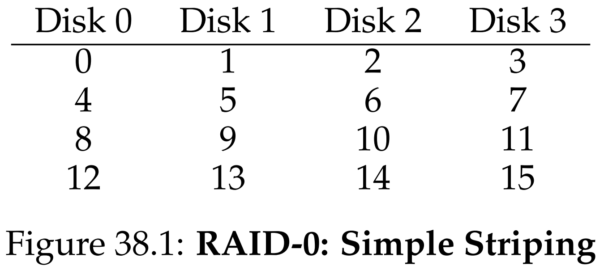
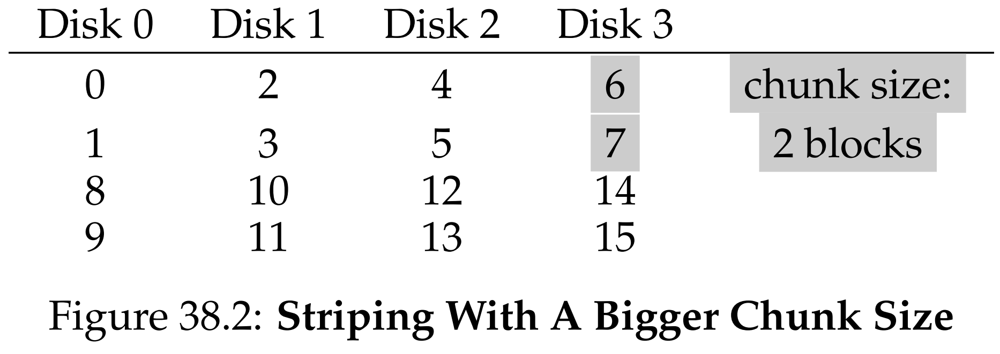
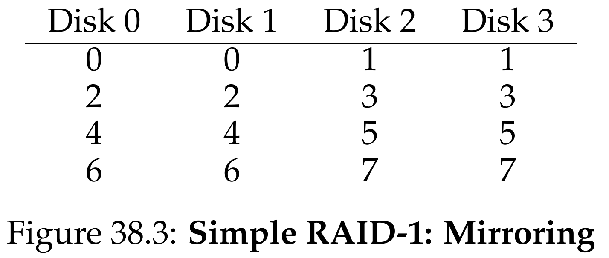
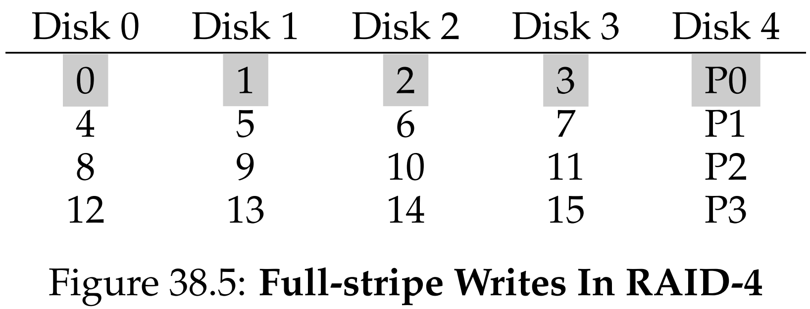
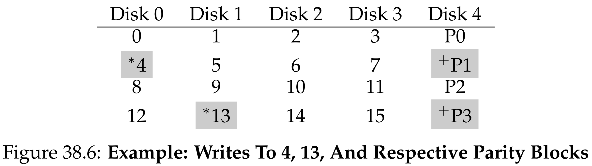
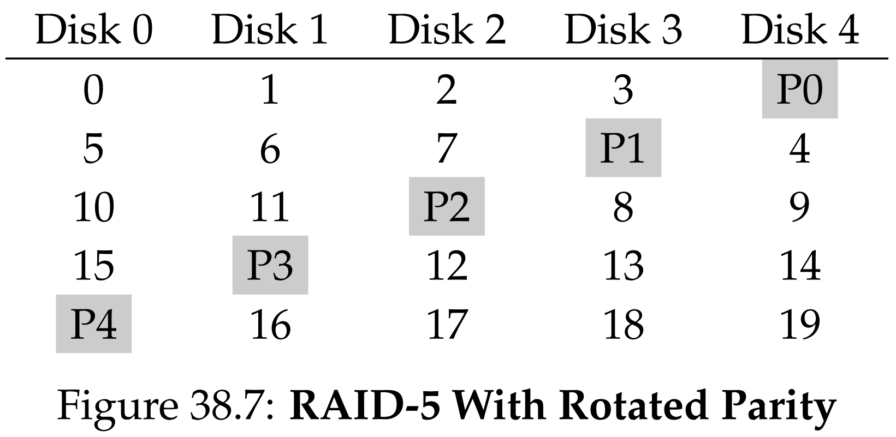
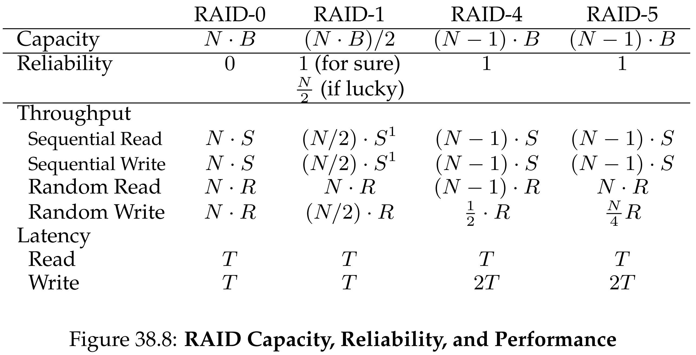

안녕하세요, pingu52입니다.

디스크 하나는 느립니다. 더 빠른 I/O, 더 큰 용량, 그리고 디스크 고장에도 데이터가 사라지지 않는 신뢰성을 원하면 단일 디스크만으로는 한계가 빠르게 드러납니다.

이 문제를 해결하는 대표적인 접근이 RAID입니다. 여러 개의 디스크를 묶어 **하나의 큰 디스크처럼 보이게** 만들고, 설계에 따라 **성능**, **용량**, **신뢰성**을 서로 다른 비율로 끌어올립니다.

---

## 1. RAID를 바라보는 관점

RAID는 위쪽(파일 시스템)에서 보면 단일 디스크와 같습니다. 파일 시스템은 논리 블록 주소(LBA)에 대해 읽기/쓰기를 요청하고, RAID가 내부에서 이를 여러 개의 물리 I/O로 변환합니다.

RAID를 비교할 때는 다음 세 축을 먼저 고정하는 편이 깔끔합니다.

- **용량(Capacity)**: 디스크가 $N$개이고 각 디스크가 $B$ 블록이라면, 유효 용량은 몇 블록인가
- **신뢰성(Reliability)**: 디스크 몇 개의 fail-stop 고장을 견딜 수 있는가
- **성능(Performance)**: 단일 요청 지연과 steady-state 처리량이 어떤가

### 1.1 성능을 두 가지로 나누기

성능은 보통 다음 둘로 쪼개어 봅니다.

- **Latency**: 단일 논리 I/O 한 번이 끝나기까지 걸리는 시간
- **Throughput**: 다수 요청이 지속적으로 들어올 때의 총 처리량(대역폭)

워크로드도 단순화해서 두 축으로 나누면 비교가 쉬워집니다.

- **Sequential**: 큰 연속 범위를 길게 읽고 쓰는 패턴
- **Random**: 작은 요청이 디스크의 여러 위치로 흩어지는 패턴

아래에서는 OSTEP의 단순화 모델을 그대로 따릅니다. 단일 디스크가 sequential에서 $S\,[\mathrm{MB/s}]$, random에서 $R\,[\mathrm{MB/s}]$의 처리량을 낸다고 두고($S \gg R$), RAID 레벨별 steady-state 처리량을 $S$와 $R$의 선형 결합으로 계산합니다. 또한 처리량 식은 **충분한 큐 깊이**가 있어 디스크들을 병렬로 포화시킬 수 있다는 가정을 포함합니다.

---

## 2. RAID 0: Striping

RAID 0은 **중복이 없는 스트라이핑**입니다. 신뢰성을 올리지 않고 오직 성능과 용량만 최대화합니다.

- **용량**: $N \cdot B$
- **신뢰성**: 없음(디스크 1개 고장이 곧 데이터 손실)
- **성능(처리량)**:
  - Sequential read/write: $N \cdot S$
  - Random read/write: $N \cdot R$
- **Latency**: 작은 단일 요청은 단일 디스크와 거의 동일(요청은 한 디스크로만 감)

### 2.1 Chunk size가 바뀌면 무엇이 달라지나

스트라이핑은 블록을 디스크에 round-robin으로 뿌리지만, 실제 시스템은 보통 **chunk size**를 1블록보다 크게 잡습니다.

- chunk가 작으면 한 파일이 여러 디스크로 퍼져 **단일 파일 병렬성**이 좋아질 수 있음
- chunk가 크면 단일 파일이 한 디스크에 머무는 구간이 늘어 **positioning 오버헤드**를 줄일 수 있음

즉 chunk size는 워크로드(요청 크기, 동시성, 파일 크기 분포)에 강하게 의존하는 성능 파라미터입니다.

---

## 3. RAID 1: Mirroring

RAID 1은 **미러링**입니다. 각 블록의 복사본을 다른 디스크에 저장해 디스크 고장에 대비합니다. 흔한 배치는 미러 쌍을 만들고 그 위에 스트라이핑을 하는 RAID 10 형태입니다.

- **용량**: $\frac{N}{2} \cdot B$  (2-way 미러 기준)
- **신뢰성**: 최악의 경우 1개 고장을 확실히 허용, 고장 위치가 운 좋게 분산되면 최대 $\frac{N}{2}$개까지도 가능
- **성능(처리량)**:
  - Sequential read/write: $\frac{N}{2}\cdot S$
  - Random read: $N \cdot R$
  - Random write: $\frac{N}{2}\cdot R$

읽기는 두 복사본 중 아무거나 선택할 수 있어 random read에서 특히 유리합니다. 반면 쓰기는 두 복사본을 모두 갱신해야 합니다. 다만 두 디스크에 **병렬로** 쓸 수 있으므로 단일 쓰기 지연은 보통 단일 디스크보다 큰 폭으로 늘지 않고, 대략 느린 쪽에 맞춰지는 정도로 이해하면 됩니다.

### 3.1 Consistent-update problem

RAID 1(그리고 다중 디스크를 함께 갱신하는 RAID)은 한 번의 논리 쓰기가 **여러 디스크 쓰기**로 분해됩니다. 이때 크래시 타이밍이 나쁘면

- 한 디스크에는 새 데이터가 기록되고
- 다른 디스크에는 옛 데이터가 남아

복사본 간 내용이 불일치해질 수 있습니다.

일반적인 해결은 RAID 내부에 **write-ahead log**를 두고, 다중 디스크 갱신을 트랜잭션처럼 처리하는 것입니다. 하드웨어 RAID는 이를 위해 배터리 백업이 있는 캐시 같은 **비휘발성 버퍼**를 함께 쓰기도 합니다.

---

## 4. RAID 4: Dedicated Parity

미러링은 용량 비용이 큽니다. RAID 4는 이를 줄이기 위해 **패리티(Parity)** 를 사용합니다.

한 stripe에 데이터 블록들이 있고, 별도의 **패리티 디스크**에 패리티 블록을 둡니다. 디스크 1개가 고장 나면 남은 블록들과 패리티로 복구할 수 있습니다.

- **용량**: $(N-1)\cdot B$
- **신뢰성**: 디스크 1개 고장까지 허용

### 4.1 XOR 패리티의 불변식

stripe의 데이터 블록을 $D_0,\dots,D_{N-2}$, 패리티를 $P$라고 하면

$$
P = D_0 \oplus D_1 \oplus \cdots \oplus D_{N-2}
\tag{1}
$$

한 블록이 사라지면 같은 연산으로 복원됩니다.

### 4.2 Full-stripe write와 small write

큰 연속 쓰기에서는 stripe를 통째로 채우는 **full-stripe write**가 가능합니다. 이때는

- 새 데이터들로 새 패리티를 계산하고
- 데이터 + 패리티를 병렬로 한 번에 기록

하면 되므로 효율이 좋습니다.

문제는 작은 랜덤 쓰기입니다. stripe의 일부만 덮어쓰면 패리티를 갱신해야 하며, 대표적인 구현이 read-modify-write입니다.

- old data 읽기
- old parity 읽기
- new parity 계산
- new data 쓰기
- new parity 쓰기

패리티 갱신은 다음 형태로 정리할 수 있습니다.

$$
P_{\mathrm{new}} =
\left(D_{\mathrm{old}} \oplus D_{\mathrm{new}}\right) \oplus P_{\mathrm{old}}
\tag{2}
$$

참고로 small write는 read-modify-write 말고, 같은 stripe의 다른 데이터 블록들을 모두 읽어 새 패리티를 재구성하는 방식(reconstruct-write)도 가능합니다. 어느 쪽이 유리한지는 디스크 수와 워크로드에 따라 갈립니다.

### 4.3 RAID 4 성능 요약

- **Sequential read**: $(N-1)\cdot S$
- **Sequential write**: $(N-1)\cdot S$  (full-stripe write 가정)
- **Random read**: $(N-1)\cdot R$
- **Small random write**: 패리티 디스크가 병목

특히 small random write는 패리티 디스크가 논리 쓰기마다 **패리티 블록 read + write**를 수행해야 해서, 전체 처리량이 패리티 디스크 처리량에 의해 제한됩니다. 단순화 모델에서는

$$
\mathrm{Throughput}_{\mathrm{RAID4,\,rand\,write}}
\approx
\frac{R}{2}
\tag{3}
$$

로 요약합니다.

---

## 5. RAID 5: Rotating Parity

RAID 4의 가장 큰 문제는 패리티 디스크 단일 병목입니다. RAID 5는 패리티 블록을 디스크들에 **회전 배치**하여 이를 제거합니다.

- **용량**: $(N-1)\cdot B$
- **신뢰성**: 디스크 1개 고장까지 허용

성능은 RAID 4와 대부분 같지만, small random write에서 병목이 크게 완화됩니다.

- **Sequential read/write**: $(N-1)\cdot S$
- **Random read**: $N\cdot R$
- **Small random write**: 4 I/O 비용은 남지만, 디스크 전체에 분산되어 병렬성이 생김

단순화 모델에서는 RAID 5 small random write 처리량을

$$
\mathrm{Throughput}_{\mathrm{RAID5,\,rand\,write}}
\approx
\frac{N}{4}\,R
\tag{4}
$$

로 요약합니다. 손실 계수 4는 각 논리 쓰기가 2 reads + 2 writes의 물리 I/O로 분해되는 비용을 반영합니다.

---

## 6. RAID 레벨 비교

아래 표는 $N$개 디스크, 디스크당 용량 $B$, 단일 디스크 처리량 $S$ 및 $R$, 단일 디스크 요청 지연 $T$라는 단순화 모델에서의 비교입니다.

| 구분 | RAID 0 | RAID 1 | RAID 4 | RAID 5 |
| :-- | :-- | :-- | :-- | :-- |
| 유효 용량 | $N\cdot B$ | $\frac{N}{2}\cdot B$ | $(N-1)\cdot B$ | $(N-1)\cdot B$ |
| 허용 고장 수 | 0 | 1 (최악) | 1 | 1 |
| Seq read | $N\cdot S$ | $\frac{N}{2}\cdot S$ | $(N-1)\cdot S$ | $(N-1)\cdot S$ |
| Seq write | $N\cdot S$ | $\frac{N}{2}\cdot S$ | $(N-1)\cdot S$ | $(N-1)\cdot S$ |
| Rand read | $N\cdot R$ | $N\cdot R$ | $(N-1)\cdot R$ | $N\cdot R$ |
| Rand write | $N\cdot R$ | $\frac{N}{2}\cdot R$ | $\frac{R}{2}$ | $\frac{N}{4}\cdot R$ |
| Latency read | $T$ | $T$ | $T$ | $T$ |
| Latency write | $T$ | $\approx T$ | $\approx 2T$ | $\approx 2T$ |

$\approx 2T$는 small write의 두 단계(읽기 단계 + 쓰기 단계)를 가정한 값입니다. full-stripe write에서는 더 낮아질 수 있습니다.

---

## 7. 요약

- RAID는 여러 디스크를 묶어 성능, 용량, 신뢰성을 서로 다른 비율로 최적화하는 기술입니다.
- RAID 0은 최고 성능과 용량을 주지만 신뢰성이 없습니다.
- RAID 1은 용량을 희생하고 신뢰성과 random read 성능을 얻습니다. 대신 다중 디스크 갱신에 따른 consistent-update 문제가 존재합니다.
- RAID 4/5는 패리티로 용량 효율을 높이지만 small write에서 read-modify-write 계열 비용을 치릅니다.
- RAID 4는 패리티 디스크 단일 병목이 치명적이고, RAID 5는 패리티 회전으로 병목을 완화해 실무에서 더 널리 쓰입니다.

---

## 8. 용어 정리

- `RAID`: 여러 디스크를 하나처럼 묶어 성능, 용량, 신뢰성을 개선하는 저장장치 구성
- `Striping`: 블록을 디스크들에 분산 배치해 병렬성을 얻는 기법
- `Chunk`: 스트라이핑에서 한 디스크에 연속 배치되는 단위
- `Stripe`: 각 디스크의 한 chunk가 모여 이루는 묶음
- `Mirroring`: 동일 데이터 복사본을 다른 디스크에 저장하는 기법
- `Parity`: XOR 기반 복구 정보를 저장하는 기법
- `Full-stripe write`: 한 stripe를 통째로 덮어쓰는 쓰기
- `Read-modify-write`: 작은 쓰기에서 old data/old parity를 읽고 패리티를 갱신하는 방식
- `Consistent-update problem`: 다중 디스크 갱신 도중 크래시로 복사본 또는 패리티가 불일치해지는 문제

---

## Reference

- [Operating Systems: Three Easy Pieces - Chapter 38: Redundant Arrays of Inexpensive Disks (RAIDs)](https://pages.cs.wisc.edu/~remzi/OSTEP/file-raid.pdf)
