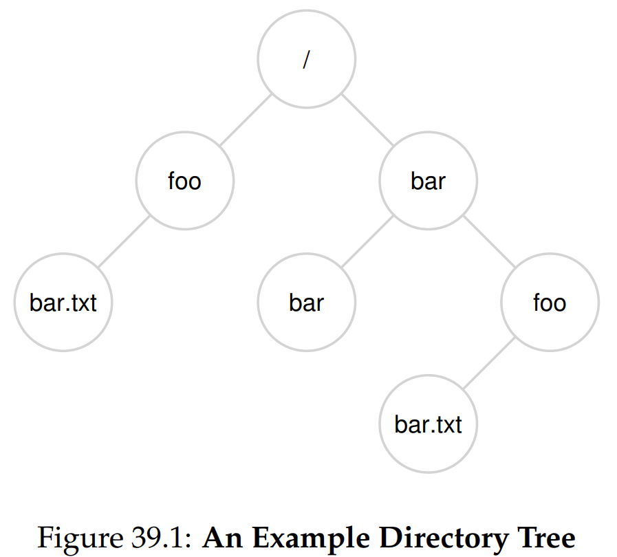
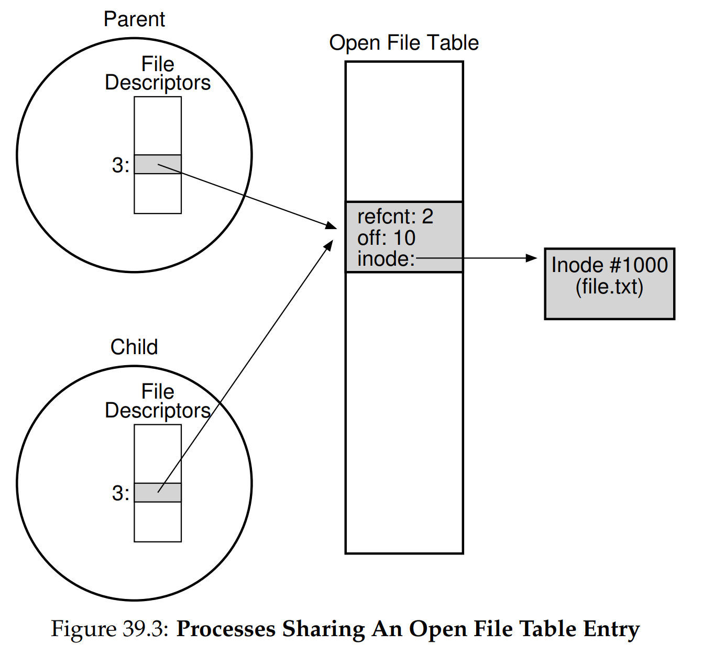

안녕하세요, pingu52입니다.

지금까지 우리는 프로세스(CPU 가상화)와 주소 공간(메모리 가상화)을 다뤘습니다. 둘 다 전원이 꺼지면 사라지는 휘발성 자원입니다. 이제 데이터를 오래 보관하기 위한 운영체제의 세 번째 축인 **영속성(Persistence)** 으로 들어갑니다.

이번 글에서는 파일 시스템 구현(Implementation)으로 들어가기 전에, 사용자 관점에서 파일 시스템을 어떻게 사용하는지, 즉 **인터페이스(API)** 를 먼저 정리합니다.

---

## 1. 파일과 디렉터리

파일 시스템은 저장 장치를 다루기 위해 두 가지 핵심 추상화를 제공합니다.

1. **파일(File)**  
   읽고 쓸 수 있는 **바이트의 선형 배열**입니다. 각 파일은 저수준 이름인 **inode 번호(i-number)** 를 갖습니다. 운영체제는 파일이 텍스트인지 이미지인지 같은 의미를 해석하지 않고, 단지 바이트를 저장하고 다시 돌려주는 역할을 수행합니다.

2. **디렉터리(Directory)**  
   사용자 친화적 이름을 inode 번호에 매핑하는 **(이름, inode 번호)** 목록을 담는 특수한 파일입니다. 디렉터리도 inode 번호를 가지며, 디렉터리 안의 엔트리는 파일 또는 다른 디렉터리를 가리킵니다. 이 엔트리들이 연결되어 전체 디렉터리 트리(계층)를 이룹니다.



확장자 `.c`, `.jpg` 같은 표기는 관례에 가깝고, 파일 시스템이 강제하지 않는 경우가 일반적입니다.

---

## 2. 파일 생성과 입출력

### 2.1 open과 file descriptor

파일을 다루려면 보통 `open()`으로 시작합니다. `O_CREAT`를 주면 파일이 없을 때 새로 만듭니다. 이때만 세 번째 인자 `mode`가 의미를 갖습니다.

```c
#include <fcntl.h>
#include <sys/stat.h>
#include <unistd.h>

int fd = open("foo",
              O_CREAT | O_WRONLY | O_TRUNC,
              S_IRUSR | S_IWUSR);
if (fd < 0) {
    /* error handling */
}
```

`open()`이 성공하면 **파일 디스크립터(file descriptor, fd)** 라는 정수를 돌려줍니다.

- fd는 **프로세스마다 독립**인 핸들입니다.
- 내부적으로는 프로세스가 가진 열린 파일 테이블(보통 fd 테이블)의 인덱스처럼 관리됩니다.
- 이후 `read()`, `write()`, `fsync()`, `close()` 같은 호출의 대상으로 사용됩니다.

많은 시스템에서 프로세스는 시작 시점에 이미 3개의 fd를 열고 있습니다.

- `0`: 표준 입력(stdin)
- `1`: 표준 출력(stdout)
- `2`: 표준 에러(stderr)

따라서 새로 `open()`한 fd가 `3`부터 시작하는 경우가 흔합니다.

:::tip
strace로 시스템 콜 확인

리눅스에서는 `strace`로 프로그램이 어떤 시스템 콜을 쓰는지 확인할 수 있습니다.
:::

```sh
strace -o trace.txt cat foo
```

---

### 2.2 read, write, close

`read(fd, buf, size)`는 파일에서 읽어 버퍼에 채우고, 실제로 읽은 바이트 수를 리턴합니다. EOF에서는 `0`을 리턴합니다.  
`write(fd, buf, size)`는 버퍼 내용을 파일에 기록하고, 실제로 쓴 바이트 수를 리턴합니다.

현실적으로는 다음을 항상 염두에 둡니다.

- `read()`/`write()`는 요청한 바이트 수보다 **적게** 처리하고 돌아올 수 있습니다.
- 실패하면 `-1`을 반환하고 원인은 `errno`로 전달됩니다.
- 따라서 일반 코드는 반환값을 확인하며 루프를 돕니다.

---

### 2.3 오프셋과 lseek

각 열린 파일은 커널이 관리하는 **현재 오프셋(current offset)** 을 갖습니다.

- `read()` 또는 `write()`로 `N`바이트를 처리하면 오프셋이 `N`만큼 증가합니다.
- 임의 접근이 필요하면 `lseek()`으로 오프셋을 바꿀 수 있습니다.

```c
#include <sys/types.h>
#include <unistd.h>

off_t off = lseek(fd, 0, SEEK_END);
if (off == (off_t) -1) {
    /* error handling */
}
```

중요한 포인트가 하나 있습니다.

- `lseek()`은 **디스크 헤드를 직접 움직이지 않습니다.**  
  단지 커널 메모리에 있는 오프셋 값을 바꿉니다.  
  다만 이후 `read()`/`write()`가 파일의 먼 위치를 건드리면, 결과적으로 디스크 수준에서는 임의 접근이 늘어 탐색과 회전 비용이 커질 수 있습니다.

---

### 2.4 오픈 파일 테이블(Open File Table)

fd는 프로세스 내부의 fd 테이블 엔트리이고, 그 엔트리가 커널의 **오픈 파일 테이블 엔트리(open file description)** 를 가리키는 형태로 구현되는 경우가 일반적입니다. 이 엔트리가 다음을 추적합니다.

- 어떤 inode를 가리키는지
- 현재 오프셋
- 접근 모드(읽기/쓰기)
- 참조 카운트(refcount)

이 구조 덕분에 같은 파일을 두 번 `open()`하면 각각 다른 오픈 파일 테이블 엔트리를 갖고, 오프셋도 독립적으로 움직입니다.

---

## 3. 열린 파일 엔트리 공유: fork와 dup

오픈 파일 테이블 엔트리는 상황에 따라 **공유**될 수 있습니다. 이때 핵심은 오프셋도 함께 공유된다는 점입니다.

### 3.1 fork는 오프셋을 공유한다

`fork()`를 하면 자식은 부모의 fd 테이블을 복사하지만, 각 fd가 가리키는 **오픈 파일 테이블 엔트리 자체는 공유**됩니다. 따라서 오프셋이 공유됩니다.

아래 코드는 그 현상을 가장 단순하게 보여줍니다.

```c
#include <assert.h>
#include <fcntl.h>
#include <stdio.h>
#include <sys/types.h>
#include <sys/wait.h>
#include <unistd.h>

int main(void) {
    int fd = open("shared.txt", O_RDONLY);
    assert(fd >= 0);

    pid_t pid = fork();
    assert(pid >= 0);

    if (pid == 0) {
        /* child: advance the shared offset */
        off_t off = lseek(fd, 10, SEEK_SET);
        assert(off == 10);
        _exit(0);
    } else {
        wait(NULL);

        /* parent: offset was changed by the child */
        off_t off = lseek(fd, 0, SEEK_CUR);
        printf("offset=%lld\n", (long long) off);
        close(fd);
    }
    return 0;
}
```



이 성질은 협력적으로 같은 파일에 순차 기록을 이어붙이는 패턴 등에서 의도적으로 활용되기도 합니다. 반대로 의도하지 않은 공유라면, 오프셋 경쟁으로 인해 결과가 뒤섞일 수 있으니 주의가 필요합니다.

### 3.2 dup, dup2도 오프셋을 공유한다

`dup(oldfd)`는 기존 fd와 같은 오픈 파일 테이블 엔트리를 가리키는 새 fd를 만듭니다. 즉, 오프셋과 상태를 공유합니다. `dup2(oldfd, newfd)`는 새 fd 번호를 지정할 수 있다는 점이 다릅니다. (PDF의 Figure 39.4가 이 포인트를 보여줍니다)

```c
#include <assert.h>
#include <fcntl.h>
#include <stdio.h>
#include <unistd.h>

int main(void) {
    int fd1 = open("shared.txt", O_RDONLY);
    assert(fd1 >= 0);

    int fd2 = dup(fd1);
    assert(fd2 >= 0);

    /* advance offset via fd1 */
    off_t a = lseek(fd1, 5, SEEK_SET);
    assert(a == 5);

    /* observe the same offset via fd2 */
    off_t b = lseek(fd2, 0, SEEK_CUR);
    printf("offset(fd2)=%lld\n", (long long) b);

    close(fd2);
    close(fd1);
    return 0;
}
```

셸의 리다이렉션이 `dup2()` 계열을 많이 사용하는 이유도 여기에 있습니다.

---

## 4. 영속성 보장: fsync

`write()`가 즉시 저장 장치에 기록되는 것은 아닙니다. 일반적으로 파일 시스템은 성능을 위해 쓰기를 메모리에 버퍼링한 뒤 나중에 내려씁니다.

즉각적인 영속성이 필요하면 `fsync(fd)`를 사용합니다.

```c
int fd = open("foo",
              O_CREAT | O_WRONLY | O_TRUNC,
              S_IRUSR | S_IWUSR);

write(fd, buffer, size);
fsync(fd);
close(fd);
```

여기서 자주 빠뜨리는 디테일이 하나 더 있습니다.

- 새 파일 생성, 이름 변경 등으로 **디렉터리 엔트리**가 바뀌면, 파일 내용만 `fsync(fd)` 해서는 부족할 수 있습니다.
- 이름이 들어 있는 **디렉터리 자체도 fsync**해야, 그 이름 변경이 영속적으로 반영되는 경우가 있습니다.

즉, 데이터와 메타데이터를 함께 영속화하려면 파일과 디렉터리까지 포함해 순서를 설계해야 합니다.

---

## 5. 이름 변경과 원자성: rename

`mv`는 내부적으로 `rename(old, new)`를 사용합니다.

```c
#include <stdio.h>

int rc = rename("old_name", "new_name");
if (rc != 0) {
    /* error handling */
}
```

`rename()`은 보통 크래시에 대해 원자적으로 구현됩니다. 크래시가 나더라도 이름은 old 또는 new 중 하나로 남고, 중간 상태가 나타나지 않는다는 성질을 기대할 수 있습니다.

이 성질을 이용한 고전적 패턴이 있습니다. 파일을 안전하게 갱신할 때는 다음처럼 합니다.

```c
#include <fcntl.h>
#include <sys/stat.h>
#include <unistd.h>

int fd = open("foo.txt.tmp",
              O_WRONLY | O_CREAT | O_TRUNC,
              S_IRUSR | S_IWUSR);

write(fd, buffer, size);
fsync(fd);
close(fd);

/* atomic name swap */
rename("foo.txt.tmp", "foo.txt");

/* for full durability, fsync the directory that contains foo.txt */
```

추가로 기억할 점도 있습니다.

- `rename()`은 같은 파일 시스템 내부에서의 원자적 변경을 전제로 합니다.
- 서로 다른 파일 시스템 간 이동은 복사 후 삭제로 구현되는 경우가 많고, 동일한 원자성을 기대하기 어렵습니다.

---

## 6. 메타데이터 읽기: stat

파일의 내용 외에 크기, 권한, 소유자, 링크 수, 시간 정보 같은 것은 메타데이터입니다. 유닉스 계열에서는 `stat()`/`fstat()`로 조회합니다.

```c
#include <stdio.h>
#include <sys/stat.h>

int main(void) {
    struct stat sb;
    if (stat("foo.txt", &sb) != 0) {
        return 1;
    }

    printf("size=%lld\n", (long long) sb.st_size);
    printf("inode=%lld\n", (long long) sb.st_ino);
    printf("nlink=%lld\n", (long long) sb.st_nlink);
    printf("mode=%o\n", (unsigned) sb.st_mode);

    return 0;
}
```

Figure 39.5는 `struct stat`의 대표 필드들을 보여줍니다. 플랫폼마다 필드 구성이 조금씩 다를 수 있지만, 핵심은 비슷합니다.

```c
/* simplified view of struct stat (fields vary by platform) */
struct stat {
    dev_t     st_dev;     /* ID of device containing file */
    ino_t     st_ino;     /* inode number */
    mode_t    st_mode;    /* file type + permission bits */
    nlink_t   st_nlink;   /* hard link count */
    uid_t     st_uid;     /* user ID of owner */
    gid_t     st_gid;     /* group ID of owner */
    off_t     st_size;    /* total size, bytes */
    time_t    st_atime;   /* last access time */
    time_t    st_mtime;   /* last modification time */
    time_t    st_ctime;   /* last status change time */
};
```

---

## 7. 파일 삭제가 unlink인 이유

유닉스에서 파일 삭제는 `delete()`가 아니라 `unlink(path)`입니다. 이유는 파일이 실제로는 두 가지로 구성되기 때문입니다.

- inode: 파일 메타데이터와 데이터 블록을 가리키는 저수준 구조
- 디렉터리 엔트리: 사람이 읽는 이름을 inode 번호에 연결하는 링크

즉 삭제는 이름과 inode의 연결을 끊는 작업이며, 그래서 unlink입니다.

### 7.1 하드 링크와 링크 카운트

`link()` 또는 `ln`은 동일 inode를 가리키는 이름을 하나 더 만듭니다.

```sh
ln file file2
```

이때 `file`과 `file2`는 inode 번호가 같습니다. 파일 시스템은 inode 안에 **링크 카운트(nlink)**를 유지합니다.

- `unlink()`는 디렉터리 엔트리를 제거하고 링크 카운트를 1 줄입니다.
- 링크 카운트가 0이 되는 시점에야 inode와 데이터 블록이 해제됩니다.

추가로, 어떤 프로세스가 그 파일을 이미 열어두고 있다면 링크 카운트가 0이 되어도 마지막 fd가 닫힐 때까지 실제 데이터는 남아 있을 수 있습니다.

---

## 8. 디렉터리 API

### 8.1 mkdir, 그리고 . 과 ..

`mkdir()`로 디렉터리를 만듭니다. 빈 디렉터리에도 최소한 두 엔트리가 있습니다.

- `.`: 자기 자신
- `..`: 부모 디렉터리

### 8.2 디렉터리는 직접 write 할 수 없음

디렉터리도 파일이지만, 일반 파일처럼 `write()`로 내용을 직접 바꿀 수는 없습니다. 디렉터리 형식은 파일 시스템 메타데이터이며, 무결성을 위해 파일 시스템이 직접 관리해야 하기 때문입니다. 파일을 만들거나 지우는 식으로 간접적으로만 갱신됩니다.

### 8.3 읽기: opendir, readdir, closedir

디렉터리 내용을 읽을 때는 다음 API를 씁니다.

```c
#include <dirent.h>
#include <stdio.h>

int main(void) {
    DIR *dp = opendir(".");
    if (!dp) return 1;

    struct dirent *d;
    while ((d = readdir(dp)) != NULL) {
        printf("%lu %s\n",
               (unsigned long) d->d_ino,
               d->d_name);
    }
    closedir(dp);
    return 0;
}
```

디렉터리 엔트리는 이름과 inode 번호를 포함하고, 더 많은 정보가 필요하면 각 엔트리에 대해 `stat()`을 호출하는 방식이 흔합니다.

### 8.4 삭제: rmdir

디렉터리 삭제는 `rmdir()`이며, 안전을 위해 **비어 있는 디렉터리만** 지울 수 있습니다. 비어 있다는 것은 엔트리가 `.`와 `..`만 남아 있다는 뜻입니다.

---

## 9. 심볼릭 링크

심볼릭 링크는 하드 링크의 제약을 풀기 위해 도입된 별도 파일 타입입니다.

- 심볼릭 링크 자체가 inode를 가지는 파일입니다.
- 링크 파일의 내용으로 대상 경로 문자열을 저장합니다.
- 대상이 삭제되면 링크는 깨진 경로를 가리키는 dangling 상태가 됩니다.

하드 링크는 일반적으로 다음 제약이 있습니다.

- 디렉터리에 하드 링크를 만들 수 없음(디렉터리 트리에 사이클이 생길 위험)
- 다른 파일 시스템 파티션을 가로질러 하드 링크를 만들 수 없음(inode 번호는 파일 시스템 내부에서만 유일)

심볼릭 링크는 이런 제약을 피해갈 수 있지만, 대신 dangling 문제를 갖습니다.

---

## 10. 권한 비트와 ACL

유닉스는 파일을 공유하는 시스템이므로 접근 제어가 필요합니다.

### 10.1 권한 비트

`ls -l`로 보면 `-rw-r--r--` 같은 문자열이 나옵니다.

- 첫 글자: 파일 타입(`-` 일반 파일, `d` 디렉터리, `l` 심볼릭 링크 등)
- 다음 9글자: 소유자, 그룹, 기타에 대한 읽기/쓰기/실행 권한

`chmod 600 foo.txt`는 소유자만 읽기/쓰기를 허용합니다.

디렉터리에서 실행 비트는 의미가 다릅니다. 디렉터리에 대한 실행 권한은 그 디렉터리로 `cd`하거나, 경로 탐색을 할 수 있는 권한과 밀접합니다.

### 10.2 superuser와 ACL

로컬 파일 시스템에서는 root 같은 superuser가 모든 파일에 접근할 수 있는 경우가 많습니다. 더 정교한 제어가 필요한 시스템은 디렉터리 단위의 **ACL(Access Control List)** 같은 메커니즘을 제공하기도 합니다.

---

## 11. 파일 시스템 만들기와 마운트

디스크 파티션을 파일 시스템으로 초기화하려면 `mkfs` 계열 도구를 사용합니다. 그리고 그 파일 시스템을 현재 디렉터리 트리의 한 지점에 붙이는 작업이 `mount`입니다.

```sh
mount -t ext3 /dev/sda1 /home/users
```

마운트 이후에는 `/home/users`가 새 파일 시스템의 루트가 됩니다. 이 방식 덕분에 여러 종류의 파일 시스템(ext 계열, proc, sysfs, tmpfs, 네트워크 FS 등)을 하나의 트리로 통합해 일관된 이름 체계를 제공합니다.

---

## 12. 보안 관점 덤: TOCTTOU

파일을 검사한 뒤 사용하기까지 시간 간격이 있으면, 그 사이 공격자가 대상을 바꿔치기할 수 있습니다. 이를 TOCTTOU(time of check to time of use) 문제라고 부릅니다.

파일을 열 때 플래그를 적절히 사용하고, 가능하면 경로 기반 검사보다 fd 기반 검사를 선호하는 방식으로 위험을 줄일 수 있습니다.

---

## 13. 요약

- **파일**은 바이트 배열이며, 저수준 이름으로 **inode 번호**를 갖습니다.
- **디렉터리**는 (이름, inode 번호) 매핑 목록이며 트리를 이룹니다.
- fd는 프로세스별 핸들이고, 커널의 **오픈 파일 테이블 엔트리**를 가리킵니다. 오프셋은 그 엔트리에 저장됩니다.
- `fork()`와 `dup()`는 오픈 파일 테이블 엔트리를 공유하여 오프셋도 공유합니다.
- `fsync()`는 영속성을 강제하지만, 디렉터리까지 포함해 올바르게 쓰는 것이 중요합니다.
- `rename()`은 원자적 교체 패턴의 핵심 빌딩 블록입니다.
- `unlink()`는 이름과 inode의 연결을 끊는 호출이며, 링크 카운트가 0이 될 때 실제 해제가 발생합니다.
- 권한 비트와 ACL은 공유 환경에서 접근 제어를 제공합니다.
- `mkfs`와 `mount`는 여러 파일 시스템을 하나의 트리로 합칩니다.

다음 장부터는 이런 추상화가 디스크 위에 어떻게 구현되는지(VSFS 등)를 살펴봅니다.

---

## 14. 용어 정리

- `inode (i-number)`: 파일의 메타데이터와 데이터 블록 위치를 담는 영속 구조
- `file descriptor (fd)`: 열린 파일을 가리키는 프로세스별 정수 핸들
- `open file table`: 열린 파일의 상태(오프셋, 권한, 참조 카운트 등)를 추적하는 커널 자료구조
- `offset`: 다음 `read`/`write`가 시작될 파일 내 위치
- `lseek`: 오프셋을 재설정하는 시스템 콜(자체로 디스크 I/O를 수행하지 않음)
- `unlink`: 디렉터리 엔트리를 제거해 이름과 inode의 연결을 끊는 시스템 콜
- `hard link`: 동일 inode를 가리키는 또 다른 이름
- `symbolic link`: 경로 문자열을 담는 별도 파일 타입의 링크
- `fsync`: 더티 데이터를 저장 장치로 강제 플러시하는 시스템 콜
- `rename`: 크래시에 대해 원자적으로 이름을 교체하는 시스템 콜
- `mkfs`, `mount`: 파일 시스템 생성과 트리 결합

---

## Reference

- [Operating Systems: Three Easy Pieces - Chapter 39: Interlude: Files and Directories](https://pages.cs.wisc.edu/~remzi/OSTEP/file-intro.pdf)
