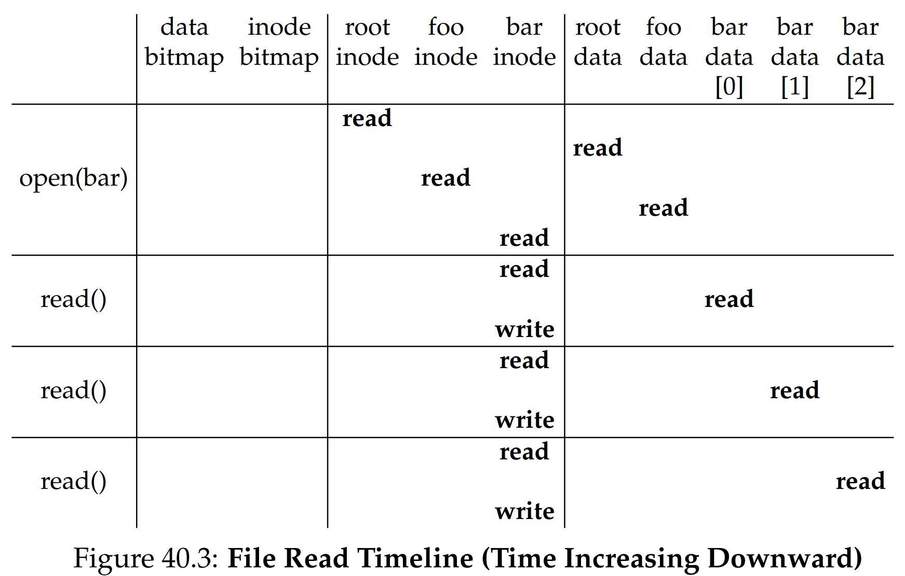
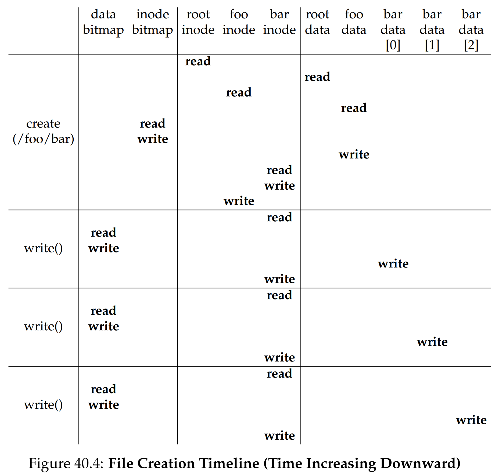

안녕하세요, pingu52입니다.

지난 장에서 우리는 `open`, `read`, `write`, `fsync` 같은 파일 시스템 API를 사용자 관점에서 정리했습니다. 이번 장에서는 한 단계 내려가서, 운영체제가 그 API들을 **디스크 위의 어떤 자료구조**로 구현하고, 각 시스템콜이 **어떤 블록을 어떤 순서로** 읽고 쓰는지 추적합니다.

OSTEP는 이를 위해 **VSFS(Very Simple File System)** 라는 학습용 파일 시스템을 사용합니다. VSFS는 단순하지만, 아래 감각을 한 번에 잡게 해줍니다.

- 메타데이터가 어디에 놓이고, 왜 그 배치가 중요한가
- free space를 왜 별도 자료구조로 관리하는가
- i-number 하나로 inode 위치를 계산하는 방식
- 경로 탐색과 메타데이터 갱신 때문에 I/O가 왜 폭증하는가
- 이 비용을 줄이기 위해 캐싱과 버퍼링이 왜 필수인가

---

## 1. 파일 시스템을 보는 두 축

파일 시스템을 이해하는 가장 좋은 정신 모델은 두 축입니다.

### 1.1 온디스크 자료구조

디스크를 블록 배열로 보고, 그 위에 **데이터와 메타데이터**를 어떤 구조로 올릴지 정합니다.

- 파일 데이터는 어디에 두는가
- inode 같은 메타데이터는 어디에 두는가
- 어떤 블록이 free인지 누가 추적하는가

### 1.2 접근 경로

`open()`, `read()`, `write()` 요청이 들어오면 **어떤 블록들을 어떤 순서로** 접근하는지 따져봅니다.

이 장의 핵심은 1.2입니다. 사용자 데이터보다 **메타데이터 I/O가 먼저 터지는 구조**가 흔하고, 그게 파일 시스템 성능을 지배합니다.

---

## 2. VSFS의 전체 레이아웃

VSFS는 디스크를 블록 단위로 쪼갠 뒤, 블록 배열 위에 파일 시스템 자료구조를 배치합니다. 예시에서 블록 크기는 $$B_{\mathrm{blk}} = 4\,\mathrm{KiB}$$ 입니다.

### 2.1 장난감 파티션: 64 blocks

파티션 크기를 **64 블록**으로 두면, 블록 주소는 0부터 63까지입니다. VSFS는 마지막 56블록을 data region으로 사용합니다.

- data region: 블록 8–63 (총 56블록)

앞부분은 메타데이터용으로 고정 배치합니다.

| 구역 | 블록 범위 | 역할 |
|---|---:|---|
| superblock | 0 | 전체 메타정보, magic |
| inode bitmap | 1 | inode 할당 여부 |
| data bitmap | 2 | 데이터 블록 할당 여부 |
| inode table | 3–7 | inode 배열 |
| data region | 8–63 | 파일, 디렉터리 데이터 |

이 표가 이후 타임라인(그림 40.3, 40.4)을 이해하는 좌표계입니다.

### 2.2 inode table

파일마다 inode가 하나씩 필요합니다. VSFS는 inode들을 디스크에 **배열**로 저장하며, 이 영역을 inode table이라 부릅니다.

- inode 크기 $$B_{\mathrm{inode}} = 256\,\mathrm{B}$$
- 한 블록(4KiB)에 들어가는 inode 개수

$$
N_{\mathrm{ipb}} = \frac{B_{\mathrm{blk}}}{B_{\mathrm{inode}}}
= \frac{4096}{256} = 16
\tag{1}
$$

inode table을 5블록(블록 3–7)으로 잡으면 총 inode 수는 $$5 \times 16 = 80$$ 입니다. 즉, 이 파티션에서 만들 수 있는 파일 수의 상한도 대략 80개입니다.

### 2.3 free space 추적: bitmap 2개

파일을 만들고 블록을 할당하려면, 어떤 inode나 데이터 블록이 free인지 알아야 합니다. VSFS는 bitmap을 씁니다.

- inode bitmap: 블록 1
- data bitmap: 블록 2

각 비트가 0이면 free, 1이면 in-use입니다. 예시 규모에서는 bitmap이 과하게 크지만, 단순화를 위해 bitmap을 블록 하나로 통째로 둡니다.

### 2.4 superblock

남은 블록 0은 superblock입니다.

- inode 수, data 블록 수
- inode table 시작 블록 번호
- data region 시작 블록 번호
- 파일 시스템 식별용 magic number 등

마운트 시 운영체제는 superblock을 먼저 읽고, 이후 필요한 온디스크 구조를 정확히 찾아갈 수 있게 됩니다.

---

## 3. inode: 파일의 핵심 메타데이터

inode는 파일 이름을 제외한 대부분의 메타데이터를 담는 구조입니다.

- 권한, 소유자, 시간 정보
- 크기
- 데이터 블록 위치(포인터)
- 링크 수 등

### 3.1 i-number로 inode 위치 계산하기

inode는 디스크의 inode table에 배열로 저장됩니다. 따라서 i-number $$i$$ 만 알면 inode 위치를 계산할 수 있습니다.

inode table 시작 블록을 $$b_{\mathrm{it}}$$, 블록당 inode 수를 $$N_{\mathrm{ipb}}$$ 라 두면, i-number $$i$$ 의 inode가 들어있는 블록과 블록 내 오프셋은

$$
b(i) = b_{\mathrm{it}} + \left\lfloor \frac{i}{N_{\mathrm{ipb}}} \right\rfloor,\qquad
o(i) = i \bmod N_{\mathrm{ipb}}
\tag{2}
$$

입니다.

이 식이 의미하는 바는 단순합니다.

- pathname 탐색으로 i-number만 알아내면
- inode table에서 그 inode를 읽어오는 위치는 계산으로 결정된다

즉, i-number는 파일 시스템 내부에서 inode를 가리키는 안정적인 핸들입니다.

### 3.2 multi-level index: direct + indirect

inode 설계의 핵심 결정 중 하나는 데이터 블록을 어떻게 가리키는가입니다.

- direct pointer: 데이터 블록을 직접 가리킴
- indirect pointer: 포인터 배열 블록을 가리킴

VSFS 예시는 아래 구조를 사용합니다.

- direct pointer 12개
- single indirect pointer 1개

블록 크기 $$B_{\mathrm{blk}} = 4\,\mathrm{KiB}$$, 포인터 크기 $$B_{\mathrm{ptr}} = 4\,\mathrm{B}$$ 이면, 간접 블록 하나가 담는 포인터 수는

$$
N_{\mathrm{ptr}} = \frac{B_{\mathrm{blk}}}{B_{\mathrm{ptr}}}
= \frac{4096}{4} = 1024
\tag{3}
$$

따라서 single indirect까지 포함한 최대 파일 크기는

$$
B_{\max}
= (12 + 1024)\cdot 4\,\mathrm{KiB}
= 4144\,\mathrm{KiB}
\tag{4}
$$

입니다.

double, triple indirect는 더 큰 파일을 지원하기 위한 일반화지만, 이 장의 VSFS 예시는 single indirect만으로도 포인터 계층의 핵심을 충분히 보여줍니다.

---

## 4. 디렉터리도 파일이다

VSFS에서 디렉터리는 특별한 타입의 파일입니다.

- 디렉터리 inode는 inode table에 있음
- 디렉터리 데이터 블록은 data region에 있음
- 데이터 블록 내용은 name → i-number 매핑 리스트

VSFS의 디렉터리 엔트리는 `inum`, `reclen`, `strlen`, `name` 같은 필드로 표현되며, 각 디렉터리는 항상 `.` 과 `..` 엔트리를 포함합니다.

VSFS 같은 단순 설계에서는 디렉터리 엔트리를 선형 검색합니다. 따라서 디렉터리가 커질수록 경로 탐색 비용이 증가합니다.

---

## 5. Access Path: open, read, write가 만드는 I/O

이제 진짜 핵심입니다. 아래 표들은 **캐시가 비어있는 최악 조건**을 가정한 I/O 카운트입니다.

- page cache, inode cache가 비어있음
- 필요한 메타데이터는 디스크에서 직접 읽어야 함
- atime 갱신이 켜져 있어 `read()`가 inode write를 유발할 수 있음
- 디렉터리 데이터가 예시처럼 1블록에 들어간다고 가정

현실 시스템에서는 캐시 hit, atime 정책, read-ahead 등에 의해 I/O는 크게 줄어들 수 있지만, 접근 경로 자체는 그대로입니다.

---

### 5.1 읽기: `/foo/bar`를 open하고 12 KiB를 read

Figure 40.3은 `/foo/bar`를 `open(O_RDONLY)` 후 3블록(12 KiB)을 읽는 타임라인입니다.

#### 5.1.1 open에서 경로 탐색이 만든 read 누적

`open`은 pathname을 따라 내려가며 inode와 디렉터리 데이터를 읽습니다.

- 모든 traversal은 루트 디렉터리에서 시작
- 루트는 부모가 없으므로 루트 inode 번호는 파일 시스템이 마운트 시점에 알고 있어야 함
- 많은 UNIX 계열에서 루트 inode 번호는 2

따라서 `/foo/bar`를 열기 위해, 대략 아래 블록 read가 누적됩니다.

- 루트 inode read
- 루트 디렉터리 데이터 read
- `foo` inode read
- `foo` 디렉터리 데이터 read
- `bar` inode read

pathname 레벨이 하나 늘 때마다 최소 inode 1회 + 디렉터리 데이터 1회 read가 추가된다고 보면 됩니다.

#### 5.1.2 read는 bitmap을 보지 않는다

단순 읽기는 allocation 구조(bitmap)를 보지 않습니다. bitmap은 **할당이 필요할 때만** 접근됩니다.

#### 5.1.3 I/O 카운트 요약표

| 시스템콜 | 디스크 I/O 구성 | 읽기 횟수 | 쓰기 횟수 | 합계 |
|---|---|---:|---:|---:|
| `open(/foo/bar)` | 루트 inode + 루트 dir data + foo inode + foo dir data + bar inode | 5 | 0 | 5 |
| `read()` 1회 (블록 1개) | bar inode read + data block read + bar inode write (atime) | 2 | 1 | 3 |
| `read()` 3회 (총 12 KiB) | 위 패턴 반복 | 6 | 3 | 9 |
| **전체** | open + read(3 blocks) | **11** | **3** | **14** |

핵심은 하나입니다.

- 데이터 3블록을 읽는 작업에서, 데이터 I/O(3 reads)보다 메타데이터 I/O가 더 많아질 수 있음

---

### 5.2 생성과 쓰기: create + 4 KiB write 3회

Figure 40.4는 `/foo/bar`를 생성하고 4 KiB write를 3번 수행하는 타임라인입니다.

#### 5.2.1 create 자체가 이미 무겁다

파일 생성은 아래를 동시에 해야 합니다.

- 새 inode 할당
- 부모 디렉터리에 엔트리 추가
- 부모 디렉터리 inode 갱신

디렉터리가 커져서 새 데이터 블록이 필요해지면, data bitmap 갱신까지 추가됩니다.

#### 5.2.2 Figure 40.4 create 10 I/O를 표로 쪼개기

그림 40.4에서 `create(/foo/bar)`는 총 10 I/O를 유발합니다. 타임라인을 그대로 분해하면 다음처럼 정리됩니다.

##### A. 경로 탐색: `/foo`까지 내려가기

| 순서 | 대상 | I/O | 읽기 | 쓰기 |
|---:|---|---|---:|---:|
| 1 | 루트 inode | read | 1 | 0 |
| 2 | 루트 dir data | read | 1 | 0 |
| 3 | `foo` inode | read | 1 | 0 |
| 4 | `foo` dir data | read | 1 | 0 |
| 소계 |  |  | 4 | 0 |

##### B. create 메타데이터 갱신

| 순서 | 대상 | I/O | 읽기 | 쓰기 |
|---:|---|---|---:|---:|
| 5 | inode bitmap | read | 1 | 0 |
| 6 | inode bitmap | write | 0 | 1 |
| 7 | `foo` dir data | write (엔트리 추가) | 0 | 1 |
| 8 | `foo` inode | write (디렉터리 inode 갱신) | 0 | 1 |
| 9 | `bar` inode block | read | 1 | 0 |
| 10 | `bar` inode block | write (RMW로 새 inode 초기화) | 0 | 1 |
| 소계 |  |  | 2 | 4 |

따라서 create 전체는

- 읽기 6회
- 쓰기 4회
- 합계 10회

로 정리됩니다.

여기서 자주 놀라는 부분이 하나 있습니다.

- `bar` inode는 아직 초기화도 안 됐는데 read가 왜 있는가

이는 inode가 작고(예: 256B), inode들이 더 큰 블록(예: 4KiB) 안에 같이 들어있기 때문입니다. 새 inode만 바꾸려면 블록 단위로 read-modify-write가 필요하고, 그 read가 타임라인에 나타납니다.

#### 5.2.3 allocating write 1회는 5 I/O

이제 파일에 새 블록을 할당하며 쓰는 allocating write는 논리적으로 **5 I/O**입니다.

| 순서 | 갱신 대상 | I/O |
|---:|---|---|
| 1 | data bitmap | read |
| 2 | data bitmap | write |
| 3 | 파일 inode | read |
| 4 | 파일 inode | write |
| 5 | 데이터 블록 | write |

Figure 40.4의 `write()` 3회는 이 패턴이 그대로 3번 반복됩니다.

#### 5.2.4 전체 합산

| 작업 | 합계 I/O |
|---|---:|
| create | 10 |
| allocating write 3회 | 15 |
| **전체** | **25** |

이 수치가 말하는 바는 단순합니다.

- 사용자 데이터 12 KiB를 쓰는 작업이 메타데이터 갱신 때문에 **25회의 디스크 I/O**를 만들 수 있음
- 이것이 파일 시스템에서 흔히 말하는 **write traffic 증가**, **write amplification**의 출발점

---

## 6. 느린 디스크를 버티는 방법: caching과 buffering

디스크 I/O는 느립니다. 그래서 파일 시스템은 DRAM을 적극 활용합니다.

### 6.1 읽기 캐싱: unified page cache

캐싱이 없다면, pathname 레벨이 하나 늘 때마다 open에 최소 2 reads가 더 필요합니다.

- 디렉터리 inode read
- 디렉터리 data read

과거에는 파일 시스템 캐시를 메모리의 일정 비율(예: 대략 10퍼센트)로 고정해 두는 방식도 있었지만, 이는 유휴 캐시 페이지를 다른 용도로 재사용하기 어렵습니다.

현대 OS는 VM 페이지와 파일 시스템 페이지를 통합한 **unified page cache**로 동적으로 분배합니다. 그 결과, 자주 접근되는 inode와 디렉터리 데이터가 메모리에 남아, 5장의 메타데이터 read 폭탄을 크게 줄일 수 있습니다.

### 6.2 쓰기 버퍼링: 지연 쓰기

read는 캐시로 완전히 필터링될 수 있지만, write는 영속성을 위해 결국 디스크로 가야 합니다. 다만 파일 시스템은 쓰기를 즉시 내리지 않고 버퍼링합니다.

- batching: 작은 업데이트를 모아 I/O 감소
- scheduling: 더 좋은 순서로 디스크 I/O 배치
- avoidance: 곧바로 생성됐다가 삭제되는 데이터는 디스크 기록 자체를 피할 수 있음

대신 크래시 시 유실 가능성이 있으므로, 영속성이 필요하면 `fsync()`가 필요합니다. 많은 시스템이 수 초에서 수십 초 단위로 쓰기를 지연시키는 이유도 이 트레이드오프 때문입니다.

---

## 7. 요약

- 파일 시스템은 **온디스크 자료구조**와 **접근 경로**로 보면 가장 빠르게 이해됩니다.
- VSFS는 superblock, inode bitmap, data bitmap, inode table, data region으로 디스크를 구성합니다.
- inode는 i-number로 위치를 계산할 수 있고, direct 및 indirect 포인터로 큰 파일을 지원합니다.
- `open`은 pathname traversal 때문에 메타데이터 read를 누적시킵니다.
- `read`는 데이터 블록 I/O 외에 정책에 따라 inode write(atime)를 동반할 수 있습니다.
- create는 경로 탐색 + inode 할당 + 디렉터리 갱신이 겹쳐 매우 비쌉니다.
- allocating write 1회는 data bitmap과 inode 갱신 때문에 **5 I/O**를 만들 수 있습니다.
- 이를 줄이기 위해 unified page cache와 write buffering이 사실상 필수입니다.

---

## Reference

- [Operating Systems: Three Easy Pieces - Chapter 40: File System Implementation](https://pages.cs.wisc.edu/~remzi/OSTEP/file-implementation.pdf)
