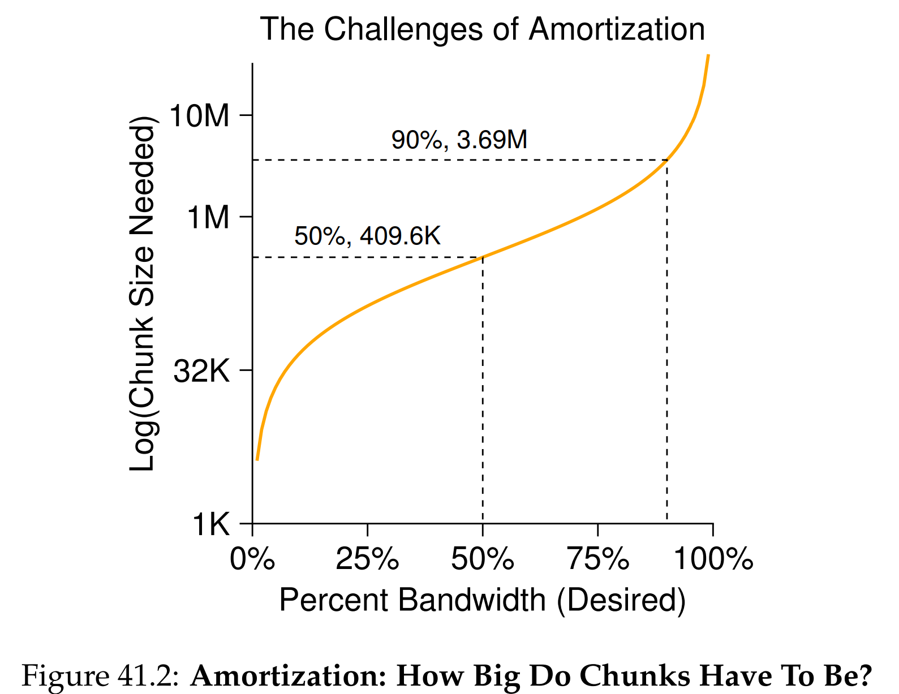

안녕하세요, pingu52입니다.

이전 장에서 우리는 아주 단순한 파일 시스템인 `VSFS`를 통해 파일 시스템의 기본 구조를 배웠습니다. 초기 유닉스 파일 시스템(Old UNIX)도 큰 틀에서는 비슷했습니다. 하지만 치명적인 문제가 있었습니다. **너무 느렸다**는 점입니다.

당시 측정 결과는 디스크 대역폭의 **약 2%** 만 활용하는 수준이었습니다. 원인은 단순합니다. 파일 시스템이 디스크를 메모리처럼 취급하면서 데이터와 메타데이터를 디스크 전체에 흩뿌려 두었고, 그 결과 **지역성(Locality)** 이 무너졌습니다.

이번 글에서는 이를 해결하기 위해 **디스크의 물리적 비용(Seek, Rotation)을 의식**하고 설계한 **FFS(Fast File System)** 를 정리합니다.

---

## 1. 문제의 본질: 디스크는 메모리가 아니다

디스크 I/O 비용은 보통 다음 세 항으로 쪼개 생각합니다.

$$
T_{\mathrm{io}} = T_{\mathrm{seek}} + T_{\mathrm{rot}} + T_{\mathrm{xfer}}
\tag{1}
$$

- $T_{\mathrm{seek}}$: 헤드 이동 시간
- $T_{\mathrm{rot}}$: 원하는 섹터가 헤드 아래로 올 때까지의 회전 지연
- $T_{\mathrm{xfer}}$: 실제 전송 시간

초기 유닉스 파일 시스템이 느렸던 이유는, **작은 전송량을 위해서도 $T_{\mathrm{seek}} + T_{\mathrm{rot}}$를 반복해서 지불**하도록 데이터가 배치되었기 때문입니다.

### 1.1 옛날 유닉스 파일 시스템의 구조적 문제

초기 파일 시스템은 대략 다음처럼 단순 배치였습니다.

- superblock
- inode 영역
- data 영역

이 설계가 만들어낸 문제는 대표적으로 아래 세 가지입니다.

1. **긴 탐색 거리**
   inode와 데이터가 물리적으로 멀리 떨어지기 쉬워, 파일을 읽을 때 메타데이터 접근과 데이터 접근 사이에 seek가 자주 발생합니다.

2. **단편화(Fragmentation)**
   free list 기반의 거친 관리로 연속 할당이 깨지기 쉽고, 순차 읽기조차 중간중간 seek를 유발합니다.

3. **작은 블록 크기**
   512B 같은 작은 블록은 전송 효율이 낮고, 같은 파일을 읽어도 더 많은 I/O를 발생시켜 $T_{\mathrm{seek}} + T_{\mathrm{rot}}$ 비중을 키웁니다.

이제 목표는 명확합니다.

- **관련 있는 것들을 물리적으로 가깝게 두어** $T_{\mathrm{seek}}$와 $T_{\mathrm{rot}}$를 줄인다
- 전송 단위를 키워 $T_{\mathrm{xfer}}$가 지배하도록 만든다

---

## 2. 해결책: 실린더 그룹(Cylinder Group)

FFS의 핵심 아이디어는 디스크를 **실린더 그룹(Cylinder Group)** 으로 나누는 것입니다. 현대 파일 시스템의 **block group**과 유사한 개념입니다.

각 실린더 그룹은 작은 파일 시스템처럼 필요한 메타데이터와 데이터 영역을 함께 포함합니다.

- superblock의 복사본(또는 요약 정보)
- inode bitmap, data bitmap
- inode table
- data blocks

**핵심 요약**  
FFS는 파일을 구성하는 메타데이터(inode)와 데이터 블록을 **가능한 한 같은 그룹 안에** 배치해, 긴 seek를 줄이고 지역성을 살립니다.

---

## 3. 성능을 결정하는 핵심: 배치 정책(Allocation Policy)

실린더 그룹만 나눠놓고 아무렇게나 할당하면 의미가 없습니다. FFS의 성능은 어떤 그룹에 무엇을 둘지 결정하는 **정책**에서 나옵니다.

### 3.1 디렉터리 배치: 분산을 통해 균형을 만든다

디렉터리는 파일들의 부모입니다. 디렉터리가 한 그룹에 몰리면, 그 그룹은 곧 inode와 데이터 블록이 부족해져서 이후 파일들이 다른 그룹으로 밀려나고 지역성이 깨집니다.

따라서 FFS는 디렉터리를 **분산**시키는 정책을 택합니다.

- 디렉터리 수가 상대적으로 적고
- free inode가 많은 그룹을 선호

이것은 단순히 디렉터리를 흩뿌리는 것이 아니라, 미래의 파일 생성까지 고려한 **load balancing**입니다.

### 3.2 파일 배치: 부모 디렉터리와 가깝게 둔다

파일은 보통 다음 패턴으로 접근됩니다.

- 디렉터리 탐색으로 inode를 찾고
- inode를 읽은 뒤
- 그 inode가 가리키는 데이터 블록을 읽는다

즉, 메타데이터와 데이터는 함께 움직입니다. 그래서 FFS는 다음을 기본 규칙으로 둡니다.

- 파일 inode는 **부모 디렉터리와 같은 그룹**에 둔다
- 파일 데이터 블록은 **그 inode와 같은 그룹**에 두고, 가능하면 연속적으로 배치한다

이 정책은 디렉터리 워크로드(`ls`, 디렉터리 아래 파일들 연속 접근)와 파일 열기 워크로드(open 후 read)를 동시에 개선합니다. 이것이 FFS가 말하는 **공간 지역성(Spatial Locality)** 입니다.

---

## 3.3 워크로드 시나리오로 보는 정책 효과

정책의 가치는 워크로드에서 드러납니다. 아래 두 시나리오를 보면 왜 FFS가 디렉터리와 파일을 다르게 다루는지 감각이 잡힙니다.

### 3.3.1 시나리오 A: ls -la 같은 메타데이터 중심 워크로드

`ls -la`는 단순히 디렉터리 엔트리 목록만 읽는 것이 아니라, 각 파일의 권한, 소유자, 시간 등을 보여주기 위해 inode를 대량으로 읽습니다.

- 디렉터리 데이터 블록을 읽고
- 각 엔트리의 inode를 따라가며 메타데이터를 읽는다

이때 inode들이 디렉터리와 멀리 흩어져 있으면, inode마다 seek가 유발되어 $T_{\mathrm{seek}} + T_{\mathrm{rot}}$가 반복됩니다.

FFS의 기본 규칙은 여기서 효과가 큽니다.

- 부모 디렉터리와 같은 그룹에 파일 inode를 배치
- 결과적으로 한 디렉터리의 inode들이 같은 그룹 근처에 모임
- inode read가 더 연속적으로 진행되어 seek가 줄어듦

즉, ls -la는 파일 데이터가 아니라 **메타데이터 지역성**에서 이득을 봅니다.

### 3.3.2 시나리오 B: open 후 read 같은 데이터 중심 워크로드

일반적인 파일 열기 패턴은 다음 순서를 가집니다.

- 디렉터리 탐색으로 inode를 찾고
- inode를 읽고
- 데이터 블록을 읽는다

inode와 데이터가 서로 멀면, open 직후 read에서 바로 큰 seek가 발생합니다. FFS는 다음을 보장하려 합니다.

- inode와 데이터 블록을 같은 그룹에 배치
- 가능하면 데이터 블록을 연속 배치

따라서 작은 파일이 많은 워크로드에서, inode 접근과 데이터 접근이 물리적으로 가까워져 open-read 경로가 빨라집니다.

### 3.3.3 시나리오 C: create 폭탄, 예를 들어 untar, 빌드 트리 생성

압축 해제나 빌드처럼 다음 작업이 반복되는 워크로드가 있습니다.

- 디렉터리 생성
- 작은 파일 다량 생성
- 같은 디렉터리 아래에 파일이 쏟아짐

만약 디렉터리를 한 그룹에 몰아두면, 그 그룹은 빠르게 고갈되고 다음 문제가 생깁니다.

- 디렉터리와 파일 inode, 데이터가 서로 다른 그룹으로 튐
- 같은 디렉터리 아래 파일인데도 locality가 깨짐
- 결과적으로 나중에 그 디렉터리를 스캔할 때 seek가 폭증

그래서 FFS는 디렉터리를 분산해 그룹별로 균형을 만들고, 그 위에 파일을 디렉터리 근처로 붙이는 전략을 택합니다.

---

## 4. 예외 처리: 대용량 파일(Large Files)

위 규칙을 그대로 적용하면, 거대한 파일 하나가 어떤 실린더 그룹의 data blocks를 대부분 소비해버릴 수 있습니다. 그러면 그 그룹에는 이후 파일을 위한 공간이 부족해져, 다른 파일들이 먼 그룹으로 밀려나고 지역성이 무너집니다.

그래서 FFS는 **대용량 파일 예외**를 둡니다.

- 작은 파일은 한 그룹 안에 최대한 묶어 locality를 얻고
- 충분히 큰 파일은 어느 시점부터 **다른 그룹으로 분산**한다

여기서 중요한 것은 분산의 단위입니다. 너무 자주 그룹을 바꾸면 $T_{\mathrm{seek}}$가 폭증합니다. 따라서 FFS는 일정 크기 이상의 **청크(chunk)** 단위로 옮겨가며, 아래 조건이 만족되도록 설계합니다.

$$
T_{\mathrm{xfer}}(\text{chunk})
\gg
T_{\mathrm{seek}} + T_{\mathrm{rot}}
\tag{2}
$$

즉, 한 번 이동했으면 충분히 오래 순차 전송을 해서, 이동 비용을 상각(amortize)해야 합니다.

---

## 4.1 상각 관점에서의 청크 크기

FFS 문맥에서 청크 크기를 직관적으로 잡아보는 데 도움이 되는 그림이 PDF의 Figure 41.2입니다.

그림이 말하는 직관은 다음입니다.

- 원하는 대역폭이 peak에 가까울수록 필요한 청크 크기는 로그 스케일로 커진다
- 단지 약간 더 높은 효율을 얻기 위해 청크 크기가 급격히 커질 수 있다

---

## 5. 기타 개선 사항

### 5.1 큰 블록과 작은 파일: fragments

블록을 크게 잡으면 순차 전송 효율은 좋아지지만, 작은 파일에서 내부 단편화가 커집니다. 예를 들어 4KiB 블록에 1KiB 파일을 저장하면 3KiB가 낭비됩니다.

FFS는 이를 완화하기 위해 **fragments**를 도입합니다.

- 큰 단위로는 4KiB 블록을 사용해 전송 효율을 얻고
- 작은 파일은 더 작은 fragment 단위(예: 512B)로 저장해 공간 낭비를 줄인다
- 파일이 커지면 fragment들을 모아 full block으로 승격시키는 방식으로 관리한다

이로써 성능과 공간 효율 사이의 트레이드오프를 완화합니다.

### 5.2 파라미터화(Parameterization)와 디스크 인식

FFS는 디스크의 물리적 특성을 반영하기 위해 다양한 파라미터를 활용했습니다.

- 트랙, 실린더 배치
- 회전 지연을 고려한 배치
- 연속 블록 접근에서 섹터를 놓치지 않기 위한 스큐(skew)와 유사한 기법

이런 디스크 인식 최적화는 현대 디스크, 컨트롤러(큰 캐시, 내부 재배치, NCQ 등)에서는 의미가 약해진 부분도 있지만, 중요한 메시지는 남습니다.

- 파일 시스템은 저장장치의 비용 구조를 이해하고 설계되어야 한다

---

## 6. 요약

FFS는 파일 시스템 설계의 교과서적인 사례입니다.

- **문제 인식**: 디스크 I/O는 $T_{\mathrm{seek}} + T_{\mathrm{rot}}$가 지배할 수 있다
- **구조 변경**: 실린더 그룹으로 나눠, 메타데이터와 데이터를 가까이 두는 단위를 만든다
- **정책 적용**
  - 디렉터리는 분산 배치해 균형을 유지한다
  - 파일 inode와 데이터는 부모 디렉터리와 가깝게 두어 지역성을 얻는다
  - 대용량 파일은 청크 단위로 분산해 한 그룹 고갈을 방지한다
- **추가 개선**
  - fragments로 작은 파일의 공간 낭비를 줄인다
  - 디스크 특성을 반영하는 파라미터화로 최적화한다

다음 장에서는 성능만큼 중요한 주제인 **크래시 일관성(Consistency)** 과 이를 위한 **저널링(Journaling)** 을 다룹니다.

---

## 7. 용어 정리

- `Locality`: 접근되는 데이터가 시간적, 공간적으로 뭉치는 성질
- `Cylinder Group`: 관련 메타데이터와 데이터를 함께 배치하기 위한 디스크 분할 단위
- `Fragmentation`: 연속성이 깨져 추가 seek를 유발하는 외부 단편화, 블록 내부 낭비인 내부 단편화
- `Amortization`: 큰 오버헤드를 큰 작업량으로 나눠 단위 비용을 작게 만드는 기법
- `Bitmap`: 할당 여부를 비트로 관리하는 자료구조
- `Fragment`: 작은 파일의 공간 효율을 위해 도입한 서브 블록 단위

---

## Reference

- [Operating Systems: Three Easy Pieces - Chapter 41: Locality and The Fast File System](https://pages.cs.wisc.edu/~remzi/OSTEP/file-ffs.pdf)
