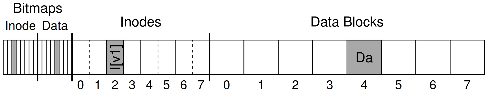
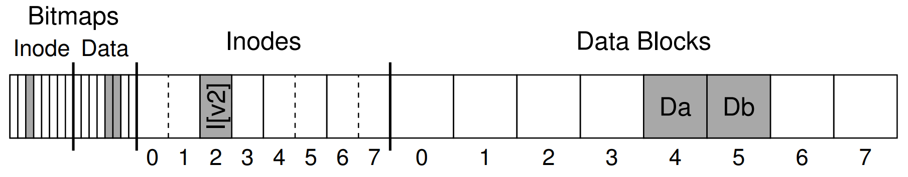
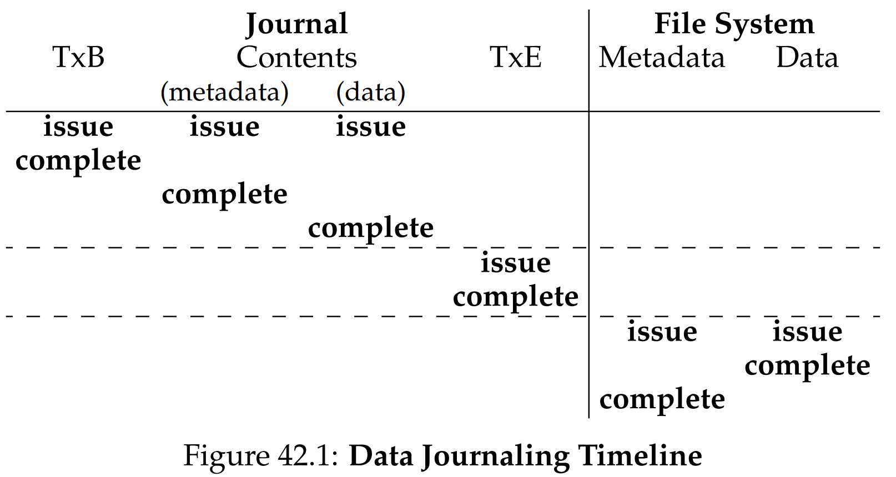
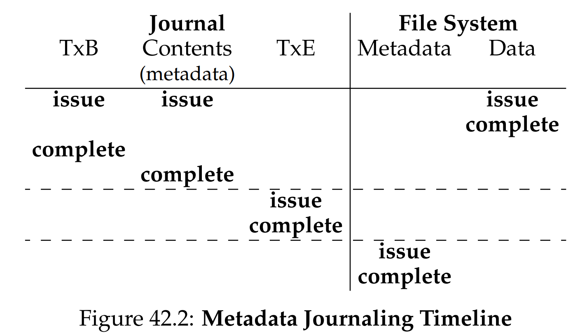

안녕하세요, pingu52입니다.

우리는 지금까지 파일을 어떻게 디스크에 효율적으로 배치할지(FFS 등)를 배웠습니다. 하지만 파일 시스템 개발자를 가장 골치 아프게 하는 문제는 따로 있습니다. **쓰기 도중에 크래시가 나면 무엇이 남는가** 입니다.

디스크는 업데이트를 블록 단위로 수행하지만, 파일 시스템 연산은 보통 여러 블록의 갱신을 필요로 합니다. 이때 각 블록 쓰기는 원자적일 수 있어도, 여러 블록에 걸친 업데이트 전체는 원자성이 보장되지 않습니다. 이 불일치가 바로 **크래시 일관성(Crash Consistency)** 문제를 만듭니다.

이번 글에서는 이 문제를 해결하는 대표적인 두 접근, **fsck(사후 복구)** 와 **저널링(사전 예방)** 을 정리합니다.

---

## 1. 문제 상황: append는 왜 위험한가

파일에 데이터 블록 하나를 추가하는 append를 생각해 봅시다. 논리적으로는 간단하지만, 디스크 수준에서는 최소 다음 블록 갱신이 필요합니다.

- **데이터 비트맵(Data Bitmap)**: 새 블록을 사용 중으로 표시 $B$
- **inode**: 파일 크기 증가 및 데이터 포인터 추가 $I$
- **데이터 블록(Data Block)**: 실제 데이터 기록 $D$

아래 그림은 append 전의 단순화된 on-disk 상태를 보여줍니다.

즉, 최소 3개의 블록 쓰기가 필요합니다. 문제는 이 중간 어딘가에서 크래시가 나면 디스크 위 상태가 어중간해질 수 있다는 점입니다.

### 1.1 크래시 시나리오와 결과

아래는 대표적인 조합을 직관적으로 정리한 것입니다.

- **$D$만 쓰고 크래시**
  - 데이터는 디스크에 존재하지만 어떤 메타데이터도 그 블록을 가리키지 않음
  - 결과적으로 공간 누수(leak) 또는 고아 데이터가 됨
  - 메타데이터 관점에서는 상대적으로 덜 위험

- **$B$만 쓰고 크래시**
  - 비트맵은 사용 중이라고 표시하지만 어떤 inode도 그 블록을 참조하지 않음
  - 역시 공간 누수(leak)

- **$I$만 쓰고 크래시**
  - inode는 어떤 데이터 블록을 가리키지만, 그 블록에는 새 데이터가 아직 기록되지 않았을 수 있음
  - 결과적으로 쓰레기 데이터 노출 또는 이전 내용(stale data) 노출 가능
  - 사용자가 기대하지 않은 바이트가 파일 내용으로 보일 수 있어 심각

- **$I$와 $B$만 쓰고 크래시**
  - inode가 특정 블록을 가리키고, 비트맵도 사용 중으로 표시됨
  - 겉으로는 일관적으로 보이지만, $D$가 안 써졌다면 내용은 여전히 쓰레기일 수 있음

- **$I$는 됐는데 $B$가 안 된 경우도 위험**
  - inode는 블록을 사용한다고 생각하지만, 비트맵은 free라고 남을 수 있음
  - 이후 다른 파일이 같은 블록을 재할당받아 데이터 오염이 발생할 수 있음

우리가 원하는 것은 결국 하나입니다.

- 세 업데이트 $B, I, D$는 **모두 실행되거나**, 아니면 **아예 실행되지 않아야** 한다  
  즉, all or nothing

아래 그림은 append가 정상 완료되었을 때의 목표 on-disk 상태를 보여줍니다.

---

## 2. 해결책 1: fsck(File System Checker)

옛 유닉스 시스템은 단순한 전략을 택했습니다.

- 평소에는 빠르게 진행한다
- 크래시가 나면 부팅 시점에 전체를 검사하고 고친다

이 역할을 하는 도구가 **fsck(file system checker)** 입니다.

fsck는 디스크 전체를 스캔하면서 메타데이터 불일치를 찾아 복구합니다.

- **슈퍼블록 검사**: 파일 시스템 기본 정보 확인
- **inode 스캔**: 각 inode가 가리키는 데이터 블록 수집
- **비트맵 재구성/검사**: inode가 참조하는 블록이 비트맵에서도 사용 중인지 확인하고 불일치 수정
- **도달 가능성 검사**: 디렉터리 트리를 따라가며 도달 불가능한 inode를 찾아 `lost+found`로 이동
- **링크 카운트 검사**: 실제 디렉터리 엔트리 수와 inode의 link count 일치 여부 확인

### 2.1 fsck의 한계

fsck의 결정적 단점은 **너무 느리다**는 점입니다.

fsck는 본질적으로 디스크를 광범위하게 읽는 작업이고, 그 시간은 대체로 디스크 크기에 비례해 증가합니다. 즉, 스캔 시간은 보통 **선형(O(N))**에 가깝습니다. 문제는 디스크 용량이 커지는 속도가 매우 빨라, 현실적으로는 수 TB급에서 검사 시간이 길어져 운영 환경에서 부담이 커진다는 점입니다.

그래서 현대 파일 시스템은 크래시 복구를 전체 스캔에 의존하지 않는 방향으로 발전합니다.

---

## 3. 해결책 2: 저널링(Journaling), WAL

저널링은 DBMS에서 널리 쓰던 **Write-Ahead Logging(WAL)** 개념을 파일 시스템에 적용한 것입니다.

핵심 아이디어는 단순합니다.

- 실제 위치에 반영하기 전에, 변경 의도와 내용을 로그에 먼저 기록한다
- 크래시가 나면 로그를 보고 복구한다

이때 로그는 보통 파일 시스템 내부의 **journal 영역**에 존재합니다.

---

## 3.1 물리적 저널링(Physical Journaling)

물리적 저널링은 데이터와 메타데이터를 모두 저널에 기록합니다. 트랜잭션 단위로 보면 아래처럼 진행됩니다.

1. **Journal Write**
   - TxB(트랜잭션 시작 표시) 기록
   - 갱신될 블록들 기록 (예: $B, I, D$)

2. **Journal Commit**
   - TxE(트랜잭션 완료 표시) 기록  
   - TxE가 디스크에 안전하게 기록되면, 트랜잭션은 커밋된 것으로 간주

3. **Checkpoint**
   - 저널에 있던 블록들을 실제 위치(home location)로 복사

4. **Free**
   - 해당 로그 구간을 재사용 가능하게 정리

아래 그림은 위 과정을 타임라인으로 요약합니다.

### 3.1.1 크래시가 나면 무엇을 하는가

복구는 단순합니다.

- TxE가 없는 트랜잭션은 무시한다 (커밋 전이므로 버림)
- TxE가 있는 트랜잭션은 replay 한다 (저널 내용을 실제 위치에 반영)

즉, 커밋 여부를 TxE로 판단하고, 커밋된 것만 재실행하면 all or nothing을 만족합니다.

### 3.1.2 단점

물리적 저널링은 $D$까지 로그에 쓰므로, 데이터는

- 저널에 한 번
- 실제 위치에 한 번

총 두 번 기록됩니다. 따라서 쓰기 비용이 커집니다.

---

## 4. 성능 개선: 메타데이터 저널링과 ordered mode

대부분의 상용 파일 시스템은 성능 때문에 데이터를 저널에 남기지 않고, **메타데이터만 저널링**하는 방식을 사용합니다. 리눅스 계열에서는 이를 ordered mode로 설명하는 경우가 많습니다.

핵심은 아래 한 줄입니다.

- 데이터는 홈 위치에 쓰되, 메타데이터 커밋 전에 데이터가 먼저 디스크에 도달해야 한다

### 4.1 ordered mode의 절차

append 예시를 기준으로 순서를 정리하면 아래처럼 생각할 수 있습니다.

1. **Data Write**
   - $D$를 실제 위치에 먼저 기록한다

2. **Journal Write**
   - 메타데이터만 저널에 기록한다 (예: $B, I$)

3. **Journal Commit**
   - TxE를 기록한다  
   - 커밋 시점 이후에는 복구가 가능해야 한다

4. **Checkpoint**
   - 메타데이터를 실제 위치로 반영한다

### 4.2 왜 순서가 중요한가

ordered mode가 막고 싶은 최악의 상황은 이것입니다.

- 메타데이터가 커밋되어 inode가 새 블록을 가리키게 됐는데
- 데이터 $D$가 아직 디스크에 없고
- 그 상태로 크래시가 나면
- 복구 후 inode가 쓰레기 또는 stale data를 가리킬 수 있음

따라서 ordered mode는 반드시 다음 제약을 만족해야 합니다.

- $D$가 디스크에 안전하게 기록된 이후에만 $B, I$를 커밋한다

아래 그림은 메타데이터 저널링의 타임라인과 순서 제약을 한 번에 보여줍니다.

### 4.3 writeback mode는 무엇이 다른가

일부 모드는 데이터 $D$의 디스크 도달을 커밋과 강하게 묶지 않습니다. 이 경우 메타데이터 일관성은 유지할 수 있지만, 크래시 후 파일 내용이 쓰레기 또는 stale로 보일 가능성이 커집니다. 그래서 ordered mode는 안전성과 성능의 균형점으로 자주 선택됩니다.

---

## 5. 구현 관점의 디테일: 순환 로그와 배치

### 5.1 순환 로그(Circular Log)

저널 공간은 무한하지 않습니다. 따라서 저널은 보통 원형 버퍼처럼 운영됩니다.

- 커밋 및 체크포인트가 끝난 구간은 재사용
- 로그 헤드와 테일을 관리하며 순환

### 5.2 배치(Batching)

매번 작은 연산마다 트랜잭션을 커밋하면 TxE 쓰기, 장치 flush 등 오버헤드가 과도해집니다. 그래서 실제 구현은 여러 파일 시스템 연산을 하나의 트랜잭션으로 묶어 커밋합니다.

예를 들어 파일 생성이 연속으로 발생하면 이를 묶어 커밋해, 커밋 오버헤드를 상각할 수 있습니다.

---

## 6. 요약

- **크래시 일관성**: 여러 블록 업데이트는 원자적이지 않아서, 크래시 시 파일 시스템이 망가질 수 있다
- **fsck**: 전체 스캔 기반 사후 복구. 용량이 커질수록 시간이 오래 걸려 운영 부담이 커진다
- **저널링(WAL)**: 변경을 로그에 먼저 기록하고, 크래시 후 로그를 replay 하여 빠르게 복구한다
- **ordered mode**: 데이터는 홈 위치에 쓰고 메타데이터만 로깅하되, 데이터가 먼저 디스크에 도달한 뒤에만 커밋한다

저널링 덕분에 우리는 더 이상 부팅 중 disk checking 화면을 몇 시간씩 바라보는 시스템에 머물 필요가 없어졌습니다.

---

## 7. 용어 정리

- `Crash Consistency`: 크래시 후에도 파일 시스템이 모순 없는 상태로 복구되는 성질
- `fsck`: 파일 시스템 전역 스캔으로 불일치를 찾아 복구하는 도구
- `Journaling (WAL)`: 변경을 홈 위치에 반영하기 전에 로그에 먼저 기록하는 기법
- `Transaction`: all or nothing으로 처리되어야 하는 업데이트 묶음
- `Commit (TxE)`: 트랜잭션이 완료되었음을 나타내는 로그 레코드
- `Checkpoint`: 저널 내용을 실제 위치에 반영하는 과정
- `Ordered mode`: 데이터 선기록 후 메타데이터 커밋을 강제하는 저널링 모드

---

## Reference

- [Operating Systems: Three Easy Pieces - Chapter 42: Crash Consistency: FSCK and Journaling](https://pages.cs.wisc.edu/~remzi/OSTEP/file-journaling.pdf)
