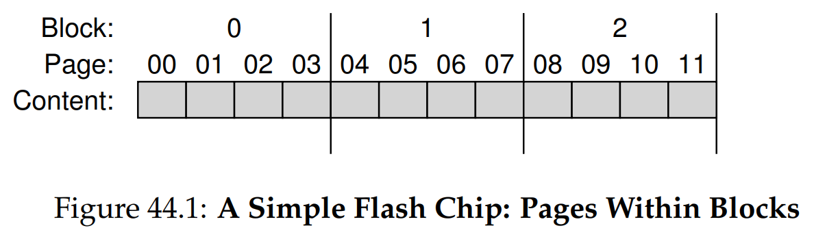
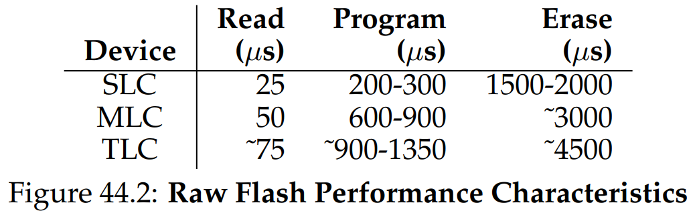
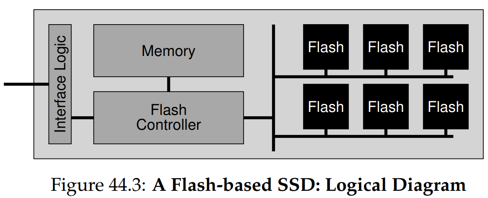
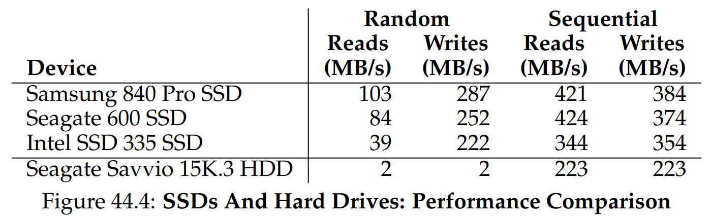

안녕하세요, pingu52입니다.

지난 장들에서 우리는 회전 플래터와 암을 가진 HDD를 기준으로 스토리지와 파일 시스템을 배웠습니다. 하지만 오늘날 성능 중심 스토리지의 핵심은 **SSD(Solid-State Drive)** 입니다.

SSD는 기계적인 구동부가 없어서 seek나 회전 지연이 없습니다. 대신 트랜지스터 기반의 **NAND 플래시**를 사용하며, 이 플래시는 HDD에는 없던 제약을 가집니다. 이번 글에서는 그 제약을 숨기고 OS에게는 여전히 블록 디바이스처럼 보이게 만드는 **FTL(Flash Translation Layer)** 의 내부 메커니즘을 정리합니다.

---

## 1. 플래시 메모리의 물리적 특성

### 1.1 용어 주의: 블록과 페이지

플래시에서도 block, page라는 단어를 쓰지만, 우리가 디스크/VM에서 쓰던 의미와 다릅니다.

- **페이지(page)**: 읽기(read)와 쓰기(program)의 단위, 보통 수 KB(예: 4 KiB)
- **블록(block, erase block)**: 지우기(erase)의 단위, 보통 수백 KB 이상(예: 128 KiB, 256 KiB)
- 플래시 칩은 많은 **bank/plane**으로 구성되고, 각 bank/plane은 많은 block, 각 block은 많은 page로 구성됩니다

### 1.2 3가지 기본 연산: read / erase / program

플래시에는 3개의 기본 연산이 있고, 여기서 모든 난제가 시작됩니다.

1. **read(페이지)**  
   임의 위치를 빠르게 읽습니다. 대략 수십 $\mu\mathrm{s}$ 수준입니다.

2. **erase(블록)**  
   쓰기 전에 반드시 필요합니다. 블록 단위로만 지울 수 있고, 비용이 가장 큽니다. 대략 수 $\mathrm{ms}$ 수준입니다.  
   erase는 블록 내 모든 비트를 1로 만드는 동작으로 볼 수 있고, 기존 내용은 파괴됩니다.

3. **program(페이지)**  
   erase 이후에만 가능하며, 페이지를 한 번 program하면 같은 페이지를 다시 program할 수 없습니다.  
   또한 program은 보통 1을 0으로만 바꾸는 방향으로 동작합니다.

이 제약을 상태 전이로 보면 직관적입니다.

- 초기: INVALID
- erase 후: ERASED
- program 후: VALID
- VALID 페이지를 다시 program: error
- 내용을 바꾸려면: 해당 페이지가 속한 **블록 전체 erase** 가 필요

### 1.3 성능과 신뢰성

플래시는 read는 빠르지만, program과 erase가 훨씬 비쌉니다. 또한 신뢰성 이슈도 존재합니다.

- **wear out**: 블록은 program/erase(P/E) 사이클을 반복하면 열화됩니다
- **disturbance**: 인접 페이지 비트가 뒤집히는 read/program disturb가 발생할 수 있습니다

---

## 2. FTL: 플래시를 블록 디바이스처럼 보이게 하기

OS는 저장 장치를 여전히 LBA 기반 블록 배열로 취급합니다. 하지만 플래시는 overwrite가 불가능하고 erase 단위가 큽니다. 이 간극을 메워주는 계층이 **FTL** 입니다.

FTL의 목표는 3가지로 요약됩니다.

- **주소 변환**: 논리 주소(LBA) $\to$ 물리 페이지 주소(PPA)
- **write amplification 최소화**: 내부 복사/GC로 인한 추가 쓰기 감소
- **wear leveling**: 특정 블록만 닳지 않도록 P/E 사이클을 분산

SSD 내부는 플래시 칩들 + volatile memory(SRAM/DRAM) + 컨트롤 로직으로 구성되고, FTL은 컨트롤 로직의 핵심 기능입니다.

---

## 3. 나쁜 접근: direct-mapped FTL

PDF에서 말하는 **direct-mapped** 는 페이지 단위 매핑이 아니라, 훨씬 단순하고 위험한 고정 매핑입니다.

- 논리 페이지 $N$은 물리 페이지 $N$에 고정
- write(논리 페이지 $N$)를 처리하려면
  - 해당 페이지가 속한 **블록 전체를 읽고**
  - 블록을 **erase**
  - 원래 데이터들과 변경된 페이지를 **program**
- 결과적으로 write는 블록 크기에 비례하는 write amplification을 만들고,
  hot data overwrite가 특정 블록을 빨리 죽게 만들어 신뢰성도 최악입니다

이 방식은 성능/수명 관점에서 실질적으로 사용할 수 없는 접근입니다.

---

## 4. 좋은 접근: log-structured FTL

대부분의 현대 FTL은 **log-structured** 입니다.

- overwrite를 하지 않고
- 다음 free page에 append 방식으로 program
- 그리고 **mapping table** 로 논리 주소가 현재 어디에 있는지 추적합니다

이 방식은 작은 랜덤 쓰기를 내부적으로 큰 순차 쓰기 형태로 바꿔, erase 빈도를 낮추고 성능을 끌어올립니다.

### 4.1 매핑 테이블은 왜 필요한가

논리 블록 $L$을 쓸 때마다 물리 위치가 바뀌므로,
read(L)은 현재 물리 위치를 알아야 합니다.

- mapping table: $L \mapsto P$

### 4.2 매핑 정보는 전원 꺼지면 어떻게 되나

매핑 테이블은 volatile memory에 있으므로 전원이 나가면 사라집니다. 따라서 SSD는 매핑 정보를 복구할 수 있어야 합니다.

- 가장 단순한 방식: 각 페이지의 OOB(out-of-band)에 논리 주소 정보를 기록해두고, 부팅 시 전체를 스캔하여 매핑 테이블을 재구성
- 단점: 대용량 SSD에서 스캔 비용이 큼
- 고급 SSD는 logging/checkpointing으로 복구 시간을 줄이기도 합니다

---

## 5. 가비지 컬렉션(GC)과 write amplification

log-structured의 대가가 있습니다. overwrite가 쌓이면 구버전 데이터가 **garbage** 로 남습니다.

FTL은 주기적으로 GC를 수행합니다.

- garbage가 포함된 블록을 선택
- 그 블록의 **live page** 만 읽어서 새로운 위치로 이동
- 블록 erase로 free 공간 확보

GC가 만드는 핵심 부작용이 **write amplification** 입니다.

$$
\mathrm{WA} = \frac{\text{FTL이 플래시에 실제로 쓴 바이트}}{\text{호스트가 요청한 바이트}}
$$

### 5.1 TRIM이 왜 필요한가

호스트가 파일을 삭제해도 SSD는 그 LBA가 더 이상 필요 없다는 사실을 모르면, live로 착각하고 불필요한 복사를 할 수 있습니다.

**TRIM** 은 호스트가 더 이상 필요 없는 LBA 범위를 SSD에 알려 GC 효율을 높입니다.

추가로 많은 SSD는 **overprovisioning** 으로 여유 공간을 두어 GC를 더 늦추고, 백그라운드에서 처리하기 쉽게 만듭니다.

---

## 6. 매핑 테이블 크기 문제와 3가지 설계

log-structured는 보통 페이지 단위로 유연하게 쓰기 때문에, 이상적으로는 논리 페이지마다 매핑 엔트리가 필요합니다. 문제는 그 크기입니다.

- SSD 용량: $C$
- 페이지 크기: $B_{\mathrm{page}}$
- 포인터 크기: $B_{\mathrm{ptr}}$ (예: 4 B)

$$
N_{\mathrm{page}} = \frac{C}{B_{\mathrm{page}}}, \quad
M_{\mathrm{map}} = N_{\mathrm{page}} \cdot B_{\mathrm{ptr}}
$$

예를 들어 1 TiB SSD, 4 KiB 페이지, 4 B 포인터면 매핑 테이블만 대략 1 GiB 수준이 됩니다.

이 때문에 다양한 절충이 등장합니다.

### 6.1 블록 단위 매핑(block-based mapping)

- 장점: 엔트리 수가 블록 단위로 줄어 테이블이 작아짐
- 단점: small write에서 기존 블록의 live 데이터를 대량 복사해야 하므로 write amplification이 커짐

### 6.2 하이브리드 매핑(hybrid mapping)

PDF의 대표 절충입니다.

- 대부분은 **data table(블록 매핑)** 으로 관리
- 소수의 **log block** 에 대해서만 **log table(페이지 매핑)** 을 유지
- 쓰기는 log block에 append
- log block이 찼거나 정책상 필요해지면 merge로 data block을 재구성

merge는 3가지 케이스가 있습니다.

- **switch merge**: 가장 이상적, log block이 순서대로 꽉 차서 그대로 data block으로 전환
- **partial merge**: 일부만 덮였으면 나머지 live page를 읽어 합쳐서 재구성
- **full merge**: 흩어진 overwrite로 여러 블록을 모아 재조립, 가장 비싸고 피해야 함

### 6.3 페이지 매핑 + 캐싱(page mapping plus caching)

페이지 매핑을 유지하되,
working set의 translation만 메모리에 캐싱하는 방식도 연구됩니다.
working set이 작으면 좋지만, working set이 크면 translation miss 때문에 추가 read/write가 발생할 수 있습니다.

---

## 7. wear leveling

log-structured와 GC는 기본적으로 write load를 퍼뜨리지만, 여전히 문제가 남습니다.

- 어떤 블록이 **long-lived data** 로 가득 차면 overwrite가 없어서 GC로는 회수되지 않음
- 그러면 그 블록은 P/E 사이클을 거의 받지 않아 wear leveling 관점에서 불균형이 생김

따라서 FTL은 때때로 이런 블록의 live data를 다른 곳으로 옮겨,
해당 블록도 쓰기 대상이 되게 만들어 P/E 사이클을 평준화합니다.
이 과정은 write amplification을 늘리지만, SSD 수명을 위해 필수입니다.

---

## 8. SSD 성능과 비용 감각

SSD는 랜덤 I/O에서 HDD를 압도하지만, 순차 I/O에서는 격차가 상대적으로 줄어듭니다.

또한 cost per GB는 여전히 HDD가 유리하여, 데이터센터에서는 hot 데이터는 SSD, cold 데이터는 HDD 같은 혼합 구성도 흔합니다.

---

## 9. 요약

- 플래시는 **erase-before-program** 제약 때문에 overwrite가 불가능하고 erase가 비쌉니다
- FTL은 플래시 위에 블록 디바이스 인터페이스를 구현하며, 성능/수명 목표를 동시에 만족해야 합니다
- direct-mapped 같은 단순 고정 매핑은 write amplification과 wear out 때문에 실용적이지 않습니다
- 대부분의 SSD는 log-structured FTL을 사용하고, GC로 인해 write amplification이 발생합니다
- page-level mapping은 유연하지만 테이블이 커지고, 이를 줄이기 위해 block/hybrid/caching 절충이 등장합니다
- wear leveling은 수명 확보를 위해 필수이며, 역시 추가 write amplification을 동반합니다

---

## 10. 용어 정리

- `NAND Flash`: SSD의 주 저장 매체인 비휘발성 플래시
- `Block (Erase Block)`: erase 단위
- `Page`: read/program 단위
- `FTL`: 논리 블록 요청을 물리 flash 연산(read/erase/program)으로 변환하는 계층
- `Log-structured FTL`: overwrite 대신 append로 쓰기를 처리하는 FTL 설계
- `Garbage Collection`: live page를 옮기고 블록을 erase하여 공간을 회수하는 과정
- `Write Amplification`: 호스트 쓰기 대비 내부 쓰기 총량의 증가 비율
- `Wear Leveling`: P/E 사이클을 블록 전체에 고르게 분산시키는 기법
- `TRIM`: 호스트가 더 이상 필요 없는 LBA 범위를 SSD에 알려 GC 효율을 높이는 명령

---

## Reference

- [Operating Systems: Three Easy Pieces - Chapter 44: Flash-based SSDs](https://pages.cs.wisc.edu/~remzi/OSTEP/file-ssd.pdf)
