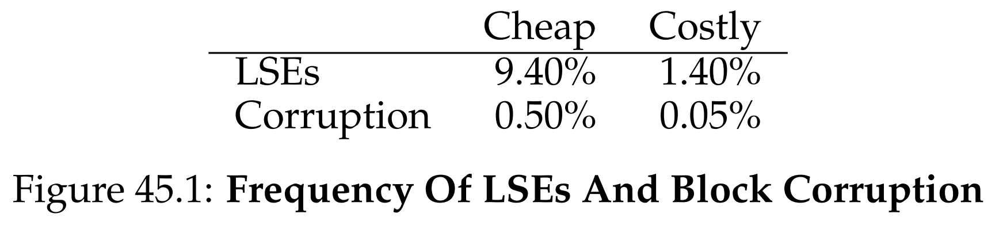
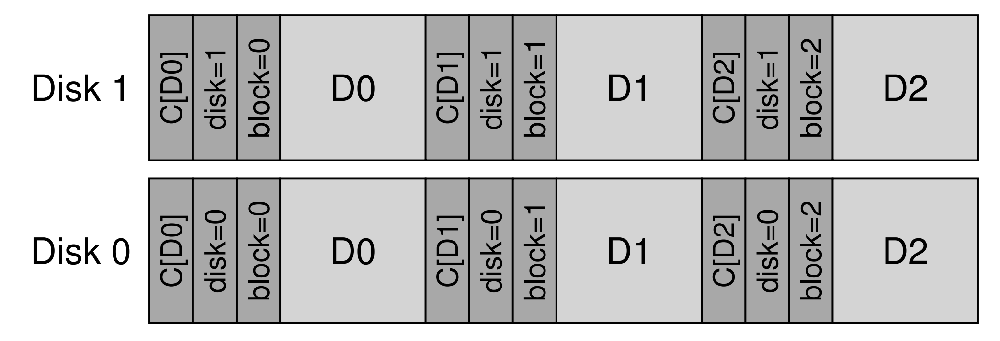

안녕하세요, pingu52입니다.

지난 시간까지 우리는 SSD와 FTL을 다뤘습니다. 이번 장은 스토리지 신뢰성의 마지막 퍼즐인 **데이터 무결성(data integrity)** 입니다.

디스크 고장은 단순한 fail-stop만 있는 것이 아닙니다. 현대 스토리지는 부분 실패(fail-partial)를 자주 보입니다.

- **잠재적 섹터 오류(Latent Sector Error, LSE)**: 해당 블록을 읽으려 하면 디스크가 에러를 반환
- **데이터 손상(block corruption)**: 에러는 없는데 데이터 내용이 달라져서 조용히 틀린 값을 반환

---

## 2. LSE와 corruption은 해결 방식이 다르다

### 2.1 LSE는 탐지가 쉽고, 복구는 redundancy의 문제다

LSE는 디스크가 에러를 반환하므로 탐지가 쉽습니다. 따라서 저장 시스템은 미러나 패리티 같은 **중복성(redundancy)** 으로 복구하면 됩니다.

- 미러 RAID라면 다른 복사본에서 읽기
- RAID-4/5라면 패리티 그룹으로 재구성

즉, LSE 자체는 체크섬보다도 복구 경로가 준비되어 있는지가 더 중요합니다.

### 2.2 corruption은 탐지가 핵심이고, 체크섬이 필요하다

corruption은 디스크가 정상처럼 행동하는데 내용이 다릅니다. 따라서 시스템이 데이터가 틀렸다는 사실을 알아차릴 수 있도록 **탐지 메커니즘**이 필요합니다. 이때 가장 널리 쓰는 것이 체크섬입니다.

---

## 3. 체크섬의 기본 개념

체크섬은 데이터 청크의 내용을 요약한 작은 값입니다.

- 데이터 블록을 $D$
- 체크섬 함수(알고리즘)를 $C$

라고 하면 저장 시점에 $C(D)$를 계산해 함께 보관하고, 읽기 시점에 다시 계산한 $C(D')$와 비교합니다.

- $C_s(D)$: 저장된 체크섬(stored)
- $C_c(D)$: 읽은 데이터로 계산한 체크섬(computed)

$$
C_s(D) = C_c(D) \Rightarrow \text{정상일 가능성이 높음}
$$

$$
C_s(D) \ne C_c(D) \Rightarrow \text{corruption 탐지}
$$

중요한 전제는 하나입니다.
체크섬은 탐지 장치이고, 복구를 하려면 별도의 redundancy가 있어야 합니다. redundancy가 없다면 결국 에러를 반환하는 것 외에 할 수 있는 일이 없습니다.

---

## 4. 체크섬 알고리즘의 종류

체크섬은 강도(strength)와 속도(speed)의 트레이드오프입니다. 강해질수록 보통 비용이 커집니다.

또한 요약값이 작기 때문에, 서로 다른 데이터가 같은 체크섬을 가질 수 있는 **충돌(collision)** 가능성은 원리적으로 존재합니다.

### 4.1 XOR

바이트(또는 워드) 단위로 모두 XOR합니다.

- 장점: 매우 빠름
- 단점: 같은 위치에서 짝수 번 비트가 뒤집히면 탐지 실패 가능

### 4.2 Addition

2의 보수 덧셈을 누적하고 overflow는 버립니다.

- 장점: 빠름
- 단점: 데이터가 shift되는 형태의 변화에 약함

### 4.3 Fletcher checksum

두 개의 누적 합 $s_1, s_2$를 유지해 위치 정보를 일부 반영합니다.

- $s_1 = (s_1 + D[i]) \bmod 255$
- $s_2 = (s_2 + s_1) \bmod 255$

XOR나 단순 addition보다 강력하면서도 충분히 빠른 편입니다.

### 4.4 CRC

데이터를 큰 이진수로 보고 약속된 다항식으로 나눈 나머지를 사용합니다.
버스트 에러에 강하고, 하드웨어 지원이 있어 빠르게 계산 가능한 경우도 많습니다.

---

## 5. 체크섬을 어디에 저장할까

체크섬은 계산보다 레이아웃이 더 골치 아픈 경우가 많습니다.

### 5.1 섹터 내 여유 공간(520-byte 섹터)

일부 디스크는 512B 대신 520B 섹터로 포맷해 추가 8B를 체크섬에 사용합니다.
구현은 깔끔하지만 하드웨어 지원이 필요합니다.

### 5.2 체크섬을 모아서 저장(checksum sector)

일반 디스크에서는 체크섬을 별도 섹터에 몰아 넣고, 그 뒤에 데이터 블록들을 배치할 수 있습니다.

- 장점: 어떤 디스크에서도 동작
- 단점: overwrite 시 체크섬 섹터 갱신 때문에 추가 I/O가 발생할 수 있음

이 파트는 PDF의 레이아웃 그림을 그대로 캡처해 붙이면 이해가 매우 빨라집니다.

---

## 6. 새로운 문제 1: misdirected write

misdirected write는 디스크나 RAID 컨트롤러가 데이터를 제대로 쓰긴 했는데, 주소를 잘못 써서 엉뚱한 곳에 기록한 경우입니다.

이 문제는 단순히 C(D)만 저장하면 탐지가 어려울 수 있습니다.
따라서 체크섬에 **physical ID** 를 함께 저장하는 방식이 유용합니다.

- 체크섬 옆에 disk 번호, block 오프셋을 함께 저장
- 읽을 때 내가 기대한 (disk, block)과 저장된 physical ID가 다르면 misdirected write를 탐지

---

## 7. 새로운 문제 2: lost write

lost write는 더 까다롭습니다.
디바이스가 write 완료를 알렸는데 실제로는 기록되지 않아, 디스크에는 예전 내용이 남아 있는 경우입니다.

이 경우 예전 데이터 블록은 자기 체크섬과 일치할 가능성이 높고, physical ID도 맞기 때문에 탐지가 어렵습니다.

대표적인 대응은 다음과 같습니다.

- **read-after-write**: 즉시 다시 읽어 검증, 하지만 I/O가 2배가 되어 느림
- **상위 메타데이터에 체크섬 저장**: inode/indirect 블록에 데이터 블록의 체크섬을 저장해 두면,
  데이터 블록이 갱신되지 않은 경우 불일치로 탐지 가능
  단, 메타데이터와 데이터의 write가 모두 lost면 실패할 수 있음

이 지점에서 ZFS의 체크섬 포인터 접근이 의미를 가집니다.

---

## 8. 스크러빙(scrubbing)

읽을 때만 검사하면, 거의 접근하지 않는 cold data는 부패가 진행돼도 모를 수 있습니다.
따라서 많은 시스템은 주기적으로 전체 블록을 스캔하며 체크섬을 확인하는 **스크러빙**을 수행합니다.

보통 nightly 또는 weekly 같은 주기 스케줄이 많이 언급됩니다.

---

## 9. 오버헤드

체크섬은 공짜가 아닙니다. 공간과 시간 오버헤드가 있습니다.

### 9.1 공간

예를 들어 4KiB 블록당 8B 체크섬이면

$$
\frac{8}{4096} \approx 0.00195 = 0.195\%
$$

즉 대략 0.19% 수준입니다.
4B 체크섬이라면 대략 그 절반입니다.

### 9.2 시간

- CPU: 저장 시, 읽기 시 모두 체크섬 계산 비용이 듭니다
- 최적화: 데이터 copy와 체크섬 계산을 결합하면 CPU 오버헤드를 줄일 수 있습니다
- I/O: 체크섬을 데이터와 떨어뜨려 두면 추가 I/O가 생길 수 있고, 스크러빙 역시 백그라운드 I/O를 유발합니다

---

## 10. 요약

- 디스크는 fail-stop만 있는 것이 아니라 fail-partial 실패 모드도 가진다
- LSE는 탐지가 쉽고, 복구는 redundancy로 해결한다
- corruption은 탐지가 핵심이며, 체크섬이 표준 해법이다
- misdirected write는 checksum에 physical ID를 포함해 탐지할 수 있다
- lost write는 더 어렵고, read-after-write 또는 상위 메타데이터 체크섬 같은 추가 장치가 필요하다
- scrubbing은 잘 읽지 않는 데이터의 부패를 조기에 발견하는 데 유용하다

---

## 11. 용어 정리

- `Data Integrity`: 저장 장치가 오류 없이 동일한 데이터를 반환한다는 성질
- `Fail-stop`: 장치가 고장 시 동작을 멈추거나 에러를 명확히 반환하는 실패 모델
- `Fail-partial`: 일부 요청은 정상처럼 보이지만 내부적으로 데이터가 손상되는 실패 모델
- `LSE (Latent Sector Error)`: 읽기 시점에 드러나는 섹터/블록 단위의 잠재적 오류
- `Block Corruption`: 에러 없이 잘못된 데이터를 반환하는 현상
- `Silent Corruption`: corruption이 시스템에 감지되지 않고 조용히 지나가는 상황
- `Checksum`: 데이터 블록을 요약한 값으로, 읽기 시 재계산하여 불일치를 탐지
- `Collision`: 서로 다른 데이터가 동일한 체크섬 값을 갖는 경우
- `XOR Checksum`: XOR 누적 기반의 매우 단순한 체크섬
- `Addition Checksum`: 덧셈 누적 기반의 간단한 체크섬
- `Fletcher Checksum`: 두 개의 누적 합으로 위치 정보를 일부 반영하는 체크섬
- `CRC`: 다항식 나눗셈 기반의 체크섬으로, 버스트 에러 탐지에 강함
- `Physical ID`: (disk, block)처럼 물리 위치를 식별하는 정보로, misdirected write 탐지에 활용
- `Misdirected Write`: 데이터가 의도한 물리 위치가 아닌 다른 위치에 기록되는 오류
- `Lost Write`: write 완료가 보고되었으나 실제로는 기록되지 않아 이전 데이터가 남는 오류
- `Read-after-write`: write 직후 즉시 read로 검증하는 기법
- `Scrubbing`: 백그라운드에서 전체 블록을 읽고 체크섬을 확인하는 주기적 검사

---

## Reference

- [Operating Systems: Three Easy Pieces - Chapter 45: Data Integrity and Protection](https://pages.cs.wisc.edu/~remzi/OSTEP/file-integrity.pdf)
