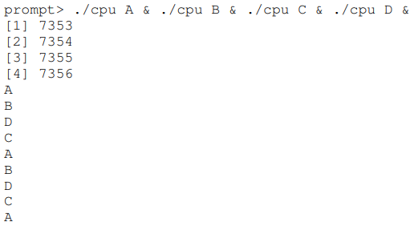
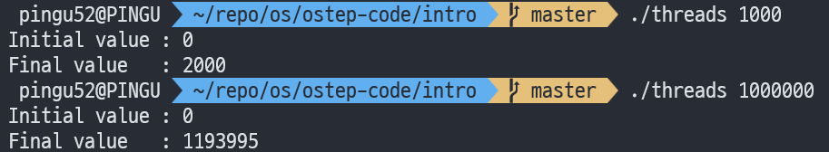

안녕하세요, pingu52입니다.

이번 글은 『Operating Systems: Three Easy Pieces(OSTEP)』 **2장(Introduction to Operating Systems)** 을 읽고 정리한 노트입니다.  
1장 Dialogue는 별도 글로 만들지 않고, 이 장의 흐름(세 가지 축 + Mechanism/Policy) 안에 자연스럽게 섞어서 정리합니다.

---

### 실습 준비: ostep-code

이 장의 예제(cpu.c, mem.c, threads.c 등)는 `ostep-code` 저장소의 `intro/` 디렉터리에 있습니다.

```bash
git clone https://github.com/remzi-arpacidusseau/ostep-code.git
cd ostep-code/intro
# (선택) 한 번에 빌드하고 싶으면
# make
```

---

## 1. 이 장에서 잡아야 할 관점

운영체제(Operating System)는 물리 자원(CPU/Memory/Disk)을 직접 드러내지 않고, 프로그램이 쓰기 쉬운 추상화(Abstraction)로 제공합니다.  
그리고 운영체제는 아래 세 가지 큰 문제를 반복해서 다룹니다.

- 가상화(Virtualization): CPU/메모리 같은 자원을 **마치 분리되어 있는 것처럼** 보이게 만듭니다.
- 동시성(Concurrency): 여러 실행 흐름이 겹칠 때 생기는 오류를 다룹니다.
- 영속성(Persistence): 전원이 꺼져도 데이터가 남도록 저장합니다.

---

## 2. Virtualization 1: CPU 가상화 (Virtualizing the CPU)

단일 CPU에서도 여러 프로그램이 동시에 실행되는 것처럼 보입니다.  
이 **동시 실행처럼 보이는 효과**는 운영체제가 하드웨어의 도움을 받아 만든 **환상(illusion)** 입니다.

### 2.1 예제: cpu.c

책의 예제는 1초 정도 바쁜 대기(Spin) 후 문자열을 출력하는 단순 루프입니다.

```bash
# build
gcc -o cpu cpu.c -Wall

# run (foreground)
./cpu A
```


여기서 핵심은 **한 번에 하나만 실행**이 아니라 **여러 개를 동시에 실행**하는 상황입니다.

```bash
# zsh 기준 예시: 백그라운드로 여러 프로세스 실행
./cpu A & ./cpu B & ./cpu C & ./cpu D &
```



#### 관찰 포인트

- CPU는 하나인데 출력이 섞입니다.
- 운영체제는 타임-셰어링(Time-sharing) 방식으로 CPU 시간을 쪼개서, 마치 가상 CPU(virtual CPU)가 여러 개인 것처럼 보이게 합니다.
- **누가 먼저 CPU를 쓰는가?** 는 정책(Policy) 문제로 이어집니다(스케줄링 Scheduling).

#### 실행 중지 팁

- 포그라운드 실행은 `Ctrl+C`로 종료합니다.
- 백그라운드 실행은 `jobs`로 확인 후 `kill %1`처럼 종료합니다.
- 간단히 정리하려면 `pkill cpu`도 사용할 수 있습니다(동명이 프로그램이 있으면 주의합니다).

---

## 3. Virtualization 2: 메모리 가상화 (Virtualizing Memory)

물리 메모리(physical memory)는 바이트 배열이고, 주소를 통해 읽고/씁니다.  
그런데 각 프로세스는 자기만의 주소 공간(Address Space, Virtual Address Space)을 가진 것처럼 보입니다.

### 3.1 예제: mem.c

```bash
# build
gcc -o mem mem.c -Wall

# run
./mem
```


여러 인스턴스를 동시에 실행하면, 각 프로세스가 같은 가상 주소(예: 0x200000)를 출력하면서도 서로 영향을 주지 않는 것처럼 보입니다.

```bash
./mem & ./mem &
```


#### 관찰 포인트

- **같은 주소인데 왜 충돌이 없나?** → 여기서 주소는 가상 주소(virtual address)이고, 운영체제가 이를 물리 메모리(physical memory)로 매핑(mapping)합니다.
- 결과적으로 프로세스마다 사적인(private) 메모리를 가진 것처럼 보이지만, 실제 물리 메모리는 공유 자원(shared resource)이며 OS가 관리합니다.

:::note
이 예제는 주소 공간 랜덤화(ASLR, Address Space Layout Randomization)가 켜져 있으면 책의 출력과 다르게 보일 수 있습니다. **같은 주소가 반복된다**는 현상을 재현하려면 ASLR을 끄는 방식이 필요합니다.
:::

```bash
# 끄기(재현용) — 실습 후 원복을 권장합니다
sudo sysctl -w kernel.randomize_va_space=0
# 원복(기본값)
sudo sysctl -w kernel.randomize_va_space=2
```

---

## 4. Concurrency: 동시성(Concurrency) 문제를 코드로 확인하기

동시성은 여러 작업이 겹쳐 실행될 때 생기는 문제를 통칭합니다.  
운영체제는 가상화를 위해 여러 프로세스를 번갈아 실행하므로(스케줄링) 동시성 이슈를 구조적으로 안고 있습니다. 또한 현대 소프트웨어는 애플리케이션 자체도 멀티스레드(Multi-threaded)로 동작하므로, 동일한 문제가 사용자 프로그램에서도 그대로 나타납니다.

### 4.1 예제: threads.c (Race Condition)

두 개의 스레드(Thread)가 같은 변수(counter)를 증가시킵니다.

```bash
# build
gcc -o threads threads.c -Wall -pthread

# run
./threads 1000
./threads 1000000
```



#### 관찰 포인트

- loops=1000일 때는 기대값(2N)이 잘 나올 수 있습니다.
- loops를 크게 하면 결과가 틀리거나 실행마다 달라질 수 있습니다 → 경쟁 조건(Race Condition)의 전형적인 증상입니다.
- 원인은 `counter++`가 원자적(atomic) 연산이 아니기 때문입니다. 일반적으로 `load → increment → store` 같은 여러 단계로 분해되어 실행되며, 그 사이에 스케줄링이 끼어들면 결과가 깨집니다.

이 파트는 이후 챕터에서 동기화(Synchronization), 상호배제(Mutual Exclusion), 락(Lock) 같은 기본 도구로 확장됩니다.

---

## 5. Persistence: 영속성(Persistence)과 파일 시스템(File System)

DRAM 같은 메모리는 휘발성(volatile)이라 전원이 꺼지거나 크래시가 나면 데이터가 사라집니다.  
그래서 시스템은 저장장치(I/O device: HDD/SSD 등)에 데이터를 **영속적으로 저장**해야 합니다.

- 하드웨어: 디스크/SSD 같은 저장 장치
- 소프트웨어(운영체제): 파일 시스템(File System)

CPU/메모리와 달리, 디스크는 **프로세스마다 사적인 가상 디스크**를 제공하기보다 **공유(share)** 를 전제로 합니다.  
에디터로 파일을 만들고, 컴파일러로 빌드하고, 실행 파일을 돌리는 일련의 흐름이 바로 그 공유를 활용합니다.

또한 OS는 저장장치에 접근하는 복잡한 세부를 감추고, 시스템 콜(System Call) 형태의 단순한 인터페이스로 I/O를 제공합니다(예: open/write/close).

---

## 6. Mechanism vs Policy: 구현과 선택을 분리해서 보기

OSTEP는 **가능하게 하는 방법(How)** 과 **무엇을 선택할지(Which)** 를 분리해 사고하는 습관을 강조합니다.

- 메커니즘(Mechanism): 기능을 가능하게 하는 구현 수단입니다.
  - 예: 타임-셰어링(Time-sharing), 트랩(trap) 기반 시스템 콜 진입
- 정책(Policy): 여러 선택지 중 무엇을 택할지에 대한 기준입니다.
  - 예: 스케줄링(Scheduling)에서 **어느 프로세스에게 CPU를 먼저 줄지**
  - 예: 파일 시스템에서 캐싱/쓰기 지연(write-back) 같은 정책 선택

---

## 7. 운영체제 설계 목표(Goals)

이 장에서는 **OS를 만든다면 어떤 목표를 먼저 세워야 하는가**도 함께 언급합니다.

- 편의성(Convenience): 추상화(Abstraction)로 사용을 쉽게 만듭니다.
- 성능(Performance): OS 오버헤드(overhead)를 과도하게 키우지 않습니다.
- 보호/격리(Protection/Isolation): 한 프로그램이 다른 프로그램/OS를 망가뜨리지 못하게 합니다.
- 신뢰성(Reliability): OS가 실패하면 전체가 멈추므로, 높은 신뢰성이 필요합니다.
- 기타: 에너지 효율(Energy-efficiency), 보안(Security), 이동성(Mobility) 등은 환경에 따라 중요도가 달라집니다.

---

## 8. 시스템 콜(System Call)과 실행 모드(User/Kernel Mode)

운영체제가 **그저 라이브러리**를 넘어서려면, OS 코드와 앱 코드를 구분해야 합니다.  
대표적인 장치가 시스템 콜(System Call)입니다.

- 프로시저 호출(Procedure Call): 같은 권한 레벨에서 함수로 점프합니다.
- 시스템 콜(System Call): OS로 점프하면서 권한 레벨(privilege level)을 올립니다.

일반 앱은 사용자 모드(User Mode)에서 실행되어 I/O 요청이나 물리 메모리 접근 같은 위험한 작업이 제한됩니다.  
시스템 콜은 트랩(trap) 같은 특별한 하드웨어 명령을 통해 커널 모드(Kernel Mode)로 진입하고, OS가 요청을 처리한 뒤 다시 사용자 모드로 돌아옵니다.

이 구조가 곧 격리(Isolation)와 보호(Protection)의 기반입니다.

---

## 9. 짧은 역사: 라이브러리에서 멀티프로그래밍까지

- 초기 OS는 공통 루틴을 모아둔 라이브러리 수준에서 출발했습니다.
- I/O가 느린 환경에서 CPU 활용률을 높이려면, 한 작업이 I/O를 기다릴 때 다른 작업으로 전환해야 했습니다.
  - 그 결과 멀티프로그래밍(Multiprogramming)과 인터럽트(Interrupt) 기반 설계가 확산됐습니다.
- 이 과정에서 메모리 보호, 동시성 문제(특히 인터럽트로 인한 경쟁)가 핵심 과제로 부상했습니다.
- UNIX는 다양한 아이디어를 비교적 단순한 형태로 정리해 대중화에 큰 영향을 줬습니다.

---

## 10. 용어정리

- 추상화(Abstraction): 복잡한 세부를 감추고 일관된 인터페이스를 제공합니다.
- 가상화(Virtualization): 물리 자원을 프로그램 관점에서 가상 자원으로 보이게 만듭니다.
- 주소 공간(Address Space, Virtual Address Space): 프로세스가 바라보는 가상 메모리 범위입니다.
- 동시성(Concurrency): 실행 흐름이 겹치며 발생하는 문제 영역입니다(스레드/인터럽트 등).
- 경쟁 조건(Race Condition): 타이밍에 따라 결과가 달라지는 버그입니다.
- 영속성(Persistence): 크래시/전원 차단에도 데이터가 유지되어야 하는 성질입니다.
- 파일 시스템(File System): 저장장치 위에서 파일/디렉터리 추상화를 제공하는 OS 구성요소입니다.
- 시스템 콜(System Call): 사용자 모드 → 커널 모드 전환을 동반하는 OS 호출입니다.
- 사용자 모드(User Mode) / 커널 모드(Kernel Mode): 권한 레벨 분리 메커니즘입니다.

---

## 11. 다음 글

다음 글은 4장 가상화(Virtualization) 파트로 들어갑니다.  
3장 Dialogue(가상화에 관한 대화)는 별도 글로 만들지 않고, 4장(프로세스 Process) 서두에서 필요한 프레임만 짧게 연결하겠습니다.
