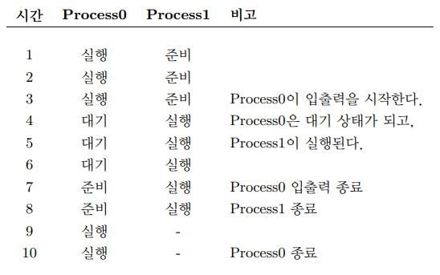
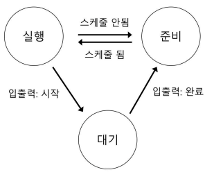
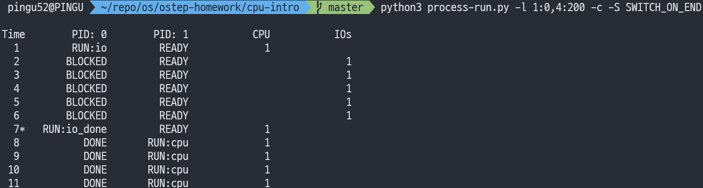

안녕하세요, pingu52입니다.

이 글은 OSTEP Part I Virtualization의 출발점입니다.  
Chapter 3 Dialogue on Virtualization은 비유로 방향을 잡아주고, Chapter 4 The Abstraction The Process에서 Process라는 핵심 abstraction을 정의합니다.

이번 글의 목표는 딱 두 가지입니다.

- Process가 무엇인지, OS가 왜 Process라는 abstraction을 제공하는지 이해합니다
- CPU virtualization이 어떻게 가능해지는지, time sharing 관점에서 감을 잡습니다

---

## 0. 실습 준비

아직 이전 글을 안 보셨다면 아래 링크에서 환경 준비와 실행 감각을 먼저 잡는 편이 좋습니다.

<https://pingu52.github.io/posts/computer-science/os-architecture/ostep-os-introduction/>

이번 글의 실습은 process-run.py로 Process states 전이를 관찰하는 데 집중합니다.  
ostep-homework 저장소가 이미 있다면 그대로 사용하고, 없다면 이전 글의 방식과 동일하게 한 번만 clone해서 준비합니다.


## 1. Dialogue on Virtualization

Virtualization은 한 개의 physical resource를 여러 개의 virtual resource처럼 보이게 만드는 것입니다.  
중요한 포인트는 사용자가 진짜로 자원이 여러 개 있다고 믿게 만드는 illusion입니다.

CPU로 옮기면 이렇게 들립니다.

- 물리 CPU는 보통 소수입니다
- 그런데 우리는 동시에 많은 프로그램을 실행합니다
- OS가 CPU virtualization을 제공하기 때문에, 각 프로그램은 자기 전용 CPU를 가진 듯한 느낌을 받습니다

이때 기본 기법이 time sharing입니다. time sharing은 용어 그대로 시간을 나눠서 번갈아 사용하는 방식입니다. 이 용어는 이후 챕터에서도 계속 그대로 쓰이므로, 이번 글에서 익숙해지는 것이 좋습니다.

---

## 2. Chapter 4의 질문, 왜 Process인가요

Chapter 4의 질문은 매우 직접적입니다.

- physical CPUs가 few인데도, OS는 어떻게 many CPUs가 있는 것처럼 보이게 할까

여기서 OS가 내놓는 답이 Process입니다.

Process는 running program입니다.  
여기서 program은 디스크에 저장된 파일 형태의 코드와 데이터 덩어리이고, 아직 실행 중이 아닙니다.  
OS가 program을 메모리에 올리고 CPU가 실행하도록 준비시킨 순간, 그 실행 단위를 Process로 부릅니다.

아래처럼 이해하는 편이 좋습니다.

- program은 저장된 설계도입니다
- Process는 실제로 움직이는 작업 단위입니다

---

## 3. Process가 있어야 CPU virtualization이 쉬워집니다

CPU virtualization의 핵심은 동시에 실행되는 것처럼 보이는 효과입니다.  
실제로 CPU가 한 개라면 동시에 실행은 불가능합니다. 그래서 OS는 다음을 반복합니다.

- Process A를 잠깐 실행합니다
- 멈춥니다
- Process B를 잠깐 실행합니다
- 다시 바꿉니다

이때 사용자는 동시에 실행되는 것처럼 느낍니다. 하지만 실제로는 매우 빠르게 번갈아 실행되는 것입니다.  
이 방식은 concurrency를 만들어내지만, 성능 비용도 있습니다. CPU를 공유하면 각 Process는 단독 실행보다 느려질 수 있습니다.

---

## 4. Time sharing과 Space sharing

### 4.1 Time sharing

time sharing은 자원을 시간 단위로 쪼개서 돌아가며 사용하는 방식입니다. CPU virtualization의 핵심 도구입니다.

- CPU를 1초씩 나눠 A, B, C에게 번갈아 배정하는 식으로 이해하면 됩니다
- 실제 OS는 1초보다 훨씬 짧은 단위로 바꾸며, 사람이 보기에는 동시에 실행되는 것처럼 보입니다

### 4.2 Space sharing

space sharing은 자원을 공간 단위로 나눠 고정 할당하는 방식입니다.

- 디스크는 공간을 나눠서 파일에게 블록을 배정합니다
- 어떤 파일이 특정 블록을 쓰고 있으면, 그 블록이 해제되기 전까지 다른 파일이 쓰지 않습니다

이처럼 CPU는 time sharing이 자연스럽고, 디스크는 space sharing이 자연스럽다는 대비가 이번 챕터의 요지 중 하나입니다.

### 4.3 Timeline example without I/O


Figure 3은 입출력이 없는 단순한 경우를 보여줍니다. Process0이 끝날 때까지 계속 실행되고, 그 다음 Process1이 실행됩니다.  
이 경우에는 switch가 적고 단순하지만, interactive workload가 많으면 response time 측면에서 불리할 수 있습니다.

### 4.4 Timeline example with I/O overlap



Figure 4는 Process0이 입출력을 시작한 뒤 대기 상태로 내려가고, 그 사이 OS가 Process1을 실행시키는 흐름입니다.  
OS 입장에서는 CPU를 놀리지 않는 것이 중요합니다. 그래서 입출력이 끝날 때까지 기다리는 Process0 대신, 준비된 Process1을 실행합니다.

이 패턴이 multiprogramming의 동기입니다.

- 입출력 장치가 느려서 기다리는 시간이 생깁니다
- 그 시간 동안 다른 Process를 실행해서 CPU utilization을 높입니다

---

## 5. Mechanism and Policy를 분리해서 보기

OS 설명은 자주 Mechanism과 Policy로 나뉩니다. 초보자 입장에서는 이렇게 잡으면 됩니다.

- Mechanism 메커니즘은 가능하게 만드는 장치입니다. 어떻게 할 수 있는가에 대한 부분입니다
- Policy 정책은 선택 기준입니다. 무엇을 먼저 할 것인가에 대한 부분입니다

CPU virtualization에 그대로 적용하면 다음입니다.

- Mechanism은 context switch로 Process A를 멈추고 Process B를 이어서 실행할 수 있게 합니다
- Policy는 scheduling policy로 지금 CPU를 누구에게 줄지 결정합니다

Policy는 목표에 따라 달라집니다.

- interactive performance, 즉 응답성을 우선할 수도 있습니다
- throughput, 즉 처리량을 우선할 수도 있습니다

이 구분을 머리에 두면, 이후 스케줄링 챕터에서 어떤 내용이 Mechanism이고 어떤 내용이 Policy인지 정리가 쉬워집니다.

---

## 6. Process를 구성하는 machine state

Process는 단순히 코드 파일이 아닙니다. 실행 중인 상태 전체가 Process입니다.  
그래서 OS는 Process를 다룰 때 machine state를 관리해야 합니다.

### 6.1 Address space

Address space는 Process가 접근할 수 있는 메모리 공간입니다. 보통 다음으로 구성됩니다.

- code instructions
- static data
- heap
- stack


Figure 1은 디스크에 있던 program이 메모리로 load되고, 그 결과 Process의 Address space가 구성되는 큰 흐름을 보여줍니다.  
heap과 stack만큼은 확실히 기억하는 편이 좋습니다.

- heap은 실행 중에 필요한 만큼 늘어나는 동적 메모리입니다
- stack은 함수 호출과 지역 변수 같은 실행 흐름을 담는 메모리입니다

### 6.2 Registers

Registers는 CPU 내부의 매우 빠른 저장소입니다. 실행의 현재 위치와 중간 결과가 여기에 있습니다.

특히 아래 항목이 자주 등장합니다.

- program counter PC 또는 instruction pointer IP, 다음에 실행할 instruction의 위치
- stack pointer, frame pointer, stack의 현재 위치와 함수 프레임 관리
- general purpose registers, 계산 결과나 임시 값을 저장

context switch가 중요한 이유는 명확합니다.  
Process를 바꿔 실행하려면, 이전 Process의 Registers 값을 저장하고 다음 Process의 Registers 값을 복원해야 합니다.

### 6.3 I/O information

Process는 디스크 파일을 열고 읽고 쓰는 일을 합니다. 그래서 I/O information도 Process의 상태에 포함됩니다.

- 열린 파일 목록
- 파일 위치 같은 메타데이터

리눅스와 유닉스 계열에서는 기본적으로 STDIN, STDOUT, STDERR 같은 표준 입출력 경로가 준비된다는 점도 함께 기억해두면 좋습니다.

---

## 7. Process API sketch

Chapter 4는 실제 system call 상세에 들어가기 전에, Process API가 무엇을 제공해야 하는지 윤곽을 줍니다.

- Create, 새로운 Process 생성
- Destroy, 문제가 있는 Process 강제 종료
- Wait, Process 종료까지 대기
- Misc control, suspend와 resume 같은 제어
- Status, runtime과 current state 조회

이 목록은 fork, exec, wait으로 구체화됩니다.

---

## 8. Process states and transitions

OS는 Process를 상태로 나눠서 관리합니다. simplified view에서 3-state model은 아래입니다.

- Running, CPU에서 실행 중
- Ready, 실행 준비 완료지만 CPU를 아직 못 받음
- Blocked, 이벤트를 기다림. 대표 원인은 입출력



Figure 2는 전이를 한 눈에 보여줍니다.

- Ready에서 Running으로 올라가는 순간이 scheduled
- Running에서 Ready로 내려오는 순간이 descheduled
- Running에서 입출력을 시작하면 Blocked로 내려가고, 입출력이 끝나면 Ready로 복귀합니다


- Blocked는 CPU가 느린 것이 아니라 입출력이 느려서 기다리는 상태입니다

---

## 9. Process list and PCB

OS는 여러 Process를 동시에 관리해야 합니다. 그래서 Process list 또는 task list 같은 자료구조를 갖습니다.  
각 Process의 정보를 담은 레코드를 PCB Process Control Block이라고 부릅니다.

PCB에는 대략 아래 정보가 들어갑니다.

- Process state
- register context
- Address space 관련 정보
- I/O information
- accounting 정보

유닉스 계열에서는 종료는 했지만 정리가 끝나지 않은 상태를 zombie state로 부른다는 점도 함께 등장합니다. 이 내용은 이후 Process API에서 wait를 배울 때 더 자연스럽게 연결됩니다.

---

## 10. 실습, process-run.py로 상태 전이 따라가기

이번 글의 실습 목표는 Process state 전이를 눈으로 확인하는 것입니다.

```bash
cd ostep-homework/cpu-intro
python3 process-run.py -l 5:100,5:100 -c -p
```


### 관찰 포인트

- Ready, Running, Blocked가 언제 바뀌는지 확인합니다
- 입출력이 섞이면 CPU utilization이 왜 좋아지는지 확인합니다
- switching behavior를 바꾸는 것이 policy 실험이라는 점을 연결합니다

```bash
python3 process-run.py -l 1:0,4:200 -c -S SWITCH_ON_END
python3 process-run.py -l 1:0,4:100 -c -S SWITCH_ON_IO
python3 process-run.py -l 3:0,5:100,5:100,5:100 -S SWITCH_ON_IO -I IO_RUN_LATER -c -p
python3 process-run.py -l 3:0,5:100,5:100,5:100 -S SWITCH_ON_IO -I IO_RUN_IMMEDIATE -c -p
```

위 옵션은 다음처럼 이해하면 됩니다.

- SWITCH_ON_END는 Process가 끝날 때만 바꿉니다



- SWITCH_ON_IO는 입출력로 Blocked가 되면 바로 다른 Process로 바꿉니다


- IO_RUN_LATER와 IO_RUN_IMMEDIATE는 입출력 처리 타이밍을 바꿔서 전이를 비교하게 해줍니다


---

## 11. 용어 정리

추상화 (Abstraction): 복잡한 세부를 감추고, 프로그램이 쓰기 쉬운 형태로 일관된 interface를 제공합니다. Process, file, address space 같은 개념이 대표적인 abstraction입니다.

가상화 (Virtualization): 물리 자원 physical resource을 프로그램 관점에서 가상 자원 virtual resource처럼 보이게 만듭니다. CPU virtualization은 물리 CPU가 여러 개처럼 보이게 하는 효과를 말합니다.

프로세스 (Process): running program입니다. 디스크에 저장된 program을 OS가 메모리에 올리고 실행 가능한 상태로 만든 실행 단위입니다.

시분할 (time sharing): 자원을 시간 단위로 쪼개 여러 주체가 번갈아 쓰는 방식입니다. CPU virtualization의 핵심 기법입니다.

공간 분할 (space sharing): 자원을 공간 단위로 나눠 고정적으로 배정하는 방식입니다. 디스크 블록을 파일에 할당하는 방식이 대표적입니다.

주소 공간 (Address space): Process가 접근 가능한 메모리 범위입니다. 보통 code, static data, heap, stack으로 구성됩니다.

레지스터 (Registers): CPU 내부의 빠른 저장소로, 실행 위치와 중간 결과 같은 machine state를 담습니다. context switch는 registers를 save and restore하는 과정입니다.

프로그램 카운터 (program counter), 인스트럭션 포인터 instruction pointer: 다음에 실행할 instruction의 위치를 가리키는 register입니다.

문맥교환 (context switch): 실행 중인 Process를 바꾸기 위해 기존 Process의 state를 저장하고, 다음 Process의 state를 복원하는 mechanism입니다.

스케줄링 (scheduling): Ready 상태의 Process 중에서 누구를 Running으로 올릴지 결정하는 과정입니다. scheduling policy는 그 선택 기준입니다.

정책 (policy): 무엇을 선택할지에 대한 기준입니다. CPU를 누구에게 먼저 줄지, 언제 바꿀지 같은 선택을 포함합니다.

메커니즘 (mechanism): 선택을 실제로 가능하게 만드는 구현 방법입니다. context switch 같은 저수준 동작이 여기에 해당합니다.

입출력 (I/O): 디스크, 네트워크, 터미널 같은 장치와 데이터를 주고받는 작업입니다. I/O가 느리면 Process는 Blocked로 내려가 이벤트를 기다립니다.

실행 (Running): CPU에서 instructions를 실제로 실행 중인 상태입니다.

준비 (Read)y: 실행 준비는 되었지만 CPU를 아직 받지 못한 상태입니다.

대기 (Blocked): 이벤트를 기다리는 상태입니다. 대표 이유는 I/O 대기입니다.

프로세스 제어 블록 (PCB, Process Control Block): 각 Process의 핵심 정보를 담는 자료구조 entry입니다. state, register context, address space 정보, I/O 정보 등이 들어갑니다.

멀티프로그래밍 (multiprogramming): I/O로 기다리는 시간이 생길 때 다른 Process를 실행해 CPU utilization을 높이려는 접근입니다.

CPU 활용률 (CPU utilization): CPU가 유용한 일을 하고 있는 비율입니다. I/O 대기 시간을 다른 Process 실행으로 메우면 utilization이 올라갑니다.

좀비 상태 (zombie state): Process가 exit했지만, 부모 Process가 wait로 종료 코드를 회수하지 않아 정리가 끝나지 않은 상태입니다.

---

다음 글에서는 Process API를 system call 관점으로 확장합니다. fork, exec, wait가 어떻게 Process creation과 연결되는지 이어서 정리하겠습니다.
