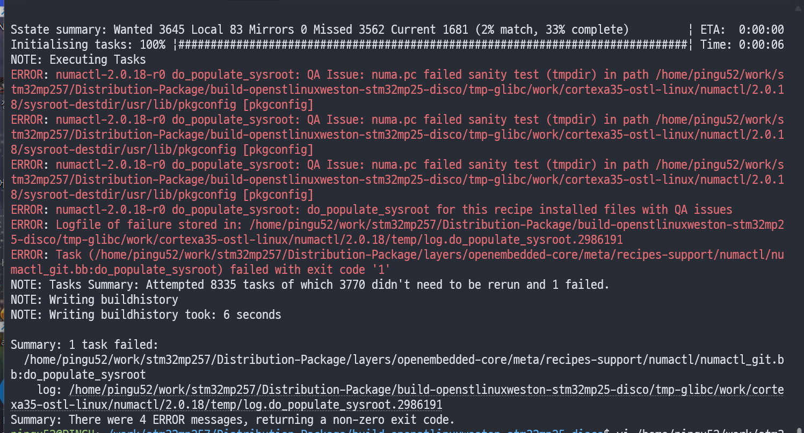
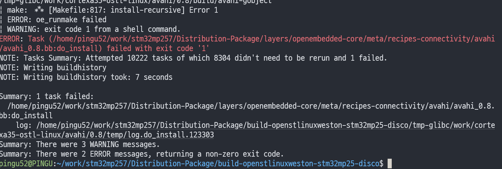
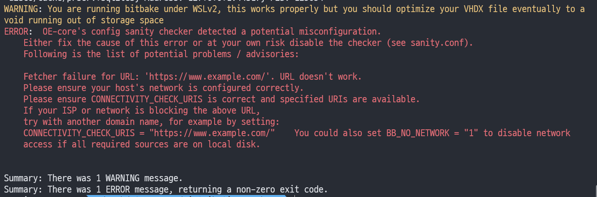
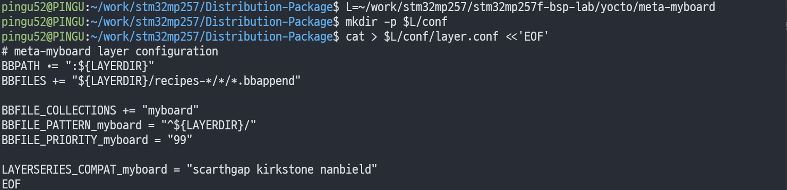
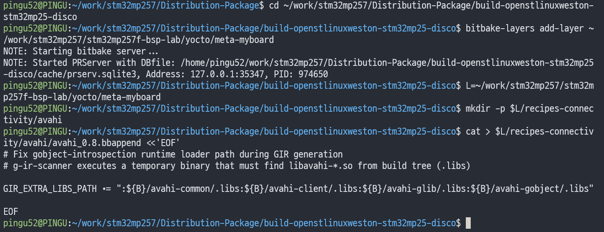
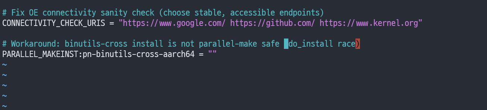
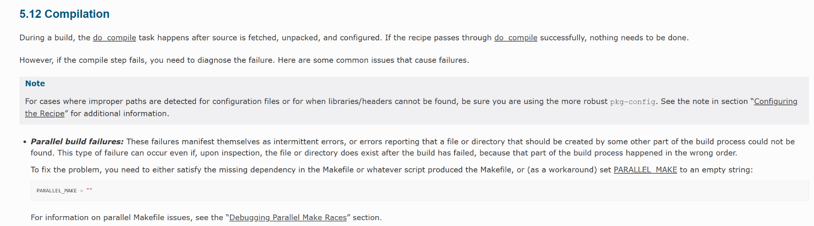
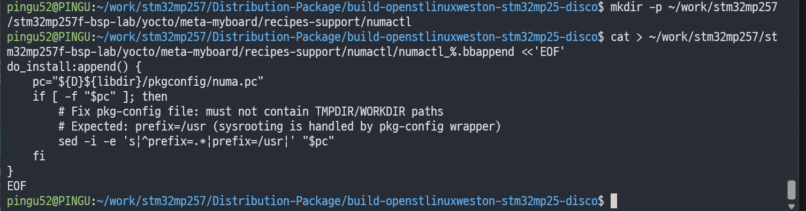
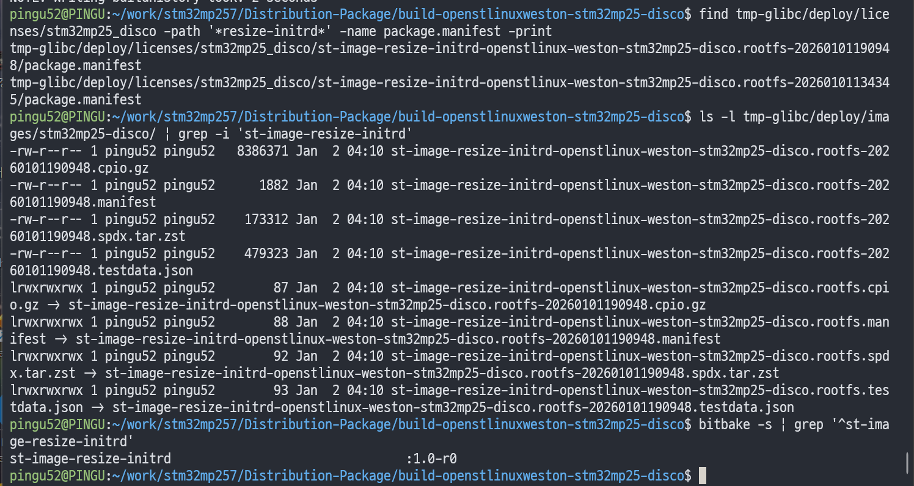

안녕하세요, pingu52입니다.

Yocto/OpenEmbedded 빌드는 패키지 수가 많고, 호스트 환경·네트워크·병렬성·QA 규칙 등 변수가 많아서 **레시피 단위로 간헐/고질적인 빌드 실패**가 발생할 수 있습니다.  
이 글에서는 ST OpenSTLinux 환경에서 실제로 만난 실패 유형을 예시로 들며, **벤더 레이어를 건드리지 않고** `meta-myboard` 같은 커스텀 레이어에서 `.bbappend`로 해결하는 방식(유지보수 가능한 패턴)을 정리합니다.

---

## 1. 문제 상황

### 1.1 numactl: pkg-config QA(sanity) 실패



요약하면 `.pc` 파일에 TMPDIR/WORKDIR 같은 “빌드 경로”가 남아 QA 검사에서 실패하는 케이스입니다.

### 1.2 avahi: gobject-introspection(g-ir-scanner) 관련 do_install 실패



`g-ir-scanner`가 임시 바이너리를 실행할 때 런타임 로더가 빌드 트리의 `libavahi*.so`를 찾지 못해 실패하는 유형입니다.

### 1.3 네트워크 sanity check 실패(Connectivity check)



빌드 자체가 아니라 “환경 점검” 단계에서 외부 접속 확인이 실패해 중단되는 케이스입니다.

---

## 2. 해결: 커스텀 레이어(meta-myboard)에서 bbappend로 오버레이

벤더 레이어(예: `meta-st-*`, `openembedded-core`)를 직접 수정하면 업스트림 업데이트/리베이스 때 충돌이 쉽게 생깁니다.  
가장 유지보수하기 좋은 패턴은

1. 내 레이어(`meta-myboard`)를 만들고  
2. `bitbake-layers add-layer`로 빌드에 추가한 뒤  
3. `.bbappend`로 필요한 부분만 오버레이

### 2.1 meta-myboard 구성(layers.conf/layer.conf)



레이어 등록 후에는 아래 명령으로 정상 인식 여부를 확인합니다.

```bash
bitbake-layers show-layers | grep -E "myboard|meta-myboard"
```

### 2.2 오버레이(appends) 적용 여부 확인

어떤 레시피가 `.bbappend`로 오버레이되는지는 다음으로 확인할 수 있습니다.

```bash
bitbake-layers show-appends | grep -i <recipe>
```



---

## 3. sanity(Connectivity check) 우회/수정: CONNECTIVITY_CHECK_URIS

이 경우 `local.conf`에서 체크용 URI를 신뢰할 수 있는 엔드포인트로 바꾸는 방식이 현실적입니다.

### 3.1 local.conf 튜닝 예시



```conf
# conf/local.conf
CONNECTIVITY_CHECK_URIS = "https://www.google.com/ https://www.st.com/"
```

---

## 4. 병렬 설치/경쟁 조건(race) 완화: PARALLEL_MAKEINST(필요 시)

간헐적으로 “있어야 할 파일이 없다” 유형의 실패가 난다면, Makefile 의존성이 완전하지 않아서 병렬 설치 시 순서가 꼬이는 경우가 있습니다.  
이때는 문제 패키지에 한해 설치 단계의 병렬성을 끄는 것이 우회책이 될 수 있습니다.

Yocto 문서에서도 **병렬 빌드 실패(parallel build failures)**가 간헐적으로 나타날 수 있으며, 워크어라운드로 `PARALLEL_MAKE`를 비우는 방법 등을 언급합니다.

### 4.1 문서 예시



### 4.2 특정 패키지에 한정해 병렬성 조정 예시

```conf
# conf/local.conf
PARALLEL_MAKEINST:pn-binutils-cross-aarch64 = ""
```

> 패키지별 override는 실제 실패 패키지 이름(`pn-...`)에 맞춰 적용합니다.

---

## 5. avahi do_install 실패 해결: GIR_EXTRA_LIBS_PATH 보강

`g-ir-scanner`는 임시 바이너리를 실행하면서 심볼을 분석합니다. 이때 동적 로더가 빌드 트리의 `.libs`에 있는 `libavahi*.so`를 찾지 못하면 실패합니다.  
해결은 `avahi_0.8.bbappend`에서 gobject-introspection이 참조하는 라이브러리 경로를 추가해주는 방식이 깔끔합니다.

### 5.1 bbappend 예시

```bash
# meta-myboard/recipes-connectivity/avahi/avahi_0.8.bbappend
# g-ir-scanner executes a temporary binary that must find libavahi-*.so from build tree (.libs)

GIR_EXTRA_LIBS_PATH += ":${B}/avahi-common/.libs:${B}/avahi-client/.libs:${B}/avahi-glib/.libs:${B}/avahi-gobject/.libs"
```


### 5.2 적용 후 재빌드

```bash
bitbake -c cleansstate avahi
bitbake avahi
```

---

## 6. numactl pkg-config QA 실패 해결: numa.pc의 prefix 정리

`numa.pc`가 빌드/스테이징 경로를 그대로 품고 있으면 QA에서 “tmpdir sanity test”로 실패합니다.  
Yocto에서 `pkg-config`는 래퍼를 통해 sysroot 처리를 하기 때문에 `.pc`의 `prefix`는 보통 `/usr` 형태로 두는 편이 안전합니다.

### 6.1 bbappend 예시

```bash
# meta-myboard/recipes-support/numactl/numactl_%.bbappend

do_install:append() {
    pc="${D}${libdir}/pkgconfig/numa.pc"
    if [ -f "$pc" ]; then
        # Fix pkg-config file: must not contain TMPDIR/WORKDIR paths
        # Expected: prefix=/usr (sysrooting is handled by pkg-config wrapper)
        sed -i -e 's|^prefix=.*|prefix=/usr|' "$pc"
    fi
}
```



### 6.2 적용 후 재빌드

```bash
bitbake -c cleansstate numactl
bitbake numactl
```

---

## 7. 빌드 산출물/상태 확인

이미지 빌드가 완료되면 `tmp-glibc/deploy/images/<machine>/`에 결과물이 생성됩니다.  
또한 “생성된 파일이 없다는 경고”가 나오면, 실제 deploy에 생성되었는지 `find`나 `ls`로 확인하는 것이 빠릅니다.

### 7.1 deploy 산출물 확인 예시



---

## 참고 자료

- Yocto Project Documentation: <https://docs.yoctoproject.org/>
- Yocto Project Reference Manual (Variables 포함): <https://docs.yoctoproject.org/ref-manual/>
- BitBake User Manual: <https://docs.yoctoproject.org/bitbake/>
- OpenEmbedded-Core(OE-Core) 소스 트리: <https://git.openembedded.org/openembedded-core/>
- sanity.bbclass (CONNECTIVITY_CHECK_URIS 등 확인용): <https://git.openembedded.org/openembedded-core/tree/meta/classes-global/sanity.bbclass>
- gobject-introspection.bbclass (GIR_* 변수 확인용): <https://git.openembedded.org/openembedded-core/tree/meta/classes-recipe/gobject-introspection.bbclass>
