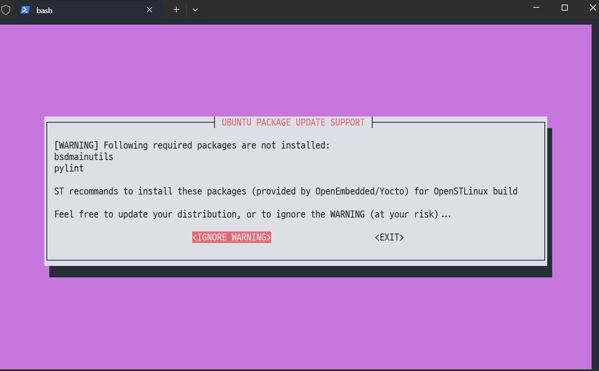
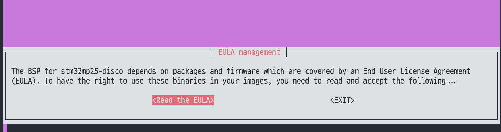
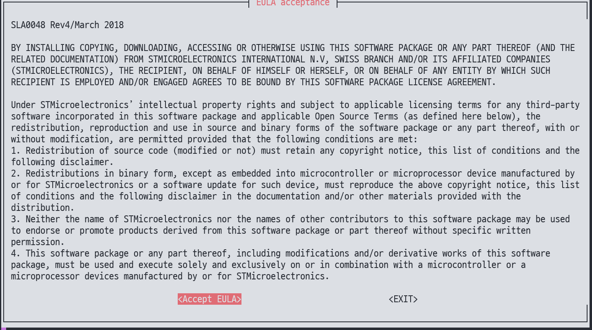
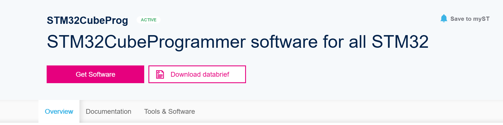
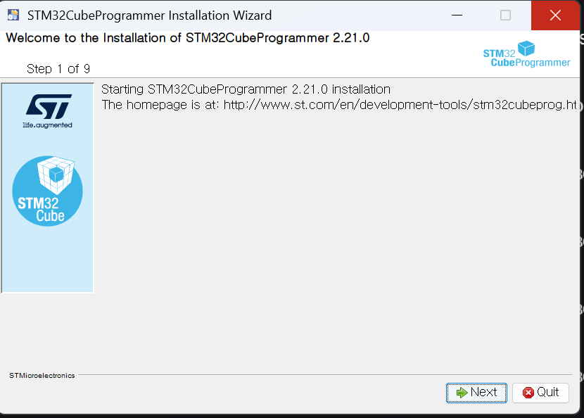
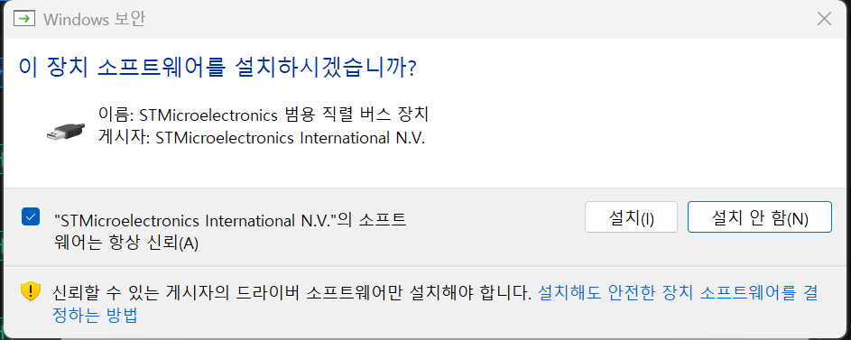

안녕하세요, pingu52입니다.

이 글은 **OpenSTLinux(=ST의 Yocto 배포 구성)**를 기준으로, `stm32mp25-disco` 타깃에서 **첫 이미지 빌드**까지 가는 “실행 가능한 절차”를 정리합니다.  
(환경은 WSL2/Ubuntu를 가정하지만, 일반 Ubuntu 호스트에서도 동일하게 적용됩니다.)

---

## 1) 사전 준비: 호스트 패키지(의존성) 설치

OpenEmbedded/Yocto는 빌드 호스트에 필요한 패키지(컴파일러/툴/파서 등)가 꽤 많습니다.  
ST 배포 패키지는 호스트에 빠진 패키지를 경고로 알려주는 경우가 많습니다.

*빌드 환경에서 필수(또는 권장) 패키지가 누락되면 이런 경고가 나타납니다.*

가능하면 **Yocto 공식 문서(지원 호스트 배포판/필수 패키지 목록)**와, **ST 배포 패키지 문서의 Host dependencies** 섹션을 함께 확인해 설치하는 것을 권장합니다.

---

## 2) 빌드 환경 초기화: envsetup 적용

ST 배포는 보통 환경 초기화 스크립트를 제공합니다. 이 스크립트가 다음을 구성합니다.

- 빌드 디렉토리(`build-*`) 생성/선택
- `bblayers.conf`, `local.conf` 기본값 설정
- 필요한 레이어 경로/환경 변수 설정

*환경 초기화 후 `bitbake <image>`로 빌드를 시작합니다.*

---

## 3) 타깃 선택: MACHINE / DISTRO / 이미지 레시피

보통 다음 조합이 핵심입니다.

- `MACHINE = "stm32mp25-disco"` (보드 타깃)
- `DISTRO = "openstlinux-weston"` (예: Weston 기반 데스크톱/그래픽 스택)
- 이미지 레시피: `st-image-weston` 등

설정은 보통 `conf/local.conf`에서 이루어집니다.

---

## 4) EULA(라이선스) 승인 이슈: 처음 막히는 지점 처리

ST 배포는 특정 바이너리/펌웨어/패키지에서 **EULA 승인**이 필요할 수 있습니다.  
승인이 되지 않으면 다운로드/빌드 단계에서 중단됩니다.

*EULA를 승인/관리하는 UI가 제공되는 경우가 있습니다.*

*승인 절차는 문서/환경에 따라 다를 수 있으니, 해당 패키지의 안내를 따르는 것이 안전합니다.*

---

## 5) 첫 빌드 실행: st-image-weston

첫 빌드는 시간이 많이 걸립니다(툴체인/기본 패키지/이미지 조합 전체).  
중단되더라도 당황하지 말고 **어떤 태스크에서 실패했는지**를 먼저 확인하세요.

- 실패 지점: `ERROR: <recipe> ... do_compile/do_install/do_rootfs ...`
- 상세 로그: `tmp-glibc/work/<...>/temp/log.do_<task>.*`

---

## 6) 결과물 확인 위치

빌드 산출물은 보통 다음 경로에 모입니다.

- 이미지/커널/DT/부트로더 등: `tmp-glibc/deploy/images/<machine>/`
- 라이선스/SPDX: `tmp-glibc/deploy/licenses/...`

ST 배포는 `*.ext4`, `*.wic`, `*.tar.gz`, `*.spdx.*` 등 여러 형태로 산출될 수 있습니다.

---

## 7) 보드 플래싱 도구: STM32CubeProgrammer(선택)

보드에 이미지를 올리려면 ST가 제공하는 도구(예: STM32CubeProgrammer)를 쓰는 경우가 많습니다.

ST 다운로드는 MyST 계정 로그인이 요구되는 경우가 있습니다.

Windows에서 설치하는 경우, 설치 중 드라이버 설치 안내가 뜰 수 있습니다.

---

## 참고 자료

- [Yocto Project Documentation](https://docs.yoctoproject.org/)
- [Yocto Project Reference Manual](https://docs.yoctoproject.org/ref-manual/)
- [ST STM32MPU Wiki(메인)](https://wiki.st.com/stm32mpu/wiki/Main_Page)
- [STM32CubeProgrammer](https://www.st.com/en/development-tools/stm32cubeprog.html)
