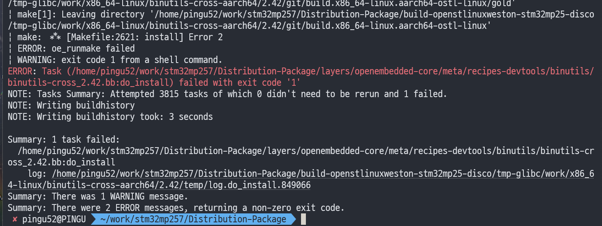

안녕하세요, pingu52입니다.

이 글은 **STM32MP25(= STM32MP2 시리즈) + OpenSTLinux** 기준으로, **DP(Distribution Package) 확보 → 환경 초기화 → 이미지(`st-image-weston`) 빌드 → 산출물 확인** 순서로 정리합니다.

> 전제: 보드는 `stm32mp25-disco(stm32mp257f-dk)`, DISTRO는 `openstlinux-weston`을 기준으로 설명합니다.  
> (다른 보드도 흐름은 같고, `MACHINE/DISTRO` 값만 바뀝니다.)

---

## 0. 먼저 짚고 가기: DP vs Starter Package

- **Starter Package**: “보드가 부팅되는 기준 이미지”를 제공(초기 보드 점검/플래시 파티션 구성 확인에 중요)
- **Distribution Package(DP)**: Yocto/OpenEmbedded 기반 **소스 트리**(레이어/레시피/빌드 스크립트 포함). 여기서 직접 빌드해서 이미지를 만든다.

ST도 “Starter Package로 보드가 정상 부팅되는 것”을 먼저 확인한 뒤 DP로 넘어가길 권장합니다.

---

## 1. 작업 디렉토리/디스크/WSL2 주의사항

### 1.1 경로 길이

Yocto는 **절대 경로 길이** 때문에 파일명이 길어지면 빌드가 실패할 수 있습니다.  
따라서 DP는 너무 깊은 경로(예: `/home/<user>/very/long/...`)에 두지 말고, 가능하면 짧게 잡으세요.

예) `~/work/stm32mp25/Distribution-Package` 처럼

### 1.2 디스크 여유

DP 자체는 크지 않지만, **빌드 산출물 포함하면 수십 GB**가 필요합니다(최소 30GB 이상을 잡는 것이 안전).

### 1.3 WSL2 사용 시

- 가능하면 DP/빌드 디렉토리는 **WSL 리눅스 파일시스템(/home)** 쪽에 두세요. (`/mnt/c` 등 Windows 파일시스템은 체감 성능이 크게 떨어질 수 있음)

---

## 2. 호스트(WSL2/Ubuntu) 패키지 설치

아래는 ST가 OpenEmbedded/Yocto 빌드를 위해 예시로 제시하는 Ubuntu 패키지 목록(필수/권장 포함)입니다.

> Ubuntu 24.04 기준

```bash
sudo apt-get update

# Yocto/OpenEmbedded 빌드 기본 패키지
sudo apt-get install gawk wget git git-lfs diffstat unzip texinfo gcc-multilib chrpath socat cpio python3 python3-pip python3-pexpect xz-utils debianutils iputils-ping python3-git python3-jinja2 libsdl1.2-dev pylint xterm bsdmainutils libusb-1.0-0 bison flex

# 추가로 자주 필요한 패키지들
sudo apt-get install libssl-dev libgmp-dev libmpc-dev lz4 zstd

# (Ubuntu 22.04 only) ST 문서에 언급된 추가 패키지
sudo apt-get install libegl1-mesa
```

`repo`를 설치하려면 Python 기본을 `python3`로 맞추는 과정이 필요할 수 있어, ST 문서에서는 다음도 안내합니다.

```bash
sudo apt-get install python-is-python3
```


*ST 스크립트가 “필수/권장 패키지 누락”을 감지하면 이런 안내가 뜹니다.*

---

## 3. repo(Repo tool) 설치/검증

ST의 DP는 “manifest + repo” 방식으로 내려받는 것이 기본 흐름입니다.  
Ubuntu에서는 우선 apt로 설치를 시도하고, 안 되면 수동 설치(검증 포함)로 진행하면 됩니다.

### 3.1 apt로 설치
```bash
sudo apt-get update
sudo apt-get install repo
repo version
```

### 3.2 수동 설치(apt가 안 될 때)
```bash
export REPO=$(mktemp /tmp/repo.XXXXXXXXX)
curl -o ${REPO} https://storage.googleapis.com/git-repo-downloads/repo
gpg --recv-keys 8BB9AD793E8E6153AF0F9A4416530D5E920F5C65
curl -s https://storage.googleapis.com/git-repo-downloads/repo.asc | gpg --verify - ${REPO} && install -m 755 ${REPO} ~/bin/repo

# PATH에 ~/bin이 없다면 추가
echo 'export PATH="$HOME/bin:$PATH"' >> ~/.bashrc
source ~/.bashrc

repo version
```

---

## 4. DP(Distribution Package) 받기: repo init + repo sync

이제 실제로 “Distribution-Package” 소스 트리를 받습니다.

### 4.1 작업 디렉토리 만들기
```bash
mkdir -p ~/work/stm32mp25/Distribution-Package
cd ~/work/stm32mp25/Distribution-Package
```

### 4.2 repo init (ST manifest / tag)
ST 문서 기준으로 OpenSTLinux 배포는 **manifest repo + tag(revision)**로 제공됩니다.  
아래에서는 ST 위키/문서에 안내된 **release revision(tag)** 를 그대로 사용합니다.

```bash
repo init -u https://github.com/STMicroelectronics/oe-manifest.git \
  -b refs/tags/openstlinux-6.6-yocto-scarthgap-mpu-v25.08.27
```

> 참고
> - `repo init` 중간에 “ERROR 404”가 보일 수 있으나, ST 문서에서는 프로세스에 영향이 없을 수 있다고 언급합니다.
> 위 tag가 “항상 최신”은 아닐 수 있습니다. (ST 위키의 minor release 안내를 우선으로 따라가세요.)

### 4.3 repo sync
```bash
repo sync
```

네트워크/디스크/CPU에 따라 시간이 꽤 걸립니다.  
완료되면 대략 아래와 같은 트리(`layers/meta-st/scripts/envsetup.sh` 포함)가 구성됩니다.

```
Distribution-Package/
├─ layers/
│  ├─ meta-openembedded/
│  ├─ meta-st/
│  │  ├─ meta-st-openstlinux/
│  │  ├─ meta-st-stm32mp/
│  │  └─ scripts/envsetup.sh
│  └─ openembedded-core/
└─ ...
```

---

## 5. 빌드 환경 초기화: envsetup

DP 루트에서 아래 명령을 실행합니다.

```bash
DISTRO=openstlinux-weston MACHINE=stm32mp25-disco source layers/meta-st/scripts/envsetup.sh
```


*보통 envsetup 후 같은 셸에서 `bitbake <image>`를 이어서 실행합니다.*

envsetup 스크립트는 보통 다음을 자동으로 합니다.

- `build-<distro>-<machine>` 형식의 빌드 디렉토리를 생성/이동
- `conf/local.conf`, `conf/bblayers.conf` 기본 구성 생성

예: `build-openstlinux-weston-stm32mp25-disco/`

> - 반드시 **bash**에서 실행하세요.

---

## 6. local.conf에서 MACHINE/DISTRO 확인

envsetup 이후 현재 디렉토리는 빌드 디렉토리이며, 설정 파일은 `conf/`에 있습니다.

```bash
pwd
ls conf
grep -nE '^(MACHINE|DISTRO)\s*=' conf/local.conf
```

예상:
- `MACHINE = "stm32mp25-disco"`
- `DISTRO = "openstlinux-weston"`

---

## 7. 이미지 빌드: st-image-weston

이제 이미지 빌드를 시작합니다.

```bash
bitbake st-image-weston
```

첫 빌드는 툴체인/기본 패키지까지 전부 빌드하므로 시간이 많이 걸립니다.  
실패하면 “어떤 레시피/태스크에서 실패했는지”부터 잡는 게 정석입니다.

### 7.1 실패 로그 확인
에러 메시지에는 보통 이런 형태가 포함됩니다.

- `ERROR: <recipe> ... do_fetch/do_compile/do_install/do_rootfs ...`

상세 로그는 대개 다음에 있습니다.

- `tmp-glibc/work/<...>/temp/log.do_<task>.*`


*에러 하단에 실패한 레시피/태스크와 `log.do_<task>` 경로가 같이 출력됩니다.*

---

## 8. 산출물 확인 위치

빌드가 끝나면 산출물은 일반적으로 다음에 모입니다.

- 이미지/커널/DT/부트로더 등:  
  `tmp-glibc/deploy/images/stm32mp25-disco/`

여기서 `.wic`, `.ext4`, `FlashLayout_*.tsv` 등 “보드에 올릴 때 필요한 것”까지 함께 나오는 경우가 많습니다.

---

## 9. 참고 자료

- ST Wiki: STM32MPU Distribution Package (OpenSTLinux 설치/빌드 개요): <https://wiki.st.com/stm32mpu/wiki/Main_Page>
- ST Wiki: PC prerequisites (호스트 패키지/WSL2/AppArmor/Locale 등): <https://wiki.st.com/stm32mpu/wiki/Main_Page>
- Yocto Project Documentation: <https://docs.yoctoproject.org/>
