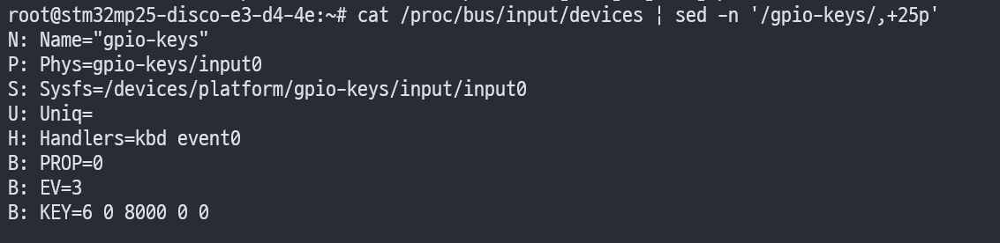
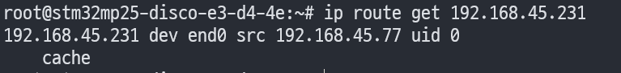
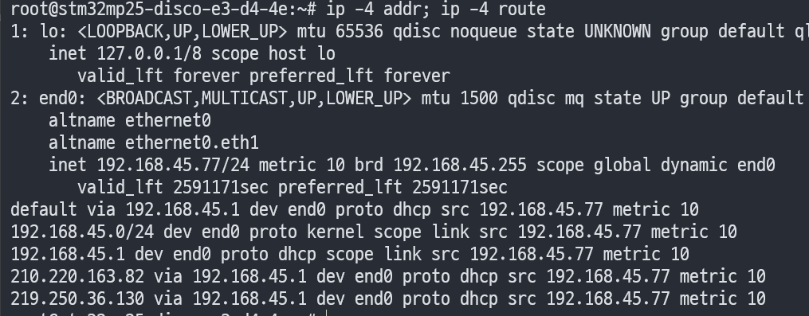
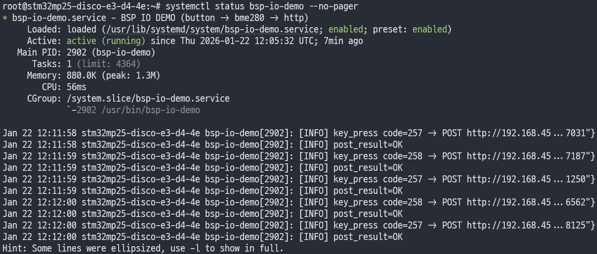
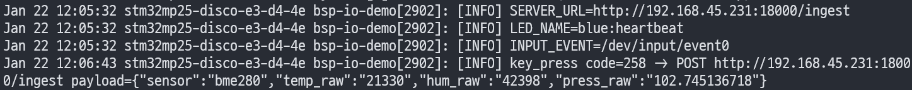
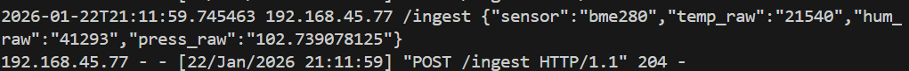
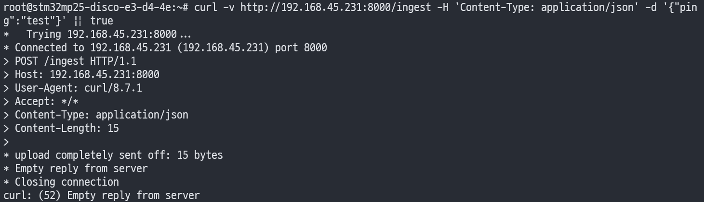
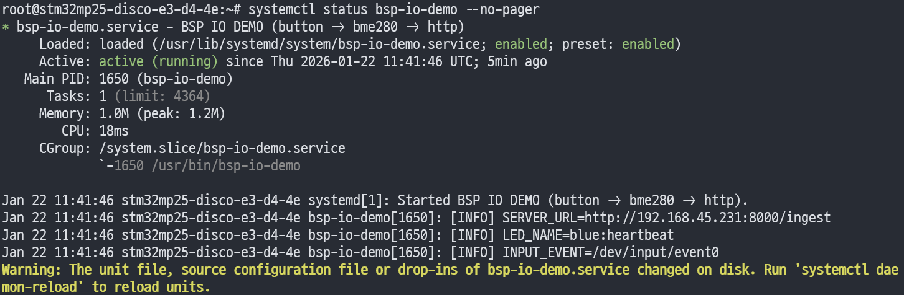

안녕하세요, pingu52입니다.

임베디드 I/O 기초: GPIO/I2C/SPI/UART 실습의 형태로, **보드에서 이벤트가 발생하면 센서값을 읽어 서버로 전송하는 최소 경로(DoD)** 를 구현해 봤습니다.

저는 아직 외부 LED/버튼 부품이 없어서, **보드에 기본으로 탑재된 버튼(gpio-keys → /dev/input/eventX)** 과 **기본 LED(/sys/class/leds)** 를 활용했습니다. I2C 센서는 앞서 bring-up 한 **BME280(IIO sysfs)** 를 그대로 재사용합니다.

---

## 구성 개요

- 입력(GPIO): 보드 기본 버튼 → Linux input subsystem(`/dev/input/event0`) 이벤트 감지
- 센서(I2C): BME280 → IIO sysfs(`in_temp_input`, `in_humidityrelative_input`, `in_pressure_input`) 값 읽기
- 네트워크: userspace에서 HTTP POST(JSON)로 서버 전송
- 서비스: systemd로 부팅 시 자동 실행

구성 흐름은 아래 한 줄로 요약됩니다.

> **button(gpio-keys) → bme280(IIO) → HTTP POST(JSON)**

---

## 전제 조건

- OpenSTLinux 부팅 완료, root 쉘 접근 가능
- BME280 bring-up 완료(IIO sysfs에서 값 읽기 가능)
- 보드가 서버(PC)와 같은 L2/L3 망에 있고, HTTP 포트가 열려 있음

---

## 1. 버튼(gpio-keys) / LED 리소스 확인

### 1.1 gpio-keys가 어떤 input event로 잡혔는지 확인

보드에 기본으로 올라간 버튼은 보통 `gpio-keys`로 구성되어 있고, 결과적으로 Linux에서는 **키보드 이벤트처럼** `/dev/input/eventX`로 노출됩니다.

```bash
cat /proc/bus/input/devices | sed -n '/gpio-keys/,+25p'
```

아래처럼 `Name="gpio-keys"`, `Handlers=kbd event0`가 보이면, 이 보드에서는 버튼 이벤트가 `/dev/input/event0`으로 들어온다는 의미입니다.



:::TIP
`evtest /dev/input/event0`(패키지 설치 필요)로도 쉽게 키 코드가 확인됩니다.
:::

### 1.2 LED class 디바이스 확인 및 수동 제어

보드 기본 LED는 `/sys/class/leds/` 아래에 노출됩니다.

```bash
ls -1 /sys/class/leds
```

예를 들어 `blue:heartbeat` 같은 이름이 보이면, 아래처럼 **트리거를 끄고(=none) 밝기를 직접 제어**할 수 있습니다.

```bash
LED=blue:heartbeat

# 현재 trigger 확인
cat /sys/class/leds/${LED}/trigger

# 트리거를 none으로 바꾸면 brightness로 직접 제어 가능
echo none > /sys/class/leds/${LED}/trigger

# ON/OFF
echo 1 > /sys/class/leds/${LED}/brightness
sleep 1
echo 0 > /sys/class/leds/${LED}/brightness
```

---

## 2. 서버(PC) 준비: 최소 수신기(recv.py)

저는 PC에서 간단히 Python HTTP 서버로 `/ingest`를 받아 로그로 찍는 방식으로 시작했습니다.

### 2.1 ping이 안 되는데 HTTP가 되는 경우

처음에 서버 IP로 ping이 안 간다에서 멈출 수 있는데, Windows 방화벽 정책 등에 따라 **ICMP Echo(ping)만 막고 TCP는 허용**되는 구성이 흔합니다.

실제로 보드에서 라우팅은 정상으로 잡혀 있었습니다.



그리고 TCP 레벨에서는 연결까지는 되었지만, 서버가 예외로 죽어서 `Empty reply from server`가 발생하는 상태였습니다.



따라서 이 단계에서는 ping 유무보다 **HTTP 요청이 정상 응답(예: 204/200)을 받는지**를 먼저 확인하는 편이 작업이 빠릅니다.

### 2.2 수신 서버 코드(예외 수정 포함)

아래는 제가 사용한 최소 수신 서버입니다.

```python
# recv.py

from http.server import BaseHTTPRequestHandler, HTTPServer
from datetime import datetime

class Handler(BaseHTTPRequestHandler):
    def do_POST(self):
        n = int(self.headers.get('Content-Length', '0'))
        body = self.rfile.read(n).decode('utf-8', errors='replace')

        ts = datetime.now().isoformat(timespec='microseconds')
        print(f"{ts} {self.client_address[0]} {self.path} {body}")

        # 204 No Content
        self.send_response(204)
        self.end_headers()

    def log_message(self, fmt, *args):
        # 기본 access log를 끄고 싶으면 pass
        return

if __name__ == '__main__':
    addr = ('0.0.0.0', 18000)
    print(f"listening on http://{addr[0]}:{addr[1]}/ingest")
    HTTPServer(addr, Handler).serve_forever()
```

실행:

```bash
python recv.py
```

---

## 3. userspace 앱(bsp-io-demo): 버튼 이벤트로 BME280 읽고 HTTP POST

### 3.1 동작 요구사항(DoD)

- 버튼 입력 발생 → BME280 센서값 1회 읽기
- JSON payload 구성 → 서버 `/ingest`로 HTTP POST
- 성공/실패를 journal 로그로 남기기

### 3.2 참고 구현(단일 C 파일)

아래는 최소 동작을 목표로 한 단일 파일 구현 예시입니다.

- 입력: `/dev/input/event0`에서 `struct input_event` 읽기
- 센서: IIO sysfs 파일을 직접 읽기(값 없으면 error payload)
- 전송: libcurl로 HTTP POST
- 설정: `SERVER_URL`, `INPUT_EVENT`, `LED_NAME` 환경변수로 런타임 주입

```c
// bsp-io-demo.c

#define _GNU_SOURCE
#include <errno.h>
#include <fcntl.h>
#include <linux/input.h>
#include <signal.h>
#include <stdio.h>
#include <stdlib.h>
#include <stdarg.h>
#include <string.h>
#include <sys/stat.h>
#include <sys/types.h>
#include <time.h>
#include <unistd.h>

#include <curl/curl.h>

static volatile int g_stop = 0;

static void on_sigint(int sig) {
    (void)sig;
    g_stop = 1;
}

static void logi(const char *fmt, ...) {
    va_list ap;
    va_start(ap, fmt);
    printf("[INFO] ");
    vprintf(fmt, ap);
    printf("\n");
    fflush(stdout);
    va_end(ap);
}

static void logw(const char *fmt, ...) {
    va_list ap;
    va_start(ap, fmt);
    printf("[WARN] ");
    vprintf(fmt, ap);
    printf("\n");
    fflush(stdout);
    va_end(ap);
}

static int read_file_to_buf(const char *path, char *buf, size_t buflen) {
    int fd = open(path, O_RDONLY | O_CLOEXEC);
    if (fd < 0) return -1;
    ssize_t n = read(fd, buf, buflen - 1);
    close(fd);
    if (n <= 0) return -1;
    buf[n] = '\0';
    // trim newline
    char *p = strchr(buf, '\n');
    if (p) *p = '\0';
    return 0;
}

static int write_str(const char *path, const char *s) {
    int fd = open(path, O_WRONLY | O_CLOEXEC);
    if (fd < 0) return -1;
    ssize_t n = write(fd, s, strlen(s));
    close(fd);
    return (n == (ssize_t)strlen(s)) ? 0 : -1;
}

static void led_pulse_once(const char *led_name) {
    if (!led_name || !*led_name) return;

    char trig[256];
    char bri[256];
    snprintf(trig, sizeof(trig), "/sys/class/leds/%s/trigger", led_name);
    snprintf(bri, sizeof(bri), "/sys/class/leds/%s/brightness", led_name);

    // best-effort: disable trigger and pulse
    (void)write_str(trig, "none");
    (void)write_str(bri, "1");
    usleep(80 * 1000);
    (void)write_str(bri, "0");
}

static int find_bme280_iio(char *out_dir, size_t out_len) {
    // 아주 단순하게 iio:device0~9를 훑어보고 name==bme280인지 확인
    for (int i = 0; i < 10; i++) {
        char namep[128];
        char name[64];
        snprintf(namep, sizeof(namep), "/sys/bus/iio/devices/iio:device%d/name", i);
        if (read_file_to_buf(namep, name, sizeof(name)) == 0) {
            if (strcmp(name, "bme280") == 0 || strcmp(name, "bmp280") == 0) {
                snprintf(out_dir, out_len, "/sys/bus/iio/devices/iio:device%d", i);
                return 0;
            }
        }
    }
    return -1;
}

static int read_bme280_raw(long *temp_raw, long *hum_raw, double *press_kpa) {
    char base[128];
    if (find_bme280_iio(base, sizeof(base)) < 0) {
        return -1;
    }

    char p_temp[256], p_hum[256], p_press[256];
    char b[64];

    snprintf(p_temp, sizeof(p_temp), "%s/in_temp_input", base);
    snprintf(p_hum, sizeof(p_hum), "%s/in_humidityrelative_input", base);
    snprintf(p_press, sizeof(p_press), "%s/in_pressure_input", base);

    if (read_file_to_buf(p_temp, b, sizeof(b)) < 0) return -1;
    *temp_raw = strtol(b, NULL, 10);

    if (read_file_to_buf(p_hum, b, sizeof(b)) < 0) return -1;
    *hum_raw = strtol(b, NULL, 10);

    if (read_file_to_buf(p_press, b, sizeof(b)) < 0) return -1;
    long press_pa = strtol(b, NULL, 10);

    // Pa -> kPa (102739 Pa -> 102.739 kPa)
    *press_kpa = ((double)press_pa) / 1000.0;
    return 0;
}

static size_t discard_cb(void *ptr, size_t size, size_t nmemb, void *userdata) {
    (void)ptr; (void)userdata;
    return size * nmemb;
}

static int http_post_json(const char *url, const char *json) {
    CURL *curl = curl_easy_init();
    if (!curl) return -1;

    struct curl_slist *hdrs = NULL;
    hdrs = curl_slist_append(hdrs, "Content-Type: application/json");

    curl_easy_setopt(curl, CURLOPT_URL, url);
    curl_easy_setopt(curl, CURLOPT_HTTPHEADER, hdrs);
    curl_easy_setopt(curl, CURLOPT_POSTFIELDS, json);
    curl_easy_setopt(curl, CURLOPT_WRITEFUNCTION, discard_cb);
    curl_easy_setopt(curl, CURLOPT_TIMEOUT, 3L);

    CURLcode rc = curl_easy_perform(curl);

    long http_code = 0;
    curl_easy_getinfo(curl, CURLINFO_RESPONSE_CODE, &http_code);

    curl_slist_free_all(hdrs);
    curl_easy_cleanup(curl);

    if (rc != CURLE_OK) {
        return -1;
    }
    if (http_code < 200 || http_code >= 300) {
        return -1;
    }
    return 0;
}

int main(void) {
    signal(SIGINT, on_sigint);
    signal(SIGTERM, on_sigint);

    const char *server_url = getenv("SERVER_URL");
    const char *input_event = getenv("INPUT_EVENT");
    const char *led_name = getenv("LED_NAME");

    if (!server_url) server_url = "http://192.168.45.231:18000/ingest";
    if (!input_event) input_event = "/dev/input/event0";
    if (!led_name) led_name = "blue:heartbeat";

    logi("SERVER_URL=%s", server_url);
    logi("LED_NAME=%s", led_name);
    logi("INPUT_EVENT=%s", input_event);

    if (curl_global_init(CURL_GLOBAL_DEFAULT) != 0) {
        logw("curl_global_init failed");
        return 1;
    }

    int fd = open(input_event, O_RDONLY | O_CLOEXEC);
    if (fd < 0) {
        logw("open(%s) failed: %s", input_event, strerror(errno));
        curl_global_cleanup();
        return 1;
    }

    while (!g_stop) {
        struct input_event ev;
        ssize_t n = read(fd, &ev, sizeof(ev));
        if (n < 0) {
            if (errno == EINTR) continue;
            logw("read input_event failed: %s", strerror(errno));
            break;
        }
        if (n != (ssize_t)sizeof(ev)) continue;

        if (ev.type == EV_KEY && ev.value == 1) { // key press
            long t = 0, h = 0;
            double p = 0.0;

            char payload[256];
            if (read_bme280_raw(&t, &h, &p) < 0) {
                logw("sensor read failed; sending empty payload");
                snprintf(payload, sizeof(payload),
                         "{\"sensor\":\"bme280\",\"error\":\"read_failed\"}");
            } else {
                snprintf(payload, sizeof(payload),
                         "{\"sensor\":\"bme280\",\"temp_raw\":\"%ld\",\"hum_raw\":\"%ld\",\"press_raw\":\"%.9f\"}",
                         t, h, p);
            }

            logi("key_press code=%u -> POST %s payload=%s", ev.code, server_url, payload);
            led_pulse_once(led_name);

            int ok = http_post_json(server_url, payload);
            logi("post_result=%s", ok == 0 ? "OK" : "FAIL");
        }
    }

    close(fd);
    curl_global_cleanup();
    return 0;
}
```

---

## 4. Yocto(meta-myboard)로 패키징: 이미지 포함 + systemd 자동 실행

이 글에서는 커널/DT를 건드리지 않고, **userspace 앱을 레이어에서 패키징해서 이미지에 포함**시키는 쪽에 집중합니다.

### 4.1 레이어 파일 배치(예시)

`meta-myboard`에 아래처럼 배치하는 구성을 기준으로 합니다.

[github stm32mp257f-bsp-lab](<https://github.io/pingu52/stm32mp257f-bsp-lab>)를 기반으로 작성하였습니다.

```bash
meta-myboard/
  recipes-apps/
    bsp-io-demo/
      files/
        bsp-io-demo.c
        bsp-io-demo.service
        bsp-io-demo.conf
      bsp-io-demo_1.0.bb
  recipes-st/images/
    st-image-weston.bbappend
```

### 4.2 레시피(bsp-io-demo_1.0.bb)

`LIC_FILES_CHKSUM`은 빌드 로그에서 나온 새로운 md5 값으로 맞춥니다.

```ini
# bsp-io-demo_1.0.bb

SUMMARY = "BSP IO demo (button -> bme280 -> http)"
LICENSE = "MIT"
LIC_FILES_CHKSUM = "file://${COMMON_LICENSE_DIR}/MIT;md5=0835ade698e0bcf8506ecda2f7b4f302"

SRC_URI = "\
  file://bsp-io-demo.c \
  file://bsp-io-demo.service \
  file://bsp-io-demo.conf \
"

S = "${WORKDIR}"

inherit systemd pkgconfig

DEPENDS += "curl"

SYSTEMD_SERVICE:${PN} = "bsp-io-demo.service"
SYSTEMD_AUTO_ENABLE:${PN} = "enable"

do_compile() {
    ${CC} ${CFLAGS} ${LDFLAGS} \
        -o bsp-io-demo bsp-io-demo.c \
        $(${PKG_CONFIG} --cflags --libs libcurl)
}

do_install() {
    install -d ${D}${bindir}
    install -m 0755 bsp-io-demo ${D}${bindir}/bsp-io-demo

    install -d ${D}${systemd_system_unitdir}
    install -m 0644 ${WORKDIR}/bsp-io-demo.service ${D}${systemd_system_unitdir}/

    install -d ${D}${sysconfdir}
    install -m 0644 ${WORKDIR}/bsp-io-demo.conf ${D}${sysconfdir}/bsp-io-demo
}
```

:::TIP
위에서 중요한 포인트는 `--libs`가 쉘에서 **명령으로 오해되지 않도록** `$(${PKG_CONFIG} ...)` 형태로 감싸는 것입니다.
:::

### 4.3 systemd 유닛(bsp-io-demo.service)

```ini
[Unit]
Description=BSP IO DEMO (button -> bme280 -> http)
After=network-online.target
Wants=network-online.target

[Service]
Type=simple
EnvironmentFile=-/etc/bsp-io-demo
ExecStart=/usr/bin/bsp-io-demo
Restart=always
RestartSec=1

[Install]
WantedBy=multi-user.target
```

### 4.4 환경 설정 파일(bsp-io-demo.conf)

```ini
# bsp-io-demo

SERVER_URL=http://<본인 서버 IP>:18000/ingest
INPUT_EVENT=/dev/input/event0
LED_NAME=blue:heartbeat
```

### 4.5 이미지에 포함(st-image-weston.bbappend)

```ini
# st-image-weston.bbappend

IMAGE_INSTALL:append = " bsp-io-demo"
```

---

## 5. 런타임 검증(보드)

### 5.1 서비스 기동 확인

```bash
systemctl status bsp-io-demo --no-pager
```

서비스가 `active (running)`이고, 환경변수가 로그에 찍히면 1차 OK입니다.



서비스 시작 직후 journal에 `SERVER_URL/LED_NAME/INPUT_EVENT`가 출력되면, systemd 환경변수 주입까지 정상입니다.



:::TIP
unit 파일을 수정했는데 "changed on disk" 경고가 뜨면 `systemctl daemon-reload` 후 서비스를 재시작합니다.
:::

### 5.2 HTTP 전송 성공 확인(journal + 서버 로그)

버튼을 눌렀을 때 보드에서 아래처럼 `post_result=OK`가 찍히면 전송 성공입니다.


서버 측에서는 요청이 들어오면서 204 응답이 찍힙니다.



---

## 6. 트러블슈팅 포인트

### 6.1 네트워크가 의심되면: 라우팅/주소부터 확인

```bash
ip -4 addr
ip -4 route
ip route get <본인 서버 IP>
```



### 6.2 `Empty reply from server`는 서버가 예외로 연결을 끊는 경우가 많음

보드에서 `curl -v`로 확인했을 때 연결은 되는데 응답이 비어 있으면(=서버가 제대로 응답 못함) 서버 콘솔/로그에서 예외를 확인합니다.


### 6.3 `sensor read failed`가 뜨는 경우

- BME280 IIO 디바이스 번호가 바뀌었을 수 있음(`/sys/bus/iio/devices/iio:deviceX/`)
- 필요한 sysfs 파일명이 환경에 따라 다를 수 있음

```bash
for d in /sys/bus/iio/devices/iio:device*; do
  echo "== $d ==";
  cat "$d/name" 2>/dev/null || true;
  ls -1 "$d" | grep -E 'temp|press|humid' || true;
  echo;
done
```

### 6.4 systemd 유닛 변경 경고("changed on disk")

`systemctl status`에 아래 경고가 보이면, 유닛 파일이 변경되었는데 systemd가 아직 반영하지 않은 상태입니다.



```bash
systemctl daemon-reload
systemctl restart bsp-io-demo
```

---

## 참고

- ST wiki: How to control a GPIO in userspace (libgpiod, userspace GPIO)
  <https://wiki.st.com/stm32mpu/wiki/How_to_control_a_GPIO_in_userspace>

- ST wiki: GPIOLib overview
  <https://wiki.st.com/stm32mpu/wiki/GPIOLib_overview>

- Linux kernel Device Tree binding: gpio-keys
  <https://www.kernel.org/doc/Documentation/devicetree/bindings/input/gpio-keys.txt>

- Linux kernel ABI (IIO sysfs: in_temp_input, in_pressure_input, in_humidityrelative_input 등)
  <https://www.kernel.org/doc/Documentation/ABI/testing/sysfs-bus-iio>

- Yocto Project Dev Manual: Working With Licenses (LIC_FILES_CHKSUM)
  <https://docs.yoctoproject.org/dev-manual/licenses.html>

- (참고) Yocto 메일링리스트: PKG_CONFIG가 비어 있는 케이스/맥락
  <https://docs.yoctoproject.org/pipermail/yocto/2019-November/047314.html>

- systemd.exec(5): EnvironmentFile= (서비스 환경파일 로딩)
  <https://www.freedesktop.org/software/systemd/man/systemd.exec.html>
