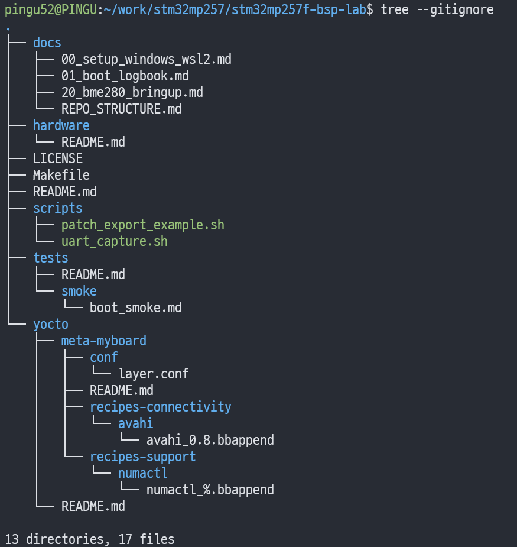
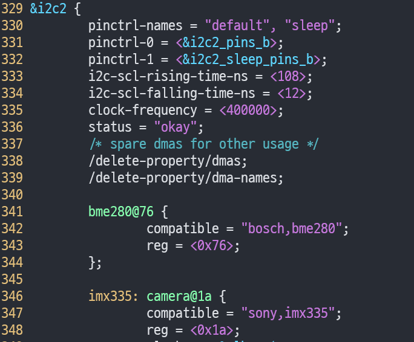
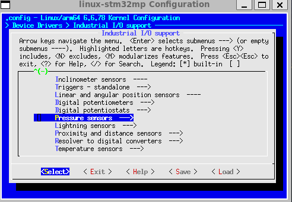
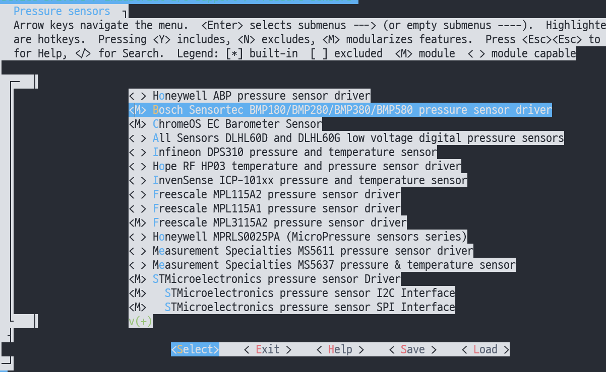
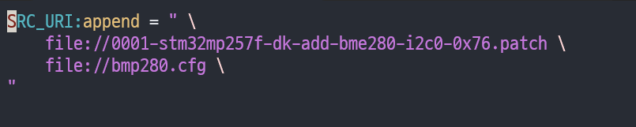
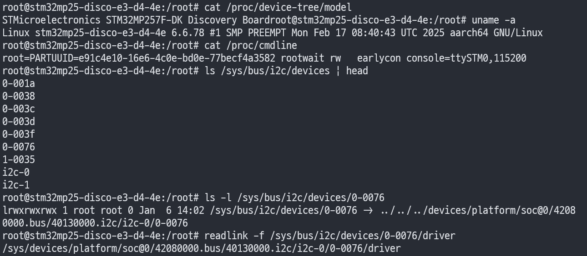
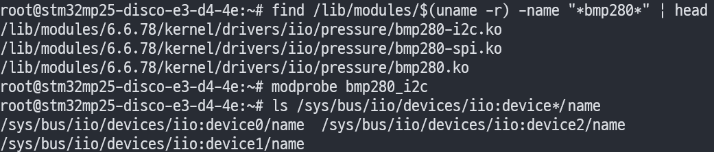
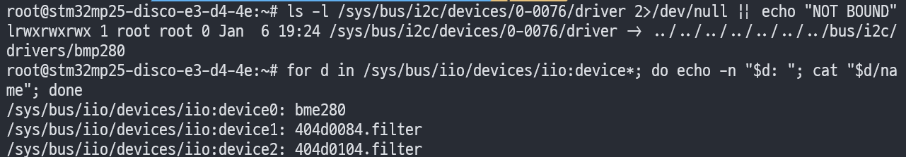
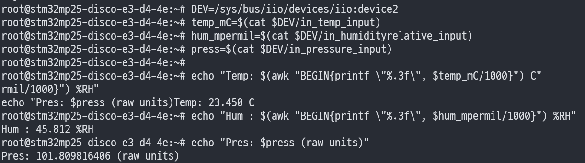

안녕하세요, pingu52입니다.

이번 글은 **STM32MP257F-DK(빌드 머신: `stm32mp25-disco`)** 환경에서 **BME280 센서(I2C0, 주소 `0x76`)** 를 붙이고,

- **Device Tree(DTS)에 노드 추가**
- **Yocto에서 커널 드라이버(bmp280)를 모듈로 활성화**
- **이미지 빌드 → SD 카드 플래시 → 부팅**
- **IIO(`/sys/bus/iio`)에서 온도/기압/습도 값 읽기**

까지 따라하면 그대로 되는 방식으로 정리합니다.

---

## 구성 개요

- **커널 소스에 직접 커밋하지 않고**: `meta-myboard` 레이어에서 `bbappend + patch`로 관리
- **드라이버는 모듈로**: `bmp280_i2c.ko`를 `modprobe`로 로드
- **런타임 검증은 IIO sysfs**: `in_temp_input`, `in_pressure_input`, `in_humidityrelative_input`

---

## 전제 조건

- ST **Distribution-Package(OpenSTLinux)** 를 기준으로 설명합니다.
- 빌드 환경이 아래처럼 잡혀있다고 가정합니다.

```bash
# 예시
DISTRO=openstlinux-weston
MACHINE=stm32mp25-disco
source layers/meta-st/scripts/envsetup.sh
```

- 커스텀 레이어(예: `~/work/stm32mp257/stm32mp257f-bsp-lab/yocto/meta-myboard`)를 운영 중이며,
  **bblayers.conf에 추가**되어 있어야 합니다.

```bash
bitbake-layers show-layers | grep -E "meta-myboard|meta-st" || true
```

---

## 1. meta-myboard 레이어 준비

### 1.1 파일 배치 위치

이번 글에서 사용하는 파일은 아래 두 개입니다.

- `linux-stm32mp_%.bbappend`
- `0001-...bme280...patch` (DTS 수정 패치)
- `bmp280.cfg` (커널 config fragment)



> 저는 `openstlinux-weston` 환경에만 적용되도록 `linux-stm32mp/openstlinux-weston/` 아래에 파일을 두었습니다.

---

## 2. Device Tree 수정 패치 만들기

BME280를 커널이 자동으로 인식하게 하려면, 보드 DTS에 I2C 디바이스 노드를 추가해야 합니다.  
여기서는 **Yocto devshell 없이**, 현재 빌드 환경(Distribution-Package) 안에서 커널 소스 트리를 “확정적으로” 찾고, 그 변경을 **패치 파일(0001-*.patch)** 로 만들어 `meta-myboard`에 보관합니다.

### 2.1 커널 소스 트리 경로를 확정(S 변수)

Yocto에서 커널 소스 디렉토리는 레시피 변수 `S`로 확정할 수 있습니다.

```bash
# (이미 envsetup.sh로 Yocto bash 환경을 올린 상태에서)
KSRC=$(bitbake -e virtual/kernel | sed -n 's/^S="\([^"]*\)".*/\1/p')
echo "KSRC=$KSRC"
ls -la "$KSRC"
```

만약 `$KSRC`가 비어있거나, 디렉토리가 아직 준비되지 않았다면 아래를 한 번 실행해 소스를 준비합니다.

```bash
bitbake -c fetch  virtual/kernel
bitbake -c unpack virtual/kernel
bitbake -c patch  virtual/kernel
```

### 2.2 DTS 원본 백업

패치를 만들 때 **/tmp 같은 외부 경로로 diff를 뜨면**, patch 헤더가 `/tmp/...`로 들어가서 `do_patch` 단계에서 “파일을 못 찾는” 문제가 자주 발생합니다.  
따라서 원본 백업도 **커널 트리 내부**에 둔 뒤 diff를 생성합니다.

```bash
cd "$KSRC"
DTS=arch/arm64/boot/dts/st/stm32mp257f-dk.dts

# 원본 백업(같은 디렉토리 안에 둠)
cp -v "$DTS" "${DTS}.orig"
```

### 2.3 DTS에 BME280 노드 추가

I2C 디바이스 노드 이름은 보통 `<device>@<addr>` 형태를 씁니다.  
예를 들어 0x76이면 `bme280@76`처럼 표기하는 것이 일반적이며, 이 “노드 이름”은 **사람이 읽기 좋은 방식**이고 실제 드라이버 매칭은 `compatible` / `reg`로 결정됩니다.



**&i2c2**를 찾아 내부에 bme280 노드를 추가합니다.

```dts
&i2c2 {
    status = "okay";

    bme280@76 {
        compatible = "bosch,bme280";
        reg = <0x76>;
    };
};
```

:::tip
 주소가 0x77인 모듈도 있으니, 하드웨어 SDO 설정/모듈 스펙에 맞춰 `reg`를 결정합니다.
:::

### 2.4 커널 소스 트리에서 `git commit` 후 `git format-patch -1`로 패치 만들기

아래 `KSRC`는 **반드시 `git status`가 동작하는 경로**로 잡습니다.

```bash

# 커널 소스 트리 경로(예: 현재 사용 중인 kernel-source)
KSRC=$(bitbake -e virtual/kernel | sed -n 's/^S="\([^"]*\)".*/\1/p')

cd "$KSRC"
git status
```

아까 DTS에 노드를 추가하였습니다[(2.3)](###-2.3-DTS에-BME280-노드-추가). 이제 아래처럼 **정확히 3줄**로 패치를 만듭니다.

```bash
cd "$KSRC"

git add arch/arm64/boot/dts/st/stm32mp257f-dk.dts
git commit -m "arm64: dts: stm32mp257f-dk: add bme280 on i2c2@0x76"
git format-patch -1
```

생성된 패치 파일명은 커밋 subject에 따라 달라질 수 있으니, **레이어에서 재사용하기 쉽게 파일명을 고정**합니다.

```bash
# 방금 생성된 patch 파일을 찾아 파일명 고정
PATCH_OUT=$(ls -t 0001-*.patch | head -n 1)
mv -v "$PATCH_OUT" 0001-stm32mp257f-dk-add-bme280-i2c2-0x76.patch
PATCH_OUT="$KSRC/0001-stm32mp257f-dk-add-bme280-i2c2-0x76.patch"
```

:::tip
(선택) 커널 소스 트리에 “로컬 커밋을 남기고 싶지 않다면”, 패치 파일을 레이어로 복사한 뒤 아래로 되돌릴 수 있습니다.
:::

```bash

# 주의: 로컬 커밋/변경이 없을 때만
git reset --hard HEAD~1
```

### 2.5 meta-myboard로 패치 이관

```bash
DST_DIR=~/work/stm32mp257/stm32mp257f-bsp-lab/yocto/meta-myboard/recipes-kernel/linux/linux-stm32mp/openstlinux-weston
install -d "$DST_DIR"
cp -v "$PATCH_OUT" "$DST_DIR/"
```

:::note
DTS에서는 `&i2c2`에 붙였더라도, 런타임에서는 `i2c-0`처럼 “버스 번호”가 다르게 매겨질 수 있습니다.  
이때는 `0-0076`처럼 보이는 sysfs 경로가 정상이며, Device Tree의 `compatible/reg`와 드라이버 매칭이 핵심입니다.
:::

## 3. meta-myboard에서 패치 적용(bbappend)

### 3.1 linux-stm32mp_%.bbappend 작성

`meta-myboard` 안에 `linux-stm32mp_%.bbappend`를 만들고, 2장에서 만든 patch를 `SRC_URI`에 추가합니다.

파일: `yocto/meta-myboard/recipes-kernel/linux/linux-stm32mp_%.bbappend`

```bitbake
FILESEXTRAPATHS:prepend := "${THISDIR}/${PN}:"

SRC_URI:append = " \
    file://0001-stm32mp257f-dk-add-bme280-i2c2-0x76.patch \
"
```

::note
`local.conf`에 우회로로 넣으면 당장은 편해 보이지만, **빌드 디렉토리 로컬 설정에 종속**되어 재현·공유가 어렵습니다.
DTS/커널 변경은 `bbappend + patch`로 레이어에서 관리하는 편이 BSP 실습/협업/블로그 기록에 훨씬 유리합니다.
:::

### 3.2 패치 파일 배치 확인

patch 파일은 `FILESEXTRAPATHS`가 가리키는 디렉토리(여기서는 `${THISDIR}/${PN}` 계열) 아래에 있어야 합니다.

```bash
ls -l ~/work/stm32mp257/stm32mp257f-bsp-lab/yocto/meta-myboard/recipes-kernel/linux/linux-stm32mp/openstlinux-weston/
```

### 3.3 bbappend가 실제로 먹는지 확인

```bash
bitbake-layers show-appends | grep -i "linux-stm32mp" || true

# SRC_URI에 patch가 실제로 포함됐는지 확인
bitbake -e virtual/kernel | egrep '^(FILESEXTRAPATHS=|SRC_URI=)' | sed -n '1,160p'
```

(옵션) `do_patch` 단계만 강제로 돌려서 빠르게 검증할 수도 있습니다.

```bash
bitbake -c patch virtual/kernel -f
```

## 4. 커널 설정: BMP280 드라이버를 모듈로 활성화

리눅스에서는 BME280가 “전용 드라이버 이름”으로 보이기보다, `bmp280` 드라이버가 BME280(습도 채널 포함)까지 함께 지원하는 구성이 일반적입니다.  
따라서 커널 설정에서는 보통 **BMP280 + I2C transport**를 모듈로 켜는 것이 핵심입니다.

### 4.1 menuconfig 실행(virtual/kernel)

아래 명령은 **현재 빌드 환경**(envsetup.sh 적용 상태)에서 실행합니다.

```bash
bitbake -c menuconfig virtual/kernel
```

### 4.2 활성화할 Kconfig 포인트(모듈 기준)

menuconfig에서 아래 항목을 찾아 **M(모듈)** 로 설정합니다(메뉴 경로는 커널 버전에 따라 달라질 수 있습니다).

- Device Drivers ---> 
- < * > Industrial I/O support --->
- Pressure sensors --->
- < M > Bosch ... 




### 4.3 diffconfig로 fragment.cfg 추출

menuconfig로 바꾼 설정을 config로 뽑아내기 위해 diffconfig를 사용합니다.

```bash
bitbake -c diffconfig virtual/kernel
```

### 4.4 fragment.cfg 위치 찾기

diffconfig 결과물은 보통 커널 WORKDIR 아래에 생성됩니다. 경로를 “확정적으로” 찾는 방식은 아래처럼 고정합니다.

```bash
KWORKDIR=$(bitbake -e virtual/kernel | sed -n 's/^WORKDIR="\([^"]*\)".*/\1/p')
FRAG=$(find "$KWORKDIR" -maxdepth 5 -name "fragment.cfg" | head -n 1)
echo "FRAG=$FRAG"
```

### 4.5 fragment를 레이어에 고정(bmp280.cfg)

```bash
CFG_DST=~/work/stm32mp257/stm32mp257f-bsp-lab/yocto/meta-myboard/recipes-kernel/linux/linux-stm32mp/openstlinux-weston/bmp280.cfg
install -d "$(dirname "$CFG_DST")"
cp -v "$FRAG" "$CFG_DST"
```

(옵션) fragment.cfg를 직접 만들고 싶다면, 최소한 아래 3줄만으로도 동작합니다.

```cfg
CONFIG_IIO=y
CONFIG_BMP280=m
CONFIG_BMP280_I2C=m
```

### 4.6 bbappend로 cfg를 실제 빌드에 반영

`KERNEL_CONFIG_FRAGMENTS`는 보통 `${WORKDIR}`에서 cfg를 찾습니다.  
따라서 **cfg를 반드시 `SRC_URI`에도 추가**해야 `do_configure` 단계에서 “파일을 못 찾는” 문제를 피할 수 있습니다.

`meta-myboard/recipes-kernel/linux/linux-stm32mp_%.bbappend` 예시:

```bitbake
FILESEXTRAPATHS:prepend := "${THISDIR}/${PN}:"

SRC_URI:append = " \
    file://bmp280.cfg \
"

KERNEL_CONFIG_FRAGMENTS:append = " \
    file://bmp280.cfg \
"
```




반영 여부는 `tmp-glibc/work/.../linux-stm32mp/.../temp/log.do_configure.*`에서  
`NOTE: file = file://bmp280.cfg` 이후에 **“Could not find …”가 없어야** 합니다.

### 4.7 사용 중인 커널 설정 변수 확인

레시피/클래스에 따라 cfg 병합에 사용되는 변수가 다를 수 있습니다. 빌드 트리에서 실제로 무엇을 쓰는지 아래 출력으로 먼저 확인해두면, bbappend를 망가뜨릴 가능성이 크게 줄어듭니다.

```bash
bitbake -e virtual/kernel | egrep '^(PN=|PREFERRED_PROVIDER_virtual/kernel=|S=|KERNEL_CONFIG_FRAGMENTS=|KERNEL_FEATURES=|KCONFIG_MODE=|KBUILD_DEFCONFIG=)'
```

- `KERNEL_CONFIG_FRAGMENTS`가 존재하면, 4.6처럼 cfg를 `SRC_URI`로 가져온 뒤 fragments에 추가하는 방식이 보통 정답입니다.
- 만약 다른 메커니즘을 사용한다면(예: `KERNEL_FEATURES`), 위 출력에서 힌트를 얻은 뒤 그 변수에 맞춰 반영 방식을 조정합니다.

## 5. 커널/이미지 빌드 & deploy 산출물 확인

### 5.1 커널만 재빌드

```bash
bitbake linux-stm32mp -c cleansstate
bitbake linux-stm32mp -c compile
bitbake linux-stm32mp -c deploy
```

이미지까지 한 번에 만들려면 아래로 가면 됩니다.

```bash
bitbake st-image-weston
```

### 5.2 deploy 결과 확인

```bash
ls -al tmp-glibc/deploy/images/stm32mp25-disco | head
ls -al tmp-glibc/deploy/images/stm32mp25-disco/*.dtb 2>/dev/null || true
```

---

## 6. SD 카드 플래시

### 6.1 FlashLayout TSV 선택

`deploy/images/<MACHINE>` 아래에 flashlayout TSV가 생성됩니다.

```bash
cd tmp-glibc/deploy/images/stm32mp25-disco
find flashlayout_st-image-weston -maxdepth 2 -type f -name "FlashLayout_sdcard*.tsv" -print
```

- OpenSTLinux Weston + OP-TEE 흐름이라면 보통 `optee/FlashLayout_sdcard_...-optee.tsv`를 사용합니다.

### 6.2 raw 이미지 생성

ST가 제공하는 스크립트로 TSV → raw 이미지를 만듭니다.

```bash
cd tmp-glibc/deploy/images/stm32mp25-disco

# 예시: optee FlashLayout
TSV=flashlayout_st-image-weston/optee/FlashLayout_sdcard_stm32mp257f-dk-optee.tsv

./scripts/create_sdcard_from_flashlayout.sh "$TSV"
ls -al *.raw 2>/dev/null || true
```

### 6.3 dd로 SD 카드에 기록

먼저 장치가 무엇인지 확실히 확인합니다.

```bash
lsblk -p
```

그 다음, 마운트된 파티션이 있으면 해제하고 raw를 씁니다.

```bash
SD=/dev/sdX   # 반드시 본인 SD 카드 디바이스로 변경
sudo umount ${SD}?* 2>/dev/null || true

RAW=$(ls -t *.raw | head -n 1)
sudo dd if="$RAW" of="$SD" bs=8M conv=fsync status=progress
sync
```

### 6.4 파티션 확인

```bash
sudo partprobe "$SD" || true
lsblk "$SD"
```

---

## 7. 부팅 후 BME280(IIO) 검증

### 7.1 I2C 디바이스 노드 확인

BME280 노드가 올라오면 보통 아래처럼 `0-0076`이 생깁니다.

```bash
ls -l /sys/bus/i2c/devices/0-0076
cat /sys/bus/i2c/devices/0-0076/modalias
cat /sys/bus/i2c/devices/0-0076/of_node/compatible 2>/dev/null || true
```




### 7.2 모듈 존재 확인 + 로드

```bash
find /lib/modules/$(uname -r) -name "*bmp280*" | head
modprobe bmp280_i2c
```



### 7.3 드라이버 바인딩 확인

```bash
ls -l /sys/bus/i2c/devices/0-0076/driver 2>/dev/null || echo "NOT BOUND"
ls /sys/bus/i2c/drivers | grep -E "bmp280|bme280" || true
```



### 7.4 IIO 값 읽기 (온도/기압/습도)

`/sys/bus/iio/devices/iio:device*/name` 중 `bme280`를 찾아서 읽습니다.

```bash
DEV=$(for d in /sys/bus/iio/devices/iio:device*; do
  [ "$(cat "$d/name")" = "bme280" ] && echo "$d" && break
done)

echo "DEV=$DEV"

cat "$DEV/in_temp_input"
cat "$DEV/in_pressure_input"
cat "$DEV/in_humidityrelative_input" 2>/dev/null || true
```


