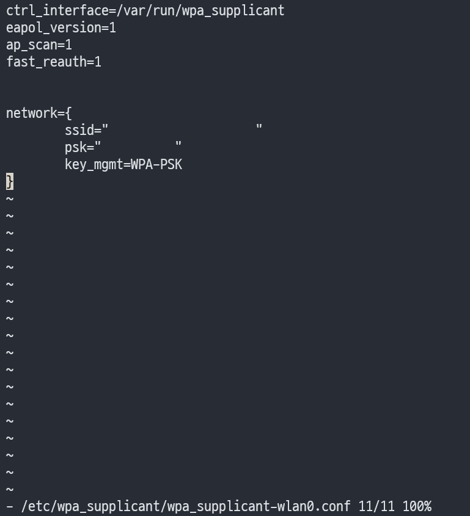
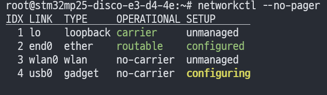
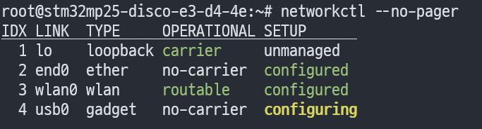

안녕하세요, pingu52입니다.  
이번 글에서는 **STM32MP25-DISCO(OpenSTLinux)** 에서 **Wi‑Fi(WLAN)** 를 설정해 `wlan0`가 **부팅 시 자동으로 연결**되도록 구성하는 방법을 정리합니다.

저는 ST Wiki의 가이드를 기준으로 진행했고, 실제 보드에서 확인한 로그/스크린샷을 함께 첨부했습니다.

---

## 구성 개요

- **wpa_supplicant**: SSID/PSK 기반 무선 인증 및 연결
- **systemd-networkd**: 링크 관리 및 **DHCP(IPv4)** 로 IP 할당

---

## 전제 조건

- OpenSTLinux 부팅 완료, root 쉘 접근 가능
- 무선 인터페이스가 `wlan0`로 잡혀 있음(환경에 따라 `wlan1`일 수도 있으니 실제 이름 확인)

---

## 1. wlan0 상태 확인 및 UP

먼저 인터페이스가 보이는지 확인합니다.

```bash
ifconfig -a
# 또는
ip link
```

`ifconfig wlan0`에서 `UP` 표시가 없다면 아직 내려가 있는 상태입니다.


올려줍니다.

```bash
ifconfig wlan0 up
# 또는
ip link set wlan0 up
```


---

## 2. SSID 스캔으로 무선 동작 확인

주변 AP가 보이면 드라이버/펌웨어/안테나 쪽은 1차로 정상 가능성이 높습니다.

```bash
iw dev wlan0 scan | grep SSID
```


---

## 3. systemd-networkd: wlan0 DHCP(IPv4) 설정

`systemd-networkd`가 `wlan0`에 DHCP를 적용하도록 `.network` 파일을 둡니다.

```ini
# /lib/systemd/network/51-wireless.network
[Match]
Name=wlan0

[Network]
DHCP=ipv4
```

확인:

```bash
cat /lib/systemd/network/51-wireless.network
```


---

## 4. wpa_supplicant: SSID/PSK 설정

`/etc/wpa_supplicant/wpa_supplicant-wlan0.conf` 를 준비합니다.

```ini
# /etc/wpa_supplicant/wpa_supplicant-wlan0.conf

ctrl_interface=/var/run/wpa_supplicant
eapol_version=1
ap_scan=1
fast_reauth=1

network={
    ssid="<YOUR_SSID>"
    psk="<YOUR_PSK>"
    key_mgmt=WPA-PSK
}
```



:::tip
실무에서는 `wpa_passphrase "<SSID>" "<PASS>"`로 `psk=`를 생성해 붙여 넣는 편이 안전합니다(따옴표/이스케이프 실수 방지).
:::

---

## 5. 자동 연결: 서비스 enable + 재시작

```bash
systemctl enable wpa_supplicant@wlan0.service

systemctl restart systemd-networkd.service
systemctl restart wpa_supplicant@wlan0.service
```


---

## 6. 연결 상태 확인

### networkctl로 한 번에 보기

```bash
networkctl --no-pager
```

연결이 아직 안 된 상황에서는 아래처럼 `wlan0`가 `no-carrier / unmanaged`로 보일 수 있습니다.



정상 연결 후에는 `wlan0`가 `routable / configured`로 바뀌는 것을 확인할 수 있습니다.



### 추가 확인(필요 시)

```bash
iw wlan0 link
ip addr show wlan0
ip route
ping -c 3 8.8.8.8
ping -c 3 google.com
```

---

## 7. 자주 보는 문제와 점검 포인트

### 7.1 IP가 안 잡힐 때

- `wpa_supplicant`가 실제로 붙었는지 로그 확인

```bash
systemctl status wpa_supplicant@wlan0 --no-pager
journalctl -u wpa_supplicant@wlan0 -b --no-pager | tail -n 200
```

- `systemd-networkd`가 DHCP를 수행하는지 확인

```bash
systemctl status systemd-networkd --no-pager
journalctl -u systemd-networkd -b --no-pager | tail -n 200
```

### 7.2 SSID 스캔이 안 될 때

- 인터페이스가 UP인지 재확인
- (있는 경우) rfkill 차단 여부 확인

```bash
rfkill list
```

- 드라이버/펌웨어 로그 확인

```bash
dmesg | grep -iE "wlan|wifi|firmware|cfg80211" | tail -n 200
```

---

## 참고

- ST Wiki: How to setup a WLAN connection  
  <https://wiki.st.com/stm32mpu/index.php?title=How_to_setup_a_WLAN_connection&sfr=stm32mpu>
