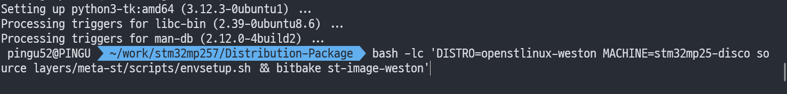

안녕하세요, pingu52입니다.

Yocto를 “리눅스 배포판을 만드는 빌드 프레임워크”라고만 이해하면, 실제로 무엇이 어디에서 결정되고(메타데이터), 무엇이 실행되는지(BitBake) 감이 잘 오지 않습니다.
이 글에서는 **Yocto 프로젝트의 구성요소**와 **빌드가 진행되는 방식**을 “레이어/레시피/태스크” 관점에서 정리하고, STM32MP2(OpenSTLinux) 같은 BSP 환경에서 어떻게 적용되는지까지 연결해 설명합니다.

## Yocto가 하는 일: 소스 → 이미지 산출까지의 “규칙(메타데이터)” 집합

Yocto(정확히는 Yocto Project)는 단일 프로그램이라기보다는, 다음을 가능하게 하는 **툴·메타데이터·가이드의 묶음**입니다.

- 어떤 패키지를 어떤 옵션으로 빌드할지
- 어떤 루트 파일시스템 구성을 만들지
- 부트로더/커널/디바이스 트리까지 포함해 어떤 “이미지”를 만들지
- 반복 가능한 빌드(캐시/재현성/QA)로 관리할지

핵심은 “코드”라기보다 **빌드 규칙과 의존 관계를 정의한 메타데이터**가 빌드를 결정한다는 점입니다.

## 구성요소 빠르게 구분하기: Poky / OE-Core / BitBake

- **BitBake**: 메타데이터(.bb/.bbappend/.conf 등)를 해석해 **태스크(task)를 실행**하는 빌드 엔진.
- **OE-Core(OpenEmbedded-Core)**: 기본 클래스(bbclass), 기본 레시피, QA 규칙 등 “표준 기반”의 핵심 메타데이터.
- **Poky**: BitBake + OE-Core + 레퍼런스 레이어를 한데 묶어 제공하는 “참조 배포” 성격의 저장소.

즉, “Yocto를 쓴다”는 말은 보통 **BitBake로 OE 메타데이터를 실행**해 이미지를 만든다는 뜻에 가깝습니다.

## 레이어(Layer)란: 메타데이터를 관리하는 단위

Yocto는 여러 벤더/프로젝트가 동시에 참여하는 구조라서, 변경을 “한 덩어리”로 관리할 수 있어야 합니다.  
그 단위가 **레이어(layer)** 입니다.

- 레이어는 보통 `conf/layer.conf`를 가지며
- 레시피(.bb), 레시피 수정(.bbappend), 설정(.conf) 등을 포함합니다.
- `bblayers.conf`에 레이어를 추가하면 BitBake가 그 레이어의 메타데이터를 탐색합니다.

### 레시피(.bb) / 레시피 수정(.bbappend)

- `.bb`: “패키지/컴포넌트”를 어떻게 가져오고(fetch), 어떻게 빌드하고(compile), 어떻게 설치하고(install), 어떻게 패키징할지(package) 정의
- `.bbappend`: 기존 레시피에 **패치/변수/태스크**를 덧붙이는 방식으로 오버레이(overlay)

벤더 레이어(예: ST의 OpenSTLinux 레이어)를 그대로 두고, 내가 만든 레이어에서 `.bbappend`로 수정하는 패턴이 가장 유지보수에 안전합니다.

## 빌드의 축: MACHINE / DISTRO / IMAGE(레시피)

Yocto 빌드에서 “무엇을 만들지”는 크게 세 축으로 잡힙니다.

- **MACHINE**: 타깃 보드/SoC에 대한 설정 (커널 구성, DT, 부트로더, 툴체인 튜닝 등)
- **DISTRO**: 배포판 정책/기본 패키지/기본 설정 (systemd 여부, 보안 정책 등)
- **IMAGE 레시피**: 최종 이미지에 어떤 패키지를 포함할지 (예: `core-image-minimal`, `st-image-weston` 등)

실제로는 `local.conf`에서 MACHINE/DISTRO를 선택하고, `bitbake <image>`로 이미지를 빌드하는 흐름이 일반적입니다.

*환경 설정 스크립트 적용 후 `bitbake`로 이미지 레시피를 빌드하는 전형적인 흐름.*
## BitBake 태스크 흐름: Fetch → Configure → Compile → Install → Package → Image

BitBake는 레시피에 정의된 태스크를 “그래프(의존 관계)”로 계산한 뒤 실행합니다. 대표적인 흐름은 다음과 같습니다.

- `do_fetch`: 소스 가져오기
- `do_unpack`: 압축 해제/체크아웃
- `do_configure`: configure/CMake 설정
- `do_compile`: 컴파일
- `do_install`: `${D}`(destdir)에 설치
- `do_package`: 패키지로 분리
- `do_rootfs`: 루트FS 생성
- `do_image`: 이미지 산출

여기서 실제 파일이 쌓이는 곳이 `tmp-glibc/work/...` 같은 작업 디렉토리이고, 결과물이 모이는 곳이 `tmp-glibc/deploy/...` 입니다.

## 캐시 관점에서 이해하기: sstate(Shared State)

Yocto는 빌드 시간이 길기 때문에, 동일 입력에 대해 “태스크 결과”를 재사용할 수 있도록 **sstate 캐시**를 사용합니다.

- `sstate`가 히트하면 해당 태스크는 재실행되지 않고 결과가 재사용됩니다.
- CI나 여러 PC 환경에서 성능을 끌어올릴 때 가장 중요한 최적화 포인트입니다.

## 실전 팁: 원인 찾을 때 유용한 명령들

- 레이어 확인: `bitbake-layers show-layers`
- 레시피 오버레이 확인: `bitbake-layers show-appends | grep -i <recipe>`
- 변수 확인: `bitbake -e <recipe> | less`
- 특정 태스크만: `bitbake -c <task> <recipe>`
- 캐시 제거: `bitbake -c cleansstate <recipe>` (필요할 때만)

## 참고 자료

- [Yocto Project Documentation](https://docs.yoctoproject.org/)
- [Yocto Project Reference Manual](https://docs.yoctoproject.org/ref-manual/)
- [BitBake User Manual](https://docs.yoctoproject.org/bitbake/)
- [OpenEmbedded-Core(OE-Core) 소스 트리](https://git.openembedded.org/openembedded-core/)
- [OpenEmbedded Wiki](https://www.openembedded.org/wiki/Main_Page)
- [ST STM32MPU Wiki(메인)](https://wiki.st.com/stm32mpu/wiki/Main_Page)
- [(ST) OpenSTLinux 배포/SDK 관련 문서(위 Wiki 내)](https://wiki.st.com/stm32mpu/wiki/Category:OpenSTLinux_distribution)
