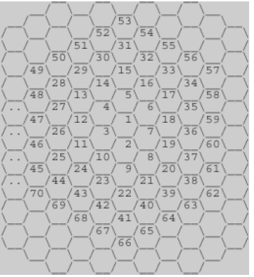

## 문제

<https://www.acmicpc.net/problem/2292>



위의 그림과 같이 육각형으로 이루어진 벌집이 있다. 그림에서 보는 바와 같이 중앙의 방 1부터 시작해서 이웃하는 방에 돌아가면서 1씩 증가하는 번호를 주소로 매길 수 있다. 숫자 N이 주어졌을 때, 벌집의 중앙 1에서 N번 방까지 최소 개수의 방을 지나서 갈 때 몇 개의 방을 지나가는지(시작과 끝을 포함하여)를 계산하는 프로그램을 작성하시오. 예를 들면, 13까지는 3개, 58까지는 5개를 지난다.

## 입력

첫째 줄에 N(1 ≤ N ≤ 1,000,000,000)이 주어진다.

## 출력

입력으로 주어진 방까지 최소 개수의 방을 지나서 갈 때 몇 개의 방을 지나는지 출력한다.

## 풀이

겹이 하나 늘어날 때마다 방의 개수는 `6`, `12`, `18`, ... 처럼 `6`의 배수만큼 증가합니다.

- 1번째 겹: `1`
- 2번째 겹: `2 ~ 7` → 6개 증가
- 3번째 겹: `8 ~ 19` → 12개 증가
- 4번째 겹: `20 ~ 37` → 18개 증가...

현재 겹의 마지막 번호를 계속 늘려 가면서, 입력값 `N`이 어느 겹에 포함되는지 찾으면 됩니다.

## 코드

```c
#include <stdio.h>

int main() {
    int n;
    scanf("%d", &n);

    int a = 1;
    int res = 1;

    while (n > a) {
        a += 6 * res;
        res++;
    }

    printf("%d\n", res);

    return 0;
}
```
